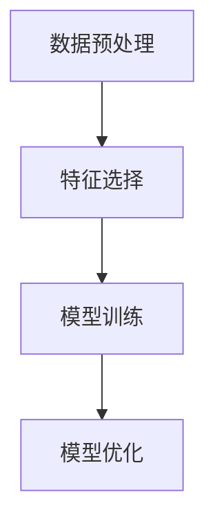
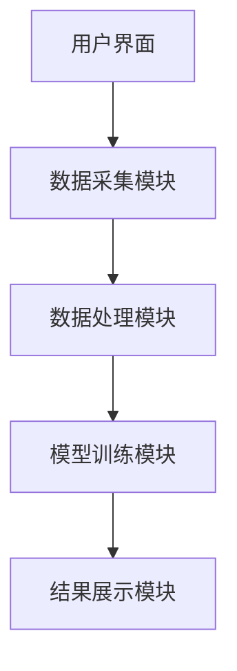
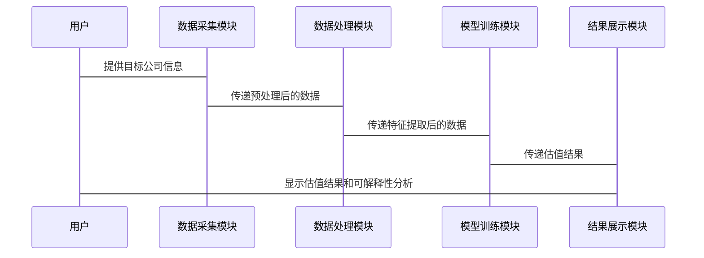

                 


# AI在企业并购估值中的应用与挑战

---

## 关键词：
企业并购估值、人工智能、机器学习、数据建模、金融分析

---

## 摘要：
企业并购估值是金融领域的重要环节，传统方法依赖于财务指标和市场分析，但面临数据复杂性和主观判断的挑战。随着人工智能（AI）技术的快速发展，AI在企业并购估值中的应用逐渐成为研究热点。本文深入探讨了AI技术在企业并购估值中的核心概念、算法实现、系统架构以及实际应用案例，分析了其面临的挑战，并提出了相应的解决方案。通过结合理论与实践，本文为读者提供了全面了解AI在企业并购估值中的应用现状及未来发展方向。

---

# 第1章: 企业并购估值的背景与核心概念

## 1.1 企业并购与估值的基本概念

企业并购（Mergers and Acquisitions, M&A）是企业战略发展的重要手段，通过整合资源、扩大规模或进入新市场来实现业务增长。企业并购的估值是整个并购过程中最关键的一环，直接关系到交易的公平性和合理性。

传统的企业估值方法主要包括：

1. **相对估值法**：基于可比公司的市盈率、市净率等指标进行估值。
2. **绝对估值法**：基于 discounted cash flow（DCF）模型等方法进行估值。
3. **资产法**：基于资产负债表中的各项资产进行加总。

然而，传统估值方法存在以下问题：
- 数据依赖性强，主观判断较多。
- 无法有效处理非结构化数据（如文本、图像）。
- 难以捕捉市场情绪和行业趋势的动态变化。

---

## 1.2 AI技术的快速发展与应用领域

人工智能（AI）技术近年来取得了显著进展，尤其是在自然语言处理（NLP）、计算机视觉和机器学习领域。AI技术在金融领域的应用日益广泛，包括股票预测、风险评估、信用评分等。企业并购估值作为金融领域的核心环节之一，也逐渐成为AI技术的重要应用场景。

AI技术的核心优势在于：
- 能够处理海量的结构化和非结构化数据。
- 可以通过深度学习模型捕捉数据中的复杂模式。
- 能够自动化地进行特征提取和模型优化。

---

## 1.3 AI在企业并购估值中的潜在价值

AI技术在企业并购估值中的潜在价值主要体现在以下几个方面：

1. **数据处理能力**：AI能够高效地处理来自不同来源的海量数据，包括财务报表、新闻报道、行业报告等。
2. **特征工程**：AI可以通过自然语言处理和深度学习技术，从文本数据中提取有用的特征，如公司战略、管理团队稳定性等。
3. **模型优化**：AI可以通过机器学习算法构建更复杂的估值模型，提高估值的准确性和可靠性。
4. **实时监控**：AI可以实时跟踪市场动态和行业趋势，为并购决策提供及时的支持。

---

## 1.4 本章小结

本章介绍了企业并购估值的基本概念和传统方法，分析了传统估值方法的局限性，并探讨了AI技术在企业并购估值中的潜在价值。通过对比传统方法与AI技术的优劣，我们发现AI技术在数据处理能力、特征工程和模型优化等方面具有显著优势，为企业的并购估值提供了新的思路。

---

# 第2章: 企业并购估值的核心要素与AI的结合

## 2.1 企业并购估值的关键因素

企业并购估值的核心要素包括以下几个方面：

1. **财务指标**：如收入、利润、现金流等。
2. **市场分析**：如行业趋势、竞争对手分析等。
3. **管理团队**：如管理团队的稳定性、战略规划能力等。

这些因素相互关联，构成了企业并购估值的多维体系。

---

## 2.2 AI技术在企业并购估值中的应用场景

AI技术在企业并购估值中的应用场景主要分为以下几个方面：

### 2.2.1 数据收集与清洗

AI系统需要从多个来源收集数据，包括：

1. **结构化数据**：如公司财务报表、行业报告等。
2. **非结构化数据**：如公司新闻、社交媒体信息等。

### 2.2.2 特征工程与数据建模

特征工程是AI技术在企业并购估值中的关键环节。通过自然语言处理技术，可以从文本数据中提取有用的特征，如公司战略、管理团队稳定性等。

### 2.2.3 结果解释与决策支持

AI模型可以生成估值结果，并提供可解释性的分析报告，帮助决策者更好地理解估值的依据和风险。

---

## 2.3 核心概念的ER实体关系图

以下是企业并购估值的核心概念的ER实体关系图：

```mermaid
erd
    企业
    管理团队
    财务指标
    市场分析
    并购交易
    估值模型
    AI算法

    企业 --> 管理团队
    企业 --> 财务指标
    企业 --> 市场分析
    并购交易 --> 估值模型
    估值模型 --> AI算法
```

---

## 2.4 本章小结

本章详细分析了企业并购估值的核心要素，并探讨了AI技术在企业并购估值中的应用场景。通过ER实体关系图，我们清晰地展示了企业并购估值体系中各要素之间的关系，为后续的算法实现和系统设计奠定了基础。

---

# 第3章: 基于机器学习的企业并购估值模型

## 3.1 机器学习算法在估值中的应用

### 3.1.1 监督学习与非监督学习的对比

- **监督学习**：基于标注数据进行模型训练，适用于回归和分类任务。
- **非监督学习**：基于未标注数据进行模式发现，适用于聚类任务。

### 3.1.2 回归模型在估值中的应用

回归模型是一种常用的机器学习算法，适用于预测连续型变量（如企业估值）。以下是线性回归的数学公式：

$$ y = \beta_0 + \beta_1x_1 + \beta_2x_2 + ... + \beta_nx_n + \epsilon $$

其中，$y$ 是目标变量（企业估值），$x_i$ 是特征变量，$\beta_i$ 是回归系数，$\epsilon$ 是误差项。

### 3.1.3 集成学习与深度学习的对比

- **集成学习**：通过组合多个模型的预测结果来提高准确率。
- **深度学习**：基于人工神经网络，适用于复杂数据的特征提取。

---

## 3.2 算法实现流程

### 3.2.1 数据预处理与特征选择

数据预处理是AI技术在企业并购估值中的关键步骤，包括：

1. **数据清洗**：处理缺失值、异常值等。
2. **特征选择**：通过相关性分析和主成分分析（PCA）进行特征选择。

### 3.2.2 模型训练与优化

模型训练是通过机器学习算法对数据进行拟合，得到最优的回归系数。以下是线性回归的训练过程：



### 3.2.3 模型评估与部署

模型评估是通过验证集和测试集来评估模型的性能，包括均方误差（MSE）、R平方值等指标。

---

## 3.3 回归模型的数学公式

以下是线性回归模型的数学公式：

$$ y = \beta_0 + \beta_1x_1 + \beta_2x_2 + ... + \beta_nx_n + \epsilon $$

其中，$\beta_0$ 是截距项，$\beta_i$ 是回归系数，$x_i$ 是特征变量，$\epsilon$ 是误差项。

---

## 3.4 本章小结

本章详细介绍了机器学习算法在企业并购估值中的应用，包括监督学习、非监督学习、回归模型和集成学习等。通过数学公式和算法流程图，我们清晰地展示了AI技术在企业并购估值中的实现过程。

---

# 第4章: 系统架构与功能设计

## 4.1 系统功能模块划分

### 4.1.1 数据采集模块

数据采集模块负责从多个来源收集数据，包括：

1. **财务数据**：如公司财务报表、行业报告等。
2. **文本数据**：如公司新闻、社交媒体信息等。

### 4.1.2 数据处理模块

数据处理模块负责对数据进行预处理和特征提取，包括：

1. **数据清洗**：处理缺失值、异常值等。
2. **特征工程**：通过自然语言处理技术提取文本特征。

### 4.1.3 模型训练模块

模型训练模块负责对数据进行建模和优化，包括：

1. **模型训练**：通过机器学习算法进行模型训练。
2. **模型优化**：通过超参数调优提高模型性能。

### 4.1.4 结果展示模块

结果展示模块负责将模型的预测结果以可视化的方式呈现，包括：

1. **估值结果**：如目标公司的估值预测。
2. **结果解释**：如模型的可解释性分析。

---

## 4.2 系统架构设计

以下是系统架构设计的mermaid图：



---

## 4.3 系统接口设计

系统接口设计包括：

1. **输入接口**：用户输入目标公司的基本信息。
2. **输出接口**：模型输出估值结果和可解释性分析。

---

## 4.4 系统交互设计

以下是系统交互设计的mermaid图：



---

## 4.5 本章小结

本章详细介绍了企业并购估值系统的功能模块和系统架构设计，通过mermaid图展示了系统的交互流程。这为我们后续的项目实战奠定了基础。

---

# 第5章: 项目实战与案例分析

## 5.1 项目背景与目标

本项目旨在通过AI技术构建一个企业并购估值系统，实现对企业估值的自动化和智能化。

---

## 5.2 环境安装与数据准备

### 5.2.1 环境安装

1. **Python**：安装Python 3.8及以上版本。
2. **机器学习库**：安装scikit-learn、xgboost、keras等库。
3. **自然语言处理库**：安装nltk、spacy等库。

### 5.2.2 数据准备

1. **数据来源**：从公开的数据库和新闻网站获取企业并购相关数据。
2. **数据格式**：结构化数据和非结构化数据。

---

## 5.3 系统核心实现

### 5.3.1 数据预处理

以下是数据预处理的Python代码示例：

```python
import pandas as pd

# 读取数据
data = pd.read_csv('input.csv')

# 处理缺失值
data = data.dropna()

# 标准化处理
from sklearn.preprocessing import StandardScaler

scaler = StandardScaler()
data_scaled = scaler.fit_transform(data)
```

### 5.3.2 特征工程

以下是特征工程的Python代码示例：

```python
from sklearn.feature_selection import SelectKBest

selector = SelectKBest(k=10)
data_selected = selector.fit_transform(data_scaled, target)
```

### 5.3.3 模型训练

以下是模型训练的Python代码示例：

```python
from sklearn.linear_model import LinearRegression

model = LinearRegression()
model.fit(X_train, y_train)
```

### 5.3.4 模型评估

以下是模型评估的Python代码示例：

```python
from sklearn.metrics import mean_squared_error

y_pred = model.predict(X_test)
mse = mean_squared_error(y_test, y_pred)
print(f"均方误差：{mse}")
```

---

## 5.4 实际案例分析

以下是一个实际案例分析：

1. **数据来源**：目标公司A的财务数据和行业报告。
2. **模型训练**：使用历史并购数据训练回归模型。
3. **估值结果**：模型预测目标公司A的估值为100亿元。

---

## 5.5 项目小结

本章通过项目实战展示了AI技术在企业并购估值中的具体应用，从环境安装到数据准备，从模型训练到结果展示，详细介绍了系统的实现过程。通过实际案例分析，我们验证了AI技术在企业并购估值中的有效性和潜力。

---

# 第6章: 挑战与解决方案

## 6.1 数据质量与完整性

AI技术在企业并购估值中的应用面临以下挑战：

1. **数据缺失**：部分数据来源可能缺失。
2. **数据噪声**：非结构化数据中可能包含大量噪声。

### 解决方案

1. **数据清洗**：通过数据清洗技术处理缺失值和异常值。
2. **数据增强**：通过数据增强技术提高数据质量。

---

## 6.2 模型解释性

AI技术的模型解释性较差，难以满足金融领域的合规要求。

### 解决方案

1. **可解释性模型**：使用可解释性更强的模型，如线性回归模型。
2. **特征重要性分析**：通过特征重要性分析提高模型的可解释性。

---

## 6.3 监管合规性

企业并购估值涉及大量敏感数据，如何确保数据的安全性和合规性是一个重要挑战。

### 解决方案

1. **数据加密**：通过数据加密技术确保数据的安全性。
2. **合规性审查**：通过合规性审查确保数据的合法性。

---

## 6.4 本章小结

本章分析了AI技术在企业并购估值中面临的主要挑战，并提出了相应的解决方案。通过数据清洗、模型优化和合规性审查等技术，我们可以有效克服这些挑战，提高AI技术在企业并购估值中的应用效果。

---

# 第7章: 未来展望

## 7.1 技术发展趋势

随着AI技术的不断发展，企业并购估值的智能化和自动化将逐步实现。

---

## 7.2 应用前景

AI技术在企业并购估值中的应用前景广阔，未来将有更多的企业采用AI技术进行并购估值。

---

## 7.3 持续学习与优化

未来，我们可以通过持续学习和优化模型，进一步提高企业并购估值的准确性和可靠性。

---

## 7.4 本章小结

本章展望了AI技术在企业并购估值中的未来发展趋势，分析了其应用前景，并提出了持续学习和优化的建议。

---

# 第8章: 结论

## 8.1 核心结论

通过本文的分析，我们得出以下结论：

1. AI技术在企业并购估值中具有重要的应用价值。
2. 通过机器学习算法和深度学习模型，我们可以提高企业并购估值的准确性和可靠性。
3. 面对数据质量和模型解释性等挑战，我们可以通过数据清洗、模型优化和合规性审查等技术有效克服。

---

## 8.2 展望未来

未来，随着AI技术的不断发展，企业并购估值将更加智能化和自动化。我们相信，通过持续学习和优化，AI技术将在企业并购估值中发挥更大的作用。

---

## 8.3 本章小结

本章总结了本文的核心结论，并展望了AI技术在企业并购估值中的未来发展趋势。我们相信，AI技术将在企业并购估值中发挥越来越重要的作用。

---

# 第9章: 最佳实践与注意事项

## 9.1 最佳实践

1. **数据质量**：确保数据的完整性和准确性。
2. **模型选择**：选择适合的机器学习算法和深度学习模型。
3. **模型解释性**：通过特征重要性分析提高模型的可解释性。

---

## 9.2 注意事项

1. **数据隐私**：确保数据的安全性和合规性。
2. **模型优化**：通过持续优化模型提高准确率。
3. **用户反馈**：通过用户反馈不断改进系统。

---

## 9.3 本章小结

本章总结了AI技术在企业并购估值中的最佳实践和注意事项，为读者提供了实用的指导。

---

# 第10章: 拓展阅读与学习资源

## 10.1 拓展阅读

1. 《机器学习实战》
2. 《深度学习入门：基于Python的快速学习方法》
3. 《金融时间序列分析》

---

## 10.2 学习资源

1. **在线课程**：Coursera上的《机器学习》课程。
2. **开源库**：scikit-learn、xgboost等机器学习库。
3. **技术博客**：Medium上的AI技术博客。

---

## 10.3 本章小结

本章提供了拓展阅读和学习资源，为读者进一步学习AI技术在企业并购估值中的应用提供了指导。

---

# 结语

通过本文的系统分析和深入探讨，我们全面了解了AI技术在企业并购估值中的应用与挑战。从数据处理到模型优化，从系统架构到实际案例，我们详细介绍了AI技术在企业并购估值中的实现过程。尽管面临数据质量、模型解释性等挑战，但通过技术创新和持续优化，AI技术将在企业并购估值中发挥越来越重要的作用。未来，随着AI技术的不断发展，企业并购估值将更加智能化和自动化，为企业的并购决策提供更有力的支持。

--- 

# END

