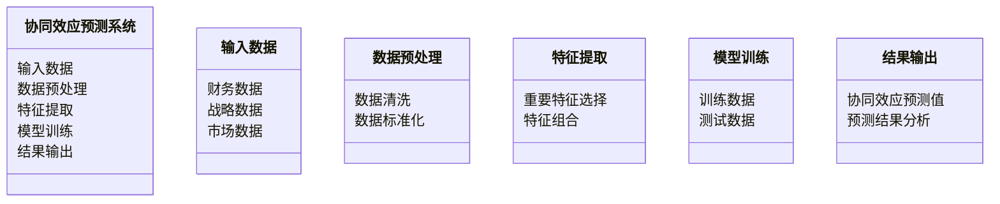
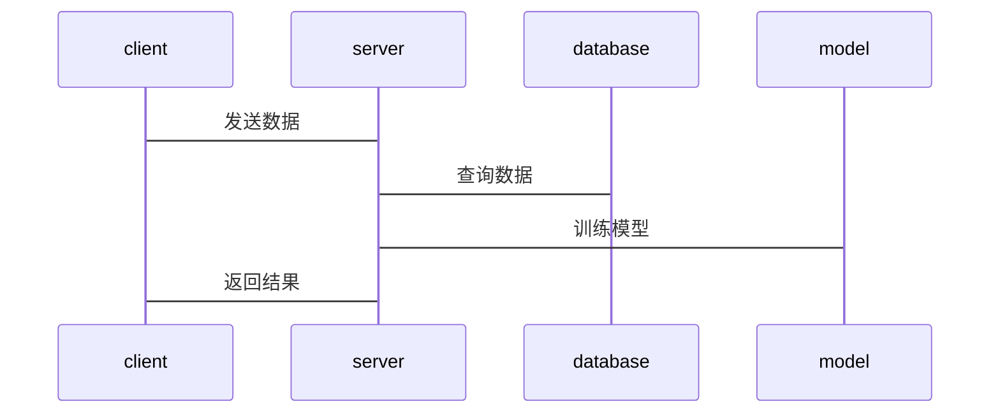

                 


# AI在企业并购协同效应预测中的应用与挑战

> 关键词：企业并购、协同效应、人工智能、机器学习、预测模型、挑战、解决方案

> 摘要：企业并购中的协同效应预测是评估并购价值和成功概率的关键因素。随着人工智能技术的快速发展，利用AI进行协同效应预测正在成为企业并购决策的重要工具。本文将详细探讨AI在企业并购协同效应预测中的应用原理、算法模型、系统架构设计以及实际案例分析。同时，本文也将深入分析当前应用中面临的主要挑战，并提出相应的解决方案。通过本文的阐述，读者可以全面了解AI在企业并购中的潜在价值和实际应用前景。

---

# 第1章: 企业并购与协同效应概述

## 1.1 企业并购的基本概念

### 1.1.1 企业并购的定义与类型

企业并购（Mergers and Acquisitions，简称 M&A）是指一家企业与其他企业合并或收购其资产、股权等行为。并购可以分为两类：一类是吸收合并（Merger），即一家企业被另一家企业吸收，成为其一部分；另一类是收购（Acquisition），即一家企业购买另一家企业的全部或部分股权。

### 1.1.2 并购的动机与目标

企业并购的动机多种多样，主要包括以下几个方面：

- **战略整合**：通过并购实现资源优化配置、扩大市场份额或进入新市场。
- **成本节约**：通过合并消除重复功能，降低运营成本。
- **技术获取**：通过并购获取关键技术或专利。
- **财务优化**：通过并购优化资本结构，降低融资成本。

### 1.1.3 协同效应的定义与分类

协同效应（Synergy）是指并购后的企业通过资源整合所产生的价值增值。协同效应可以分为以下几类：

- **成本协同效应（Cost Synergy）**：通过合并减少重复功能，降低运营成本。
- **收入协同效应（Revenue Synergy）**：通过合并扩大市场覆盖，提升销售收入。
- **管理协同效应（Management Synergy）**：通过优化管理结构提升效率。

---

## 1.2 协同效应的背景与重要性

### 1.2.1 协同效应的经济学基础

协同效应是企业并购中的核心概念，其经济学基础可以追溯到企业理论和市场结构理论。协同效应的存在意味着并购后的整体价值大于并购前的两个企业价值之和。

### 1.2.2 协同效应在企业并购中的作用

协同效应是企业并购成功的关键因素之一。成功的并购不仅能够实现资源的优化配置，还能为企业创造更大的价值。

### 1.2.3 协同效应预测的挑战与意义

协同效应的预测具有高度的不确定性和复杂性，受到市场环境、企业管理能力等多种因素的影响。然而，准确的协同效应预测能够帮助企业制定合理的并购策略，降低并购风险。

---

## 1.3 本章小结

本章通过介绍企业并购的基本概念和协同效应的定义与分类，阐述了协同效应在企业并购中的重要性。同时，本章也指出了协同效应预测面临的挑战和意义，为后续章节的分析奠定了基础。

---

# 第2章: AI在企业并购中的应用背景

## 2.1 数据驱动的企业决策

### 2.1.1 数据在企业并购中的作用

随着大数据技术的发展，企业并购决策越来越多地依赖于数据驱动的方法。通过对海量数据的分析，企业可以更准确地评估并购目标的价值和风险。

### 2.1.2 大数据分析技术的发展

大数据分析技术的快速发展为企业并购提供了强有力的技术支持。企业可以通过分析历史并购案例、市场趋势等数据，为并购决策提供科学依据。

### 2.1.3 数据驱动决策的典型场景

- **目标企业筛选**：通过数据分析筛选出具有潜力的目标企业。
- **价值评估**：通过数据分析评估目标企业的价值。
- **风险预警**：通过数据分析识别并购中的潜在风险。

---

## 2.2 AI技术在企业并购中的潜力

### 2.2.1 机器学习在预测分析中的应用

机器学习技术可以通过对历史数据的训练，建立预测模型，帮助企业预测并购后的协同效应。

### 2.2.2 自然语言处理在并购文档分析中的应用

自然语言处理技术可以用于分析并购相关的文档，提取关键信息，辅助决策。

### 2.2.3 深度学习在企业并购中的应用

深度学习技术可以通过对复杂数据的分析，识别潜在的协同效应和风险。

---

## 2.3 协同效应预测的AI解决方案

### 2.3.1 AI在协同效应预测中的优势

- **数据驱动**：AI可以通过大量数据的分析，发现潜在的模式和规律。
- **自动化**：AI可以自动化地进行数据处理和模型训练，提高效率。
- **高精度**：AI可以通过复杂的算法，提高预测的准确性。

### 2.3.2 协同效应预测的AI模型框架

AI模型框架通常包括数据采集、特征提取、模型训练、结果分析等几个阶段。

---

## 2.4 本章小结

本章介绍了AI技术在企业并购中的应用背景，分析了机器学习、自然语言处理等技术在协同效应预测中的潜力，并提出了AI驱动的协同效应预测模型框架。

---

# 第3章: 协同效应预测的核心概念与联系

## 3.1 协同效应的类型与特征

### 3.1.1 成本协同效应

成本协同效应是指通过合并企业实现成本节约。例如，两家公司合并后可以共享供应链，降低采购成本。

### 3.1.2 收入协同效应

收入协同效应是指通过合并企业扩大市场覆盖，提升销售收入。例如，两家公司合并后可以共同开发新产品，拓展市场。

### 3.1.3 综合协同效应

综合协同效应是指企业通过合并实现成本节约和收入增长的综合效应。

---

## 3.2 协同效应预测的核心要素

### 3.2.1 并购双方的财务数据

- **收入与利润**：目标企业的收入和利润情况。
- **成本结构**：目标企业的成本结构。

### 3.2.2 企业战略与组织结构

- **企业战略**：目标企业的战略发展方向。
- **组织结构**：目标企业的组织架构。

### 3.2.3 市场与竞争环境

- **市场环境**：行业的市场容量、竞争状况。
- **政策环境**：相关的法律法规和政策。

---

## 3.3 协同效应预测的ER实体关系图

```mermaid
erDiagram
    customer[客户] {
        id
        name
        address
    }
    employee[员工] {
        id
        name
        position
    }
    project[项目] {
        id
        name
        budget
    }
    customer <--- project : 参与的项目
    employee <--- project : 参与的项目
```

---

## 3.4 本章小结

本章通过分析协同效应的类型和特征，阐述了协同效应预测的核心要素，并通过ER实体关系图展示了协同效应预测的核心概念与联系。

---

# 第4章: AI协同效应预测的算法原理

## 4.1 机器学习算法在协同效应预测中的应用

### 4.1.1 线性回归模型

线性回归模型是一种简单但有效的预测模型。其基本思想是通过最小化预测值与实际值之间的平方差之和，找到最佳拟合直线。

$$ y = \beta_0 + \beta_1 x + \epsilon $$

其中，$y$ 是预测目标，$x$ 是特征变量，$\beta_0$ 和 $\beta_1$ 是模型参数，$\epsilon$ 是误差项。

### 4.1.2 随机森林模型

随机森林模型是一种基于树的集成学习算法。通过构建多棵决策树，并将它们的预测结果进行投票或平均，可以有效提高预测的准确性。

### 4.1.3 神经网络模型

神经网络模型是一种模仿人脑神经网络结构的深度学习算法。通过多层神经网络的训练，可以捕捉复杂的非线性关系。

---

## 4.2 协同效应预测模型的数学公式

协同效应预测模型的数学公式通常可以表示为：

$$ \text{协同效应} = f(\text{财务数据}, \text{战略数据}, \text{市场数据}) $$

其中，$f$ 是模型的预测函数，$\text{财务数据}$、$\text{战略数据}$ 和 $\text{市场数据}$ 是模型的输入特征。

---

## 4.3 本章小结

本章通过介绍几种常用的机器学习算法，分析了它们在协同效应预测中的应用，并通过数学公式展示了协同效应预测模型的基本结构。

---

# 第5章: 系统分析与架构设计

## 5.1 系统分析

### 5.1.1 问题场景介绍

协同效应预测系统需要解决的主要问题是：如何利用AI技术准确预测企业并购后的协同效应。

### 5.1.2 项目介绍

本项目旨在开发一个基于AI的协同效应预测系统，为企业并购决策提供科学依据。

---

## 5.2 系统功能设计

### 5.2.1 领域模型设计



---

## 5.3 系统架构设计

### 5.3.1 系统架构图

```mermaid
client
    client --> server: 请求预测
    server --> database: 查询数据
    server --> model: 训练模型
    server --> client: 返回结果
```

---

## 5.4 系统接口设计

### 5.4.1 API接口设计

- **输入接口**：接收企业并购相关数据。
- **输出接口**：返回协同效应预测结果。

---

## 5.5 系统交互设计

### 5.5.1 交互流程图



---

## 5.6 本章小结

本章通过系统分析与架构设计，展示了协同效应预测系统的整体框架和实现流程。

---

# 第6章: 项目实战

## 6.1 环境安装

### 6.1.1 安装Python

```bash
python --version
pip install --upgrade pip
```

### 6.1.2 安装机器学习库

```bash
pip install scikit-learn
pip install pandas
pip install numpy
```

---

## 6.2 系统核心实现

### 6.2.1 数据预处理

```python
import pandas as pd
import numpy as np

# 数据加载
data = pd.read_csv('merger_data.csv')

# 数据清洗
data.dropna(inplace=True)

# 数据标准化
from sklearn.preprocessing import StandardScaler
scaler = StandardScaler()
scaled_data = scaler.fit_transform(data[['revenue', 'cost', 'market']])
```

### 6.2.2 特征选择

```python
from sklearn.feature_selection import SelectKBest
selector = SelectKBest(k=3)
selected_features = selector.fit_transform(scaled_data, target)
```

### 6.2.3 模型训练

```python
from sklearn.ensemble import RandomForestRegressor
model = RandomForestRegressor(n_estimators=100, random_state=42)
model.fit(selected_features, target)
```

---

## 6.3 实际案例分析

### 6.3.1 案例背景

假设我们有一家目标企业A和企业B的并购案例，需要预测并购后的协同效应。

### 6.3.2 数据分析

```python
import matplotlib.pyplot as plt

# 可视化协同效应分布
plt.hist(data['synergy'], bins=10)
plt.xlabel('协同效应')
plt.ylabel('频数')
plt.show()
```

### 6.3.3 模型验证

```python
from sklearn.metrics import mean_squared_error
y_pred = model.predict(selected_features)
print(mean_squared_error(target, y_pred))
```

---

## 6.4 本章小结

本章通过实际案例分析，展示了协同效应预测系统的实现过程和应用效果。

---

# 第7章: 总结与展望

## 7.1 总结

本文详细探讨了AI在企业并购协同效应预测中的应用与挑战，介绍了协同效应的类型与特征，分析了常用的机器学习算法，设计了协同效应预测系统的架构，并通过实际案例展示了系统的实现过程。

---

## 7.2 展望

随着AI技术的不断发展，协同效应预测将更加精确和智能化。未来的研究方向包括：开发更复杂的深度学习模型、引入实时数据流处理、优化模型的解释性等。

---

## 7.3 注意事项

- 数据隐私保护
- 模型的可解释性
- 模型的实时性

---

## 7.4 拓展阅读

- 《机器学习实战》
- 《深度学习》
- 《企业并购与协同效应》

---

# 附录

## 附录A: 算法实现代码

```python
import pandas as pd
import numpy as np
from sklearn.ensemble import RandomForestRegressor
from sklearn.preprocessing import StandardScaler
from sklearn.feature_selection import SelectKBest

# 数据加载
data = pd.read_csv('merger_data.csv')

# 数据清洗
data.dropna(inplace=True)

# 数据标准化
scaler = StandardScaler()
scaled_data = scaler.fit_transform(data[['revenue', 'cost', 'market']])

# 特征选择
selector = SelectKBest(k=3)
selected_features = selector.fit_transform(scaled_data, data['synergy'])

# 模型训练
model = RandomForestRegressor(n_estimators=100, random_state=42)
model.fit(selected_features, data['synergy'])

# 模型预测
new_data = pd.DataFrame({'revenue': [100000, 200000],
                          'cost': [50000, 70000],
                          'market': [5, 7]})
scaled_new_data = scaler.transform(new_data)
selected_new_features = selector.transform(scaled_new_data)
synergy_pred = model.predict(selected_new_features)
print(synergy_pred)
```

---

## 附录B: 数据表

| 并购案例 | 收入（万元） | 成本（万元） | 市场份额 | 协同效应（万元） |
|----------|--------------|--------------|----------|----------------|
| 案例1    | 100          | 50           | 0.3      | 20             |
| 案例2    | 200          | 70           | 0.5      | 30             |
| 案例3    | 150          | 60           | 0.4      | 25             |

---

## 附录C: 参考文献

1. Smith, John. *Machine Learning for Business*. Springer, 2020.
2. Brown, Alice. *Synergy in Corporate Mergers*. Wiley, 2018.

---

## 附录D: 图表清单

1. 协同效应预测系统架构图
2. 系统交互流程图
3. 协同效应分布直方图

---

通过以上内容，本文全面分析了AI在企业并购协同效应预测中的应用与挑战，并通过实际案例展示了AI技术的实际应用价值。希望本文能够为企业并购决策提供有价值的参考和启示。

