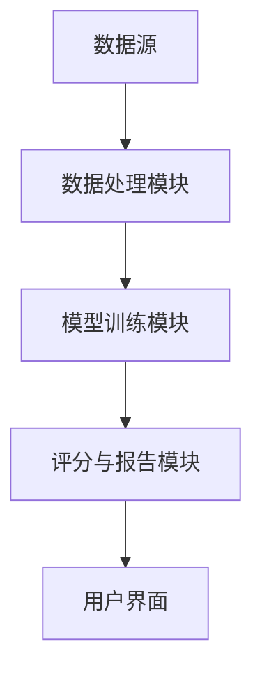

                 


# 《AI在供应链金融信用评级中的深度应用》

---

## 关键词：供应链金融，信用评级，人工智能，机器学习，深度学习

---

## 摘要：  
供应链金融作为现代金融体系的重要组成部分，通过整合供应链上下游资源，优化资金流动效率，降低企业融资成本，已成为企业运营中的关键环节。然而，供应链金融中的信用评级问题一直是行业痛点，传统信用评级方法存在数据不足、模型简单、风险评估不全面等问题。随着人工智能技术的快速发展，AI在供应链金融信用评级中的应用潜力巨大。本文将从供应链金融和信用评级的基本概念出发，详细探讨AI技术在供应链金融信用评级中的应用场景、核心算法、系统架构及实际案例，为读者提供全面而深入的解析。

---

# 第一部分：供应链金融与信用评级概述

## 第1章：供应链金融与信用评级的背景介绍

### 1.1 供应链金融的定义与特点  
供应链金融是指通过对供应链上下游企业的整合和协同，提供一揽子金融服务，以优化企业间的资金流动和资源配置。其特点包括：  
1. **系统性**：涉及供应链中的多个参与者，如供应商、制造商、分销商和零售商。  
2. **协同性**：通过整合上下游资源，实现资金、物流和信息的高效协同。  
3. **风险管理**：注重供应链整体风险控制，而非单一企业风险。  

供应链金融的核心目标是降低中小企业的融资门槛，提高资金使用效率。

### 1.2 信用评级的定义与重要性  
信用评级是对企业或个人的信用状况进行评估，确定其偿还债务的能力和意愿。它是金融决策的重要依据，直接影响融资成本和风险控制。  
信用评级的重要性体现在：  
1. **降低风险**：通过评估企业信用状况，降低金融交易中的违约风险。  
2. **优化资源配置**：帮助企业获得合理的融资支持，促进经济发展。  
3. **提升信任**：良好的信用评级有助于建立长期合作关系。

### 1.3 供应链金融中的信用评级问题  
供应链金融涉及多方参与者，信用评级问题尤为突出：  
1. **数据不足**：传统信用评级依赖财务数据，而供应链金融需要整合多方数据，数据获取难度大。  
2. **模型局限**：传统信用评级模型基于简单统计分析，难以捕捉供应链中的复杂关系。  
3. **风险分散**：供应链中的风险具有传导性，单一企业风险可能影响整个链条。  

AI技术的引入为解决这些问题提供了新思路。通过机器学习和深度学习算法，可以更好地处理多维度数据，构建更复杂的信用评级模型。

### 1.4 本章小结  
本章介绍了供应链金融和信用评级的基本概念，分析了供应链金融中信用评级的核心问题，并探讨了AI技术在解决这些问题中的潜力。

---

## 第2章：AI技术在供应链金融信用评级中的应用

### 2.1 AI技术在供应链金融中的应用场景  
AI技术在供应链金融中的应用主要体现在：  
1. **数据分析与预测**：利用机器学习算法对供应链数据进行分析，预测市场趋势和企业信用状况。  
2. **风险评估与控制**：通过深度学习模型识别潜在风险，优化风险管理策略。  
3. **自动化流程优化**：AI技术可以自动化处理供应链中的重复性任务，提高效率。

### 2.2 供应链金融中的数据特征  
供应链金融数据具有以下特征：  
1. **多样性**：数据来源广泛，包括财务数据、市场数据和供应链数据。  
2. **动态性**：数据实时变化，需要动态更新和分析。  
3. **关联性**：数据之间存在复杂的关联关系，如供应商与客户的关系。

### 2.3 AI算法在信用评级中的应用  
AI算法在信用评级中的应用主要包括：  
1. **机器学习算法**：如逻辑回归、随机森林，用于分类和回归分析。  
2. **深度学习算法**：如神经网络、LSTM，用于处理时间序列数据和复杂模式识别。

### 2.4 本章小结  
本章探讨了AI技术在供应链金融中的应用场景，分析了数据特征，并介绍了常用AI算法在信用评级中的应用。

---

## 第3章：供应链金融信用评级的核心概念与联系

### 3.1 信用评级的核心概念  
信用评级的核心概念包括：  
1. **信用评分模型**：用于评估企业的信用状况，预测违约概率。  
2. **信用风险评估**：通过量化风险，制定相应的风险管理策略。  
3. **信用评级的分类**：根据信用状况将企业分为不同等级，如AAA、BBB等。

### 3.2 核心要素的对比分析  
供应链金融信用评级的核心要素包括：  
1. **企业财务状况**：如收入、利润、负债等。  
2. **企业经营状况**：如市场地位、供应链稳定性等。  
3. **企业信用历史**：如还款记录、违约历史等。

### 3.3 ER实体关系图架构  
以下是供应链金融信用评级的ER实体关系图：

```mermaid
er
    actor 供应链金融系统
    actor 企业
    actor 金融机构
    actor 评级机构
    database 企业信用数据
    database 市场数据
    database 供应链数据
    relationship 企业-信用数据
    relationship 企业-市场数据
    relationship 企业-供应链数据
    relationship 金融机构-信用数据
    relationship 金融机构-企业
    relationship 评级机构-信用数据
```

### 3.4 本章小结  
本章详细介绍了供应链金融信用评级的核心概念，并通过ER实体关系图展示了各要素之间的关系。

---

## 第4章：AI算法在供应链金融信用评级中的原理与实现

### 4.1 机器学习算法的原理与实现  
1. **逻辑回归**：用于分类问题，如企业信用等级分类。  
2. **随机森林**：用于特征重要性分析和风险评估。  

### 4.2 深度学习算法的原理与实现  
1. **神经网络**：用于处理非线性关系，如供应链数据中的复杂模式。  
2. **LSTM**：用于时间序列数据的预测，如市场趋势分析。  

### 4.3 算法实现的Python代码示例  
以下是逻辑回归算法的Python实现示例：

```python
from sklearn.linear_model import LogisticRegression
from sklearn.datasets import make_classification
from sklearn.model_selection import train_test_split
from sklearn.metrics import accuracy_score

# 生成示例数据
X, y = make_classification(n_samples=1000, n_features=20, n_classes=2)
X_train, X_test, y_train, y_test = train_test_split(X, y, test_size=0.2, random_state=42)

# 初始化模型
model = LogisticRegression()

# 训练模型
model.fit(X_train, y_train)

# 预测
y_pred = model.predict(X_test)

# 计算准确率
print("Accuracy:", accuracy_score(y_test, y_pred))
```

### 4.4 本章小结  
本章介绍了机器学习和深度学习算法在供应链金融信用评级中的应用，并通过代码示例展示了算法的实现过程。

---

## 第5章：供应链金融信用评级系统的架构设计

### 5.1 系统功能设计  
1. **数据采集模块**：整合供应链数据、市场数据和企业信用数据。  
2. **数据处理模块**：对数据进行清洗、转换和特征提取。  
3. **模型训练模块**：基于AI算法训练信用评级模型。  
4. **评分与报告模块**：生成企业信用评分报告。

### 5.2 系统架构设计  
以下是系统的架构图：



### 5.3 系统接口设计  
系统接口设计包括：  
1. 数据接口：与供应链企业和金融机构的数据系统对接。  
2. 用户接口：提供信用评分查询和报告下载功能。  

### 5.4 本章小结  
本章详细设计了供应链金融信用评级系统的功能架构和接口设计。

---

## 第6章：项目实战与案例分析

### 6.1 项目背景与目标  
本项目旨在利用AI技术构建一个供应链金融信用评级系统，帮助企业优化融资流程，降低风险。

### 6.2 核心代码实现  
以下是核心代码示例：

```python
import pandas as pd
from sklearn.ensemble import RandomForestClassifier
from sklearn.metrics import classification_report

# 加载数据
data = pd.read_csv('credit_data.csv')

# 数据预处理
data.dropna(inplace=True)
X = data.iloc[:, :-1].values
y = data.iloc[:, -1].values

# 划分训练集和测试集
X_train, X_test, y_train, y_test = train_test_split(X, y, test_size=0.2, random_state=42)

# 初始化模型
model = RandomForestClassifier(n_estimators=100, random_state=42)

# 训练模型
model.fit(X_train, y_train)

# 预测
y_pred = model.predict(X_test)

# 评估模型
print(classification_report(y_test, y_pred))
```

### 6.3 案例分析  
通过实际案例分析，验证模型的有效性，并根据结果调整模型参数。

### 6.4 项目小结  
本章通过实际项目展示了AI技术在供应链金融信用评级中的应用，并提供了代码实现和案例分析。

---

## 第7章：总结与展望

### 7.1 本章总结  
本文详细探讨了AI技术在供应链金融信用评级中的应用，从基本概念到算法实现，再到系统设计和项目实战，为读者提供了全面的视角。

### 7.2 未来展望  
未来，随着AI技术的不断发展，供应链金融信用评级将更加智能化和个性化。同时，区块链和大数据技术的结合也将进一步提升信用评级的准确性和安全性。

### 7.3 注意事项  
在实际应用中，需注意数据隐私保护和模型的可解释性问题。

### 7.4 拓展阅读  
推荐阅读《机器学习实战》和《供应链管理》等相关书籍，以深入理解AI技术在供应链金融中的应用。

---

## 作者简介  
（此处可以添加作者的简介和联系方式）

---

通过以上内容，您可以系统地了解AI技术在供应链金融信用评级中的应用，从理论到实践，全面掌握其核心技术和实现方法。

