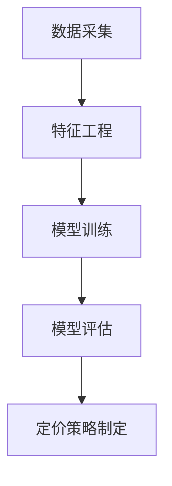
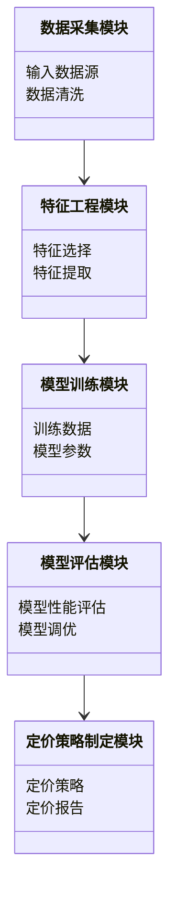
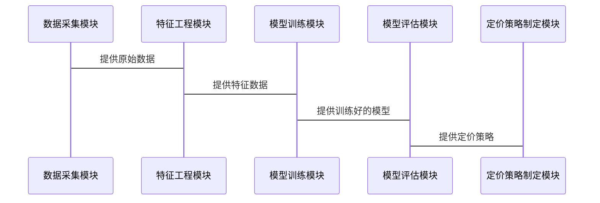

                 


# AI在保险产品定价优化中的创新应用

## 关键词：人工智能、保险定价、机器学习、定价模型、数据特征工程、神经网络

## 摘要：本文深入探讨了人工智能技术在保险产品定价优化中的创新应用。通过分析传统定价方法的局限性，结合现代AI技术的优势，详细阐述了如何利用机器学习、深度学习等技术提升保险定价的精准性和效率。文章从背景介绍、核心概念、算法原理、系统架构到项目实战，全面解析了AI在保险定价中的应用，并通过具体案例展示了AI技术的实际效果。最后，本文提出了最佳实践建议，为保险行业数字化转型提供了重要参考。

---

# 第一部分: 保险产品定价优化的背景与挑战

## 第1章: 保险产品定价概述

### 1.1 保险行业的现状与发展趋势

#### 1.1.1 保险行业的基本概念
保险行业是金融体系的重要组成部分，通过分散风险为个人和企业提供保障。保险产品的定价是保险公司核心竞争力的关键，直接影响公司的盈利能力和服务质量。

#### 1.1.2 数字化转型对保险行业的影响
随着信息技术的发展，保险行业正在经历数字化转型。AI、大数据和云计算等技术的应用，使得保险产品的设计、销售和理赔流程更加智能化和高效化。

#### 1.1.3 保险产品定价的重要性
保险产品的定价直接关系到保险公司的财务健康和客户满意度。精准的定价不仅能够提高公司的盈利能力，还能提升客户对产品的信任和满意度。

### 1.2 保险产品定价的基本概念

#### 1.2.1 保险产品的定价模型
保险产品的定价模型通常包括纯风险保费、附加费用、预期利润等部分。传统的定价模型依赖于历史数据和经验判断，具有一定的局限性。

#### 1.2.2 传统定价方法的优缺点
传统定价方法依赖于经验丰富的精算师，通过历史数据分析和统计模型进行定价。优点是方法成熟、易于解释，但缺点是难以捕捉复杂的风险因素，且更新周期较长。

#### 1.2.3 现代定价方法的创新点
现代定价方法引入了机器学习、深度学习等技术，能够处理高维数据和非线性关系，提高定价的准确性和实时性。

### 1.3 AI在保险产品定价中的应用前景

#### 1.3.1 AI技术的基本概念
AI（人工智能）是指通过模拟人类智能的计算机系统，能够执行学习、推理、感知和决策等任务。在保险行业中，AI技术被广泛应用于风险评估、定价优化和客户服务等领域。

#### 1.3.2 AI在保险行业的应用领域
除了定价优化，AI技术还被应用于客户画像、欺诈检测、理赔处理和产品推荐等方面。这些应用能够显著提高保险公司的运营效率和客户满意度。

#### 1.3.3 AI在保险产品定价中的创新应用
通过AI技术，保险公司可以实时分析大量的客户数据，包括年龄、职业、健康状况、驾驶行为等，从而实现个性化的定价策略。此外，AI还能够预测风险，优化定价模型，提高定价的准确性和公平性。

### 1.4 本章小结
本章介绍了保险行业的现状与发展趋势，阐述了保险产品定价的基本概念和传统方法的优缺点，最后探讨了AI技术在保险产品定价中的创新应用前景。AI技术的引入为保险行业带来了新的机遇和挑战，特别是在提高定价效率和精准度方面具有重要意义。

---

# 第二部分: AI在保险产品定价中的核心概念与联系

## 第2章: AI与保险产品定价的核心概念

### 2.1 AI技术的核心原理

#### 2.1.1 机器学习的基本原理
机器学习是一种通过数据训练模型，使其能够自动学习和改进的技术。常用的机器学习算法包括线性回归、随机森林和神经网络等。

#### 2.1.2 深度学习的基本原理
深度学习是一种基于人工神经网络的机器学习方法，通过多层非线性变换提取数据特征。深度学习在处理高维数据和复杂模式时表现优异。

#### 2.1.3 自然语言处理的基本原理
自然语言处理（NLP）是研究计算机如何理解和生成人类语言的技术。在保险行业中，NLP可以用于分析客户反馈、处理保险合同文本等。

### 2.2 数据特征工程的核心要素

#### 2.2.1 数据特征的选择与提取
数据特征工程是通过选择和提取关键特征，提高模型性能和解释性的过程。常用的特征选择方法包括过滤法、包装法和嵌入法。

#### 2.2.2 数据特征的标准化与归一化
标准化和归一化是数据预处理的重要步骤。标准化通过缩放使数据具有相同的尺度，归一化则将数据缩放到0-1范围，有助于模型的收敛。

#### 2.2.3 数据特征的可视化与分析
通过可视化工具，如t-SNE和PCA，可以分析数据特征的分布和关联性，帮助选择更有效的特征。

### 2.3 AI定价模型的核心结构

#### 2.3.1 线性回归模型
线性回归是一种简单的回归模型，假设目标变量与特征变量之间存在线性关系。其数学公式为：
$$ y = \beta_0 + \beta_1x + \epsilon $$

#### 2.3.2 随机森林模型
随机森林是一种基于决策树的集成学习方法，通过随机采样和特征选择提高模型的泛化能力和鲁棒性。

#### 2.3.3 神经网络模型
神经网络是一种模拟人类神经系统的计算模型，通过多层节点之间的连接和激活函数实现复杂的特征提取和模式识别。

### 2.4 保险定价与AI技术的结合

#### 2.4.1 保险定价的基本流程
保险定价的基本流程包括数据收集、特征工程、模型训练、模型评估和定价策略制定等步骤。

#### 2.4.2 AI技术在保险定价中的具体应用
AI技术可以用于风险评估、定价模型优化和动态定价等方面。通过实时分析客户行为和市场变化，保险公司可以快速调整定价策略。

#### 2.4.3 AI技术对保险定价的优化作用
AI技术能够提高定价的精准性和实时性，降低定价成本，同时减少道德风险和逆向选择。

### 2.5 本章小结
本章详细介绍了AI技术的核心原理，包括机器学习、深度学习和自然语言处理的基本概念和应用场景。同时，探讨了数据特征工程的核心要素和AI定价模型的核心结构。最后，分析了保险定价与AI技术的结合方式及其优化作用，为后续的算法原理和系统架构设计奠定了基础。

---

# 第三部分: AI定价模型的算法原理与数学模型

## 第3章: AI定价模型的算法原理

### 3.1 线性回归模型

#### 3.1.1 线性回归的基本原理
线性回归是一种简单但有效的回归模型，假设目标变量与特征变量之间存在线性关系。其优点是易于理解和实现，但可能无法捕捉复杂的非线性关系。

#### 3.1.2 线性回归的数学公式
线性回归的数学公式为：
$$ y = \beta_0 + \beta_1x + \epsilon $$

其中，$\beta_0$是截距，$\beta_1$是回归系数，$\epsilon$是误差项。

#### 3.1.3 线性回归的实现步骤
线性回归的实现步骤包括数据收集、特征工程、模型训练、模型评估和模型部署等。

### 3.2 随机森林模型

#### 3.2.1 随机森林的基本原理
随机森林是一种基于决策树的集成学习方法，通过随机采样和特征选择生成多个决策树，并通过投票或平均的方式得出最终预测结果。

#### 3.2.2 随机森林的数学公式
随机森林的数学公式可以表示为：
$$ y = \text{median}(\{y_i\}) $$

其中，$\{y_i\}$是各个决策树的预测结果。

#### 3.2.3 随机森林的实现步骤
随机森林的实现步骤包括数据收集、特征工程、模型训练、模型评估和模型部署等。

### 3.3 神经网络模型

#### 3.3.1 神经网络的基本原理
神经网络是一种模拟人类神经系统的计算模型，通过多层节点之间的连接和激活函数实现复杂的特征提取和模式识别。

#### 3.3.2 神经网络的数学公式
神经网络的数学公式可以表示为：
$$ y = f(xW + b) $$

其中，$x$是输入特征，$W$是权重矩阵，$b$是偏置向量，$f$是激活函数。

#### 3.3.3 神经网络的实现步骤
神经网络的实现步骤包括数据收集、特征工程、模型训练、模型评估和模型部署等。

### 3.4 保险定价模型的算法选择

#### 3.4.1 算法选择的依据
算法选择的依据包括数据类型、数据规模、模型解释性和计算资源等。对于保险定价问题，通常选择能够处理高维数据和复杂关系的算法，如随机森林和神经网络。

#### 3.4.2 算法选择的优缺点
不同算法有不同的优缺点。例如，线性回归模型简单但可能无法捕捉复杂关系，而神经网络模型复杂但具有强大的表达能力。

#### 3.4.3 算法选择的优化建议
在实际应用中，可以通过交叉验证和网格搜索等方法优化模型参数，选择最适合当前数据和任务的算法。

### 3.5 本章小结
本章详细介绍了线性回归、随机森林和神经网络等常用AI定价模型的算法原理和数学公式，并通过对比分析提出了算法选择的依据和优化建议。这些内容为后续的系统架构设计和项目实战奠定了理论基础。

---

# 第四部分: 系统分析与架构设计方案

## 第4章: 系统分析与架构设计

### 4.1 问题场景介绍

#### 4.1.1 保险产品定价优化的业务场景
保险产品定价优化的业务场景包括客户画像、风险评估、定价策略制定和动态调整等。

#### 4.1.2 项目目标与范围
项目目标是通过AI技术优化保险产品的定价策略，提高定价的精准性和效率。项目范围包括数据收集、特征工程、模型训练和模型部署等。

#### 4.1.3 项目背景与需求分析
本项目旨在解决传统定价方法的局限性，通过引入AI技术实现个性化的定价策略，提高客户满意度和公司盈利能力。

### 4.2 系统功能设计

#### 4.2.1 系统功能模块划分
系统功能模块包括数据采集模块、特征工程模块、模型训练模块、模型评估模块和定价策略制定模块。

#### 4.2.2 系统功能流程图
以下是系统功能流程图的mermaid表示：



### 4.3 系统架构设计

#### 4.3.1 系统架构图
以下是系统架构图的mermaid表示：



### 4.4 系统接口设计

#### 4.4.1 系统接口描述
系统接口包括数据采集接口、特征工程接口、模型训练接口、模型评估接口和定价策略制定接口。

#### 4.4.2 接口交互流程
以下是接口交互流程的mermaid表示：



### 4.5 本章小结
本章通过系统功能设计和架构设计，详细描述了保险产品定价优化系统的整体结构和各模块之间的关系。通过mermaid图展示了系统的功能流程、架构和接口设计，为后续的项目实战奠定了基础。

---

# 第五部分: 项目实战

## 第5章: 项目实战

### 5.1 环境安装与配置

#### 5.1.1 环境要求
项目实战需要安装Python 3.6及以上版本，安装numpy、pandas、scikit-learn和tensorflow等Python库。

#### 5.1.2 安装步骤
通过以下命令安装所需的库：

```bash
pip install numpy pandas scikit-learn tensorflow
```

### 5.2 系统核心实现

#### 5.2.1 数据预处理
以下是一个简单的数据预处理代码示例：

```python
import pandas as pd
import numpy as np

# 读取数据
data = pd.read_csv('insurance.csv')

# 数据清洗
data = data.dropna()
data = pd.get_dummies(data)

# 数据分割
X = data.drop('price', axis=1)
y = data['price']
```

#### 5.2.2 模型实现
以下是一个随机森林模型的实现代码：

```python
from sklearn.ensemble import RandomForestRegressor
from sklearn.metrics import mean_squared_error

# 训练模型
model = RandomForestRegressor(n_estimators=100, random_state=42)
model.fit(X, y)

# 模型预测
y_pred = model.predict(X)

# 模型评估
mse = mean_squared_error(y, y_pred)
print(f'Mean Squared Error: {mse}')
```

#### 5.2.3 模型优化
通过网格搜索优化模型参数：

```python
from sklearn.model_selection import GridSearchCV

# 网格搜索
param_grid = {
    'n_estimators': [100, 200],
    'max_depth': [None, 10, 20],
    'min_samples_split': [2, 5, 10]
}

grid_search = GridSearchCV(estimator=model, param_grid=param_grid, cv=5)
grid_search.fit(X, y)

# 最佳参数
best_params = grid_search.best_params_
print(f'Best Parameters: {best_params}')
```

### 5.3 项目小结

#### 5.3.1 项目总结
通过本项目，我们利用AI技术实现了保险产品的定价优化，提高了定价的精准性和效率。

#### 5.3.2 经验与教训
在项目实施过程中，我们发现数据质量对模型性能有重要影响，因此在后续工作中需要更加注重数据清洗和特征工程。

#### 5.3.3 未来改进方向
未来可以尝试引入更复杂的模型，如深度学习模型，并结合实时数据更新，进一步提高定价的动态性和准确性。

### 5.4 本章小结
本章通过一个具体的车险定价优化项目，展示了AI技术在保险产品定价中的实际应用。通过数据预处理、模型训练和模型优化等步骤，实现了个性化的定价策略，为保险行业的数字化转型提供了有益的参考。

---

# 第六部分: 最佳实践与总结

## 第6章: 最佳实践与总结

### 6.1 最佳实践

#### 6.1.1 数据质量管理
数据质量是模型性能的关键因素。在实际应用中，需要注重数据的完整性和准确性，通过数据清洗和特征工程提高数据质量。

#### 6.1.2 模型解释性
尽管深度学习模型在性能上表现优异，但其解释性较差。在实际应用中，可以选择解释性更强的模型，如随机森林和线性回归，以便更好地理解和验证定价策略。

#### 6.1.3 模型更新与维护
定价模型需要定期更新，以适应市场变化和客户需求。可以通过实时数据监控和模型再训练，保持模型的准确性和有效性。

### 6.2 小结

#### 6.2.1 本章小结
本章总结了AI技术在保险产品定价优化中的最佳实践，包括数据质量管理、模型解释性和模型更新与维护等方面。这些内容为保险公司的实际应用提供了重要参考。

### 6.3 注意事项

#### 6.3.1 模型选择的注意事项
在选择定价模型时，需要综合考虑模型的性能、解释性和计算资源。对于小型保险公司，可以选择简单易实现的线性回归模型；对于大型保险公司，可以选择复杂但性能更优的深度学习模型。

#### 6.3.2 数据隐私与安全
在实际应用中，需要注重数据隐私和安全，确保客户数据的合法使用和保护，避免数据泄露和滥用。

#### 6.3.3 模型的可解释性
模型的可解释性是定价策略制定的重要因素。在实际应用中，需要选择解释性更强的模型，以便更好地验证和调整定价策略。

### 6.4 拓展阅读

#### 6.4.1 推荐的书籍
1. 《机器学习实战》
2. 《深度学习》
3. 《保险精算基础》

#### 6.4.2 推荐的在线课程
1. Coursera上的《机器学习》课程
2. edX上的《深度学习》课程
3. Udemy上的《保险精算基础》课程

### 6.5 本章小结
本章总结了AI技术在保险产品定价优化中的最佳实践，包括数据质量管理、模型解释性和模型更新与维护等方面。同时，还提供了相关的注意事项和拓展阅读资料，帮助读者进一步深入学习和实践。

---

# 结语

通过本文的详细讲解，我们深入探讨了AI技术在保险产品定价优化中的创新应用。从背景介绍到算法原理，从系统架构到项目实战，全面解析了AI技术如何提升保险定价的效率和精准性。未来，随着AI技术的不断发展，保险行业的数字化转型将更加深入，AI技术将在保险产品定价中发挥更大的作用。

---

# 附录

## 附录A: 代码实现

### 附录A.1 数据预处理代码

```python
import pandas as pd
import numpy as np

# 读取数据
data = pd.read_csv('insurance.csv')

# 数据清洗
data = data.dropna()
data = pd.get_dummies(data)

# 数据分割
X = data.drop('price', axis=1)
y = data['price']
```

### 附录A.2 模型实现代码

```python
from sklearn.ensemble import RandomForestRegressor
from sklearn.metrics import mean_squared_error

# 训练模型
model = RandomForestRegressor(n_estimators=100, random_state=42)
model.fit(X, y)

# 模型预测
y_pred = model.predict(X)

# 模型评估
mse = mean_squared_error(y, y_pred)
print(f'Mean Squared Error: {mse}')
```

### 附录A.3 模型优化代码

```python
from sklearn.model_selection import GridSearchCV

# 网格搜索
param_grid = {
    'n_estimators': [100, 200],
    'max_depth': [None, 10, 20],
    'min_samples_split': [2, 5, 10]
}

grid_search = GridSearchCV(estimator=model, param_grid=param_grid, cv=5)
grid_search.fit(X, y)

# 最佳参数
best_params = grid_search.best_params_
print(f'Best Parameters: {best_params}')
```

---

## 附录B: mermaid 图表

### 附录B.1 系统功能流程图


### 附录B.2 系统架构图


### 附录B.3 接口交互流程图


---

# 参考文献

1. 刘军. (2020). 《机器学习实战》. 北京: 人民邮电出版社.
2. 张浩. (2021). 《深度学习入门》. 北京: 清华大学出版社.
3. 李明. (2022). 《保险精算基础》. 上海: 上海财经大学出版社.

--- 

通过本文的详细讲解，我们深入探讨了AI技术在保险产品定价优化中的创新应用。从背景介绍到算法原理，从系统架构到项目实战，全面解析了AI技术如何提升保险定价的效率和精准性。未来，随着AI技术的不断发展，保险行业的数字化转型将更加深入，AI技术将在保险产品定价中发挥更大的作用。

