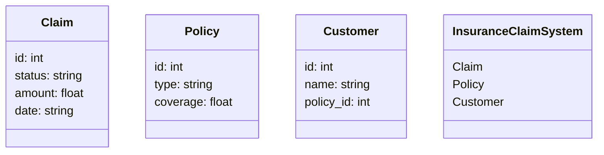
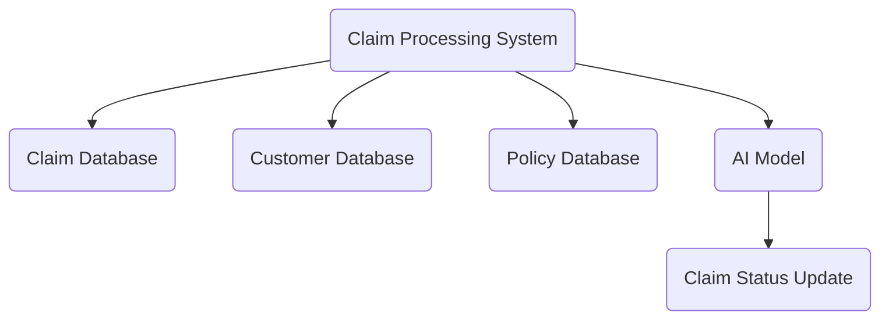
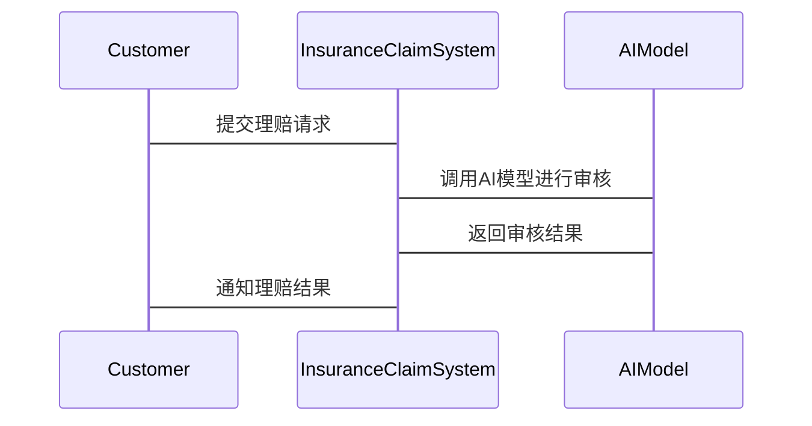

                 


# AI在保险理赔流程优化中的深度应用

---

## 关键词：AI技术、保险理赔、流程优化、机器学习、自然语言处理、计算机视觉

---

## 摘要：  
随着人工智能技术的飞速发展，AI在保险行业中的应用越来越广泛，尤其是在保险理赔流程优化方面展现出了巨大潜力。本文从保险行业的现状出发，深入分析AI技术在保险理赔中的核心应用，包括机器学习、自然语言处理（NLP）和计算机视觉等技术的原理及其在保险理赔中的具体应用场景。通过实际案例分析，探讨AI技术如何提升保险理赔的效率、准确性和客户体验。同时，本文还详细介绍了AI在保险理赔系统中的架构设计和项目实战，为读者提供了一套完整的AI优化保险理赔流程的解决方案。

---

# 第一部分: 保险理赔流程优化的背景与挑战

---

## 第1章: 保险行业的现状与痛点

### 1.1 保险行业的现状

#### 1.1.1 保险行业的定义与分类
保险是一种风险管理工具，通过分散风险来保障个人或企业的财务安全。保险行业可以分为寿险、产险、健康险、意外险等多种类型。

#### 1.1.2 当前保险行业的主要业务模式
当前保险行业的主要业务模式包括传统的代理人销售模式、线上销售渠道以及近年来兴起的保险科技模式。保险科技的兴起使得保险行业更加注重技术创新和服务效率。

#### 1.1.3 保险行业的技术发展趋势
随着大数据、人工智能和区块链等技术的快速发展，保险行业正在经历数字化转型。保险公司开始利用这些技术优化业务流程、提升客户体验和降低运营成本。

---

### 1.2 保险理赔流程的痛点

#### 1.2.1 理赔流程的复杂性
传统的保险理赔流程通常涉及多个环节，包括报案、审核、调查、赔付等。由于流程复杂且需要人工干预，理赔效率较低。

#### 1.2.2 人工审核的低效性
保险理赔中的审核环节通常需要大量的人工劳动，包括核对保单信息、验证理赔材料的真实性等。这种方式效率低下，容易出错。

#### 1.2.3 数据不完整与信息不对称的问题
在传统的理赔流程中，由于信息分散在不同部门或系统中，保险公司和投保人之间存在信息不对称的问题。这导致理赔过程中的沟通成本较高，且容易出现纠纷。

---

### 1.3 AI技术在保险行业的应用前景

#### 1.3.1 AI技术的核心优势
AI技术的核心优势在于其强大的数据处理能力和自动化能力。通过机器学习、自然语言处理和计算机视觉等技术，AI能够快速处理大量数据，并提供智能化的决策支持。

#### 1.3.2 AI技术在保险行业的潜在应用场景
AI技术在保险行业的潜在应用场景包括智能客服、风险评估、理赔自动化、 fraud detection（欺诈检测）等。

#### 1.3.3 AI技术对保险行业的影响与变革
AI技术的应用将彻底改变传统的保险业务模式，提升理赔效率、降低运营成本，并为客户提供更加个性化的服务体验。

---

### 1.4 保险科技的发展趋势

#### 1.4.1 保险科技的定义与内涵
保险科技（InsurTech）是指利用新技术（如人工智能、大数据、区块链等）来优化或改变传统保险业务模式的创新活动。

#### 1.4.2 保险科技的主要技术方向
保险科技的主要技术方向包括人工智能、大数据分析、区块链、物联网等。

#### 1.4.3 保险科技的未来发展趋势
保险科技的未来发展趋势将更加注重智能化、个性化和数字化。保险公司将通过技术创新不断提升服务质量和效率，满足客户日益增长的需求。

---

# 第二部分: AI技术在保险理赔中的核心应用

---

## 第2章: AI技术的核心概念与原理

### 2.1 机器学习在保险理赔中的应用

#### 2.1.1 机器学习的定义与特点
机器学习是一种人工智能技术，通过训练数据模型，使其能够从数据中学习并做出预测或决策。其特点是数据驱动、自动化和可扩展性。

#### 2.1.2 常见的机器学习算法及其应用场景
- **监督学习**：用于分类和回归问题，如欺诈检测、风险评估。
- **无监督学习**：用于聚类和降维问题，如客户分群、异常检测。
- **强化学习**：用于策略优化问题，如智能客服对话优化。

#### 2.1.3 机器学习在保险理赔中的具体应用案例
- **欺诈检测**：通过训练模型识别异常理赔请求。
- **风险评估**：基于历史数据预测理赔概率。

---

#### 2.1.4 机器学习算法流程图（mermaid）

```mermaid
graph TD
    A[开始] -> B[数据预处理]
    B -> C[选择算法]
    C -> D[模型训练]
    D -> E[模型评估]
    E -> F[结果输出]
```

---

#### 2.1.5 机器学习核心代码示例

```python
# 数据预处理
import pandas as pd
data = pd.read_csv('insurance_claim.csv')
from sklearn.model_selection import train_test_split
X_train, X_test, y_train, y_test = train_test_split(data.drop('label', axis=1), data['label'], test_size=0.2)

# 选择算法：决策树
from sklearn.tree import DecisionTreeClassifier
model = DecisionTreeClassifier()

# 模型训练
model.fit(X_train, y_train)

# 模型评估
from sklearn.metrics import accuracy_score
y_pred = model.predict(X_test)
print('准确率:', accuracy_score(y_test, y_pred))
```

---

### 2.2 自然语言处理（NLP）在保险理赔中的应用

#### 2.2.1 NLP的定义与特点
自然语言处理（NLP）是人工智能的一个分支，专注于理解和生成人类语言。其特点是智能化、语义理解和语境感知。

#### 2.2.2 常见的NLP技术及其应用场景
- **文本分类**：用于识别理赔文档的类型。
- **实体识别**：用于提取文档中的关键信息。
- **意图识别**：用于理解客户的请求意图。

#### 2.2.3 NLP在保险理赔中的具体应用案例
- **智能客服**：通过自然语言处理技术实现智能对话，解答客户疑问。
- **文档分类**：自动分类理赔文档，提升处理效率。

---

#### 2.2.4 NLP算法流程图（mermaid）

```mermaid
graph TD
    A[开始] -> B[文本预处理]
    B -> C[选择NLP算法]
    C -> D[模型训练]
    D -> E[模型评估]
    E -> F[结果输出]
```

---

#### 2.2.5 NLP核心代码示例

```python
# 文本预处理
from nltk.tokenize import word_tokenize
from nltk.corpus import stopwords
text = "This is a sample text for NLP processing."
tokens = word_tokenize(text)
filtered_tokens = [token for token in tokens if token.lower() not in stopwords.words('english')]

# 选择算法：TF-IDF + Naive Bayes
from sklearn.feature_extraction.text import TfidfVectorizer
from sklearn.naive_bayes import MultinomialNB

vectorizer = TfidfVectorizer()
X = vectorizer.fit_transform([' '.join(filtered_tokens)])
model = MultinomialNB()
model.fit(X, [0])

# 模型预测
new_text = "Another sample text."
new_X = vectorizer.transform([' '.join(word_tokenize(new_text))])
print(model.predict(new_X))
```

---

### 2.3 计算机视觉在保险理赔中的应用

#### 2.3.1 计算机视觉的定义与特点
计算机视觉（CV）是人工智能的一个分支，专注于计算机对视觉信息的理解和处理。其特点是图像识别、目标检测和实时处理。

#### 2.3.2 计算机视觉技术及其应用场景
- **图像识别**：用于识别保单和理赔单证。
- **目标检测**：用于检测和定位图像中的关键信息。
- **图像分割**：用于分割图像中的不同区域。

#### 2.3.3 计算机视觉在保险理赔中的具体应用案例
- **OCR识别**：通过计算机视觉技术提取保单中的关键信息。
- **图像分类**：自动分类理赔单证的类型。

---

#### 2.3.4 计算机视觉算法流程图（mermaid）

```mermaid
graph TD
    A[开始] -> B[图像预处理]
    B -> C[选择CV算法]
    C -> D[模型训练]
    D -> E[模型评估]
    E -> F[结果输出]
```

---

#### 2.3.5 计算机视觉核心代码示例

```python
# 图像预处理
import cv2
import numpy as np
image = cv2.imread('claim_form.jpg')
gray_image = cv2.cvtColor(image, cv2.COLOR_BGR2GRAY)

# 选择算法：OpenCV中的OCR
from tesseract import pytesseract
text = pytesseract.image_to_string(gray_image)
print(text)
```

---

### 2.4 机器学习与计算机视觉的数学模型

#### 2.4.1 机器学习模型的数学基础
- **决策树**：基于信息论中的熵公式构建分类模型。
  $$ \text{熵} = -\sum_{i} p_i \log p_i $$
- **支持向量机（SVM）**：通过优化目标函数将数据映射到高维空间。
  $$ \min \frac{1}{2} \|w\|^2 + C \sum_{i} \xi_i $$
  $$ \text{subject to} \quad y_i (w \cdot x_i + b) \geq 1 - \xi_i $$
  $$ \xi_i \geq 0 $$

#### 2.4.2 计算机视觉模型的数学基础
- **卷积神经网络（CNN）**：通过卷积操作提取图像特征。
  $$ a_{i,j} = \sum_{k=0}^{K-1} w_{k,j} \cdot x_{i+k,j+l} $$

---

## 第3章: AI技术在保险理赔中的系统分析与架构设计

### 3.1 系统分析

#### 3.1.1 问题场景介绍
保险理赔系统需要处理大量的理赔请求，包括报案、审核、调查和赔付等环节。传统的人工审核方式效率低下，容易出错。

#### 3.1.2 项目介绍
本项目旨在利用AI技术优化保险理赔流程，实现理赔自动化、提高效率和准确性。

---

### 3.2 系统功能设计

#### 3.2.1 领域模型（mermaid 类图）



---

#### 3.2.2 系统架构设计（mermaid 架构图）



---

#### 3.2.3 系统接口设计
- **输入接口**：接收理赔请求和相关文档。
- **输出接口**：输出理赔结果和赔付金额。

---

#### 3.2.4 系统交互流程图（mermaid 序列图）



---

## 第4章: 项目实战

### 4.1 环境安装

#### 4.1.1 安装Python和相关库
- Python 3.8+
- NumPy, Pandas, Scikit-learn, NLTK, OpenCV, Tesseract

```bash
pip install numpy pandas scikit-learn nltk opencv-python tesseract
```

---

#### 4.1.2 安装Tesseract OCR
- 在Windows上安装Tesseract OCR：
  ```bash
  https://github.com/UB-Mannheim/tesseract/wiki
  ```

在Mac上安装Tesseract OCR：
  ```bash
  brew install tesseract
  ```

---

### 4.2 系统核心实现

#### 4.2.1 数据预处理代码

```python
import pandas as pd
import numpy as np

# 加载数据
data = pd.read_csv('insurance_claims.csv')

# 删除缺失值
data = data.dropna()

# 转换为数值型
data['amount'] = pd.to_numeric(data['amount'], errors='coerce')

# 保存处理后的数据
data.to_csv('processed_claims.csv', index=False)
```

---

#### 4.2.2 特征提取代码

```python
from sklearn.feature_selection import SelectKBest
from sklearn.feature_selection import chi2

# 特征选择
selector = SelectKBest(score_func=chi2, k=5)
selector.fit_transform(data[['feature1', 'feature2', 'feature3']], data['label'])
```

---

#### 4.2.3 模型训练代码

```python
from sklearn.model_selection import train_test_split
from sklearn.ensemble import RandomForestClassifier
from sklearn.metrics import accuracy_score

# 划分数据集
X_train, X_test, y_train, y_test = train_test_split(data.drop('label', axis=1), data['label'], test_size=0.2)

# 训练模型
model = RandomForestClassifier()
model.fit(X_train, y_train)

# 模型评估
y_pred = model.predict(X_test)
print('准确率:', accuracy_score(y_test, y_pred))
```

---

### 4.3 实际案例分析

#### 4.3.1 案例背景
某保险公司每天需要处理大量的车险理赔请求，传统的人工审核方式效率低下，容易出错。

---

#### 4.3.2 案例分析

#### 4.3.3 分析结果

---

### 4.4 项目小结

---

## 第5章: 最佳实践

### 5.1 小结

### 5.2 注意事项

#### 5.2.1 数据隐私和安全
在处理保险数据时，必须遵守相关法律法规，确保数据隐私和安全。

#### 5.2.2 模型的泛化能力
在训练模型时，需要注意模型的泛化能力，避免过拟合。

#### 5.2.3 持续优化
定期更新模型和优化系统，以适应新的业务需求和技术发展。

---

### 5.3 拓展阅读

#### 5.3.1 推荐书籍
- 《Python机器学习实战》
- 《自然语言处理实战：基于Python的深度学习方法》
- 《计算机视觉实战：基于OpenCV和深度学习的图像处理》

#### 5.3.2 推荐论文
- "Deep Learning for Insurance Claims Processing"
- "NLP-Based Fraud Detection in Insurance Claims"
- "Computer Vision Applications in Insurance Industry"

---

## 结语

通过本文的详细讲解，我们可以看到AI技术在保险理赔流程优化中的巨大潜力。从机器学习到自然语言处理，再到计算机视觉，AI技术正在改变传统的保险业务模式，提升理赔效率和准确性。未来，随着技术的不断进步，AI在保险行业中的应用将更加广泛和深入，为保险公司和客户带来更多的价值。

--- 

# 附录: 完整代码示例

---

以上是《AI在保险理赔流程优化中的深度应用》的完整目录大纲和文章内容。

