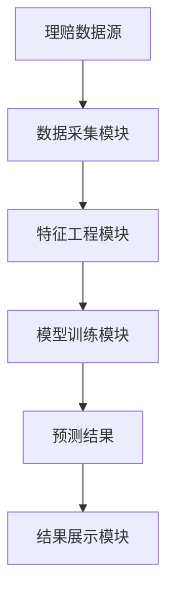

                 


# AI在保险理赔预测中的创新应用

> 关键词：人工智能、保险理赔、机器学习、深度学习、数据分析、预测模型

> 摘要：本文探讨了人工智能在保险理赔预测中的应用，分析了传统理赔流程的痛点，详细介绍了AI技术在理赔预测中的优势，涵盖了从背景介绍、核心概念、算法原理到系统架构、项目实战的各个方面，最后总结了AI在保险理赔预测中的创新价值和未来趋势。

---

## 第1章: 保险理赔预测的背景与现状

### 1.1 保险行业的数字化转型

#### 1.1.1 保险行业的现状与挑战
保险行业正面临着数字化转型的压力，传统的理赔流程效率低下，人工审核耗时且容易出错。保险公司需要通过技术手段提高效率、降低成本。

#### 1.1.2 数字化转型的必要性
随着数据量的爆炸式增长和计算能力的提升，保险公司开始引入AI技术来优化理赔流程，提升客户体验。

#### 1.1.3 AI技术在保险行业的应用前景
AI技术在保险行业的应用前景广阔，尤其是在理赔预测、风险评估和客户服务等领域。

### 1.2 保险理赔预测的定义与重要性

#### 1.2.1 保险理赔的基本概念
保险理赔是指在保险合同约定的条件下，保险公司对被保险人或受益人进行赔偿或给付的行为。

#### 1.2.2 理赔预测的定义与目标
理赔预测是通过分析历史数据和当前情况，预测未来可能发生的理赔事件及其金额。

#### 1.2.3 理赔预测在保险业务中的价值
通过预测理赔情况，保险公司可以提前做好资金准备，优化资源配置，降低运营成本。

### 1.3 AI技术如何解决传统理赔问题

#### 1.3.1 传统理赔流程的痛点
传统理赔流程繁琐，容易出错，且缺乏数据支持，难以进行精准预测。

#### 1.3.2 AI在理赔预测中的优势
AI技术可以通过大数据分析和机器学习算法，快速识别潜在风险，提高预测准确性。

#### 1.3.3 理赔预测的边界与外延
理赔预测不仅限于对赔付金额的预测，还包括对赔付概率的评估，以及对客户行为的分析。

---

## 第2章: AI在保险理赔预测中的核心概念

### 2.1 AI技术的核心概念

#### 2.1.1 机器学习与深度学习
机器学习是通过算法从数据中学习模式，深度学习则是通过多层神经网络进行特征提取和模式识别。

#### 2.1.2 数据挖掘与特征工程
数据挖掘是从大量数据中提取有用信息的过程，特征工程则是对数据进行处理和特征提取，以提高模型性能。

#### 2.1.3 自然语言处理（NLP）与图像识别
NLP用于处理文本数据，图像识别则用于分析图像信息，这些技术在保险理赔中的应用越来越广泛。

### 2.2 理赔预测的核心要素

#### 2.2.1 理赔数据的特征与属性
理赔数据包括保单信息、事故记录、医疗费用等，这些数据是理赔预测的基础。

#### 2.2.2 理赔模型的输入与输出
模型输入是各种特征数据，输出是对理赔概率和金额的预测。

#### 2.2.3 理赔预测的评价指标
常用的评价指标包括准确率、召回率、F1分数等。

### 2.3 核心概念之间的关系

#### 2.3.1 AI技术与保险业务的关联
AI技术通过数据分析和模式识别，为保险业务提供支持。

#### 2.3.2 理赔数据与模型的关系
高质量的数据是模型准确性的基础，模型通过数据学习，提高预测能力。

#### 2.3.3 理赔预测与业务决策的互动
理赔预测结果可以为保险公司的定价、风控等决策提供参考。

---

## 第3章: 常见的理赔预测算法

### 3.1 机器学习算法

#### 3.1.1 线性回归
线性回归是一种简单的回归算法，适用于线性关系的预测。

$$ y = \beta_0 + \beta_1x + \epsilon $$

#### 3.1.2 支持向量机（SVM）
SVM适用于分类问题，通过构建超平面实现数据的线性或非线性分类。

#### 3.1.3 随机森林
随机森林是一种基于决策树的集成算法，具有较高的准确性和鲁棒性。

#### 3.1.4 XGBoost与LightGBM
XGBoost和LightGBM是常用的梯度提升算法，适用于分类和回归问题。

### 3.2 深度学习算法

#### 3.2.1 神经网络
神经网络通过多层结构进行特征提取和模式识别，适用于复杂的非线性问题。

#### 3.2.2 LSTM
LSTM适用于时间序列数据的预测，常用于处理具有时序依赖性的理赔数据。

#### 3.2.3 图神经网络
图神经网络适用于处理具有复杂关系的数据，如社交网络或索赔关系图。

---

## 第4章: 数学模型与算法原理

### 4.1 逻辑回归模型

#### 4.1.1 模型原理
逻辑回归是一种常用的二分类算法，适用于预测理赔概率。

$$ P(y=1|x) = \frac{e^{\beta_0 + \beta_1x}}{1 + e^{\beta_0 + \beta_1x}} $$

#### 4.1.2 模型训练
通过最大似然估计求解模型参数，优化目标函数。

#### 4.1.3 案例分析
通过一个简单的案例，展示逻辑回归在理赔预测中的应用。

---

## 第5章: 系统分析与架构设计

### 5.1 理赔预测系统的场景介绍

#### 5.1.1 系统目标
构建一个高效的理赔预测系统，提高预测准确性和效率。

#### 5.1.2 系统功能
包括数据采集、特征工程、模型训练、结果展示等功能。

### 5.2 系统架构设计

#### 5.2.1 领域模型设计
使用Mermaid绘制领域模型类图，展示系统的功能模块和交互关系。


#### 5.2.2 系统架构
使用Mermaid绘制系统架构图，展示系统的整体结构和模块划分。



---

## 第6章: 项目实战

### 6.1 环境安装

#### 6.1.1 Python环境配置
安装Python和必要的库，如scikit-learn、xgboost、pandas等。

### 6.2 系统核心实现

#### 6.2.1 数据加载与处理
使用pandas读取数据，进行数据清洗和特征工程。

```python
import pandas as pd

data = pd.read_csv('claims.csv')
data = data.dropna()
data = pd.get_dummies(data)
```

#### 6.2.2 模型训练与评估
选择合适的模型进行训练，并评估模型性能。

```python
from sklearn.model_selection import train_test_split
from sklearn.ensemble import RandomForestClassifier
from sklearn.metrics import accuracy_score

X_train, X_test, y_train, y_test = train_test_split(data.drop('target', axis=1), data['target'], test_size=0.2)
model = RandomForestClassifier().fit(X_train, y_train)
y_pred = model.predict(X_test)
print(accuracy_score(y_test, y_pred))
```

### 6.3 实际案例分析

#### 6.3.1 数据分析
通过数据分析找到影响理赔的主要因素。

#### 6.3.2 模型优化
通过调参和特征选择优化模型性能。

---

## 第7章: 最佳实践与小结

### 7.1 最佳实践

#### 7.1.1 数据质量的重要性
确保数据的完整性和准确性，是模型性能的基础。

#### 7.1.2 模型选择与优化
选择合适的模型，并通过调参和评估指标优化模型性能。

### 7.2 小结

#### 7.2.1 AI在保险理赔中的创新价值
AI技术显著提高了理赔预测的效率和准确性，优化了保险公司的运营成本。

#### 7.2.2 挑战与展望
尽管AI在理赔预测中表现出色，但数据隐私和模型解释性等问题仍需进一步解决。

---

## 第8章: 注意事项与拓展阅读

### 8.1 注意事项

#### 8.1.1 数据隐私保护
在处理敏感数据时，需遵守相关法律法规，保护用户隐私。

#### 8.1.2 模型的可解释性
复杂的模型可能难以解释，需平衡模型的准确性和可解释性。

### 8.2 拓展阅读

#### 8.2.1 阅读推荐
推荐一些关于机器学习和保险行业的书籍和论文，供读者深入学习。

---

通过以上结构和内容安排，本文系统地介绍了AI在保险理赔预测中的创新应用，从理论到实践，为读者提供了全面的视角和深入的分析。

