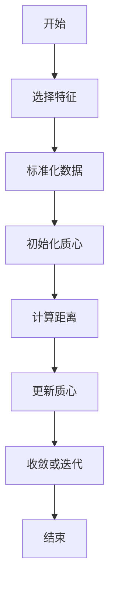
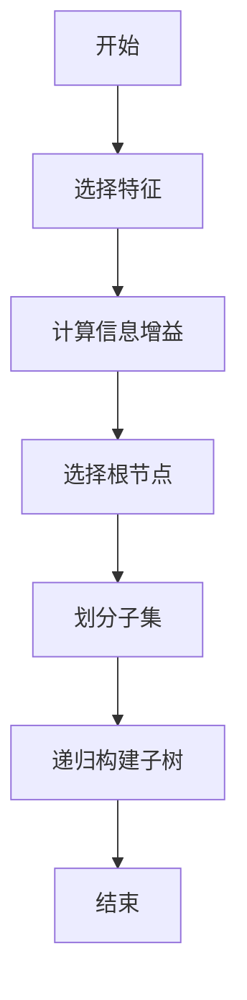
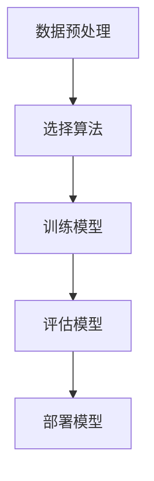
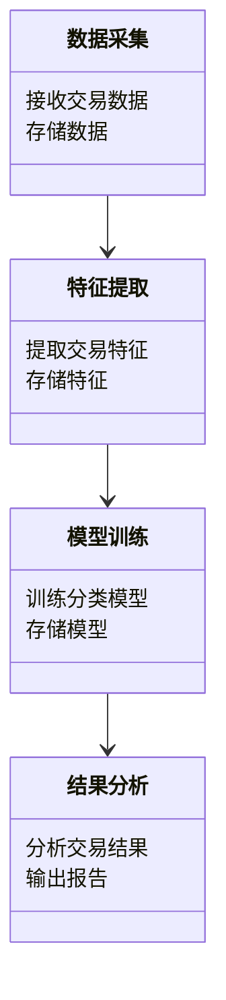
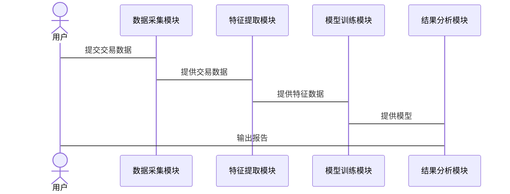

                 


# AI在反洗钱模式识别中的创新应用

## 关键词：反洗钱、人工智能、模式识别、机器学习、深度学习

## 摘要

在金融犯罪日益复杂的今天，传统的反洗钱技术面临着数据量大、交易复杂、洗钱手段多样化的挑战。人工智能（AI）技术的快速发展为反洗钱模式识别提供了新的解决方案。本文将详细探讨AI技术在反洗钱中的创新应用，从背景、核心概念、算法原理、系统架构到项目实战，全面解析AI如何助力反洗钱模式识别的效率和准确性。通过分析具体案例和算法实现，本文将为读者呈现AI在反洗钱领域的深度应用和未来发展趋势。

---

## 第一部分: 反洗钱与AI模式识别概述

### 第1章: 反洗钱的基本概念

#### 1.1 洗钱的定义与常见手法
洗钱是指将非法获得的资金通过一系列复杂的交易，使其在表面上合法化的过程。常见的洗钱手法包括：
- **隐藏资金来源**：通过多次转账、空壳公司等手段隐藏资金的非法来源。
- **拆分交易**：将大额交易拆分为多个小额交易，避免触发反洗钱监控系统。
- **利用地下金融体系**：通过黑市交易、虚拟货币等途径转移资金。

#### 1.2 反洗钱的法律与监管要求
全球范围内的反洗钱法规要求金融机构必须建立完善的反洗钱体系，包括客户身份识别（KYC）、交易监控和报告可疑交易（STR）。这些要求推动了技术在反洗钱中的应用。

#### 1.3 反洗钱技术的发展历程
传统的反洗钱技术主要依赖于规则-based系统，通过设置固定的交易阈值和特征来识别可疑交易。然而，这种方法存在以下缺陷：
- **规则固定化**：难以应对洗钱手段的多样化。
- **效率低下**：需要人工审查大量交易数据。
- **漏判率高**：复杂交易可能被规则系统漏判。

AI技术的引入，特别是机器学习和深度学习，为反洗钱带来了革命性的变化。

---

### 第2章: AI在反洗钱中的应用背景

#### 2.1 传统反洗钱技术的局限性
传统的反洗钱技术依赖于固定的规则和模式匹配，难以应对以下挑战：
- **数据量大**：金融机构每天处理的交易数据可能以百万计。
- **交易复杂**：洗钱者可能通过多层次的交易结构隐藏资金来源。
- **规则更新滞后**：新的洗钱手法出现后，需要人工调整规则，效率较低。

#### 2.2 AI技术在金融领域的潜力
AI技术在金融领域的应用已经取得了显著成果，包括欺诈检测、信用评估和风险管理。反洗钱作为金融安全的重要组成部分，同样可以受益于AI技术的以下几个方面：
- **数据处理能力**：AI能够快速处理海量数据，提取关键特征。
- **模式识别能力**：AI能够发现隐藏在数据中的异常模式。
- **自适应能力**：AI模型可以不断学习新的洗钱手法，优化检测能力。

#### 2.3 反洗钱模式识别的创新需求
随着全球化和数字化的发展，洗钱手段变得越来越隐蔽和复杂。传统的反洗钱技术已经难以满足需求，AI技术的引入成为必然选择。模式识别技术可以帮助金融机构更高效地识别可疑交易，降低漏判率。

---

## 第二部分: 反洗钱模式识别的核心概念与联系

### 第3章: 反洗钱模式识别的基本原理

#### 3.1 模式识别的定义与分类
模式识别是指通过计算机技术对数据进行分析，识别出其中的模式或规律。在反洗钱领域，模式识别主要用于识别异常交易模式，从而发现洗钱行为。

#### 3.2 反洗钱模式识别的特征提取
特征提取是模式识别的关键步骤，以下是常见的反洗钱交易特征：
- **交易金额**：大额交易或频繁的小额交易可能引起关注。
- **交易频率**：短时间内大量交易可能涉嫌洗钱。
- **交易时间**：非正常时间段的交易可能具有可疑性。
- **交易类型**：某些特定类型的交易可能与洗钱相关。

#### 3.3 模式识别在反洗钱中的应用
模式识别技术可以帮助金融机构识别以下异常行为：
- **账户行为异常**：同一账户在短时间内进行大量交易。
- **交易网络异常**：多个账户之间存在复杂的交易关系。
- **地理位置异常**：交易地点分布在不同国家或地区。

---

### 第4章: AI技术与反洗钱模式识别的结合

#### 4.1 机器学习在反洗钱中的应用
机器学习是一种AI技术，通过训练模型从数据中学习模式。在反洗钱中，机器学习可以用于：
- **分类任务**：将交易分为正常和可疑。
- **聚类任务**：发现交易中的异常群体。
- **回归任务**：预测交易风险。

#### 4.2 深度学习在反洗钱中的优势
深度学习是一种基于人工神经网络的机器学习技术，具有以下优势：
- **非线性特征提取**：深度学习可以自动提取复杂的非线性特征。
- **处理高维数据**：深度学习适合处理高维数据，如图像和文本。
- **自适应能力强**：深度学习模型能够自动调整参数，适应新的数据。

#### 4.3 自然语言处理在反洗钱中的创新应用
自然语言处理（NLP）技术可以用于分析交易相关的文本数据，例如：
- **交易描述分析**：通过NLP技术分析交易描述，识别异常词汇或语义。
- **文档审查**：自动审查交易相关的文档，识别潜在的洗钱行为。

---

### 第5章: 核心概念对比与ER实体关系图

#### 5.1 传统反洗钱技术与AI技术的对比
| 特性                | 传统反洗钱技术        | AI技术             |
|---------------------|-----------------------|--------------------|
| 数据处理能力        | 有限                  | 强大              |
| 模式识别能力        | 基于固定规则          | 基于数据学习        |
| 自适应能力          | 低                    | 高                |

#### 5.2 ER实体关系图在反洗 money 模式识别中的应用
以下是反洗钱模式识别的ER实体关系图：

```mermaid
er
actor: 金融机构, 客户, 第三方支付平台
entity: 交易记录, 账户信息, 支付方式
relationship: 参与, 关联, 影响
```

---

## 第三部分: 反洗钱模式识别的算法原理

### 第6章: 常见的反洗钱模式识别算法

#### 6.1 聚类算法
聚类算法用于将交易数据分为不同的类别，识别异常交易群体。以下是K-means聚类算法的流程图：



#### 6.2 分类算法
分类算法用于将交易分为正常和可疑。以下是决策树分类算法的流程图：



#### 6.3 深度学习算法
深度学习算法用于处理复杂的交易模式。以下是卷积神经网络（CNN）的数学模型：

$$
\text{CNN} = \{ W, b \} \quad \text{其中} \quad W \text{是权重矩阵，} b \text{是偏置}
$$`

---

### 第7章: 算法流程图与数学模型

#### 7.1 算法流程图
以下是机器学习算法的通用流程图：



#### 7.2 数学模型
以下是支持向量机（SVM）的数学模型：

$$
\text{SVM} = \{ w, b \} \quad \text{其中} \quad w \text{是权重向量，} b \text{是偏置}
$$`

---

## 第四部分: 反洗钱模式识别的系统分析与架构设计

### 第8章: 系统分析

#### 8.1 问题场景介绍
反洗钱系统需要处理以下问题：
- 数据量大
- 交易复杂
- 洗钱手段多样化

#### 8.2 项目介绍
本项目旨在设计一个基于AI的反洗钱系统，包括数据采集、特征提取、模型训练和结果分析四个模块。

---

### 第9章: 系统架构设计

#### 9.1 系统功能设计
以下是反洗钱系统的功能模块：



---

### 第10章: 系统接口设计

#### 10.1 系统接口设计
以下是反洗钱系统的接口设计：



---

## 第五部分: 项目实战

### 第11章: 环境安装

#### 11.1 安装Python
使用以下命令安装Python：

```bash
sudo apt-get install python3
```

#### 11.2 安装相关库
安装机器学习库：

```bash
pip install numpy scikit-learn
```

---

### 第12章: 系统核心实现源代码

#### 12.1 数据预处理
以下是数据预处理的代码：

```python
import pandas as pd

# 读取数据
data = pd.read_csv('transactions.csv')

# 删除缺失值
data = data.dropna()

# 标准化数据
from sklearn.preprocessing import StandardScaler
scaler = StandardScaler()
data_scaled = scaler.fit_transform(data)
```

#### 12.2 模型训练
以下是模型训练的代码：

```python
from sklearn.model_selection import train_test_split
from sklearn.svm import SVC

# 划分训练集和测试集
X_train, X_test, y_train, y_test = train_test_split(data_scaled, data['label'], test_size=0.2)

# 训练模型
model = SVC()
model.fit(X_train, y_train)

# 评估模型
print(model.score(X_test, y_test))
```

---

### 第13章: 实际案例分析与详细解读

#### 13.1 实际案例分析
以下是某银行的交易数据：

```python
# 示例交易数据
transactions = {
    'amount': [1000, 2000, 500, 10000, 300],
    'frequency': ['high', 'high', 'low', 'high', 'low'],
    'time': ['morning', 'afternoon', 'night', 'afternoon', 'night']
}
```

#### 13.2 详细解读
通过对交易数据的分析，模型可以识别出异常交易：

```python
# 预测结果
y_pred = model.predict(X_test)
print(y_pred)
```

---

## 第六部分: 总结与展望

### 第14章: 总结

#### 14.1 AI在反洗钱中的优势
AI技术可以帮助金融机构更高效地识别异常交易，降低漏判率。

#### 14.2 未来的发展方向
未来，AI技术将在反洗钱领域发挥更大的作用，包括：
- 更复杂的模型
- 更多的数据来源
- 更智能的决策系统

---

### 第15章: 最佳实践 tips

#### 15.1 小结
AI技术在反洗钱中的应用前景广阔，但需要结合实际场景进行优化。

#### 15.2 注意事项
- 数据隐私保护
- 模型更新与维护
- 多算法融合

#### 15.3 拓展阅读
- 《机器学习实战》
- 《深度学习入门》
- 《反洗钱技术与实践》

---

以上是《AI在反洗钱模式识别中的创新应用》的完整目录和内容框架，涵盖了从理论到实践的各个方面，结合具体代码和案例，帮助读者深入了解AI在反洗钱中的创新应用。

