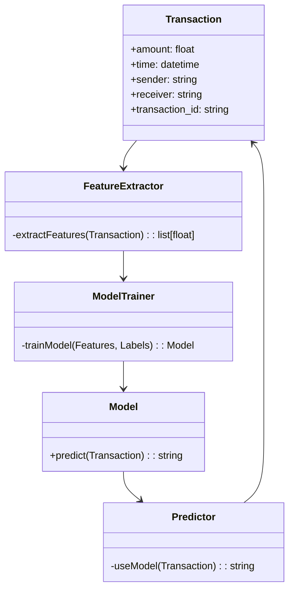

                 


# AI在反洗钱模式进化检测中的深度应用研究

> 关键词：反洗钱, AI技术, 模式进化检测, 机器学习, 深度学习, 金融安全

> 摘要：随着金融诈骗手段的不断进化，传统的反洗钱方法逐渐显得力不从心。AI技术，尤其是深度学习和机器学习，在模式识别和异常检测方面的优势，为反洗钱模式进化检测提供了新的解决方案。本文将从AI技术的基本原理出发，详细探讨其在反洗钱模式进化检测中的应用，包括算法原理、系统架构设计、项目实战案例分析以及未来的发展方向。

---

## 第1章: 反洗钱与模式进化检测概述

### 1.1 反洗钱的基本概念

反洗钱（Anti-Money Laundering, AML）是指通过各种手段将非法所得合法化的过程，是全球金融监管的重要组成部分。传统的反洗钱方法依赖于人工审查和规则-based的交易监控系统，这些系统基于固定的规则和阈值，难以应对洗钱手段的多样化和复杂化。

#### 1.1.1 反洗钱的定义与目的

反洗钱的目的是为了识别和阻止非法资金流动，防止犯罪所得通过金融系统洗白。传统的反洗钱方法依赖于规则-based系统，但这种方法存在以下问题：
- **规则固定的局限性**：固定规则难以应对洗钱手段的不断进化。
- **人工审查成本高**：需要大量的人力和时间来分析交易数据。
- **漏检风险**：复杂的交易网络容易被漏检。

#### 1.1.2 反洗钱的法律与监管框架

全球范围内的反洗钱监管框架包括《反洗钱法》、《巴塞尔协议》等，要求金融机构建立有效的反洗钱系统，确保交易的透明性和合规性。

#### 1.1.3 反洗钱技术的发展历程

- **阶段一：规则-based系统**：基于固定的交易规则和阈值进行检测。
- **阶段二：引入数据分析技术**：利用大数据分析技术对交易数据进行挖掘和分析。
- **阶段三：AI与机器学习的应用**：通过AI技术实现自动化、智能化的反洗钱检测。

### 1.2 模式进化检测的定义与特点

模式进化检测是指通过分析交易数据的模式变化，识别出异常交易行为，从而实现对洗钱行为的早期预警和拦截。

#### 1.2.1 模式进化检测的核心概念

- **模式识别**：通过分析交易数据的特征，识别出正常的交易模式和异常模式。
- **模式进化**：随着时间的推移，洗钱行为会不断进化，模式也会随之变化，需要系统能够动态适应。

#### 1.2.2 模式进化检测与传统反洗钱技术的区别

| 特性             | 传统反洗钱技术                     | 模式进化检测                     |
|------------------|------------------------------------|----------------------------------|
| 方法             | 基于固定规则和阈值                | 基于机器学习和深度学习          |
| 适应性           | 静态，难以应对新型洗钱手段         | 动态，能够识别新型模式           |
| 检测效率         | 低效，依赖人工审查                 | 高效，自动化检测                 |

#### 1.2.3 模式进化检测的必要性与应用场景

模式进化检测的必要性：
- 洗钱手段日益复杂化和隐蔽化。
- 传统反洗钱技术难以应对新型洗钱手段。

模式进化检测的应用场景：
- 银行交易监控
- 虚拟货币交易监管
- 跨-border资金流动监控

---

## 第2章: AI与反洗钱模式进化检测的核心概念

### 2.1 AI技术在反洗钱中的应用背景

#### 2.1.1 AI技术的基本原理

AI技术包括机器学习、深度学习等多种技术，通过数据训练模型，实现对数据的分类、聚类、回归等任务。

#### 2.1.2 AI技术在金融领域的应用现状

- 风险评估
- 股票预测
- 交易监控
- 反欺诈

#### 2.1.3 AI技术在反洗钱中的优势与挑战

优势：
- 高效性：能够快速处理大量交易数据。
- 准确性：通过机器学习模型，能够识别出复杂的异常模式。

挑战：
- 数据隐私：处理大量金融数据需要考虑隐私保护。
- 模型解释性：复杂的模型难以解释其决策过程。

### 2.2 模式进化检测的数学模型与算法

#### 2.2.1 模式进化检测的数学模型

模式进化检测的数学模型通常包括以下步骤：
1. 数据预处理：清洗和标准化数据。
2. 特征提取：从交易数据中提取有用的特征。
3. 模型训练：使用机器学习或深度学习算法训练模型。
4. 模型评估：通过测试数据评估模型的性能。
5. 模型部署：将模型应用于实际交易数据中。

#### 2.2.2 常见的模式检测算法

- **监督学习算法**：如随机森林、支持向量机（SVM）。
- **无监督学习算法**：如聚类、异常检测。
- **深度学习算法**：如神经网络、循环神经网络（RNN）。

#### 2.2.3 深度学习在模式进化检测中的应用

深度学习通过多层神经网络结构，能够自动提取交易数据的高维特征，识别出复杂的异常模式。

---

## 第3章: AI在反洗钱模式进化检测中的算法原理

### 3.1 监督学习算法

#### 3.1.1 监督学习的基本原理

监督学习是一种机器学习方法，通过训练数据，模型能够学习输入与输出之间的映射关系。

#### 3.1.2 常见监督学习算法

- **随机森林**：通过构建多个决策树，集成学习方法提高模型的准确性和鲁棒性。
- **支持向量机（SVM）**：通过构建超平面，将数据点分到不同的类别中。

#### 3.1.3 监督学习在反洗钱中的应用案例

案例：使用随机森林算法对交易数据进行分类，识别出正常交易和异常交易。

---

### 3.2 无监督学习算法

#### 3.2.1 无监督学习的基本原理

无监督学习是一种机器学习方法，通过数据内在的结构，发现数据中的聚类或异常点。

#### 3.2.2 常见无监督学习算法

- **聚类**：如K-means算法，将交易数据分成不同的类别。
- **异常检测**：如Isolation Forest算法，识别出异常交易。

#### 3.2.3 无监督学习在模式进化检测中的优势

优势：
- 无需标注数据，适用于数据标注困难的场景。
- 能够发现新的模式和异常。

---

### 3.3 深度学习算法

#### 3.3.1 深度学习的基本原理

深度学习是一种机器学习方法，通过多层神经网络结构，自动提取数据的特征。

#### 3.3.2 常见深度学习算法

- **神经网络**：如卷积神经网络（CNN）、循环神经网络（RNN）。
- **自动编码器（Autoencoder）**：通过编码和解码过程，提取数据的特征。

#### 3.3.3 深度学习在反洗钱中的应用与挑战

应用：
- 能够处理高维数据，识别复杂的异常模式。
- 适用于交易数据的序列分析。

挑战：
- 需要大量标注数据，否则模型性能可能下降。
- 模型的解释性较差。

---

## 第4章: AI在反洗钱模式进化检测中的系统分析与架构设计

### 4.1 问题场景介绍

#### 4.1.1 反洗钱模式进化检测的典型场景

场景：某银行发现可疑交易，需要通过AI技术进行模式进化检测，识别出异常交易。

#### 4.1.2 系统目标与功能需求

目标：
- 实现对交易数据的实时监控。
- 自动识别异常交易。
- 提供实时预警。

功能需求：
- 数据采集：从银行系统中获取交易数据。
- 数据预处理：清洗和标准化数据。
- 特征提取：从交易数据中提取特征。
- 模型训练：训练机器学习模型。
- 模型部署：将模型应用于实际交易数据中。

### 4.2 系统功能设计

#### 4.2.1 领域模型设计（Mermaid类图）



#### 4.2.2 系统功能模块划分

模块划分：
- 数据采集模块
- 数据预处理模块
- 特征提取模块
- 模型训练模块
- 模型部署模块

---

## 第5章: AI在反洗钱模式进化检测中的项目实战

### 5.1 环境安装

#### 5.1.1 安装Python环境

```bash
python --version
pip install numpy
pip install scikit-learn
pip install tensorflow
```

#### 5.1.2 安装机器学习库

```bash
pip install scikit-learn
pip install tensorflow
```

### 5.2 系统核心实现源代码

#### 5.2.1 数据预处理代码

```python
import pandas as pd

# 读取交易数据
data = pd.read_csv('transactions.csv')

# 删除缺失值
data = data.dropna()

# 标准化数据
from sklearn.preprocessing import StandardScaler

scaler = StandardScaler()
data_scaled = scaler.fit_transform(data)
```

#### 5.2.2 特征提取代码

```python
from sklearn.decomposition import PCA

pca = PCA(n_components=10)
principal_components = pca.fit_transform(data_scaled)
```

#### 5.2.3 模型训练代码

```python
from sklearn.ensemble import RandomForestClassifier

model = RandomForestClassifier(n_estimators=100, random_state=42)
model.fit(principal_components, labels)
```

#### 5.2.4 模型部署代码

```python
import joblib

joblib.dump(model, 'anti_fraud.pkl')
```

### 5.3 案例分析与解读

#### 5.3.1 案例背景

某银行发现大量异常交易，需要通过AI技术进行模式进化检测。

#### 5.3.2 数据分析与特征提取

通过PCA提取交易数据的主成分，识别出异常交易的特征。

#### 5.3.3 模型训练与评估

使用随机森林算法训练模型，评估模型的准确率、召回率和F1分数。

#### 5.3.4 模型部署与实时监控

将模型部署到生产环境中，实时监控交易数据，识别出异常交易并发出预警。

---

## 第6章: 总结与展望

### 6.1 最佳实践 tips

- 数据隐私保护：在处理交易数据时，需要遵守数据隐私保护的相关法律法规。
- 模型解释性：尽量选择解释性较强的模型，便于业务人员理解和使用。
- 模型更新：定期更新模型，以应对洗钱手段的不断进化。

### 6.2 小结

通过AI技术，特别是机器学习和深度学习，可以有效提升反洗钱模式进化检测的效率和准确性。AI技术能够自动识别异常交易模式，降低漏检和误检的风险，为金融安全提供强有力的支持。

### 6.3 注意事项

- 数据质量：确保交易数据的完整性和准确性。
- 模型选择：根据具体场景选择合适的算法和模型。
- 模型部署：确保模型在生产环境中的稳定运行。

### 6.4 拓展阅读

- 《Python机器学习实战》
- 《深度学习入门：基于Python》
- 《金融风险管理与反洗钱》

---

通过本文的分析和讲解，我们可以看到，AI技术在反洗钱模式进化检测中的应用前景广阔。随着技术的不断发展，AI技术将为金融安全提供更加智能化和高效的解决方案。

