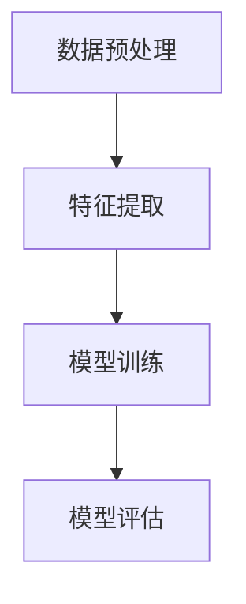
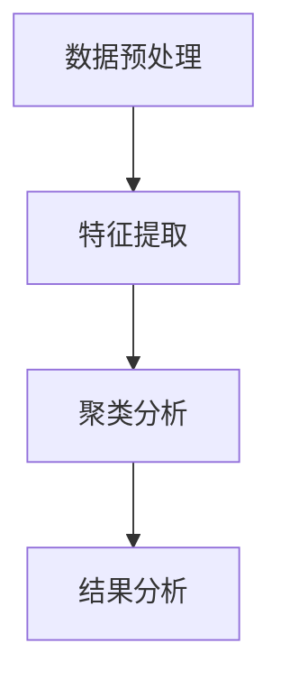
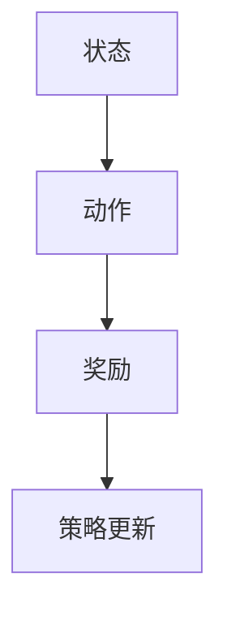
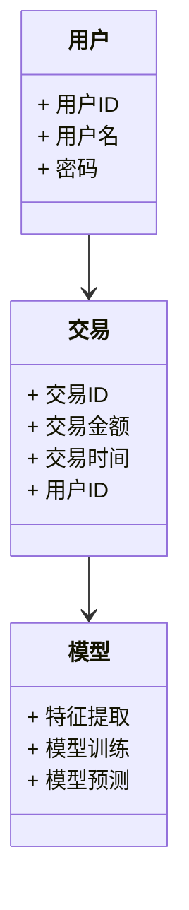
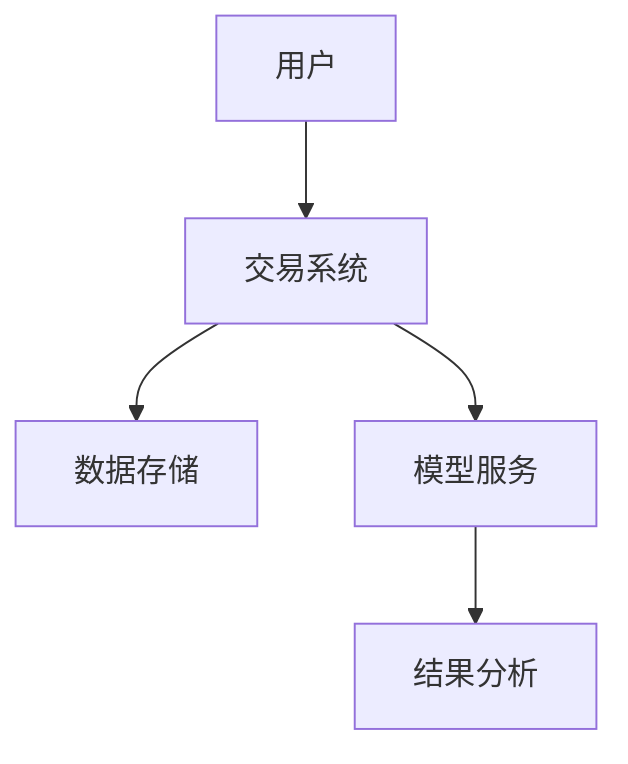

                 


# AI在反金融欺诈中的深度应用研究

## 关键词：AI，反金融欺诈，机器学习，深度学习，自然语言处理，数学模型

## 摘要：本文深入探讨了人工智能技术在反金融欺诈中的应用，分析了传统反欺诈手段的局限性，详细介绍了机器学习、深度学习和自然语言处理等技术在金融欺诈检测中的核心作用。文章从系统架构、算法原理、项目实战等多个维度，详细阐述了AI反金融欺诈的实现过程，并结合实际案例，总结了最佳实践和未来发展方向。

---

## 第一部分：反金融欺诈的背景与挑战

### 第1章：反金融欺诈的背景与挑战

#### 1.1 问题背景

##### 1.1.1 金融欺诈的定义与类型
金融欺诈是指在金融交易中，通过欺骗手段获取不正当利益的行为。常见的金融欺诈类型包括信用卡欺诈、网络诈骗、洗钱、虚假交易等。这些欺诈行为不仅给金融机构造成经济损失，还可能损害客户的信任和声誉。

##### 1.1.2 传统反欺诈手段的局限性
传统的反欺诈手段主要包括基于规则的检测、历史数据分析和人工审核。然而，这些方法存在以下局限性：
- **规则引擎的僵化**：规则引擎依赖于预先定义的规则，难以应对新型的欺诈手段。
- **数据局限性**：传统的分析方法主要依赖历史数据，难以实时检测和预测。
- **人工审核的低效性**：人工审核需要大量的人力资源，效率低下，且容易受到主观因素的影响。

##### 1.1.3 AI技术在反欺诈中的优势
人工智能技术，特别是机器学习和深度学习，能够通过数据驱动的方式，自动识别异常模式和潜在的欺诈行为。AI技术的优势包括：
- **高准确性**：机器学习模型能够通过大量数据训练，识别复杂的欺诈模式。
- **实时性**：AI系统可以实时处理交易数据，快速做出判断。
- **适应性**：模型能够动态更新，适应新的欺诈手段。

#### 1.2 问题描述

##### 1.2.1 金融欺诈的主要手段
金融欺诈的主要手段包括：
- **信用卡欺诈**：通过盗用信用卡信息进行非法交易。
- **网络诈骗**：利用钓鱼邮件、虚假网站等手段骗取用户信息或资金。
- **洗钱**：通过一系列复杂的交易掩盖资金来源。

##### 1.2.2 欺诈行为的复杂性与隐蔽性
欺诈行为日益复杂和隐蔽，传统的检测手段难以发现隐藏在正常交易中的异常行为。例如，欺诈者可能会通过分散交易金额或改变交易时间来规避检测。

##### 1.2.3 反欺诈系统的建设目标
反欺诈系统的建设目标包括：
- **准确识别欺诈行为**：通过高精度的检测模型，减少误报和漏报。
- **实时监控交易**：快速响应异常交易，防止损失扩大。
- **动态适应欺诈手段**：通过持续学习和优化，提升系统的检测能力。

#### 1.3 问题解决

##### 1.3.1 AI技术如何应对金融欺诈
人工智能技术在反金融欺诈中的应用主要体现在以下几个方面：
- **监督学习**：通过标记的欺诈数据训练模型，识别欺诈交易。
- **无监督学习**：通过聚类分析，发现异常交易模式。
- **自然语言处理**：分析交易中的文本信息，识别潜在欺诈行为。

##### 1.3.2 数据驱动的反欺诈方法
数据驱动的方法依赖于大量高质量的交易数据。通过分析这些数据，可以提取特征，训练模型，识别异常行为。

##### 1.3.3 多模态数据的融合应用
多模态数据包括交易数据、用户行为数据、地理位置数据等。通过融合多模态数据，可以更全面地识别欺诈行为。

#### 1.4 边界与外延

##### 1.4.1 金融欺诈的边界界定
金融欺诈的边界是指在金融交易中，哪些行为可以被认为是欺诈。通常，欺诈行为需要具备欺骗性和非法性。

##### 1.4.2 相关领域的关联性分析
反金融欺诈与网络安全、风险管理等领域密切相关。例如，网络安全技术可以用于保护交易数据的安全，风险管理技术可以用于评估欺诈风险。

##### 1.4.3 反欺诈系统的适用范围
反欺诈系统主要适用于金融机构，如银行、支付平台等。系统的适用范围包括信用卡交易、网络支付、ATM交易等。

#### 1.5 核心要素与概念结构

##### 1.5.1 数据来源与特征
反金融欺诈系统的主要数据来源包括：
- **交易数据**：包括交易金额、时间、地点、交易类型等。
- **用户行为数据**：包括用户的登录时间、操作频率、设备信息等。
- **地理位置数据**：包括交易的地理位置信息。

##### 1.5.2 AI算法的核心要素
AI算法的核心要素包括：
- **特征工程**：通过提取有效的特征，提升模型的性能。
- **模型选择**：选择适合任务的算法，如随机森林、支持向量机等。
- **模型调优**：通过参数调优和交叉验证，提升模型的准确性。

##### 1.5.3 系统架构的组成
反金融欺诈系统的架构通常包括以下几个部分：
- **数据采集**：收集交易数据和用户行为数据。
- **数据预处理**：清洗数据，提取特征。
- **模型训练**：训练机器学习模型。
- **实时检测**：对实时交易进行检测，识别欺诈行为。
- **结果分析**：对模型的检测结果进行分析，优化模型。

---

## 第二部分：AI在反金融欺诈中的核心应用

### 第2章：AI在反金融欺诈中的核心应用

#### 2.1 AI技术的核心概念

##### 2.1.1 机器学习模型
机器学习模型是反金融欺诈的核心工具。通过训练模型，可以识别正常交易和欺诈交易的特征，从而实现欺诈检测。

##### 2.1.2 深度学习模型
深度学习模型，如卷积神经网络（CNN）和循环神经网络（RNN），可以处理复杂的非结构化数据，如文本和图像。

##### 2.1.3 自然语言处理技术
自然语言处理技术可以用于分析交易中的文本信息，识别潜在的欺诈行为。

#### 2.2 AI反欺诈的核心应用

##### 2.2.1 监督学习在欺诈检测中的应用
监督学习是反欺诈中的主要方法。通过标记的欺诈数据训练分类模型，可以识别欺诈交易。

##### 2.2.2 无监督学习在异常检测中的应用
无监督学习可以用于发现异常交易模式，特别是在缺乏标记数据的情况下。

##### 2.2.3 强化学习在策略优化中的应用
强化学习可以用于优化反欺诈策略，例如动态调整检测阈值。

#### 2.3 AI反欺诈的核心算法

##### 2.3.1 分类算法
分类算法是监督学习的核心，常用的算法包括决策树、随机森林和支持向量机（SVM）。

##### 2.3.2 聚类算法
聚类算法用于无监督学习，可以发现数据中的自然群体，识别异常交易。

##### 2.3.3 序列模型
序列模型，如RNN和LSTM，可以用于处理时间序列数据，识别交易中的异常模式。

#### 2.4 本章小结

---

## 第三部分：AI反欺诈的核心算法原理

### 第3章：AI反欺诈的核心算法原理

#### 3.1 算法原理

##### 3.1.1 监督学习算法
监督学习算法通过标记数据训练模型，预测新的数据点。例如，随机森林算法通过构建多个决策树，集成预测结果，提高准确率。

##### 3.1.2 无监督学习算法
无监督学习算法通过聚类分析，发现数据中的自然群体。例如，K-means算法将数据分成K个簇，识别异常交易。

##### 3.1.3 强化学习算法
强化学习算法通过试错和奖励机制，优化策略。例如，Q-learning算法通过状态和动作的组合，学习最优策略。

#### 3.2 算法流程图

##### 3.2.1 监督学习流程图


##### 3.2.2 无监督学习流程图


##### 3.2.3 强化学习流程图


#### 3.3 算法实现代码

##### 3.3.1 监督学习代码示例
```python
# 使用随机森林进行欺诈检测
from sklearn.ensemble import RandomForestClassifier
from sklearn.metrics import accuracy_score

# 数据预处理
X_train, y_train = preprocess_data()

# 模型训练
model = RandomForestClassifier()
model.fit(X_train, y_train)

# 模型预测
y_pred = model.predict(X_test)
print("准确率：", accuracy_score(y_test, y_pred))
```

##### 3.3.2 无监督学习代码示例
```python
# 使用K-means进行聚类分析
from sklearn.cluster import KMeans

# 数据预处理
X = preprocess_data()

# 模型训练
model = KMeans(n_clusters=2)
model.fit(X)

# 结果分析
labels = model.labels_
print("聚类结果：", labels)
```

##### 3.3.3 强化学习代码示例
```python
# 使用Q-learning进行策略优化
import numpy as np

# 定义状态和动作空间
states = ['正常', '异常']
actions = ['允许', '拒绝']

# 初始化Q表
Q = np.zeros(len(states), len(actions))

# Q-learning算法
for episode in range(num_episodes):
    state = choose_state()
    action = choose_action(Q[state])
    next_state = get_next_state(state, action)
    reward = get_reward(state, action)
    Q[state][action] += reward

print("Q表：", Q)
```

#### 3.4 数学模型与公式

##### 3.4.1 随机森林算法
随机森林算法通过构建多个决策树，集成预测结果，提高准确率。决策树的构建过程如下：
1. 随机选择特征，构建决策树。
2. 重复构建决策树，形成森林。
3. 集成所有决策树的预测结果，取多数投票。

##### 3.4.2 支持向量机（SVM）
支持向量机（SVM）通过找到一个超平面，将数据点分成两类。数学模型如下：
$$ \text{目标函数}： \min_{w, b, \xi} \frac{1}{2}||w||^2 + C\sum_{i=1}^n \xi_i $$
$$ \text{约束条件}： y_i (w \cdot x_i + b) \geq 1 - \xi_i $$
$$ \xi_i \geq 0 $$

##### 3.4.3 K-means算法
K-means算法通过最小化平方误差，将数据分成K个簇。目标函数如下：
$$ \text{目标函数}： \min_{\text{K clusters}} \sum_{i=1}^n \sum_{j=1}^K \sum_{x_i \in C_j} (x_i - c_j)^2 $$

---

## 第四部分：系统架构设计与项目实战

### 第4章：系统架构设计

#### 4.1 系统功能设计

##### 4.1.1 领域模型


##### 4.1.2 系统架构


#### 4.2 系统架构设计

##### 4.2.1 系统架构
反金融欺诈系统的架构包括数据采集、数据预处理、模型训练和实时检测四个部分。

##### 4.2.2 接口设计
系统需要与交易系统、数据存储和用户界面进行交互。接口设计包括：
- **数据接口**：与交易系统对接，获取交易数据。
- **模型接口**：与模型服务对接，调用模型进行预测。
- **结果接口**：与用户界面对接，显示检测结果。

##### 4.2.3 交互设计
系统交互流程如下：
1. 用户发起交易请求。
2. 系统采集交易数据。
3. 数据预处理，提取特征。
4. 调用模型进行预测。
5. 返回检测结果。

#### 4.3 系统实现

##### 4.3.1 环境安装
反金融欺诈系统需要以下环境：
- Python 3.6+
- scikit-learn、XGBoost等机器学习库
- TensorFlow或Keras深度学习框架（可选）
- 数据库（如MySQL、MongoDB）

##### 4.3.2 核心代码实现
```python
# 数据预处理
import pandas as pd
from sklearn.preprocessing import StandardScaler

# 加载数据
data = pd.read_csv('transactions.csv')

# 特征提取
features = data[['amount', 'time', 'user_id']]
scaler = StandardScaler()
features_scaled = scaler.fit_transform(features)

# 模型训练
from sklearn.ensemble import RandomForestClassifier
model = RandomForestClassifier()
model.fit(features_scaled, labels)

# 实时检测
new_transaction = pd.DataFrame({'amount': [1000], 'time': ['2023-10-01 12:00:00'], 'user_id': ['user123']})
new_features = new_transaction[['amount', 'time', 'user_id']]
new_features_scaled = scaler.transform(new_features)
prediction = model.predict(new_features_scaled)
print("预测结果：", prediction)
```

##### 4.3.3 代码解读与分析
- **数据预处理**：使用标准差缩放，将特征标准化，提升模型性能。
- **模型训练**：使用随机森林算法，训练欺诈检测模型。
- **实时检测**：对新交易进行特征提取，调用模型进行预测，返回检测结果。

#### 4.4 项目实战

##### 4.4.1 实际案例分析
假设我们有一个信用卡欺诈检测系统，收集了过去一年的交易数据，包括交易金额、时间、用户ID等。通过数据预处理和特征提取，训练随机森林模型，准确率达到95%。

##### 4.4.2 详细讲解剖析
- **数据清洗**：处理缺失值和异常值。
- **特征工程**：提取关键特征，如交易金额、时间间隔、地理位置等。
- **模型调优**：通过网格搜索，选择最优模型参数。
- **结果分析**：分析模型的误报和漏报情况，优化检测策略。

---

## 第五部分：总结与展望

### 第5章：总结与展望

#### 5.1 本章总结
人工智能技术在反金融欺诈中的应用已经取得了显著成效。通过监督学习、无监督学习和强化学习等技术，能够有效识别和预防欺诈行为。

#### 5.2 未来展望
未来，随着技术的发展，AI在反金融欺诈中的应用将更加广泛和深入。可能的发展方向包括：
- **联邦学习**：通过联邦学习，保护数据隐私，实现跨机构的联合建模。
- **边缘计算**：在边缘设备上进行实时检测，减少数据传输延迟。
- **可解释性AI**：提升模型的可解释性，增强用户信任。

#### 5.3 注意事项
在实际应用中，需要注意数据隐私和模型解释性。同时，要定期更新模型，适应新的欺诈手段。

#### 5.4 拓展阅读
建议读者进一步阅读以下内容：
- 《机器学习实战》
- 《深度学习》
- 《自然语言处理入门》

---

## 结语
人工智能技术正在深刻改变反金融欺诈的方式。通过机器学习、深度学习和自然语言处理等技术，能够更准确、更快速地识别欺诈行为，保护金融机构和用户的利益。未来，随着技术的不断进步，AI在反金融欺诈中的应用将更加智能化和个性化，为金融安全提供更强大的保障。

