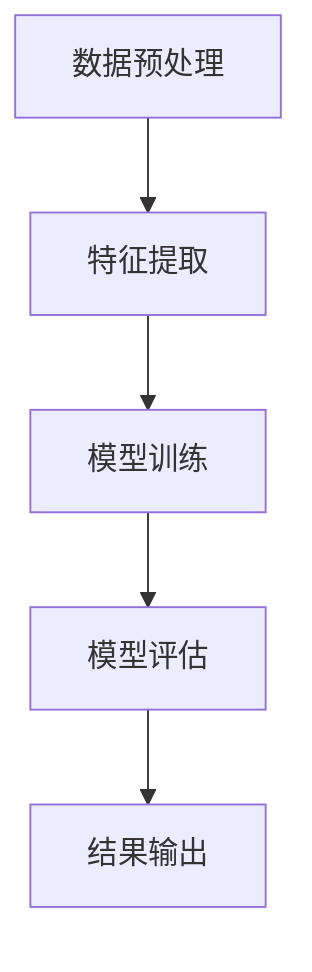
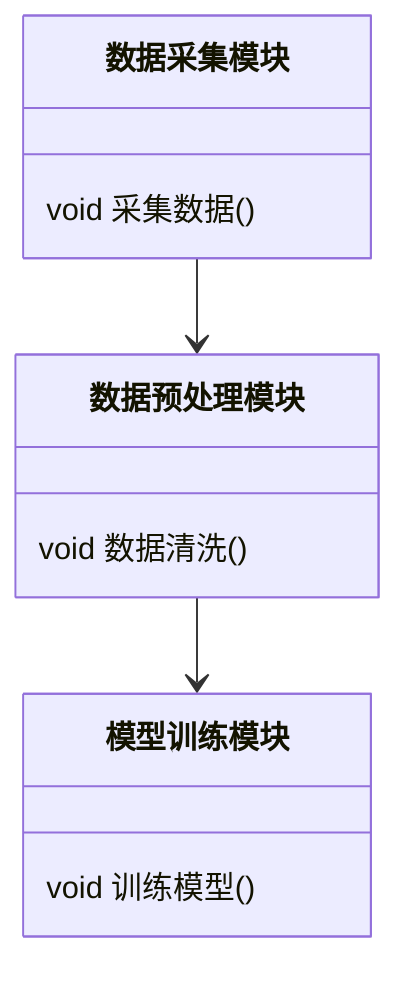
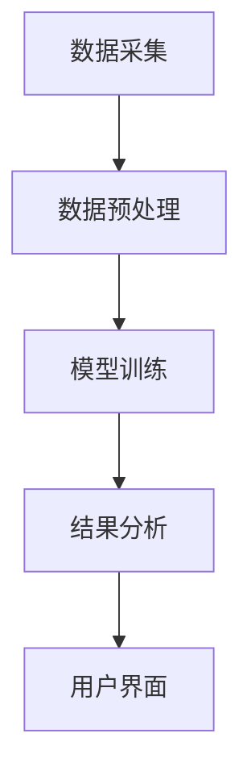
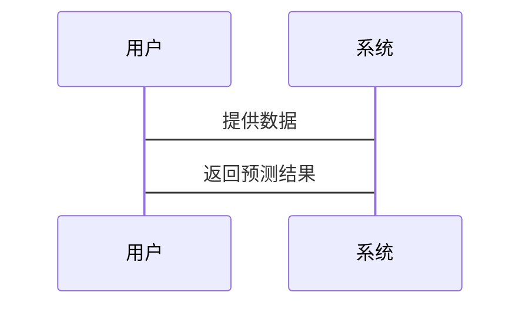

                 


# AI在金融市场微观结构分析中的创新应用

---

## 关键词：
- 人工智能（AI）
- 金融市场微观结构
- 机器学习
- 时间序列分析
- 高频交易
- 数据驱动决策

---

## 摘要：
本文深入探讨了人工智能技术在金融市场微观结构分析中的创新应用。通过结合金融市场微观结构的核心概念、AI技术的算法原理以及实际项目案例，本文系统性地分析了AI如何在金融市场的微观层面实现高效的数据处理、模式识别和决策优化。文章首先介绍了金融市场微观结构的基本概念和AI技术的背景，然后详细阐述了AI算法在微观结构分析中的原理与实现，接着通过系统架构设计和项目实战，展示了AI技术在金融市场的实际应用价值。最后，本文总结了AI在金融微观结构分析中的最佳实践与未来发展方向。

---

# 第1章: 金融市场微观结构分析概述

## 1.1 金融市场微观结构的基本概念
### 1.1.1 金融市场的定义与分类
金融市场是资金流动与资产交易的场所，根据交易主体、时间跨度和产品类型的不同，可以分为场内市场与场外市场、货币市场与资本市场、一级市场与二级市场等。

### 1.1.2 微观结构分析的核心要素
- 市场参与者的行为特征
- 价格形成的机制
- 交易量与交易频率的变化
- 市场流动性与波动性

### 1.1.3 微观结构分析的意义与应用
微观结构分析能够揭示市场参与者的交易策略、市场信息的传播路径以及价格波动的内在规律，为高频交易、风险管理和投资决策提供数据支持。

---

## 1.2 AI技术在金融领域的应用背景
### 1.2.1 AI技术的发展与现状
人工智能技术的快速发展为金融领域的数据分析和决策优化提供了新的工具。深度学习、自然语言处理和强化学习等技术在金融领域的应用日益广泛。

### 1.2.2 AI在金融领域的典型应用
- 股票价格预测
- 风险评估与信用评分
- 高频交易策略优化
- 市场情绪分析

### 1.2.3 微观结构分析中的AI创新点
AI技术能够处理高频交易数据，发现传统方法难以捕捉的市场微观特征，为市场微观结构分析提供了新的视角。

---

## 1.3 本章小结
金融市场微观结构分析是理解市场运行机制的重要手段，而AI技术的引入为这一领域带来了创新性的解决方案。通过结合AI技术，可以更高效地分析市场数据，挖掘潜在的交易机会和风险点。

---

# 第2章: AI在金融市场微观结构分析中的核心概念

## 2.1 问题背景与问题描述
### 2.1.1 金融市场微观结构中的典型问题
- 价格波动的预测
- 市场参与者的交易行为建模
- 市场微观结构对整体市场的影响

### 2.1.2 AI技术如何解决这些问题
AI技术可以通过大数据分析和模式识别，揭示市场微观结构中的复杂关系，帮助解决传统方法难以处理的问题。

### 2.1.3 问题解决的边界与外延
AI技术的应用需要结合具体的市场环境和数据特征，其效果受到数据质量、模型选择和计算能力的限制。

---

## 2.2 核心概念与联系
### 2.2.1 微观结构分析的核心要素
- 市场参与者
- 交易时间序列
- 价格与交易量的关系
- 市场流动性

### 2.2.2 AI技术的关键属性特征对比表
| **特征**       | **传统方法**               | **AI方法**                  |
|----------------|---------------------------|-----------------------------|
| 数据处理能力   | 依赖于少量特征工程         | 支持高维数据和非线性模式识别 |
| 计算效率       | 计算复杂度高               | 计算效率高                  |
| 模型可解释性   | 模型解释性强               | 模型可解释性较弱            |

### 2.2.3 ER实体关系图的Mermaid流程图
```mermaid
erDiagram
    participant 市场参与者
    participant 交易记录
    participant 价格数据
    市场参与者 --> 交易记录
    交易记录 --> 价格数据
    价格数据 --> 市场参与者
```

---

## 2.3 本章小结
通过分析金融市场微观结构的核心要素以及AI技术的关键属性特征，我们可以看到AI技术在处理复杂市场数据和揭示市场微观结构中的潜在规律方面具有显著优势。

---

# 第3章: AI算法在微观结构分析中的原理

## 3.1 算法原理概述
### 3.1.1 算法原理的数学模型
AI算法在微观结构分析中通常采用时间序列分析模型，例如：
$$y_t = \alpha y_{t-1} + \beta x_t + \epsilon_t$$

其中，$y_t$ 表示当前时刻的市场变量，$y_{t-1}$ 表示上一时刻的市场变量，$x_t$ 表示外部因素，$\epsilon_t$ 表示随机扰动项。

### 3.1.2 算法流程的Mermaid流程图


---

## 3.2 算法实现与代码解读
### 3.2.1 环境安装与配置
推荐使用Python环境，安装必要的库：
```
pip install numpy pandas scikit-learn tensorflow
```

### 3.2.2 核心算法的Python源代码实现
```python
import numpy as np
import pandas as pd
from sklearn.preprocessing import MinMaxScaler
from tensorflow.keras.models import Sequential
from tensorflow.keras.layers import LSTM, Dense

# 数据预处理
data = pd.read_csv('market_data.csv')
scaler = MinMaxScaler()
data_scaled = scaler.fit_transform(data)

# 模型构建
model = Sequential()
model.add(LSTM(50, return_sequences=True, input_shape=(timesteps, features)))
model.add(Dense(1))
model.compile(optimizer='adam', loss='mean_squared_error')

# 模型训练
model.fit(X_train, y_train, epochs=100, batch_size=32)
```

### 3.2.3 代码功能与实际案例分析
通过上述代码，我们可以训练一个LSTM模型，用于预测市场价格的变化。实际案例中，我们使用高频交易数据，验证模型在预测市场波动中的表现。

---

## 3.3 算法的数学模型与公式
### 3.3.1 线性回归模型
$$y = \beta_0 + \beta_1x + \epsilon$$

### 3.3.2 非线性模型的扩展
$$y = f(x) = \sigma(wx + b)$$
其中，$\sigma$ 表示sigmoid函数，$w$ 和 $b$ 是模型参数。

---

## 3.4 本章小结
通过详细讲解AI算法的数学模型和实现代码，我们可以看到AI技术在金融市场微观结构分析中的具体应用方式。

---

# 第4章: 系统分析与架构设计方案

## 4.1 项目背景与目标
### 4.1.1 项目需求分析
本项目旨在利用AI技术分析金融市场微观结构，优化高频交易策略，提高交易效率和收益。

### 4.1.2 项目目标与范围
- 数据采集与预处理
- 模型训练与优化
- 系统集成与部署

---

## 4.2 系统功能设计
### 4.2.1 领域模型的Mermaid类图


### 4.2.2 系统功能模块划分
- 数据采集模块
- 数据预处理模块
- 模型训练模块
- 结果分析模块

---

## 4.3 系统架构设计
### 4.3.1 系统架构的Mermaid架构图


### 4.3.2 系统接口设计
- 数据输入接口
- 模型调用接口
- 结果输出接口

### 4.3.3 系统交互的Mermaid序列图


---

## 4.4 本章小结
通过系统架构设计，我们可以清晰地看到AI技术在金融市场微观结构分析中的具体实现方式和系统流程。

---

# 第5章: 项目实战与案例分析

## 5.1 环境安装与配置
### 5.1.1 开发环境的选择
推荐使用Jupyter Notebook进行开发和调试。

### 5.1.2 依赖库的安装与配置
```
pip install numpy pandas scikit-learn tensorflow
```

---

## 5.2 核心算法实现
### 5.2.1 数据预处理与特征提取
- 数据清洗
- 特征选择
- 数据标准化

### 5.2.2 模型训练与优化
- 参数调整
- 模型评估
- 超参数优化

### 5.2.3 模型评估与测试
- 训练集与测试集的划分
- 模型性能评估指标

---

## 5.3 实际案例分析
### 5.3.1 案例背景与数据来源
我们以某股票市场的高频交易数据为例，分析其价格波动规律。

### 5.3.2 模型在案例中的应用
通过LSTM模型预测股票价格的变化趋势，并验证模型的预测精度。

### 5.3.3 案例结果与分析
- 模型预测结果与实际价格的对比
- 模型在不同市场环境下的表现

---

## 5.4 本章小结
通过实际案例分析，我们可以验证AI技术在金融市场微观结构分析中的应用效果，并总结经验教训。

---

# 第6章: 最佳实践与小结

## 6.1 最佳实践与注意事项
### 6.1.1 开发中的常见问题与解决方案
- 数据质量问题：确保数据的完整性和准确性。
- 模型过拟合问题：通过交叉验证和正则化技术进行优化。
- 计算资源限制：合理选择模型复杂度和计算资源。

### 6.1.2 模型优化与调参技巧
- 参数调整：通过网格搜索或随机搜索优化模型参数。
- 模型集成：使用集成学习方法提高模型的泛化能力。

### 6.1.3 代码规范与文档编写
- 代码规范：遵循PEP 8等规范，提高代码可读性。
- 文档编写：详细记录代码功能和使用方法，方便后续维护和扩展。

---

## 6.2 项目总结与未来展望
### 6.2.1 项目成果与经验总结
通过本项目，我们成功实现了AI技术在金融市场微观结构分析中的应用，验证了AI技术在高频交易中的潜力。

### 6.2.2 未来研究方向与发展趋势
- 更复杂的时间序列模型：如Transformer和Graph Neural Network。
- 多模态数据融合：结合文本数据和市场数据进行综合分析。
- 自适应算法：研究动态调整模型参数的自适应算法。

---

## 6.3 本书小结与读者寄语
### 6.3.1 本书的核心内容回顾
本书系统性地介绍了AI技术在金融市场微观结构分析中的创新应用，从理论到实践，全面讲解了AI算法的实现和优化方法。

### 6.3.2 对读者的建议与鼓励
希望读者能够结合实际需求，灵活运用本书中的方法，探索AI技术在金融领域的更多可能性。

### 6.3.3 未来学习与研究的方向
建议读者进一步学习深度学习和强化学习的相关知识，关注金融市场的最新动态和技术趋势。

---

## 附录: 常用工具与库
- 数据处理：Pandas、NumPy
- 模型训练：TensorFlow、Keras
- 可视化：Matplotlib、Seaborn
- 时间序列分析：LSTM、ARIMA

