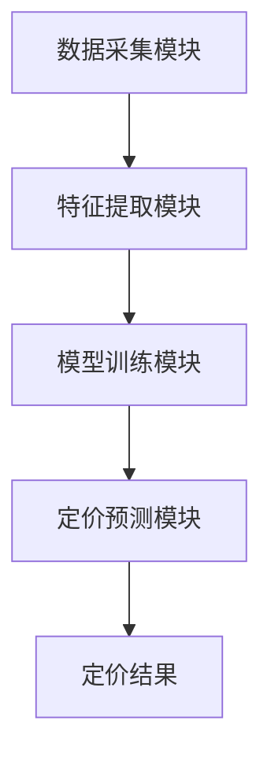

                 


# AI在金融衍生品定价中的深度应用研究

## 关键词：人工智能, 金融衍生品, 定价模型, 机器学习, 深度学习, 神经网络, 金融风险管理

## 摘要：  
本文深入探讨了人工智能（AI）在金融衍生品定价中的应用，结合机器学习和深度学习技术，分析了AI如何提升金融衍生品定价的准确性和效率。文章从金融衍生品的基本概念出发，详细介绍了AI在定价中的核心算法和数学模型，提出了基于AI的金融衍生品定价系统的架构设计，并通过实际案例展示了AI技术在金融衍生品定价中的应用效果。通过本文的研究，读者可以全面理解AI如何通过数据驱动的方式优化传统金融衍生品定价模型，为金融行业的创新发展提供了新的思路。

---

## 第1章: 金融衍生品定价的背景与挑战

### 1.1 金融衍生品的基本概念  
金融衍生品是一种以金融资产或指数为标的物的合约，其价值来源于标的资产的价格变动。常见的金融衍生品包括期权、期货、掉期和互换等。期权是最典型的金融衍生品之一，其定价问题一直是金融学的核心问题。

#### 1.1.1 期权的基本定义与分类  
- **欧式期权**：只能在到期日行使权利。  
- **美式期权**：可以在到期日前的任何时间行使权利。  
- **看涨期权**：标的资产价格上涨时行权。  
- **看跌期权**：标的资产价格下跌时行权。  

#### 1.1.2 金融衍生品的市场现状  
- 全球衍生品市场规模庞大，且逐年增长。  
- 衍生品的定价受到多种因素影响，如标的资产价格、波动率、利率、时间等。  

#### 1.1.3 金融衍生品定价的核心问题  
- 如何准确预测标的资产的价格波动？  
- 如何构建高效的数学模型来反映这些波动？  
- 如何在模型中引入更多的市场数据以提高定价的准确性？  

### 1.2 AI在金融领域的应用背景  
人工智能技术近年来在金融领域的应用越来越广泛，尤其是在高频交易、风险管理、客户画像和智能投顾等领域。然而，AI在金融衍生品定价中的应用仍处于探索阶段，传统定价模型的局限性为AI的应用提供了广阔的空间。

#### 1.2.1 传统金融衍生品定价模型的局限性  
- **假设条件的严格性**：传统模型（如Black-Scholes模型）依赖于标的资产价格服从几何布朗运动等假设，而实际市场中价格波动可能更加复杂。  
- **模型的泛化能力**：传统模型难以捕捉非线性关系和复杂的市场动态。  
- **计算效率问题**：在高频交易场景下，传统模型的计算效率可能无法满足实时性要求。  

#### 1.2.2 AI在金融衍生品定价中的潜在优势  
- **数据驱动**：AI能够利用大量历史数据，自动提取特征并构建模型。  
- **非线性建模能力**：深度学习模型可以捕捉复杂的市场动态，提高定价的准确性。  
- **实时性**：基于AI的定价系统可以在高频交易中快速响应市场变化。  

### 1.3 本章小结  
本章从金融衍生品的基本概念出发，分析了传统定价模型的局限性，并探讨了AI在金融衍生品定价中的潜在优势。接下来，我们将深入探讨AI技术在金融衍生品定价中的具体应用。

---

## 第2章: 人工智能与金融衍生品定价的结合

### 2.1 AI在金融衍生品定价中的核心概念  
人工智能技术在金融衍生品定价中的应用主要依赖于机器学习和深度学习算法。机器学习通过训练模型来预测标的资产的价格波动，而深度学习则通过多层神经网络结构进一步提升模型的非线性建模能力。

#### 2.1.1 机器学习的基本原理  
机器学习是一种数据驱动的算法，通过训练数据集构建模型，并利用模型对新数据进行预测。常见的机器学习算法包括线性回归、支持向量机（SVM）、随机森林等。  

#### 2.1.2 深度学习的基本原理  
深度学习是一种基于人工神经网络的机器学习技术，通过多层非线性变换提取数据的特征。深度学习在金融衍生品定价中的应用主要依赖于神经网络的建模能力，尤其是循环神经网络（RNN）和长短期记忆网络（LSTM）。

#### 2.1.3 神经网络在金融衍生品定价中的优势  
神经网络能够自动提取数据特征，无需手动设计特征，这在处理复杂的金融市场数据时具有明显优势。此外，神经网络的非线性建模能力可以更好地捕捉市场的波动性。

### 2.2 基于机器学习的金融衍生品定价模型  
基于机器学习的定价模型通常包括数据预处理、特征提取、模型训练和结果预测四个步骤。

#### 2.2.1 数据预处理  
数据预处理是机器学习模型训练的基础，包括数据清洗、特征标准化和数据分割。  
- **数据清洗**：去除异常值和缺失值。  
- **特征标准化**：将不同特征的值域统一，常用标准化或归一化方法。  
- **数据分割**：将数据集划分为训练集、验证集和测试集。  

#### 2.2.2 特征提取  
特征提取是机器学习模型训练的关键步骤，特征选择的好坏直接影响模型的性能。  
- **特征选择**：通过统计方法或模型解释性方法选择重要特征。  
- **特征工程**：通过组合或变换特征，构建更有意义的特征。  

#### 2.2.3 模型训练  
模型训练是基于机器学习的定价模型的核心步骤，通常采用监督学习方法。  
- **监督学习**：模型通过训练数据学习输入与输出之间的关系，最终能够对新数据进行预测。  

#### 2.2.4 模型评估  
模型评估是定价模型开发的重要环节，通常采用均方误差（MSE）、平均绝对误差（MAE）和R²系数等指标来衡量模型的性能。  

### 2.3 本章小结  
本章详细介绍了AI在金融衍生品定价中的核心概念，并探讨了基于机器学习的定价模型的构建过程。接下来，我们将深入分析深度学习在金融衍生品定价中的具体应用。

---

## 第3章: 深度学习在金融衍生品定价中的应用

### 3.1 基于深度学习的定价模型  
深度学习在金融衍生品定价中的应用主要依赖于循环神经网络（RNN）和长短期记忆网络（LSTM）。

#### 3.1.1 LSTM网络的基本原理  
LSTM网络是一种特殊的RNN，通过引入记忆单元和门控机制，能够更好地捕捉时间序列数据的长程依赖关系。LSTM网络的结构包括输入门、遗忘门和输出门三个部分。

#### 3.1.2 LSTM网络在金融衍生品定价中的应用  
LSTM网络可以用于预测标的资产的价格波动，进而计算期权的定价。LSTM网络的输出可以作为传统定价模型的输入，从而提高定价的准确性。

#### 3.1.3 LSTM网络的训练过程  
LSTM网络的训练过程包括正向传播和反向传播两个阶段。在正向传播阶段，网络计算输入数据经过各层后的输出值；在反向传播阶段，网络利用梯度下降方法更新权重参数，以最小化预测值与实际值之间的误差。

### 3.2 基于深度学习的定价模型的优势  
相比传统定价模型，基于深度学习的定价模型具有以下优势：  
- **非线性建模能力**：深度学习模型可以捕捉复杂的市场动态。  
- **自动特征提取**：深度学习模型能够自动提取特征，无需手动设计特征。  
- **实时性**：深度学习模型可以快速响应市场变化，适用于高频交易场景。  

### 3.3 本章小结  
本章深入分析了深度学习在金融衍生品定价中的应用，探讨了LSTM网络的结构和训练过程。接下来，我们将从系统架构的角度，探讨基于AI的金融衍生品定价系统的构建。

---

## 第4章: 基于AI的金融衍生品定价系统架构

### 4.1 系统架构设计  
基于AI的金融衍生品定价系统通常包括数据采集、特征提取、模型训练和定价预测四个模块。

#### 4.1.1 数据采集模块  
数据采集模块负责从金融市场中获取相关的数据，包括标的资产价格、波动率、利率等。  
- **数据源**：可以从金融数据服务提供商（如Yahoo Finance、Quandl等）获取数据。  
- **数据格式**：通常采用时间序列数据格式，如CSV或Excel。  

#### 4.1.2 特征提取模块  
特征提取模块负责将原始数据转换为适合模型输入的特征向量。  
- **特征选择**：通过统计方法或模型解释性方法选择重要特征。  
- **特征工程**：通过组合或变换特征，构建更有意义的特征。  

#### 4.1.3 模型训练模块  
模型训练模块负责训练基于AI的定价模型，包括神经网络模型和其他机器学习模型。  
- **训练数据**：通常采用历史数据进行训练。  
- **训练方法**：可以采用批量训练或在线训练方法。  

#### 4.1.4 定价预测模块  
定价预测模块负责根据训练好的模型，对未来的金融衍生品价格进行预测。  
- **输入**：输入新的市场数据，如标的资产价格、波动率等。  
- **输出**：输出金融衍生品的定价预测结果。  

### 4.2 系统架构图  
以下是基于AI的金融衍生品定价系统的架构图：  


### 4.3 系统实现  
系统实现包括数据采集、特征提取、模型训练和定价预测四个步骤。

#### 4.3.1 数据采集  
假设我们需要预测标的资产的价格，可以从Yahoo Finance获取历史数据，如标的资产价格、波动率等。

#### 4.3.2 特征提取  
通过统计方法或模型解释性方法选择重要特征，构建特征向量。

#### 4.3.3 模型训练  
采用深度学习模型（如LSTM网络）进行训练，优化模型参数，以最小化预测误差。

#### 4.3.4 定价预测  
将新的市场数据输入训练好的模型，输出金融衍生品的定价预测结果。

### 4.4 本章小结  
本章详细介绍了基于AI的金融衍生品定价系统的架构设计，并探讨了系统的实现过程。接下来，我们将通过一个实际案例，展示AI技术在金融衍生品定价中的具体应用。

---

## 第5章: 项目实战——基于AI的金融衍生品定价系统实现

### 5.1 项目背景  
本项目旨在通过AI技术优化金融衍生品的定价模型，提高定价的准确性和效率。我们将以欧式期权的定价为例，展示AI技术在金融衍生品定价中的应用。

### 5.2 环境安装  
- **Python环境**：需要安装Python 3.6及以上版本。  
- **深度学习框架**：推荐使用TensorFlow或Keras框架。  
- **数据获取工具**：可以使用Pandas库进行数据处理。  

### 5.3 核心代码实现  
以下是基于LSTM网络的欧式期权定价模型的Python代码实现：  

#### 5.3.1 数据预处理  
```python
import pandas as pd
import numpy as np

# 数据加载
data = pd.read_csv('stock_price.csv')

# 数据分割
train_data = data.iloc[:1000]
test_data = data.iloc[1000:]

# 特征提取
train_features = train_data['price'].values
test_features = test_data['price'].values

# 标准化处理
from sklearn.preprocessing import StandardScaler

scaler = StandardScaler()
train_features_scaled = scaler.fit_transform(train_features.reshape(-1, 1))
test_features_scaled = scaler.transform(test_features.reshape(-1, 1))
```

#### 5.3.2 模型训练  
```python
from tensorflow.keras.models import Sequential
from tensorflow.keras.layers import LSTM, Dense

# 模型构建
model = Sequential()
model.add(LSTM(64, input_shape=(None, 1)))
model.add(Dense(1))
model.compile(loss='mean_squared_error', optimizer='adam')

# 模型训练
model.fit(train_features_scaled, np.array(train_data['price'].values), epochs=50, batch_size=32)
```

#### 5.3.3 模型预测  
```python
# 模型预测
predicted_prices = model.predict(test_features_scaled)

# 结果分析
from sklearn.metrics import mean_squared_error

mse = mean_squared_error(test_data['price'].values, predicted_prices)
print(f'均方误差: {mse}')
```

### 5.4 项目总结  
通过本项目，我们可以看到AI技术在金融衍生品定价中的巨大潜力。基于深度学习的定价模型能够更好地捕捉市场的复杂动态，提高定价的准确性。然而，AI技术的应用也面临一些挑战，如模型的可解释性、数据的实时性等。

---

## 第6章: 总结与展望

### 6.1 本章总结  
本文深入探讨了人工智能技术在金融衍生品定价中的应用，结合机器学习和深度学习技术，分析了AI如何提升金融衍生品定价的准确性和效率。通过实际案例展示了AI技术在金融衍生品定价中的具体应用，并提出了基于AI的金融衍生品定价系统的架构设计。

### 6.2 未来展望  
未来，随着AI技术的不断发展，金融衍生品定价将更加依赖于深度学习技术。我们可以预期，基于深度学习的定价模型将在金融衍生品市场中发挥越来越重要的作用。此外，随着量子计算和边缘计算等新技术的发展，金融衍生品定价的AI技术将更加高效和智能化。

---

## 参考文献  
1. Hull, John C. *Options, Futures, and Other Derivatives*.  
2. Goodfellow, Ian, Yoshua Bengio, and Aaron Courville. *Deep Learning*.  
3.

