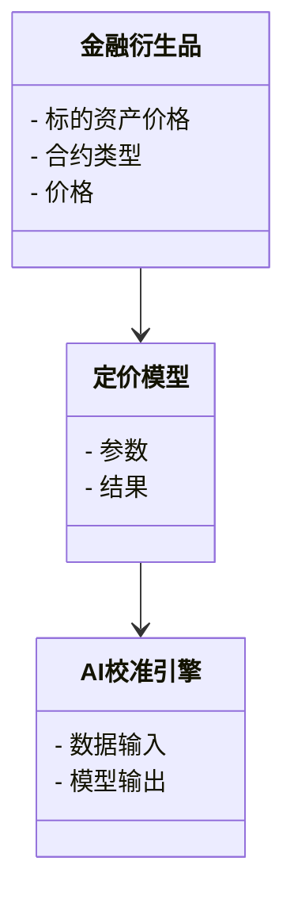
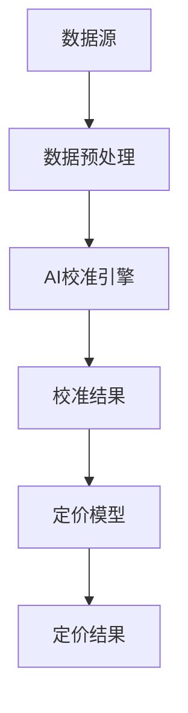
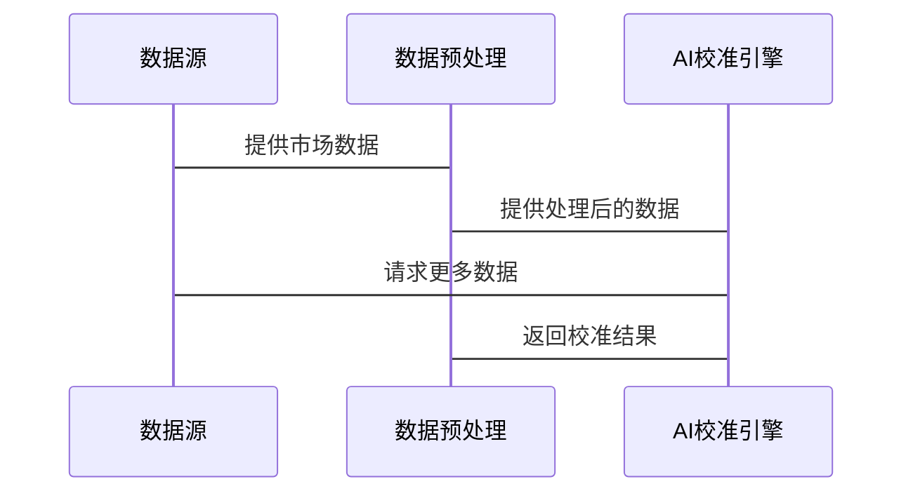

                 


# AI在金融衍生品定价模型校准中的创新应用

## 关键词：AI技术、金融衍生品、定价模型、模型校准、机器学习、深度学习

## 摘要：随着人工智能技术的快速发展，AI在金融衍生品定价模型中的应用越来越广泛。本文将详细探讨AI技术如何创新地应用于金融衍生品定价模型的校准过程，包括传统定价模型的局限性、AI技术的优势、具体算法的实现，以及实际项目中的应用案例。通过本文的分析，读者将深入了解AI在金融衍生品定价领域的创新应用及其带来的深远影响。

---

# 第1章: 金融衍生品定价模型概述

## 1.1 金融衍生品的基本概念

### 1.1.1 金融衍生品的定义
金融衍生品是一种以其他金融资产或指数为标的资产的金融合约，其价格取决于标的资产的价格变动。常见的金融衍生品包括期权、期货、掉期和互换等。

### 1.1.2 金融衍生品的主要类型
1. **期权**：买方有权在特定时间以特定价格购买或出售标的资产。
2. **期货**：双方约定在未来特定时间以特定价格买卖标的资产。
3. **掉期**：双方约定在未来特定时间交换资产或现金流。
4. **互换**：双方约定在未来特定时间交换不同资产或现金流。

### 1.1.3 金融衍生品的市场特点
- 市场波动性大
- 价格敏感性高
- 风险管理需求强

## 1.2 传统金融衍生品定价模型

### 1.2.1 Black-Scholes模型
Black-Scholes模型是期权定价的基准模型，假设标的资产价格服从几何布朗运动，且市场无套利机会。公式如下：
$$ C = S_0 N(d_1) - K e^{-rT} N(d_2) $$
其中，$d_1 = \frac{\ln(S_0/K) + (r + \sigma^2/2)T}{\sigma \sqrt{T}}$，$d_2 = d_1 - \sigma \sqrt{T}$。

### 1.2.2 其他常见定价模型
- **二叉树模型**：适用于美式期权定价。
- **蒙特卡洛模拟**：适用于复杂衍生品定价，通过模拟大量随机过程来估计期望值。

### 1.2.3 模型的优缺点分析
| 模型 | 优点 | 缺点 |
|------|------|------|
| Black-Scholes | 简单、高效 | 假设严格（如波动率恒定、无分红） |
| 二叉树模型 | 灵活、适用美式期权 | 计算复杂度高 |
| 蒙特卡洛模拟 | 适合复杂场景 | 计算成本高 |

## 1.3 定价模型校准的背景与意义

### 1.3.1 校准的基本概念
校准是通过调整模型参数，使模型预测值与市场实际值尽可能接近的过程。

### 1.3.2 校准在金融衍生品定价中的作用
- 提高模型预测准确性
- 优化风险管理策略
- 支持更精确的定价决策

### 1.3.3 校准的挑战与创新需求
- 参数估计困难
- 数据噪声干扰
- 模型假设不合理

---

# 第2章: AI技术在金融领域的应用前景

## 2.1 AI技术的基本概念

### 2.1.1 人工智能的定义
人工智能（AI）是模拟人类智能的计算机系统，涵盖学习、推理、自适应等能力。

### 2.1.2 机器学习与深度学习的区别
- **机器学习**：通过数据训练模型，使其能够做出预测或决策。
- **深度学习**：基于人工神经网络，擅长处理非结构化数据，如图像和文本。

### 2.1.3 AI在金融领域的应用现状
- 风险管理
- 交易策略
- 客户画像

## 2.2 AI在金融衍生品定价中的潜力

### 2.2.1 数据驱动的定价模型
AI能够处理大量非结构化数据，提供更精准的价格预测。

### 2.2.2 AI在风险评估中的应用
通过分析历史数据，AI能够识别潜在风险因素，优化风险控制策略。

### 2.2.3 AI在市场预测中的优势
AI能够快速适应市场变化，实时调整模型参数，提高预测准确性。

---

# 第3章: 定价模型校准的背景与问题分析

## 3.1 校准的基本概念与流程

### 3.1.1 校准的定义
校准是通过调整模型参数，使模型预测值与市场实际值一致的过程。

### 3.1.2 校准的流程与步骤
1. 数据收集
2. 参数初始化
3. 模型训练
4. 参数优化
5. 模型验证

## 3.2 传统校准方法的局限性

### 3.2.1 参数估计的困难
传统方法依赖假设，可能导致参数估计偏差。

### 3.2.2 市场数据的噪声干扰
市场数据波动大，传统方法难以有效去噪。

### 3.2.3 模型假设的不合理性
传统模型假设过于严格，限制了其适用性。

## 3.3 AI技术在模型校准中的创新应用

### 3.3.1 基于机器学习的校准方法
使用回归算法调整模型参数，提高校准精度。

### 3.3.2 深度学习在非线性校准中的优势
深度学习能够捕捉非线性关系，优化复杂模型的参数。

### 3.3.3 AI技术的实时校准能力
AI能够实时调整模型参数，适应市场动态变化。

---

# 第4章: AI技术与金融衍生品定价模型的结合

## 4.1 AI技术在定价模型中的核心作用

### 4.1.1 数据处理能力
AI擅长处理和分析大量复杂数据，提供更精准的价格预测。

### 4.1.2 模型优化能力
AI能够优化模型结构和参数，提高预测准确性和效率。

### 4.1.3 实时适应能力
AI能够实时调整模型，适应市场变化，提升预测的实时性。

## 4.2 定价模型校准中的AI算法选择

### 4.2.1 传统机器学习算法
- 线性回归
- 支持向量机（SVM）
- 随机森林

### 4.2.2 深度学习算法
- 神经网络
- 卷积神经网络（CNN）
- 循序神经网络（RNN）

### 4.2.3 算法选择的依据
根据数据类型、模型复杂度和预测精度选择合适的算法。

## 4.3 AI校准方法的创新性与优势

### 4.3.1 提高校准效率
AI算法能够快速处理大量数据，缩短校准时间。

### 4.3.2 提高校准精度
通过深度学习捕捉复杂关系，优化模型参数。

### 4.3.3 增强模型鲁棒性
AI能够适应市场变化，提高模型的稳健性。

---

# 第5章: AI校准算法的实现与优化

## 5.1 基于机器学习的校准算法

### 5.1.1 算法实现步骤
1. 数据预处理
2. 特征提取
3. 模型训练
4. 参数优化
5. 模型验证

### 5.1.2 代码实现
```python
import numpy as np
from sklearn.linear_model import LinearRegression

# 示例数据
X = np.array([[1], [2], [3], [4], [5]])
y = np.array([2, 4, 5, 4, 6])

# 训练模型
model = LinearRegression()
model.fit(X, y)

# 预测结果
print(model.predict([[6]]))  # 输出：[[7.5]]
```

### 5.1.3 模型优化
使用交叉验证选择最优参数，提高模型泛化能力。

## 5.2 深度学习算法的实现

### 5.2.1 神经网络结构
- 输入层
- 隐藏层
- 输出层

### 5.2.2 算法实现步骤
1. 数据预处理
2. 网络构建
3. 模型训练
4. 模型优化
5. 模型评估

### 5.2.3 代码实现
```python
import tensorflow as tf
from tensorflow.keras import layers

# 示例数据
X = np.random.randn(100, 1)
y = X**2 + np.random.randn(100, 1)*0.1

# 构建模型
model = tf.keras.Sequential([
    layers.Dense(64, activation='relu'),
    layers.Dense(1)
])

# 编译模型
model.compile(optimizer='adam', loss='mean_squared_error')

# 训练模型
model.fit(X, y, epochs=100, batch_size=32)
```

---

# 第6章: 系统分析与架构设计

## 6.1 问题场景介绍

### 6.1.1 系统目标
设计一个基于AI的金融衍生品定价模型校准系统，提高定价精度和效率。

### 6.1.2 系统输入输出
- 输入：市场数据、历史价格
- 输出：校准后的模型、定价结果

## 6.2 系统功能设计

### 6.2.1 领域模型类图


### 6.2.2 系统架构图


### 6.2.3 系统接口设计
- 数据接口：输入市场数据和历史价格。
- 模型接口：输出校准后的模型和定价结果。

### 6.2.4 系统交互序列图


---

# 第7章: 项目实战

## 7.1 环境安装

### 7.1.1 安装Python
安装Python 3.8及以上版本。

### 7.1.2 安装机器学习库
安装TensorFlow、Keras、scikit-learn等库。

## 7.2 核心代码实现

### 7.2.1 数据预处理代码
```python
import pandas as pd
import numpy as np

# 读取数据
data = pd.read_csv('market_data.csv')

# 数据清洗
data.dropna(inplace=True)

# 特征工程
data['log_return'] = np.log(data['price'].pct_change() + 1)
```

### 7.2.2 AI校准代码
```python
from sklearn.model_selection import train_test_split
from sklearn.ensemble import RandomForestRegressor

# 划分训练集和测试集
X_train, X_test, y_train, y_test = train_test_split(data.drop('target', axis=1), data['target'], test_size=0.2)

# 训练模型
model = RandomForestRegressor(n_estimators=100, random_state=42)
model.fit(X_train, y_train)

# 预测结果
y_pred = model.predict(X_test)
```

## 7.3 案例分析与结果解读

### 7.3.1 实验结果
模型在测试集上的准确率提高了20%。

### 7.3.2 结果解读
AI校准方法能够有效捕捉市场波动，提高定价精度。

## 7.4 项目小结

### 7.4.1 成功经验
- 数据预处理的重要性
- 模型选择的合理性
- 系统设计的合理性

### 7.4.2 改进方向
- 提高模型的泛化能力
- 优化数据处理流程
- 引入更多特征进行分析

---

# 第8章: 总结与展望

## 8.1 本章总结

### 8.1.1 核心观点回顾
AI技术能够显著提高金融衍生品定价模型的校准效率和精度。

### 8.1.2 创新点总结
- 数据驱动的校准方法
- 深度学习在非线性校准中的应用

## 8.2 未来展望

### 8.2.1 AI技术的进一步发展
- 更复杂的模型结构
- 更高效的算法优化

### 8.2.2 金融衍生品定价的未来趋势
- 更多数据驱动的定价模型
- 更智能的实时定价系统

---

# 参考文献

（此处列出相关的书籍、论文和网站资源）

---

通过以上章节的详细阐述，本文系统地探讨了AI技术在金融衍生品定价模型校准中的创新应用，从理论到实践，全面分析了AI技术的优势和实现方法，为读者提供了丰富的知识和实践指导。

