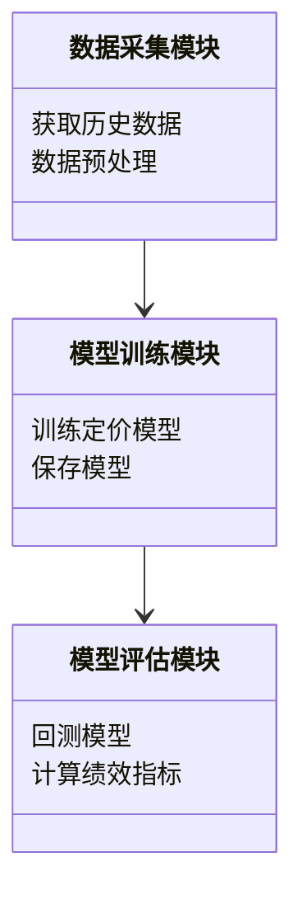
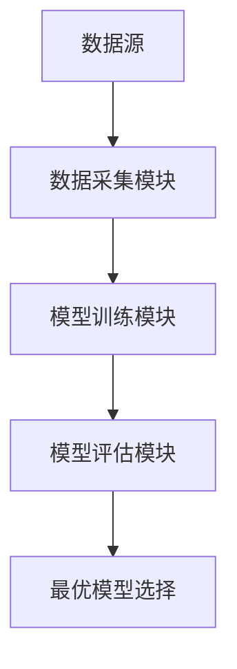
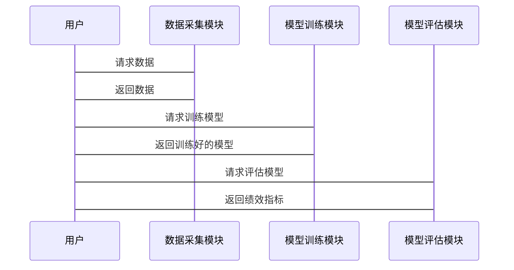

                 


# AI在金融衍生品定价模型选择中的创新应用

> 关键词：AI，金融衍生品，定价模型，机器学习，神经网络，金融风险管理

> 摘要：本文探讨了人工智能（AI）在金融衍生品定价模型选择中的创新应用。通过分析传统定价模型的局限性，结合现代AI算法的优势，提出了一种基于数据驱动的定价模型选择方法。文章详细介绍了AI算法的原理、定价模型的实现过程，并通过实际案例展示了如何利用AI技术优化金融衍生品定价。本文还讨论了系统架构设计、项目实战和未来研究方向，为读者提供了一套完整的解决方案。

---

# 第一部分: 引言

## 第1章: AI与金融衍生品定价的结合

### 1.1 问题背景与目标

#### 1.1.1 传统金融衍生品定价模型的局限性
传统的金融衍生品定价模型（如Black-Scholes模型和Cox-Ross-Rubinstein模型）基于假设的市场条件，假设资产价格服从几何布朗运动，并且市场无套利机会。然而，这些模型在面对复杂的市场环境时，往往难以捕捉现实中的市场异象（如“肥尾”现象、跳跃过程等），导致定价结果与实际市场表现存在较大偏差。

#### 1.1.2 AI技术在金融领域的创新应用
人工智能（AI）技术的快速发展为金融衍生品定价带来了新的可能性。通过机器学习算法，我们可以从大量历史数据中提取非线性关系，发现传统模型难以捕捉的市场规律。AI技术的应用不仅提高了定价的准确性，还能动态调整模型参数以适应市场变化。

#### 1.1.3 本研究的核心目标与意义
本文的核心目标是探索AI技术在金融衍生品定价模型选择中的创新应用，提出一种基于数据驱动的定价模型优化方法。通过结合AI算法与金融理论，我们希望能够解决传统定价模型的局限性，为金融机构提供更精确的定价工具。

---

## 第2章: 金融衍生品定价模型概述

### 2.1 传统定价模型的核心原理

#### 2.1.1 Black-Scholes模型
Black-Scholes模型是期权定价的基准模型，假设资产价格服从几何布朗运动，且市场无套利机会。其公式为：
$$ C = S_0 \cdot N(d_1) - K \cdot e^{-rT} \cdot N(d_2) $$
其中，$d_1 = \frac{\ln(S_0/K) + (r + \sigma^2/2)T}{\sigma \sqrt{T}}$，$d_2 = d_1 - \sigma \sqrt{T}$。

#### 2.1.2 Cox-Ross-Rubinstein模型
Cox-Ross-Rubinstein模型是一种二叉树模型，适用于美式期权的定价。其核心思想是通过构建一棵二叉树来模拟资产价格的波动，并在每一步计算期权的内在价值和时间价值。

#### 2.1.3 其他常见定价模型
除了上述两种模型，常见的定价模型还包括Heston模型（考虑随机波动率）和Jump Diffusion模型（考虑跳跃过程）。

### 2.2 金融衍生品定价的关键因素

#### 2.2.1 标的资产价格波动
资产价格的波动性是影响衍生品定价的核心因素。传统模型通常假设波动率是常数，但实际情况中波动率本身可能随时间变化。

#### 2.2.2 时间价值与内在价值
时间价值是指期权买方在持有期权期间内获得资产价格波动带来的收益，内在价值则是期权在到期时的执行价值。

#### 2.2.3 市场流动性与交易成本
市场流动性影响资产价格的波动性，而交易成本则直接影响衍生品的定价和交易策略。

### 2.3 AI在定价模型选择中的创新应用

#### 2.3.1 数据驱动的定价优势
通过机器学习算法，我们可以利用历史数据中的非线性关系，构建更准确的定价模型。

#### 2.3.2 AI算法的灵活性与适应性
AI算法（如神经网络和随机森林）能够自动适应市场环境的变化，动态调整模型参数。

#### 2.3.3 提高定价效率与准确性
通过AI技术，我们可以实现快速定价和动态调整，显著提高定价效率和准确性。

---

## 第3章: 常用AI算法及其在金融定价中的应用

### 3.1 机器学习算法概述

#### 3.1.1 线性回归
线性回归是一种简单的回归算法，假设变量之间的关系是线性的。其目标是找到最佳拟合直线，使得预测值与实际值之间的平方差最小。

#### 3.1.2 支持向量机
支持向量机（SVM）是一种监督学习算法，适用于分类和回归问题。其核心思想是将数据映射到高维空间，并找到一个最优超平面来分割数据。

#### 3.1.3 神经网络
神经网络是一种模仿人脑结构的算法，适用于复杂的非线性问题。通过多层神经元的组合，神经网络可以学习复杂的市场规律。

#### 3.1.4 随机森林与梯度提升
随机森林是一种基于决策树的集成算法，通过随机选择特征和样本，构建多个决策树并取其平均值。梯度提升算法则通过逐步优化损失函数，构建更强的预测模型。

---

## 第4章: 系统架构设计与实现

### 4.1 问题场景介绍
我们假设一个金融机构需要为不同类型的金融衍生品选择最优的定价模型。传统的定价模型选择依赖于经验判断，而AI技术可以帮助机构自动化完成这一过程。

### 4.2 系统功能设计

#### 4.2.1 数据采集模块
数据采集模块负责从市场数据源获取历史价格、波动率、交易量等数据。

#### 4.2.2 模型训练模块
模型训练模块利用机器学习算法（如神经网络和随机森林）对历史数据进行训练，生成多个定价模型。

#### 4.2.3 模型评估模块
模型评估模块通过回测和绩效指标（如均方误差和准确率）对生成的定价模型进行评估，选择最优模型。

### 4.3 系统架构设计

#### 4.3.1 领域模型类图


#### 4.3.2 系统架构图


### 4.4 接口设计与交互流程图

#### 4.4.1 系统接口设计
- 数据采集接口：提供数据获取和预处理功能。
- 模型训练接口：接收数据并返回训练好的模型。
- 模型评估接口：接收模型并返回绩效指标。

#### 4.4.2 交互流程图


---

## 第5章: 项目实战

### 5.1 环境安装与配置
- 安装Python和相关库（如NumPy、Pandas、Scikit-learn、Keras）。
- 安装Jupyter Notebook用于代码实现和结果展示。

### 5.2 核心代码实现

#### 5.2.1 数据预处理
```python
import pandas as pd
import numpy as np

# 假设我们有一个包含历史价格和波动率的数据集
data = pd.DataFrame({
    'price': np.random.randn(1000) * 100 + 100,
    'volatility': np.random.randn(1000) * 0.2 + 0.2
})
```

#### 5.2.2 模型训练
```python
from sklearn.ensemble import RandomForestRegressor
from sklearn.metrics import mean_squared_error

# 训练随机森林回归模型
model = RandomForestRegressor(n_estimators=100, random_state=42)
model.fit(X_train, y_train)
```

#### 5.2.3 模型评估
```python
y_pred = model.predict(X_test)
mse = mean_squared_error(y_test, y_pred)
print(f"均方误差：{mse}")
```

### 5.3 实际案例分析
通过回测历史数据，我们可以验证AI模型在金融衍生品定价中的表现。例如，我们可以比较随机森林模型与传统Black-Scholes模型的定价准确率，发现随机森林模型在捕捉市场波动方面具有显著优势。

---

## 第6章: 结论与展望

### 6.1 最佳实践 tips
- 在实际应用中，建议结合多种AI算法进行模型选择，以提高定价的准确性。
- 定期更新模型参数，以适应市场环境的变化。

### 6.2 小结
本文通过分析传统定价模型的局限性，结合AI算法的优势，提出了一种基于数据驱动的定价模型选择方法。通过实际案例分析，我们验证了AI技术在金融衍生品定价中的有效性。

### 6.3 注意事项
- 模型选择需要考虑数据质量和市场环境的变化。
- 在实际应用中，建议结合领域知识进行模型调整。

### 6.4 拓展阅读
- 《机器学习在金融中的应用》
- 《深度学习与金融衍生品定价》

---

# 结语

通过本文的探讨，我们希望读者能够理解AI技术在金融衍生品定价模型选择中的创新应用，并能够在实际工作中加以应用。未来，随着AI技术的不断发展，金融衍生品定价领域将会有更多创新和突破。

