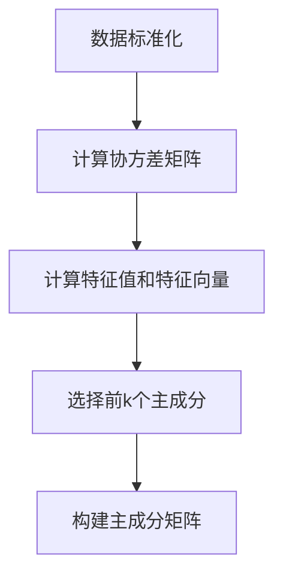
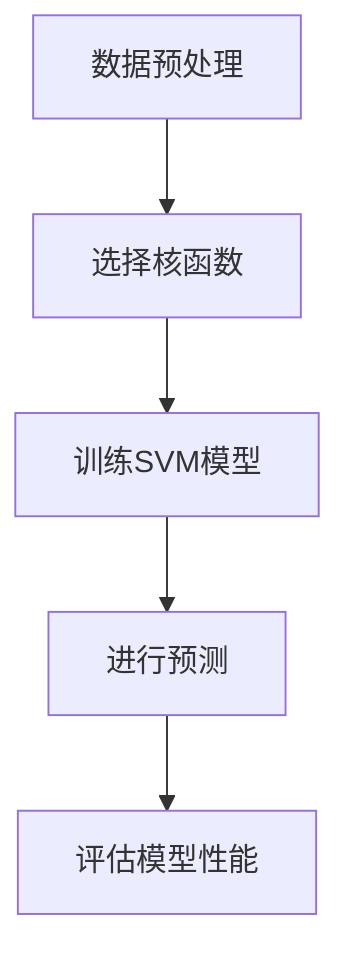
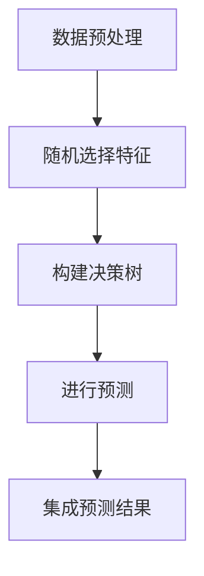
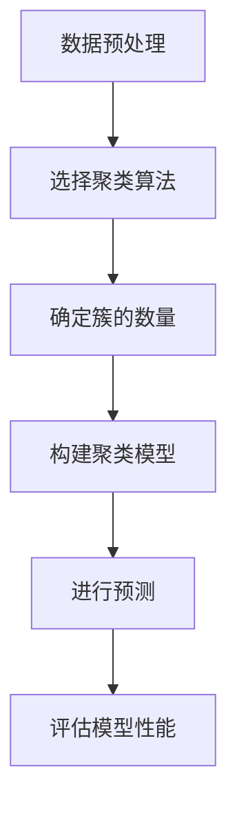
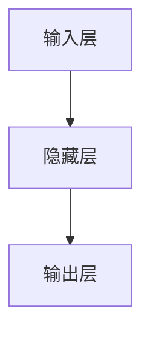
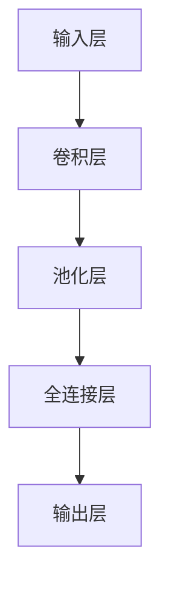
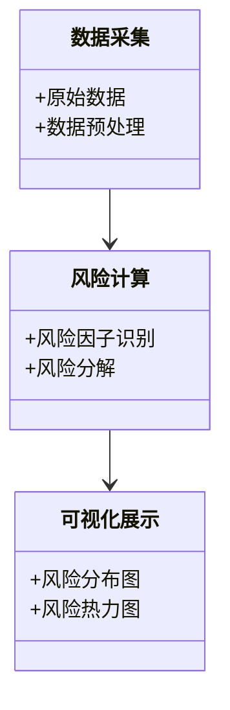
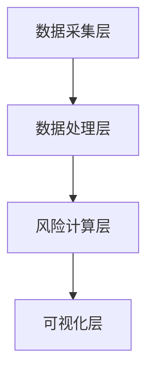
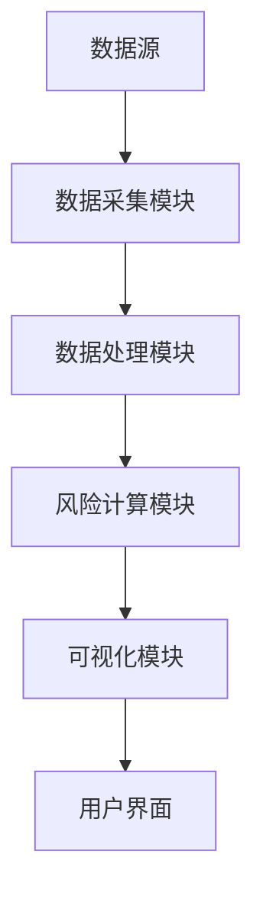
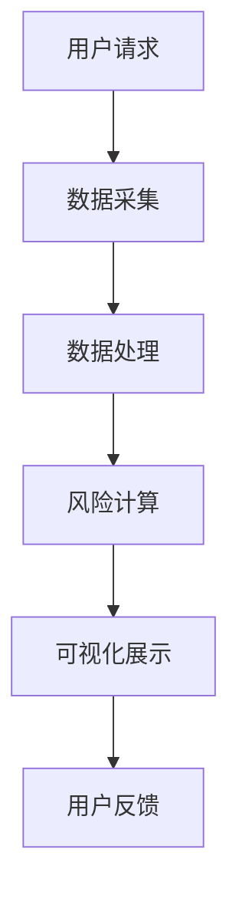

                 


# AI在金融衍生品风险分解与可视化中的创新应用

## 关键词：
- 人工智能、金融衍生品、风险分解、风险管理、可视化、机器学习

## 摘要：
本文探讨了人工智能在金融衍生品风险分解与可视化中的创新应用。通过分析金融衍生品的风险管理现状，提出基于AI的风险分解方法，结合机器学习算法，构建高效的风险分解模型，并通过可视化技术呈现风险分析结果，为金融衍生品的风险管理提供新的思路。

---

## 第1章: 金融衍生品与风险管理基础

### 1.1 金融衍生品的基本概念

#### 1.1.1 金融衍生品的定义与分类
金融衍生品是基于基础资产（如股票、债券、商品等）的金融工具，其价值来源于基础资产的价格波动。常见的金融衍生品包括期货、期权、掉期和互换等。

- **期货**：约定在未来某一特定时间以预定价格购买或出售资产的合同。
- **期权**：买方有权在特定时间内以预定价格购买或出售资产，卖方承担相应的义务。
- **掉期**：双方约定在未来某一时间交换资产或现金流的协议。
- **互换**：双方约定在未来某一时间交换不同资产或现金流的协议。

金融衍生品的分类可以通过以下几个维度进行：
- **按基础资产**：股票衍生品、外汇衍生品、利率衍生品等。
- **按交易场所**：场内交易和场外交易。
- **按执行方式**：欧式期权和美式期权。

#### 1.1.2 金融衍生品的风险特征
金融衍生品的风险主要来源于市场波动、信用风险、流动性风险和操作风险。这些风险因素相互作用，使得金融衍生品的风险管理变得复杂。

- **市场风险**：由于市场价格波动导致的损失。
- **信用风险**：由于交易对手违约导致的损失。
- **流动性风险**：难以在合理价格下快速买卖资产的风险。
- **操作风险**：由于操作错误或系统故障导致的损失。

#### 1.1.3 金融衍生品的市场与应用
金融衍生品广泛应用于对冲风险、投机和套利。例如，企业可以通过期货对冲外汇风险，投资者可以通过期权进行投机交易。

### 1.2 风险管理在金融衍生品中的重要性

#### 1.2.1 风险管理的核心目标
风险管理的核心目标是识别、评估和控制潜在风险，以最小化损失并确保资产安全。在金融衍生品中，风险管理尤为重要，因为其杠杆效应可能导致巨大损失。

#### 1.2.2 常见的金融风险类型
金融风险主要包括市场风险、信用风险、流动性风险、操作风险和法律风险。

#### 1.2.3 风险管理的挑战与机遇
风险管理的挑战在于复杂性、不确定性和高波动性。然而，AI技术的应用为风险管理带来了新的机遇，能够提高风险预测和控制的准确性。

### 1.3 AI在金融衍生品风险管理中的应用前景

#### 1.3.1 AI技术的基本概念
人工智能（AI）是指计算机系统模拟人类智能的能力，包括学习、推理、自我改进等。在金融领域，AI技术广泛应用于交易、风险管理和客户服务。

#### 1.3.2 AI在金融领域的应用现状
AI在金融领域的应用包括算法交易、信用评分、欺诈检测和客户画像等。随着技术的进步，AI在金融衍生品风险管理中的应用逐渐深入。

#### 1.3.3 AI在金融衍生品风险管理中的创新潜力
AI技术能够通过大数据分析和机器学习模型，发现传统方法难以识别的风险因素，提高风险管理的效率和准确性。

---

## 第2章: 金融衍生品风险分解的核心概念

### 2.1 风险分解的基本原理

#### 2.1.1 风险分解的定义
风险分解是将整体风险分解为多个风险因子的过程，每个因子代表特定的风险来源。通过分解，可以更好地理解和管理风险。

#### 2.1.2 风险分解的方法与步骤
风险分解的方法包括因子分析、聚类分析和主成分分析等。步骤通常包括数据收集、因子选择、模型构建和结果解释。

#### 2.1.3 风险分解的数学模型
风险分解的数学模型通常基于统计方法，如多元回归分析和主成分分析。例如，主成分分析（PCA）可以通过线性组合提取数据的主要成分。

### 2.2 风险分解的关键要素

#### 2.2.1 风险因子的识别与选择
风险因子是指影响金融资产价格的因素，如市场利率、汇率和波动率等。选择合适的因子是风险分解的关键。

#### 2.2.2 风险因子的权重分配
权重分配是指确定每个因子对整体风险的影响程度。常用的方法包括回归分析和因子分析。

#### 2.2.3 风险分解的可视化表达
可视化表达是将风险分解的结果以图表形式呈现，帮助用户更好地理解风险来源和分布。

### 2.3 风险分解的创新应用

#### 2.3.1 基于AI的风险分解模型
基于AI的风险分解模型可以通过机器学习算法自动识别和选择风险因子，提高分解的准确性和效率。

#### 2.3.2 基于机器学习的风险分解方法
机器学习方法如随机森林和神经网络可以用于风险因子的选择和权重分配，提高分解的深度和广度。

#### 2.3.3 基于深度学习的风险分解技术
深度学习技术如卷积神经网络（CNN）和循环神经网络（RNN）可以用于复杂的非线性风险分解。

---

## 第3章: AI在金融衍生品风险分解中的算法原理

### 3.1 常见的风险分解算法

#### 3.1.1 主成分分析（PCA）
PCA是一种统计方法，用于降维数据并提取主要成分。其基本步骤包括数据标准化、协方差矩阵计算和特征向量提取。

##### 3.1.1.1 PCA的数学模型
$$
\text{协方差矩阵} = \frac{1}{n-1}\sum_{i=1}^{n}(x_i - \bar{x})(x_i - \bar{x})^T
$$
其中，\(x_i\) 是第i个样本，\(\bar{x}\) 是样本均值。

##### 3.1.1.2 PCA的流程图


#### 3.1.2 因子分析（Factor Analysis）
因子分析是一种统计方法，用于识别潜在的因子影响观测变量。其基本步骤包括数据收集、因子提取和因子旋转。

##### 3.1.2.1 Factor Analysis的数学模型
$$
X = \mu + \Lambda F + \epsilon
$$
其中，\(X\) 是观测变量，\(\mu\) 是均值向量，\(\Lambda\) 是因子载荷矩阵，\(F\) 是因子向量，\(\epsilon\) 是误差项。

#### 3.1.3 线性回归分析
线性回归分析用于建立变量之间的线性关系模型。其基本假设包括线性关系、独立性、正态性和方差齐性。

##### 3.1.3.1 线性回归的数学模型
$$
y = \beta_0 + \beta_1x_1 + \beta_2x_2 + \dots + \beta_kx_k + \epsilon
$$
其中，\(y\) 是因变量，\(x_i\) 是自变量，\(\beta_i\) 是回归系数，\(\epsilon\) 是误差项。

### 3.2 基于机器学习的风险分解算法

#### 3.2.1 支持向量机（SVM）
支持向量机是一种监督学习算法，用于分类和回归问题。其基本原理是通过构建超平面将数据分为不同类别。

##### 3.2.1.1 SVM的数学模型
$$
\text{目标函数} = \min_{w,b,\xi} \frac{1}{2}||w||^2 + C\sum_{i=1}^{n}\xi_i
$$
$$
\text{约束条件} = y_i(w \cdot x_i + b) \geq 1 - \xi_i, \xi_i \geq 0
$$

##### 3.2.1.2 SVM的流程图


#### 3.2.2 随机森林（Random Forest）
随机森林是一种集成学习算法，通过构建多个决策树并进行投票或平均来提高模型的准确性和稳定性。

##### 3.2.2.1 随机森林的数学模型
$$
\text{预测结果} = \frac{1}{n}\sum_{i=1}^{n}h_i(x)
$$
其中，\(h_i(x)\) 是第i棵决策树的预测结果，\(n\) 是决策树的数量。

##### 3.2.2.2 随机森林的流程图


#### 3.2.3 聚类分析（Clustering）
聚类分析是一种无监督学习算法，用于将数据划分为多个簇，使得簇内数据点的相似性较高，簇间数据点的相似性较低。

##### 3.2.3.1 聚类分析的数学模型
$$
\text{目标函数} = \min \sum_{i=1}^{n}\sum_{j=1}^{k}w_{ij}d(x_i, x_j)
$$
其中，\(w_{ij}\) 是样本i属于簇j的权重，\(d(x_i, x_j)\) 是样本i和j之间的距离。

##### 3.2.3.2 聚类分析的流程图


### 3.3 基于深度学习的风险分解算法

#### 3.3.1 神经网络（Neural Networks）
神经网络是一种模拟人脑神经网络结构的算法，用于处理复杂的非线性关系。

##### 3.3.1.1 神经网络的数学模型
$$
y = \sigma(wx + b)
$$
其中，\(x\) 是输入，\(w\) 是权重，\(b\) 是偏置，\(\sigma\) 是激活函数。

##### 3.3.1.2 神经网络的流程图


#### 3.3.2 卷积神经网络（CNN）
卷积神经网络是一种专门用于处理图像数据的深度学习算法，适用于金融衍生品的风险分解。

##### 3.3.2.1 CNN的数学模型
$$
\text{卷积层} = \max(0, w \cdot x + b)
$$
$$
\text{池化层} = \frac{1}{n}\sum_{i=1}^{n}x_i
$$

##### 3.3.2.2 CNN的流程图


#### 3.3.3 循环神经网络（RNN）
循环神经网络是一种用于处理序列数据的深度学习算法，适用于时间序列分析。

##### 3.3.3.1 RNN的数学模型
$$
s_t = \sigma(W_{hh}s_{t-1} + W_{xh}x_t)
$$
$$
y_t = W_{hy}s_t
$$
其中，\(s_t\) 是隐藏状态，\(x_t\) 是输入，\(y_t\) 是输出。

##### 3.3.3.2 RNN的流程图


---

## 第4章: 风险分解的数学模型与公式

### 4.1 基于线性回归的风险分解模型

#### 4.1.1 线性回归的基本公式
$$
y = \beta_0 + \beta_1x_1 + \beta_2x_2 + \dots + \beta_kx_k + \epsilon
$$

#### 4.1.2 线性回归的假设检验
- 线性关系：因变量与自变量之间存在线性关系。
- 独立性：自变量之间相互独立。
- 正态性：误差项服从正态分布。
- 方差齐性：误差方差恒定。

#### 4.1.3 线性回归的优缺点
- 优点：简单易懂，计算高效。
- 缺点：无法处理非线性关系，假设条件严格。

### 4.2 基于主成分分析的风险分解模型

#### 4.2.1 PCA的基本原理
PCA通过降维提取数据的主要成分，减少维度的同时保留数据的大部分信息。

#### 4.2.2 PCA的数学公式
$$
\text{协方差矩阵} = \frac{1}{n-1}\sum_{i=1}^{n}(x_i - \bar{x})(x_i - \bar{x})^T
$$

#### 4.2.3 PCA的应用步骤
1. 数据标准化。
2. 计算协方差矩阵。
3. 计算特征值和特征向量。
4. 选择前k个主成分。
5. 构建主成分矩阵。

### 4.3 基于机器学习的风险分解模型

#### 4.3.1 机器学习的基本原理
机器学习通过数据驱动的方式，学习数据的特征和规律，构建预测模型。

#### 4.3.2 常见机器学习算法
- 回归算法：线性回归、岭回归。
- 分类算法：逻辑回归、支持向量机。
- 聚类算法：K均值聚类、层次聚类。

#### 4.3.3 机器学习的风险分解方法
1. 数据预处理：清洗、标准化、特征选择。
2. 模型训练：选择合适的算法，调整参数。
3. 模型评估：交叉验证、准确率、召回率。
4. 模型部署：集成、优化、实时监控。

---

## 第5章: 系统分析与架构设计方案

### 5.1 问题场景介绍
金融衍生品的风险管理场景包括实时监控、风险预警和决策支持。系统需要实时处理大量数据，快速识别风险，提供决策支持。

### 5.2 项目介绍
本项目旨在构建一个基于AI的金融衍生品风险分解与可视化系统，实现风险的高效分解和直观展示。

### 5.3 系统功能设计

#### 5.3.1 领域模型


#### 5.3.2 系统架构


### 5.4 系统架构设计

#### 5.4.1 系统架构图


#### 5.4.2 系统接口设计
1. 数据接口：数据采集模块与数据源对接。
2. 计算接口：风险计算模块与数据处理模块对接。
3. 展示接口：可视化模块与用户界面对接。

#### 5.4.3 系统交互流程


### 5.5 系统功能实现

#### 5.5.1 数据采集模块
```python
import pandas as pd

def collect_data():
    # 从数据库中读取数据
    data = pd.read_sql(...)
    return data
```

#### 5.5.2 数据处理模块
```python
from sklearn.preprocessing import StandardScaler

def preprocess_data(data):
    scaler = StandardScaler()
    data_scaled = scaler.fit_transform(data)
    return data_scaled
```

#### 5.5.3 风险计算模块
```python
from sklearn.decomposition import PCA

def decompose_risk(data):
    pca = PCA(n_components=3)
    principal_components = pca.fit_transform(data)
    return principal_components
```

#### 5.5.4 可视化展示模块
```python
import matplotlib.pyplot as plt

def visualize_components(components):
    plt.scatter(components[:, 0], components[:, 1])
    plt.xlabel('Principal Component 1')
    plt.ylabel('Principal Component 2')
    plt.show()
```

---

## 第6章: 项目实战

### 6.1 环境安装与配置

#### 6.1.1 安装Python环境
```bash
python --version
pip install numpy pandas scikit-learn matplotlib
```

#### 6.1.2 安装Jupyter Notebook
```bash
pip install jupyter
jupyter notebook
```

### 6.2 系统核心实现

#### 6.2.1 数据采集与预处理
```python
import pandas as pd
import numpy as np

# 数据采集
data = pd.read_csv('derivatives.csv')

# 数据预处理
from sklearn.preprocessing import StandardScaler
scaler = StandardScaler()
data_scaled = scaler.fit_transform(data)
```

#### 6.2.2 模型训练与评估
```python
from sklearn.decomposition import PCA
from sklearn.metrics import accuracy_score

# 模型训练
pca = PCA(n_components=3)
principal_components = pca.fit_transform(data_scaled)

# 模型评估
explained_variance = pca.explained_variance_ratio_
print("explained variance ratio:", explained_variance)
```

#### 6.2.3 可视化展示
```python
import matplotlib.pyplot as plt

# 绘制主成分分析结果
plt.scatter(principal_components[:, 0], principal_components[:, 1])
plt.xlabel('Principal Component 1')
plt.ylabel('Principal Component 2')
plt.show()
```

### 6.3 案例分析与结果解读

#### 6.3.1 数据分析
通过对金融衍生品数据的分析，提取主要成分，识别影响风险的关键因子。

#### 6.3.2 数据可视化
通过主成分分析，将高维数据降维，直观展示风险分布。

#### 6.3.3 结果解读
解释主成分的含义，分析风险因子的权重和影响，提出风险管理建议。

### 6.4 项目小结

#### 6.4.1 项目总结
通过项目实战，验证了AI技术在金融衍生品风险分解中的有效性，提高了风险管理的效率和准确性。

#### 6.4.2 经验与教训
- 数据质量对模型性能影响重大，需加强数据预处理。
- 模型选择需结合实际业务需求，避免盲目追求复杂性。

---

## 第7章: 最佳实践与总结

### 7.1 最佳实践 tips

#### 7.1.1 数据预处理
- 确保数据的完整性和准确性。
- 标准化或归一化处理，避免特征尺度影响。

#### 7.1.2 模型选择
- 根据数据特征选择合适的算法。
- 进行交叉验证，评估模型性能。

#### 7.1.3 可视化工具
- 使用专业的可视化工具，如Tableau、Power BI。
- 结合业务背景，设计直观的可视化界面。

### 7.2 小结
通过本文的探讨，AI技术在金融衍生品风险分解与可视化中的应用前景广阔，能够显著提升风险管理的效率和精度。

### 7.3 注意事项

#### 7.3.1 数据隐私
- 确保数据处理符合隐私保护法规。
- 加强数据加密和访问控制。

#### 7.3.2 模型解释性
- 选择可解释的模型，便于业务人员理解和应用。
- 提供模型解释工具，增强用户信任。

### 7.4 拓展阅读
建议读者进一步阅读以下内容：
- 《机器学习实战》
- 《Python机器学习》
- 《金融风险管理》

---

## 结语
人工智能技术正在深刻改变金融衍生品的风险管理方式。通过创新的算法和高效的可视化技术，AI能够帮助金融机构更好地识别和管理风险，提升整体风险管理能力。未来，随着技术的不断进步，AI在金融衍生品风险管理中的应用将更加广泛和深入。

