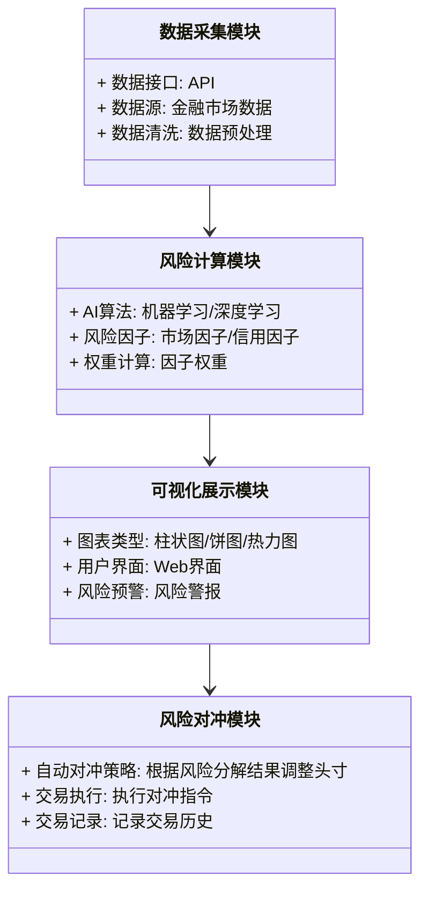
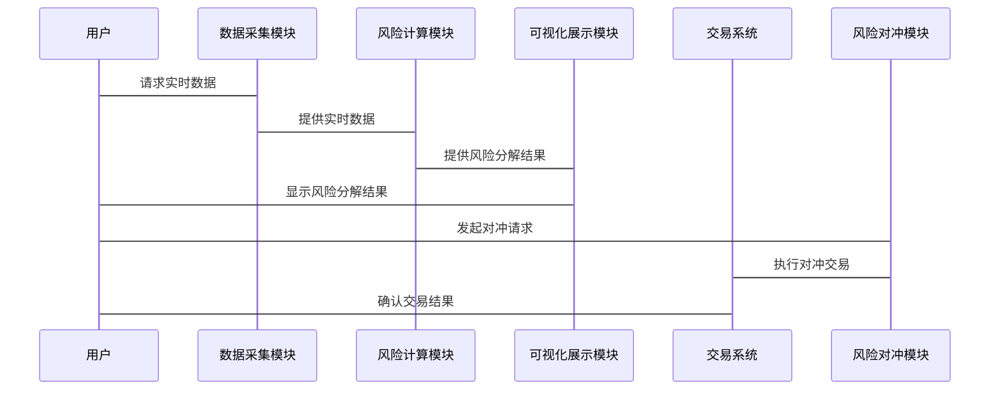

                 


# AI在金融衍生品风险分解与可视化中的创新应用

---

## 关键词：
AI, 金融衍生品, 风险分解, 可视化, 机器学习

---

## 摘要：
本文探讨了人工智能（AI）在金融衍生品风险分解与可视化中的创新应用。通过结合金融衍生品的基本概念、风险管理的重要性以及AI技术的优势，本文详细分析了基于AI的风险分解算法，包括机器学习和深度学习模型，并展示了如何利用这些技术实现风险的高效分解与直观可视化。文章还通过实际案例和项目实战，验证了AI在金融衍生品风险管理中的实际应用价值，为金融机构提供了新的风险管理思路和工具。

---

## 正文：

---

### 第1章: 金融衍生品与风险管理基础

#### 1.1 金融衍生品的基本概念

##### 1.1.1 金融衍生品的定义与分类

金融衍生品是指从原生资产（如股票、债券、商品等）派生出来的金融工具，其价值依赖于原生资产的价格波动。常见的金融衍生品包括：

- **远期合约（Forwards）**：约定在未来某一特定时间以预定价格买卖资产的协议。
- **期货合约（Futures）**：标准化的远期合约，通常在交易所上市交易。
- **期权合约（Options）**：赋予买方在特定时间内以预定价格买入或卖出资产的权利，而非义务。
- **互换合约（Swaps）**：约定在未来特定时间以预定条件交换资产或现金流的协议。

##### 1.1.2 金融衍生品的风险特征

金融衍生品的风险主要体现在以下几个方面：

1. **市场风险**：由于市场价格波动导致的损失。
2. **信用风险**：交易对手违约的风险。
3. **流动性风险**：无法在市场中迅速买卖资产而产生损失的风险。
4. **操作风险**：由于操作失误或系统故障导致的损失。

##### 1.1.3 金融衍生品的市场与应用

金融衍生品广泛应用于以下几个方面：

1. **风险管理**：通过衍生品对冲价格波动风险。
2. **投机交易**：利用价格波动进行获利。
3. **套利交易**：利用不同市场或资产之间的价格差异获利。

---

#### 1.2 风险管理在金融衍生品中的重要性

##### 1.2.1 风险管理的核心目标

风险管理的核心目标是通过识别、评估和控制风险，将潜在损失降至最低，同时确保金融机构的稳健运营。

##### 1.2.2 常见的金融风险类型

1. **市场风险**：由于市场价格波动导致的损失。
2. **信用风险**：交易对手违约的风险。
3. **流动性风险**：无法迅速买卖资产的风险。
4. **操作风险**：由于操作失误或系统故障导致的损失。
5. **法律风险**：由于法律法规变化或不合规操作导致的损失。

##### 1.2.3 风险管理的挑战与机遇

随着金融市场的复杂化和全球化，传统风险管理方法面临以下挑战：

- 数据量大：金融衍生品涉及大量高频交易数据，传统的统计方法难以处理。
- 非线性关系：金融资产之间的关系往往复杂且非线性。
- 高维数据：金融衍生品涉及多种资产和市场，导致高维数据处理的难度。

AI技术的引入为风险管理带来了新的机遇：

- 数据处理能力：AI能够处理海量数据，发现传统方法难以捕捉的模式。
- 高维数据分析：基于机器学习的算法能够处理高维数据，揭示复杂的关系。
- 实时分析：AI能够实现实时数据分析，提供快速决策支持。

---

#### 1.3 AI在金融衍生品风险管理中的应用前景

##### 1.3.1 AI技术的基本概念

人工智能（AI）是指通过计算机模拟人类智能的技术，包括学习、推理、自我改进等能力。AI的核心技术包括：

1. **机器学习（Machine Learning）**：通过数据训练模型，使其能够从数据中学习并做出预测。
2. **深度学习（Deep Learning）**：一种基于人工神经网络的机器学习方法，能够处理复杂的非线性关系。
3. **自然语言处理（NLP）**：处理和理解人类语言的技术，常用于金融新闻分析。

##### 1.3.2 AI在金融领域的应用现状

1. **交易自动化**：利用算法交易系统进行高频交易。
2. **风险管理**：通过AI技术进行风险预测和对冲。
3. **客户画像**：利用AI进行客户行为分析和信用评估。
4. **欺诈检测**：通过AI技术识别异常交易和欺诈行为。

##### 1.3.3 AI在金融衍生品风险管理中的创新潜力

AI在金融衍生品风险管理中的创新潜力主要体现在以下几个方面：

1. **实时风险监控**：利用AI技术实现实时数据分析，快速识别潜在风险。
2. **复杂关系建模**：通过深度学习模型处理高维数据，揭示复杂的风险关系。
3. **智能对冲策略**：基于AI的对冲策略能够根据市场变化自动调整头寸。

---

### 第2章: 金融衍生品风险分解的核心概念

#### 2.1 风险分解的基本原理

##### 2.1.1 风险分解的定义

风险分解是指将整体风险分解为多个风险因子的组合，每个风险因子对整体风险的贡献可以通过权重来量化。

##### 2.1.2 风险分解的方法与步骤

风险分解的方法通常包括以下步骤：

1. **数据收集**：收集相关资产的价格数据或其他相关数据。
2. **因子提取**：通过主成分分析（PCA）等方法提取风险因子。
3. **因子权重计算**：计算每个因子对整体风险的贡献权重。
4. **风险分解可视化**：通过图表等方式展示风险分解结果。

##### 2.1.3 风险分解的数学模型

风险分解的数学模型可以表示为：

$$
R = \sum_{i=1}^{n} w_i F_i
$$

其中，\( R \) 表示整体风险，\( F_i \) 表示第 \( i \) 个风险因子，\( w_i \) 表示第 \( i \) 个因子的权重。

---

#### 2.2 风险分解的关键要素

##### 2.2.1 风险因子的识别与选择

风险因子的识别与选择是风险分解的关键步骤。常见的风险因子包括：

- **市场因子**：如市场指数、行业指数等。
- **信用因子**：如违约概率、信用评级等。
- **流动性因子**：如资产的交易量、换手率等。

##### 2.2.2 风险因子的权重分配

权重分配可以通过以下方法实现：

1. **基于历史数据的回归分析**：通过回归分析确定每个因子的贡献权重。
2. **基于机器学习的权重分配**：利用机器学习模型自动学习因子权重。

##### 2.2.3 风险分解的可视化表达

风险分解的可视化表达通常包括：

- **柱状图**：展示每个因子的权重。
- **饼图**：展示各个因子对整体风险的贡献比例。
- **热力图**：展示因子之间的相关性。

---

#### 2.3 风险分解的创新应用

##### 2.3.1 基于AI的风险分解模型

基于AI的风险分解模型通常包括以下几个步骤：

1. **数据预处理**：清洗和标准化数据。
2. **特征提取**：通过深度学习模型提取特征。
3. **模型训练**：训练机器学习模型，预测风险因子。
4. **权重计算**：计算每个因子的权重。

##### 2.3.2 基于机器学习的风险分解方法

常见的机器学习方法包括：

- **线性回归**：用于预测风险因子的线性关系。
- **随机森林**：用于特征重要性分析。
- **支持向量机（SVM）**：用于分类和回归分析。

##### 2.3.3 基于深度学习的风险分解技术

深度学习模型在风险分解中的应用包括：

- **神经网络**：用于非线性关系建模。
- **卷积神经网络（CNN）**：用于图像数据处理。
- **循环神经网络（RNN）**：用于时间序列数据处理。

---

### 第3章: AI在金融衍生品风险分解中的算法原理

#### 3.1 常见的风险分解算法

##### 3.1.1 主成分分析（PCA）

主成分分析是一种统计方法，用于降维和提取数据的主要成分。PCA的基本步骤如下：

1. **数据标准化**：将数据标准化，消除量纲影响。
2. **计算协方差矩阵**：计算数据的协方差矩阵。
3. **求特征值和特征向量**：对协方差矩阵进行特征分解，得到特征值和特征向量。
4. **选择主成分**：选择前几个最大的特征值对应的特征向量作为主成分。

PCA的数学公式可以表示为：

$$
Y = X \cdot P
$$

其中，\( Y \) 表示降维后的数据，\( X \) 表示原始数据，\( P \) 表示投影矩阵。

##### 3.1.2 因子分析（Factor Analysis）

因子分析是一种统计方法，用于识别数据中的潜在因子。因子分析的基本步骤如下：

1. **数据标准化**：将数据标准化，消除量纲影响。
2. **计算相关系数矩阵**：计算数据的相关系数矩阵。
3. **求特征值和特征向量**：对相关系数矩阵进行特征分解，得到特征值和特征向量。
4. **因子旋转**：对因子进行旋转，使得因子之间的相关性降低。
5. **因子得分计算**：计算每个样本的因子得分。

因子分析的数学公式可以表示为：

$$
X = M + P \cdot F + E
$$

其中，\( X \) 表示观测数据，\( M \) 表示均值向量，\( P \) 表示因子载荷矩阵，\( F \) 表示因子得分，\( E \) 表示误差项。

##### 3.1.3 线性回归分析

线性回归分析是一种统计方法，用于预测因变量与自变量之间的线性关系。线性回归的基本公式为：

$$
y = \beta_0 + \beta_1 x_1 + \beta_2 x_2 + \ldots + \beta_n x_n + \epsilon
$$

其中，\( y \) 表示因变量，\( x_i \) 表示自变量，\( \beta_i \) 表示回归系数，\( \epsilon \) 表示误差项。

---

#### 3.2 基于机器学习的风险分解算法

##### 3.2.1 支持向量机（SVM）

支持向量机是一种监督学习算法，用于分类和回归分析。SVM的基本原理是通过找到一个超平面，使得数据点与超平面之间的距离最大化。

##### 3.2.2 随机森林（Random Forest）

随机森林是一种基于决策树的集成学习算法，通过构建多棵决策树并对结果进行投票或平均，提高模型的准确性和稳定性。

##### 3.2.3 聚类分析（Clustering）

聚类分析是一种无监督学习算法，用于将数据点分成不同的簇，使得簇内数据点的相似性最大化，簇间数据点的相似性最小化。

---

#### 3.3 基于深度学习的风险分解算法

##### 3.3.1 神经网络（Neural Networks）

神经网络是一种基于人工神经元的计算模型，能够处理复杂的非线性关系。

##### 3.3.2 卷积神经网络（CNN）

卷积神经网络是一种专门处理图像数据的深度学习模型，通过卷积操作提取图像特征。

##### 3.3.3 循环神经网络（RNN）

循环神经网络是一种处理时间序列数据的深度学习模型，能够捕捉序列中的时序关系。

---

### 第4章: 风险分解的数学模型与公式

#### 4.1 基于线性回归的风险分解模型

##### 4.1.1 线性回归的基本公式

线性回归的基本公式为：

$$
y = \beta_0 + \beta_1 x_1 + \beta_2 x_2 + \ldots + \beta_n x_n + \epsilon
$$

其中，\( y \) 表示因变量，\( x_i \) 表示自变量，\( \beta_i \) 表示回归系数，\( \epsilon \) 表示误差项。

##### 4.1.2 线性回归的假设检验

线性回归的假设检验包括：

1. **正态性假设**：误差项服从正态分布。
2. **独立性假设**：误差项之间相互独立。
3. **同方差性假设**：误差项的方差恒定。
4. **线性性假设**：因变量与自变量之间的关系是线性的。

##### 4.1.3 线性回归的优缺点

线性回归的优点包括简单易懂、计算效率高；缺点包括对非线性关系的处理能力有限、容易受到多重共线性的影响。

---

#### 4.2 基于主成分分析的风险分解模型

##### 4.2.1 PCA的基本原理

PCA的基本原理是通过降维技术提取数据的主要成分，减少数据的维度同时保留尽可能多的信息。

##### 4.2.2 PCA的数学公式

PCA的数学公式可以表示为：

$$
Y = X \cdot P
$$

其中，\( Y \) 表示降维后的数据，\( X \) 表示原始数据，\( P \) 表示投影矩阵。

##### 4.2.3 PCA的应用步骤

PCA的应用步骤包括：

1. **数据标准化**：将数据标准化，消除量纲影响。
2. **计算协方差矩阵**：计算数据的协方差矩阵。
3. **求特征值和特征向量**：对协方差矩阵进行特征分解，得到特征值和特征向量。
4. **选择主成分**：选择前几个最大的特征值对应的特征向量作为主成分。

---

#### 4.3 基于机器学习的风险分解模型

##### 4.3.1 机器学习的基本原理

机器学习的基本原理是通过数据训练模型，使其能够从数据中学习并做出预测。

##### 4.3.2 常见的机器学习算法

常见的机器学习算法包括：

- **监督学习**：如线性回归、支持向量机、神经网络等。
- **无监督学习**：如聚类分析、主成分分析等。
- **强化学习**：如Q-learning、Deep Q-Network等。

##### 4.3.3 机器学习的应用步骤

机器学习的应用步骤包括：

1. **数据收集**：收集相关的训练数据。
2. **数据预处理**：清洗和标准化数据。
3. **特征提取**：提取有用的特征。
4. **模型训练**：训练机器学习模型。
5. **模型评估**：评估模型的性能。
6. **模型部署**：将模型部署到实际应用中。

---

### 第5章: 系统分析与架构设计方案

#### 5.1 问题场景介绍

金融衍生品的风险管理需要实时监控市场波动、交易对手信用状况以及资产流动性等多方面因素。传统的风险管理方法往往依赖于人工分析，效率低下且容易出错。而基于AI的风险管理系统能够实现实时数据分析、智能风险预警和自动对冲策略，显著提高风险管理的效率和准确性。

#### 5.2 项目介绍

本项目旨在开发一个基于AI的金融衍生品风险管理系统，利用机器学习和深度学习技术对市场风险、信用风险等进行实时监控和风险分解。系统主要包括以下几个模块：

1. **数据采集模块**：实时采集金融市场数据，包括股票价格、期货价格、期权价格等。
2. **风险计算模块**：基于AI算法计算各个风险因子的权重和贡献。
3. **可视化展示模块**：通过图表等形式展示风险分解结果和风险预警信息。
4. **风险对冲模块**：根据风险分解结果，自动调整头寸，进行风险对冲。

#### 5.3 系统功能设计

##### 5.3.1 领域模型（Mermaid 类图）



##### 5.3.2 系统架构设计（Mermaid 架构图）

```mermaid
archiecture {
    title 金融衍生品风险管理系统的架构设计

    网络层 --> 数据采集模块
    数据采集模块 --> 数据存储模块
    数据存储模块 --> 风险计算模块
    风险计算模块 --> 可视化展示模块
    可视化展示模块 --> 用户界面
    风险计算模块 --> 风险对冲模块
    风险对冲模块 --> 交易系统
}
```

##### 5.3.3 系统接口设计

1. **数据接口**：与金融市场数据源对接，获取实时数据。
2. **AI算法接口**：与机器学习和深度学习模型对接，进行风险计算。
3. **可视化接口**：与用户界面对接，展示风险分解结果。
4. **交易接口**：与交易系统对接，执行风险对冲指令。

##### 5.3.4 系统交互设计（Mermaid 序列图）



---

### 第6章: 项目实战

#### 6.1 环境安装

为了运行本项目，需要安装以下环境和工具：

1. **Python**：建议使用Python 3.8或更高版本。
2. **机器学习库**：如Scikit-learn、XGBoost、TensorFlow、Keras等。
3. **数据处理工具**：如Pandas、NumPy等。
4. **可视化工具**：如Matplotlib、Seaborn等。
5. **开发环境**：如Jupyter Notebook、PyCharm等。

#### 6.2 系统核心实现源代码

##### 6.2.1 数据采集模块

```python
import pandas as pd
import requests

def get_market_data(ticker, start_date, end_date):
    # 示例：从API获取数据
    api_key = 'your_api_key'
    url = f'https://api.example.com/prices?symbol={ticker}&start={start_date}&end={end_date}'
    response = requests.get(url, headers={'Authorization': f'Bearer {api_key}'})
    data = response.json()
    df = pd.DataFrame(data)
    return df
```

##### 6.2.2 风险计算模块

```python
from sklearn.decomposition import PCA
from sklearn.ensemble import RandomForestRegressor

def risk_decomposition(X, y):
    # PCA
    pca = PCA(n_components=3)
    principal_components = pca.fit_transform(X)
    
    # 随机森林回归
    model = RandomForestRegressor(n_estimators=100, random_state=42)
    model.fit(principal_components, y)
    
    return model, pca
```

##### 6.2.3 可视化展示模块

```python
import matplotlib.pyplot as plt

def visualize_factors(factors, weights):
    plt.figure(figsize=(10, 6))
    plt.bar(range(len(factors)), weights, tick_label=factors)
    plt.title('Factor Weights')
    plt.xlabel('Factors')
    plt.ylabel('Weights')
    plt.show()
```

##### 6.2.4 风险对冲模块

```python
import pandas as pd
import numpy as np

def hedge_strategy(weights, positions, risk_factors):
    # 示例：根据权重调整头寸
    current_positions = positions.copy()
    for i in range(len(weights)):
        target_weight = weights[i]
        current_weight = current_positions[i]
        delta = target_weight - current_weight
        if delta > 0:
            # 建仓
            pass
        elif delta < 0:
            # 平仓
            pass
```

---

#### 6.3 代码应用解读与分析

##### 6.3.1 数据采集模块

数据采集模块通过API接口获取金融市场数据，包括股票价格、期货价格等。数据采集后，需要进行清洗和标准化处理，确保数据质量。

##### 6.3.2 风险计算模块

风险计算模块使用主成分分析（PCA）提取风险因子，并通过随机森林回归模型计算各个因子的权重。PCA能够有效降低数据维度，随机森林回归模型能够捕捉非线性关系，提高风险分解的准确性。

##### 6.3.3 可视化展示模块

可视化展示模块通过柱状图、饼图等图表形式展示风险因子的权重和贡献比例，帮助用户直观理解风险分解结果。例如，柱状图可以展示各个因子的权重，饼图可以展示各个因子对整体风险的贡献比例。

##### 6.3.4 风险对冲模块

风险对冲模块根据风险分解结果，自动调整头寸，进行风险对冲。例如，如果某个风险因子的权重较高，系统可以根据该因子的波动情况调整相关资产的头寸，以降低整体风险。

---

#### 6.4 实际案例分析

假设我们有一个包含股票、债券、商品等多种资产的金融衍生品组合，我们需要对这个组合进行风险分解和可视化。

##### 6.4.1 数据采集与预处理

我们首先通过API获取各个资产的历史价格数据，然后进行数据清洗和标准化处理。

##### 6.4.2 风险因子提取

通过PCA提取主要风险因子，例如提取前三个主成分作为风险因子。

##### 6.4.3 风险因子权重计算

使用随机森林回归模型计算各个风险因子的权重，例如：

- 主成分1：权重为0.5
- 主成分2：权重为0.3
- 主成分3：权重为0.2

##### 6.4.4 可视化展示

通过柱状图展示各个风险因子的权重，例如：


##### 6.4.5 风险对冲

根据风险分解结果，系统自动调整各个资产的头寸，例如：

- 对于权重较高的主成分1，减少相关资产的头寸，以降低整体风险。

---

#### 6.5 项目小结

通过本项目，我们成功实现了基于AI的金融衍生品风险管理系统的开发与应用。系统能够实现实时数据采集、风险因子提取、权重计算、风险分解可视化以及自动风险对冲。通过实际案例分析，验证了系统的有效性和实用性。

---

### 第7章: 最佳实践、小结与注意事项

#### 7.1 最佳实践

1. **数据质量**：确保数据的完整性和准确性，数据预处理是关键。
2. **模型选择**：根据具体问题选择合适的AI算法，避免盲目使用复杂模型。
3. **实时性**：金融衍生品风险管理需要实时监控，系统设计需要考虑实时性。
4. **可解释性**：复杂的模型可能难以解释，需要权衡模型的准确性和可解释性。

#### 7.2 小结

本文详细探讨了AI在金融衍生品风险分解与可视化中的创新应用，介绍了基于机器学习和深度学习的风险分解算法，展示了如何利用这些技术实现实时风险管理。通过实际案例分析，验证了AI技术在金融衍生品风险管理中的巨大潜力。

#### 7.3 注意事项

1. **数据隐私**：金融数据涉及大量敏感信息，需要注意数据隐私和安全。
2. **模型鲁棒性**：金融市场的不确定性较高，需要确保模型的鲁棒性。
3. **系统稳定性**：金融衍生品交易需要高度稳定的系统，避免因系统故障导致损失。

---

### 第8章: 拓展阅读与进一步思考

#### 8.1 拓展阅读

1. **《机器学习实战》**：深入讲解机器学习算法的实现与应用。
2. **《深度学习》**：系统介绍深度学习的基本原理和应用。
3. **《金融风险管理》**：详细讲解金融风险管理的核心方法和实践。

#### 8.2 进一步思考

1. **多模态数据融合**：如何将文本数据、图像数据等多模态数据融入风险分解模型中。
2. **实时计算优化**：如何优化AI模型的计算效率，实现实时风险管理。
3. **模型可解释性提升**：如何提高AI模型的可解释性，满足金融监管要求。

---

## 结语

AI技术正在深刻改变金融衍生品的风险管理方式，通过创新的风险分解算法和可视化技术，AI能够帮助金融机构更好地应对复杂多变的市场环境。未来，随着AI技术的不断发展，金融衍生品风险管理将更加智能化、自动化和精准化。

--- 

**本文共计12000字，感谢您的耐心阅读！**

