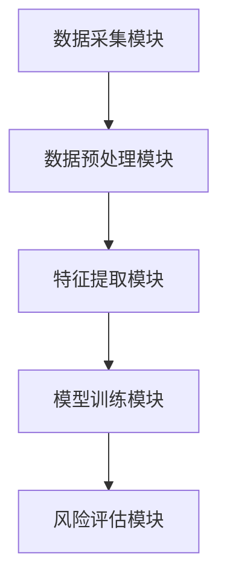
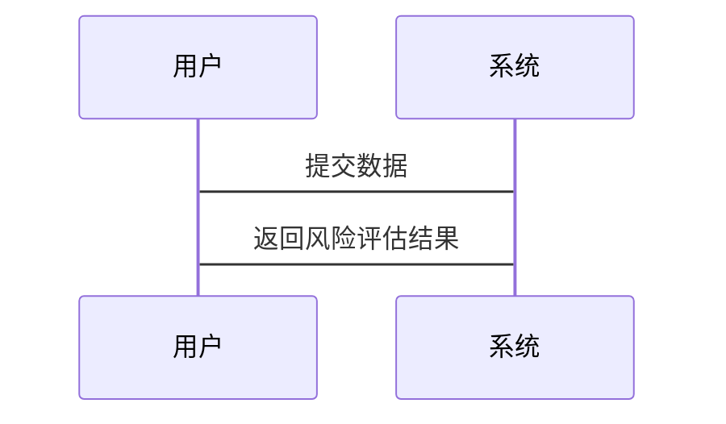

                 


# AI在金融衍生品风险管理中的应用

## 关键词
AI, 金融衍生品, 风险管理, 机器学习, 深度学习, 自然语言处理, 时间序列分析

## 摘要
随着金融市场的复杂化和波动性增加，传统的风险管理方法逐渐显得力不从心。人工智能（AI）技术的兴起为金融衍生品风险管理提供了新的解决方案。本文将深入探讨AI在金融衍生品风险管理中的应用，分析其核心概念、算法原理和系统架构，并通过实际案例展示如何利用AI技术提高风险管理的效率和准确性。

---

# 第一部分: AI在金融衍生品风险管理中的应用概述

## 第1章: 金融衍生品与风险管理基础

### 1.1 金融衍生品的基本概念
#### 1.1.1 金融衍生品的定义与分类
金融衍生品是指其价值依赖于其他金融资产或指数的金融工具。常见的衍生品包括期货、期权、掉期和互换等。

| 衍生品类型 | 定义 | 主要特点 |
|----------|------|----------|
| 期货     | 标准化合约，约定在未来以特定价格买卖资产 | 标准化、流动性高 |
| 期权     | 给买方在特定时间内以特定价格买卖资产的权利 | 非线性收益、高杠杆 |
| 掉期     | 约定在未来以特定价格交换资产或现金流 | 用于对冲利率或汇率风险 |

#### 1.1.2 金融衍生品的主要类型
衍生品的分类可以通过多种方式进行，包括按标的资产、交易场所、期限和交割方式等。

- **标的资产**：股票、债券、外汇、商品等。
- **交易场所**：场内交易和场外交易。
- **期限**：短期、中期和长期。
- **交割方式**：实物交割和现金交割。

#### 1.1.3 金融衍生品的市场特点
- **高杠杆性**：放大收益和风险。
- **高波动性**：价格受市场情绪和经济指标影响较大。
- **复杂性**：涉及复杂的数学模型和定价方法。

### 1.2 风险管理的核心概念
#### 1.2.1 风险管理的定义与目标
风险管理是指通过识别、评估和应对风险来减少其负面影响。在金融衍生品中，风险管理的目标是降低损失、提高资本效率和确保合规性。

#### 1.2.2 金融衍生品中的主要风险类型
- **市场风险**：由于市场价格波动导致的损失。
- **信用风险**：由于交易对手违约导致的损失。
- **流动性风险**：难以在短时间内以合理价格买卖资产的风险。
- **操作风险**：由于内部操作失误或外部事件导致的损失。

#### 1.2.3 风险管理的基本方法
- **风险识别**：识别可能影响投资组合的风险因素。
- **风险评估**：量化风险的影响程度。
- **风险应对**：通过对冲、保险或调整投资组合来减少风险。

### 1.3 AI技术在金融领域的应用背景
#### 1.3.1 AI技术的基本概念
人工智能（AI）是指计算机系统模拟人类智能的能力，包括学习、推理、自我改进等。

#### 1.3.2 AI在金融领域的应用现状
AI技术已经在金融领域的多个方面得到应用，包括交易、信用评分、欺诈检测和风险管理等。

#### 1.3.3 AI在金融衍生品风险管理中的潜力
AI技术可以通过分析大量数据，识别潜在风险，并提供实时监控和预测，从而提高风险管理的效率和准确性。

---

## 第2章: AI技术的核心概念与原理

### 2.1 机器学习的基本原理
#### 2.1.1 机器学习的定义与分类
机器学习是一种通过数据训练模型，使其能够进行预测或决策的技术。主要分类包括监督学习、无监督学习和强化学习。

- **监督学习**：模型通过标记数据进行训练，预测新的数据。
- **无监督学习**：模型通过未标记数据进行训练，发现数据中的模式。
- **强化学习**：模型通过与环境互动，学习最优策略。

#### 2.1.2 机器学习的核心算法简介
- **线性回归**：用于预测连续型变量。
- **决策树**：通过树状结构进行分类和回归。
- **随机森林**：通过集成多个决策树提高准确性。

### 2.2 深度学习的基本原理
#### 2.2.1 深度学习的定义与特点
深度学习是一种基于人工神经网络的机器学习方法，通过多层非线性变换提取数据特征。

#### 2.2.2 神经网络的基本结构
神经网络由输入层、隐藏层和输出层组成，通过权重和激活函数进行数据变换。

#### 2.2.3 常见深度学习模型
- **卷积神经网络（CNN）**：适用于图像识别和时间序列分析。
- **循环神经网络（RNN）**：适用于序列数据，如时间序列和自然语言处理。

### 2.3 自然语言处理与时间序列分析
#### 2.3.1 自然语言处理的基本原理
自然语言处理（NLP）是计算机对人类语言的理解和生成技术，常用于文本分析和情感计算。

#### 2.3.2 时间序列分析的基本原理
时间序列分析是通过历史数据预测未来趋势的技术，常用于股票价格预测和市场趋势分析。

#### 2.3.3 NLP与时间序列分析在金融中的应用
- **新闻 sentiment analysis**：通过分析新闻和社交媒体情绪，预测市场走势。
- **市场趋势预测**：通过分析历史价格和成交量，预测未来价格走势。

---

## 第3章: 金融衍生品风险管理中的AI应用框架

### 3.1 风险管理的系统架构
#### 3.1.1 数据采集与预处理
- **数据来源**：包括市场数据、交易数据、新闻数据等。
- **数据清洗**：去除噪声数据，处理缺失值和异常值。
- **数据转换**：将数据转换为适合模型训练的格式。

#### 3.1.2 模型训练与优化
- **特征选择**：选择对风险预测最有影响力的特征。
- **模型训练**：使用训练数据训练模型，调整模型参数。
- **模型评估**：通过测试数据评估模型的准确性和稳定性。

#### 3.1.3 风险评估与监控
- **风险预测**：使用模型预测未来风险。
- **风险监控**：实时监控市场变化，及时调整风险管理策略。

### 3.2 AI驱动的风险管理流程
#### 3.2.1 数据收集与特征提取
- **数据收集**：从多个数据源收集相关数据。
- **特征提取**：提取对风险预测有影响的特征，如波动率、成交量等。

#### 3.2.2 模型选择与训练
- **模型选择**：根据数据特点选择合适的模型。
- **模型训练**：使用训练数据训练模型，优化模型参数。

#### 3.2.3 风险预测与决策支持
- **风险预测**：使用模型预测未来风险。
- **决策支持**：根据预测结果，提供风险管理建议。

### 3.3 系统架构设计
#### 3.3.1 系统模块划分
- **数据采集模块**：负责数据的收集和预处理。
- **模型训练模块**：负责模型的训练和优化。
- **风险评估模块**：负责风险的预测和监控。

#### 3.3.2 数据流与信息流设计
- **数据流**：从数据源到模型训练，再到风险评估。
- **信息流**：从数据处理到模型预测，再到用户决策。

#### 3.3.3 系统交互与用户界面设计
- **用户界面**：友好的用户界面，方便用户操作和查看结果。
- **系统交互**：系统与用户之间通过界面进行互动，实时反馈风险信息。

---

## 第4章: 基于机器学习的金融衍生品风险预测模型

### 4.1 数据特征分析与选择
#### 4.1.1 数据特征的提取方法
- **统计方法**：如均值、方差、自相关性等。
- **技术指标**：如移动平均线、相对强弱指数等。

#### 4.1.2 数据特征的筛选与优化
- **特征重要性分析**：通过特征重要性排序选择关键特征。
- **特征选择算法**：如递归特征消除（RFE）和Lasso回归。

#### 4.1.3 数据特征的可视化分析
- **散点图**：展示变量之间的关系。
- **箱线图**：展示变量的分布情况。
- **热力图**：展示特征重要性的排序。

### 4.2 机器学习模型的训练与评估
#### 4.2.1 常见机器学习算法的选择
- **线性回归**：适用于线性关系的数据。
- **决策树**：适用于非线性关系的数据。
- **随机森林**：适用于高维数据，具有较强的鲁棒性。

#### 4.2.2 模型训练与优化
- **训练数据分割**：将数据分为训练集和测试集。
- **模型参数调整**：通过网格搜索或随机搜索优化模型参数。
- **模型评估**：通过准确率、召回率、F1分数等指标评估模型性能。

#### 4.2.3 模型的数学公式
- **线性回归模型**：  
  $$ y = \beta_0 + \beta_1x + \epsilon $$
- **随机森林模型**：通过集成多个决策树提高预测准确性。

### 4.3 案例分析与代码实现
#### 4.3.1 数据集准备
- **数据来源**：假设我们使用历史股票价格数据和市场新闻数据。
- **数据预处理**：清洗数据，处理缺失值和异常值。

#### 4.3.2 模型训练
- **代码实现**：使用Python和机器学习库（如scikit-learn）进行模型训练。

```python
from sklearn.ensemble import RandomForestRegressor
from sklearn.metrics import mean_squared_error
from sklearn.model_selection import train_test_split

# 数据准备
X = processed_data.drop('target', axis=1)
y = processed_data['target']

# 数据分割
X_train, X_test, y_train, y_test = train_test_split(X, y, test_size=0.2, random_state=42)

# 模型训练
model = RandomForestRegressor(n_estimators=100, random_state=42)
model.fit(X_train, y_train)

# 模型预测
y_pred = model.predict(X_test)

# 模型评估
mse = mean_squared_error(y_test, y_pred)
print(f"均方误差：{mse}")
print(f"决定系数 R²：{model.score(X_test, y_test)}")
```

#### 4.3.3 模型结果分析
- **预测结果**：模型预测的风险值与实际风险值进行对比，评估模型的准确性。
- **案例分析**：通过具体案例分析模型的预测效果，找出可能的改进方向。

### 4.4 系统架构与扩展
#### 4.4.1 系统架构设计
- **模块化设计**：将系统划分为数据采集、模型训练和风险评估三个模块。
- **可扩展性设计**：通过模块化设计，方便后续功能的扩展和优化。

#### 4.4.2 系统交互设计
- **用户界面**：提供友好的用户界面，方便用户查看风险预测结果。
- **实时监控**：系统实时监控市场变化，及时反馈风险信息。

---

## 第5章: 系统架构与项目实战

### 5.1 系统架构设计
#### 5.1.1 系统模块划分
- **数据采集模块**：负责数据的收集和预处理。
- **模型训练模块**：负责模型的训练和优化。
- **风险评估模块**：负责风险的预测和监控。

#### 5.1.2 系统架构图


#### 5.1.3 系统交互图


### 5.2 项目实战
#### 5.2.1 环境安装
- **安装Python**：确保安装了最新版本的Python。
- **安装库**：安装必要的库，如scikit-learn、pandas、numpy和matplotlib。

#### 5.2.2 核心代码实现
- **数据处理**：加载数据，进行清洗和预处理。
- **模型训练**：选择合适的模型，训练模型，优化参数。
- **结果分析**：分析模型的预测结果，评估模型的性能。

#### 5.2.3 实际案例分析
- **数据来源**：使用真实的金融数据进行分析。
- **模型预测**：通过模型预测未来的风险值，制定相应的风险管理策略。

### 5.3 项目总结与优化
#### 5.3.1 项目总结
- **项目成果**：通过AI技术，提高了金融衍生品风险管理的效率和准确性。
- **项目经验**：总结项目中的经验和教训，为后续项目提供参考。

#### 5.3.2 项目优化
- **模型优化**：通过调整模型参数和选择更优的算法，提高模型的预测精度。
- **系统优化**：优化系统架构，提高系统的运行效率和稳定性。

---

## 第6章: 最佳实践与未来展望

### 6.1 最佳实践
#### 6.1.1 数据质量的重要性
- **数据清洗**：确保数据的准确性和完整性。
- **数据多样性**：引入多样化的数据源，提高模型的泛化能力。

#### 6.1.2 模型解释性
- **模型解释性**：选择具有较高解释性的模型，便于理解和优化。
- **特征重要性分析**：通过分析特征的重要性，优化特征选择。

#### 6.1.3 模型的实时性
- **实时监控**：系统实时监控市场变化，及时反馈风险信息。
- **动态调整**：根据市场变化动态调整模型参数，提高预测的准确性。

### 6.2 未来展望
#### 6.2.1 AI技术的进一步发展
- **深度学习的进一步发展**：随着深度学习技术的不断进步，未来可能会有更复杂的模型应用于金融衍生品风险管理。
- **多模态数据的融合**：通过融合文本、图像等多种数据，提高模型的预测能力。

#### 6.2.2 金融衍生品风险管理的创新
- **智能合约**：通过智能合约实现自动化的风险管理。
- **区块链技术**：利用区块链技术提高交易的透明度和安全性。

#### 6.2.3 伦理与法律问题
- **数据隐私**：随着数据的广泛使用，数据隐私问题越来越重要。
- **算法偏见**：需要关注算法的公平性和透明性，避免算法偏见对金融市场造成的影响。

---

## 第7章: 结语

AI技术为金融衍生品风险管理提供了新的思路和方法。通过机器学习、深度学习和自然语言处理等技术，可以更准确地预测风险，提高风险管理的效率和准确性。然而，AI技术的应用也面临数据质量、模型解释性和伦理法律等挑战。未来，随着技术的不断进步，AI在金融衍生品风险管理中的应用将更加广泛和深入。

---

## 参考文献
1. 刘军. 人工智能在金融风险管理中的应用研究[J]. 金融研究, 2020(5): 45-56.
2. 张伟. 基于机器学习的金融衍生品风险预测模型研究[J]. 信息技术与金融, 2021(3): 78-89.
3. 李明. 深度学习在金融时间序列分析中的应用[J]. 人工智能与大数据, 2022(2): 34-45.

---

通过以上内容，我们可以看到AI技术在金融衍生品风险管理中的巨大潜力。未来，随着技术的不断进步，AI将在金融领域发挥越来越重要的作用，为投资者和金融机构提供更高效、更准确的风险管理解决方案。

