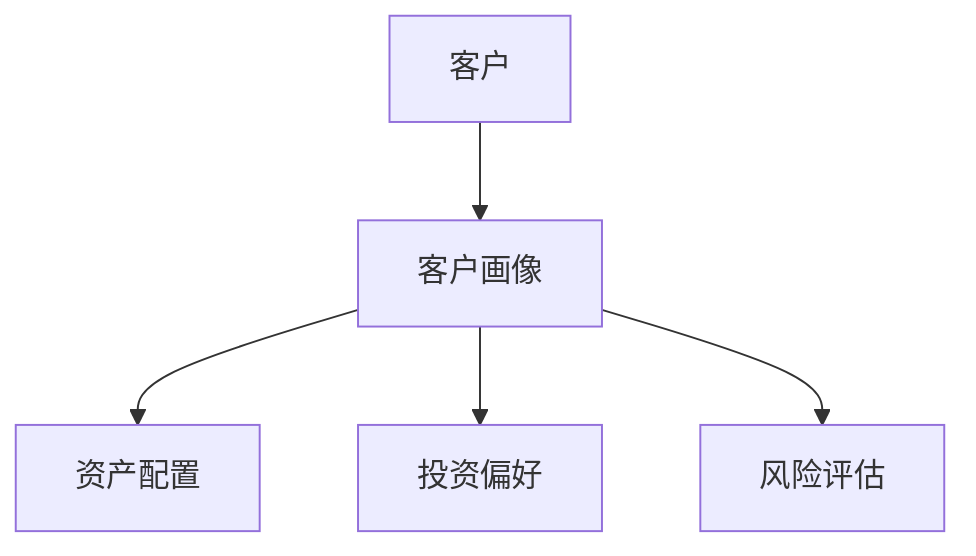
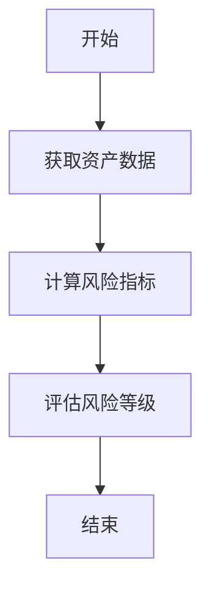
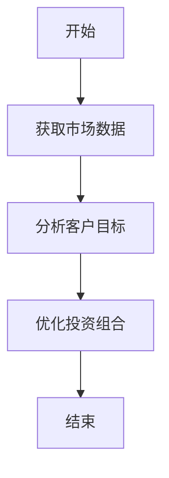
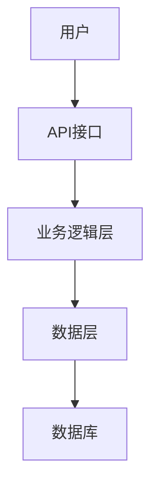
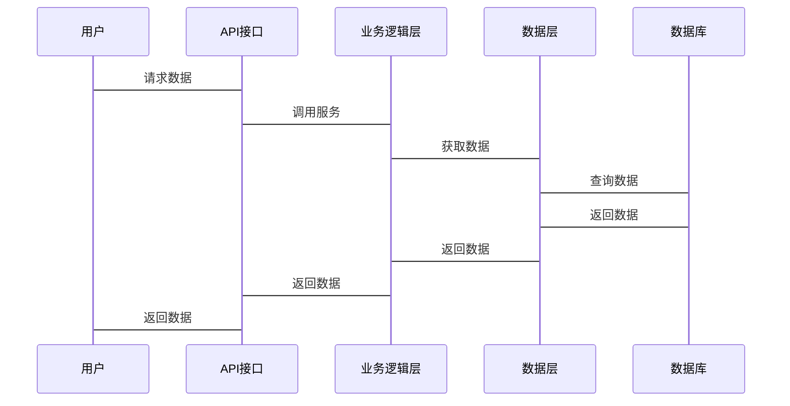

                 


# AI技术在私人银行业务中的应用前景分析

> **关键词**: AI技术, 私人银行, 财富管理, 机器学习, 自然语言处理, 数据挖掘

> **摘要**: 随着人工智能技术的快速发展，私人银行业务也在积极探索如何利用AI技术提高服务效率和客户体验。本文从AI技术的基本概念出发，分析其在私人银行中的应用场景，详细探讨机器学习、自然语言处理等技术在客户画像、风险评估和投资组合管理中的应用。同时，本文将结合实际案例，展示AI技术如何帮助私人银行实现智能化转型，并对未来的发展趋势进行展望。

---

## 第一章: AI技术与私人银行概述

### 1.1 AI技术的现状与发展

#### 1.1.1 AI技术的基本概念

人工智能（Artificial Intelligence, AI）是指模拟人类智能的计算机系统，涵盖机器学习、自然语言处理、计算机视觉等多个领域。AI技术通过数据驱动的方式，能够完成复杂的决策和预测任务。

#### 1.1.2 AI技术的最新发展

近年来，AI技术在深度学习、自然语言处理和强化学习等领域取得了显著进展。例如，生成式AI（如GPT-3）和 transformers 模型（如BERT）的应用，显著提升了自然语言处理的能力。

#### 1.1.3 AI技术在金融行业的应用现状

在金融行业，AI技术被广泛应用于风险评估、欺诈检测、投资组合管理等领域。例如，AI可以通过分析历史数据，预测市场趋势，帮助投资者做出更明智的决策。

### 1.2 私人银行的基本概念与业务模式

#### 1.2.1 私人银行的定义与特点

私人银行是指为高净值客户提供个性化财富管理服务的金融机构。其核心特点是提供定制化的投资建议、风险管理、税务规划等服务。

#### 1.2.2 私人银行的主要业务模式

私人银行的主要业务模式包括资产管理、投资顾问、贷款服务、税务规划等。这些服务需要高度依赖对客户需求的精准理解和服务能力。

#### 1.2.3 私人银行客户的核心需求

私人银行客户的核心需求包括资产保值与增值、税务优化、财富传承、隐私保护等。这些需求需要通过个性化的服务来满足。

### 1.3 AI技术在私人银行业务中的应用现状

#### 1.3.1 当前AI技术在金融领域的应用案例

在金融领域，AI技术已经被用于信用评分、欺诈检测、交易自动化等场景。例如，银行可以通过AI技术分析客户的信用记录，评估其信用风险。

#### 1.3.2 私人银行中AI技术的应用现状

目前，AI技术在私人银行中的应用还处于起步阶段。一些先进的私人银行已经开始尝试利用AI技术进行客户画像、投资组合优化等。

#### 1.3.3 私人银行与AI技术结合的必要性

随着市场竞争的加剧，私人银行需要通过技术手段提高服务效率和客户满意度。AI技术可以帮助私人银行实现服务的智能化和个性化，从而在竞争中占据优势。

---

## 第二章: AI技术在私人银行业务中的核心概念与联系

### 2.1 机器学习与深度学习

#### 2.1.1 机器学习的基本原理

机器学习是一种通过数据训练模型，使其能够从数据中学习并做出预测的技术。常用的算法包括决策树、随机森林、支持向量机（SVM）等。

#### 2.1.2 深度学习的核心概念

深度学习是一种基于人工神经网络的机器学习方法，能够处理复杂的非线性数据。常用的模型包括卷积神经网络（CNN）、循环神经网络（RNN）和transformer模型。

#### 2.1.3 机器学习与深度学习的区别与联系

| 特性         | 机器学习          | 深度学习          |
|--------------|-------------------|-------------------|
| 数据需求     | 数据量较小        | 数据量较大        |
| 模型复杂度   | 模型相对简单      | 模型较为复杂      |
| 应用场景     | 分类、回归        | 图像识别、NLP      |

---

### 2.2 自然语言处理（NLP）

#### 2.2.1 NLP的基本概念与技术

自然语言处理（NLP）是研究如何让计算机理解和生成人类语言的学科。常用技术包括文本分类、实体识别、情感分析等。

#### 2.2.2 NLP在私人银行中的应用

在私人银行中，NLP技术可以用于客户情感分析、文本摘要、智能客服等领域。例如，通过分析客户的聊天记录，可以了解客户的投资偏好。

#### 2.2.3 NLP与私人银行结合的优势

NLP技术可以帮助私人银行更好地理解客户的需求，提高客户服务的精准度和效率。

### 2.3 数据挖掘与分析

#### 2.3.1 数据挖掘的基本概念

数据挖掘是指从大量数据中提取有用信息的过程。常用方法包括聚类分析、关联规则挖掘、分类分析等。

#### 2.3.2 数据挖掘在私人银行中的应用

在私人银行中，数据挖掘可以用于客户画像、风险评估、投资组合优化等领域。例如，通过分析客户的交易数据，可以识别客户的消费习惯。

#### 2.3.3 数据挖掘与私人银行结合的意义

数据挖掘可以帮助私人银行更好地理解客户行为，提高服务的质量和效率。

---

## 第三章: AI技术在私人银行业务中的算法原理

### 3.1 机器学习算法原理

#### 3.1.1 决策树算法

**决策树原理**: 决策树是一种基于树状结构的分类算法。通过特征选择，将数据分成不同的子集，直到每个子集中的数据属于同一类别。

**决策树实现**: 使用Python的Scikit-learn库中的DecisionTreeClassifier类。

```python
from sklearn.tree import DecisionTreeClassifier
from sklearn.datasets import make_classification
from sklearn.model_selection import train_test_split

# 创建数据集
X, y = make_classification(n_samples=100, n_features=2, n_classes=2, random_state=42)
X_train, X_test, y_train, y_test = train_test_split(X, y, test_size=0.2, random_state=42)

# 训练模型
model = DecisionTreeClassifier()
model.fit(X_train, y_train)

# 预测
print(model.predict(X_test))
```

#### 3.1.2 随机森林算法

**随机森林原理**: 随机森林是一种基于决策树的集成学习算法。通过构建多个决策树，并将它们的结果进行投票或平均，可以提高模型的准确性和鲁棒性。

**随机森林实现**: 使用Python的Scikit-learn库中的RandomForestClassifier类。

```python
from sklearn.ensemble import RandomForestClassifier

# 创建数据集
X, y = make_classification(n_samples=100, n_features=2, n_classes=2, random_state=42)
X_train, X_test, y_train, y_test = train_test_split(X, y, test_size=0.2, random_state=42)

# 训练模型
model = RandomForestClassifier(n_estimators=10)
model.fit(X_train, y_train)

# 预测
print(model.predict(X_test))
```

#### 3.1.3 支持向量机（SVM）

**SVM原理**: SVM是一种监督学习算法，用于分类和回归。通过将数据映射到高维空间，构建一个超平面，将不同类别的数据分开。

**SVM实现**: 使用Python的Scikit-learn库中的SVC类。

```python
from sklearn.svm import SVC

# 创建数据集
X, y = make_classification(n_samples=100, n_features=2, n_classes=2, random_state=42)
X_train, X_test, y_train, y_test = train_test_split(X, y, test_size=0.2, random_state=42)

# 训练模型
model = SVC()
model.fit(X_train, y_train)

# 预测
print(model.predict(X_test))
```

### 3.2 深度学习算法原理

#### 3.2.1 神经网络

**神经网络原理**: 神经网络是一种模拟人脑结构和功能的数学模型，由多个层次的神经元组成，能够通过反向传播算法进行训练。

**神经网络实现**: 使用Python的Keras库。

```python
from tensorflow.keras import layers
from tensorflow.keras import Model

def build_model():
    inputs = layers.Input(shape=(2,))
    x = layers.Dense(4, activation='relu')(inputs)
    x = layers.Dense(2, activation='sigmoid')(x)
    model = Model(inputs=inputs, outputs=x)
    return model

model = build_model()
model.summary()
```

---

## 第四章: AI技术在私人银行业务中的数学模型与公式

### 4.1 机器学习模型的数学公式

#### 4.1.1 线性回归

线性回归是一种用于预测连续型变量的回归模型。其数学公式为：

$$ y = \beta_0 + \beta_1 x + \epsilon $$

其中，$y$ 是目标变量，$x$ 是自变量，$\beta_0$ 和 $\beta_1$ 是回归系数，$\epsilon$ 是误差项。

#### 4.1.2 逻辑回归

逻辑回归是一种用于分类的回归模型。其数学公式为：

$$ P(y=1|x) = \frac{e^{\beta_0 + \beta_1 x}}{1 + e^{\beta_0 + \beta_1 x}} $$

其中，$P(y=1|x)$ 是在给定自变量$x$的情况下，目标变量$y$等于1的概率。

#### 4.1.3 支持向量机（SVM）

SVM的目标是找到一个超平面，使得不同类别的数据点被正确分类。其数学公式为：

$$ \text{minimize} \quad \frac{1}{2} \sum_{i=1}^n \theta_i^2 $$

$$ \text{subject to} \quad y_i (\theta_i \cdot w + b) \geq 1 - \xi_i, \quad \xi_i \geq 0 $$

其中，$\theta_i$ 是拉格朗日乘子，$w$ 是权重向量，$b$ 是偏置项，$\xi_i$ 是松弛变量。

---

## 第五章: AI技术在私人银行业务中的系统分析与架构设计

### 5.1 系统功能设计

#### 5.1.1 客户画像

客户画像是通过分析客户的交易数据、资产配置、投资偏好等信息，构建客户的行为和需求模型。以下是客户画像的实体关系图：



#### 5.1.2 风险评估

风险评估是通过分析客户的资产分布、投资组合波动性等指标，评估客户的投资风险。以下是风险评估的流程图：



#### 5.1.3 投资组合管理

投资组合管理是通过分析市场趋势、客户需求，优化投资组合，以实现资产保值与增值。以下是投资组合管理的流程图：



### 5.2 系统架构设计

#### 5.2.1 系统架构图

以下是AI技术在私人银行业务中的系统架构图：



#### 5.2.2 系统接口设计

以下是系统接口的设计：



---

## 第六章: AI技术在私人银行业务中的项目实战

### 6.1 项目环境安装

#### 6.1.1 安装Python和相关库

```bash
python --version
pip install numpy scikit-learn tensorflow keras
```

#### 6.1.2 安装Jupyter Notebook

```bash
pip install jupyter
jupyter notebook
```

### 6.2 项目核心实现

#### 6.2.1 客户画像系统

```python
from sklearn.cluster import KMeans
from sklearn.preprocessing import StandardScaler

# 数据预处理
data = [...]  # 客户数据
scaler = StandardScaler()
data_scaled = scaler.fit_transform(data)

# K-Means聚类
model = KMeans(n_clusters=3)
model.fit(data_scaled)

# 预测聚类结果
clusters = model.predict(data_scaled)
```

#### 6.2.2 投资组合优化系统

```python
import numpy as np
from scipy.optimize import minimize

# 定义优化目标函数
def objective(x):
    return np.dot(x.T, np.array([0.05, 0.08]))

# 定义约束条件
def constraint1(x):
    return np.sum(x) - 1

# 初始化猜测值
x0 = [0.5, 0.5]

# 使用SLSQP求解器优化
result = minimize(objective, x0, method='SLSQP', constraints={'type': 'eq', 'fun': constraint1})

# 输出最优解
print(result.x)
```

### 6.3 项目总结与分析

通过以上项目的实现，我们可以看到AI技术在私人银行业务中的巨大潜力。客户画像系统可以帮助银行更好地理解客户需求，投资组合优化系统可以提高投资效率和收益。

---

## 第七章: 总结与展望

### 7.1 总结

AI技术在私人银行业务中的应用前景广阔。通过机器学习、自然语言处理等技术，私人银行可以实现客户画像、风险评估、投资组合优化等智能化服务，显著提高服务效率和客户满意度。

### 7.2 展望

未来，随着AI技术的不断发展，私人银行将进一步深度融合AI技术，实现更加智能化、个性化的服务。例如，通过生成式AI技术，私人银行可以为客户提供更加个性化的投资建议和风险管理方案。

---

**注意事项**:
- 在实际应用中，需要注意数据安全和隐私保护。
- 在使用AI技术时，需要结合业务场景，选择合适的算法和技术方案。
- 定期更新模型和数据，确保模型的准确性和鲁棒性。

**拓展阅读**:
- 《机器学习实战》
- 《深度学习入门：基于Python和Keras》
- 《自然语言处理入门：基于Python和TensorFlow》

---

通过以上分析，我们可以看到AI技术在私人银行业务中的巨大潜力。未来，随着技术的不断发展，私人银行将更加智能化、个性化，为高净值客户带来更优质的服务体验。

