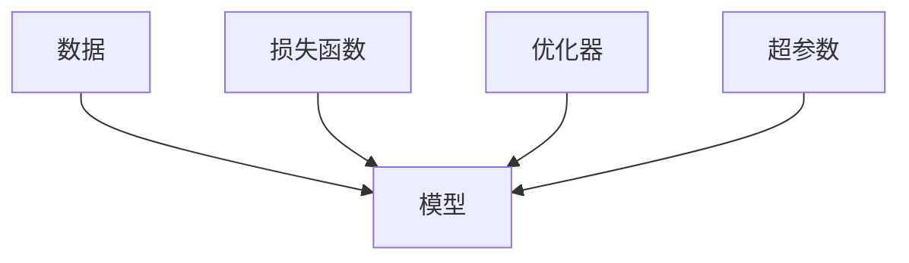
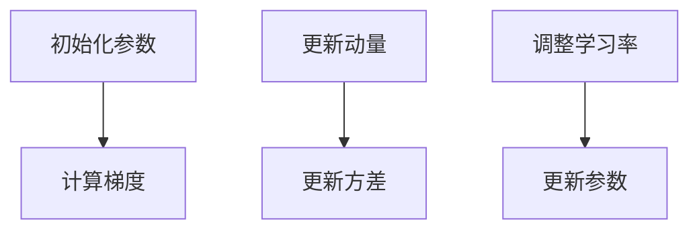
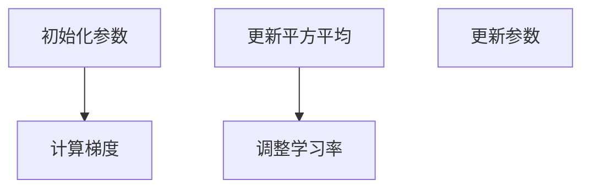
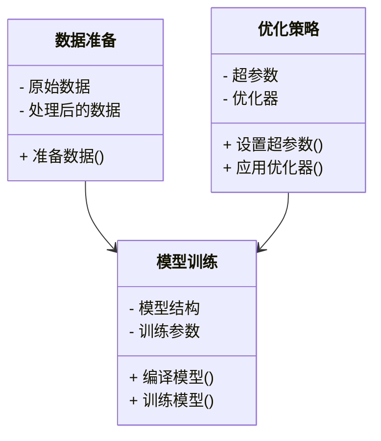

                 


# AI模型训练与优化步骤详解

> 关键词：AI模型训练，优化步骤，数据准备，模型选择，优化算法，超参数调整，模型评估

> 摘要：本文将详细讲解AI模型训练与优化的全过程，从数据准备到模型选择，从训练策略到优化方法，再到模型评估与部署。通过系统化的步骤分析和实际案例展示，帮助读者全面掌握AI模型训练与优化的核心要点。

---

## 第一部分: AI模型训练与优化背景介绍

### 第1章: AI模型训练与优化概述

#### 1.1 问题背景与描述

##### 1.1.1 人工智能模型的重要性
人工智能模型是实现机器学习和深度学习的核心工具。通过训练模型，我们可以让计算机从数据中学习规律，并用于预测或分类任务。模型的质量直接决定了AI系统的性能。

##### 1.1.2 模型训练与优化的核心问题
模型训练与优化的核心问题包括：
- 如何高效地训练模型以减少计算成本？
- 如何选择合适的模型结构以提高性能？
- 如何调整超参数以优化模型表现？
- 如何避免过拟合和欠拟合问题？

##### 1.1.3 问题的边界与外延
模型训练与优化的边界在于数据预处理和模型部署，而其外延则包括模型解释性、可扩展性以及模型的实时更新。

#### 1.2 核心概念与联系

##### 1.2.1 模型训练与优化的概念结构
- 数据：输入样本，包括特征和标签。
- 模型：算法的结构，如神经网络。
- 损失函数：衡量模型预测与真实值的差距。
- 优化器：更新模型参数的算法。
- 超参数：需要手动调整的参数，如学习率。

##### 1.2.2 核心要素对比表格
| 要素 | 描述 |
|------|------|
| 数据 | 输入训练的样本数据 |
| 模型 | 算法的结构，如神经网络 |
| 损失函数 | 评估预测与真实值的差距 |
| 优化器 | 更新模型参数的算法 |
| 超参数 | 需要手动调整的参数，如学习率 |

##### 1.2.3 ER实体关系图（Mermaid）



---

## 第二部分: AI模型训练与优化的核心步骤

### 第2章: 数据准备

#### 2.1 数据清洗与预处理

##### 2.1.1 数据清洗
- 去除重复数据
- 处理缺失值
- 删除异常值

##### 2.1.2 数据转换
- 标准化/归一化
- 编码处理（如将类别变量转换为数值）

#### 2.2 特征工程

##### 2.2.1 特征选择
- 选择重要特征
- 删除无关特征

##### 2.2.2 特征构造
- 创建新特征
- 组合现有特征

### 第3章: 模型选择

#### 3.1 常见模型介绍

##### 3.1.1 线性回归
- 简单线性回归
- 多变量线性回归

##### 3.1.2 支持向量机（SVM）
- 线性SVM
- 非线性SVM（使用核函数）

##### 3.1.3 决策树
- ID3
- C4.5
- C5.0

##### 3.1.4 神经网络
- 深度前馈神经网络
- 卷积神经网络（CNN）
- 循环神经网络（RNN）

#### 3.2 模型选择策略

##### 3.2.1 基于性能的选择
- 准确率、召回率、F1分数

##### 3.2.2 基于复杂度的选择
- 避免过拟合和欠拟合

### 第4章: 模型训练

#### 4.1 算法原理

##### 4.1.1 随机梯度下降（SGD）
- 单个样本更新参数
- 适用于大数据集

##### 4.1.2 批量梯度下降（BGD）
- 批处理，计算整个训练集的梯度
- 收敛速度慢，但方向更准确

##### 4.1.3 小批量梯度下降（MBGD）
- 在SGD和BGD之间折中
- 适用于并行计算

#### 4.2 训练流程

##### 4.2.1 网络初始化
- 随机初始化权重
- 使用 Xavier 初始化或 He 初始化

##### 4.2.2 前向传播
- 输入数据，计算输出
- 应用激活函数

##### 4.2.3 计算损失
- 使用损失函数计算损失值

##### 4.2.4 反向传播
- 计算损失对权重的梯度
- 使用链式法则

##### 4.2.5 更新参数
- 应用优化器更新权重

### 第5章: 模型优化

#### 5.1 优化策略

##### 5.1.1 超参数调整
- 学习率（Learning Rate）
- 批大小（Batch Size）
- 正则化系数（Regularization Rate）

##### 5.1.2 学习率调度器
- 固定学习率
- 指数衰减
- 衰减到零

##### 5.1.3 正则化方法
- L1 正则化
- L2 正则化
- Dropout

#### 5.2 超参数调整方法

##### 5.2.1 网格搜索（Grid Search）
- 遍历所有可能的超参数组合
- 适用于参数较少的情况

##### 5.2.2 随机搜索（Random Search）
- 在超参数空间中随机采样
- 适用于参数较多的情况

##### 5.2.3 自动调优工具
- 使用 HyperOpt 或 Optuna 等工具

---

## 第三部分: 算法原理与数学模型

### 第6章: 优化算法

#### 6.1 Adam 优化器

##### 6.1.1 算法流程


##### 6.1.2 数学公式
$$\text{Adam} = \beta_1 \cdot g_t + (1-\beta_1) \cdot g_t$$
$$\text{Adam} = \beta_2 \cdot g_t^2 + (1-\beta_2) \cdot g_t^2$$
$$\theta = \theta - \alpha \cdot \frac{\text{Adam}}{1-\beta_2^t}$$

#### 6.2 RMSprop 优化器

##### 6.2.1 算法流程


##### 6.2.2 数学公式
$$r_t = \beta \cdot r_{t-1} + (1-\beta) \cdot g_t^2$$
$$\theta = \theta - \frac{\alpha}{\sqrt{r_t + \epsilon}} \cdot g_t$$

---

## 第四部分: 系统分析与架构设计

### 第7章: 系统架构设计

#### 7.1 领域模型（Mermaid 类图）



#### 7.2 系统架构图（Mermaid 架构图）

```mermaid
docker {
  service 数据准备 {
    docker run 数据清洗工具
  }
  service 模型训练 {
    docker run 深度学习框架
  }
  service 优化策略 {
    docker run 优化器组件
  }
}
```

---

## 第五部分: 项目实战

### 第8章: 实战案例

#### 8.1 环境安装

```bash
pip install numpy pandas scikit-learn tensorflow
```

#### 8.2 核心实现

##### 8.2.1 数据准备代码

```python
import numpy as np
import pandas as pd

# 加载数据
data = pd.read_csv('data.csv')

# 数据清洗
data.dropna()
data['target'] = data['target'].astype(int)

# 特征工程
from sklearn.preprocessing import StandardScaler
scaler = StandardScaler()
data_scaled = scaler.fit_transform(data)
```

##### 8.2.2 模型选择与训练代码

```python
from tensorflow.keras.models import Sequential
from tensorflow.keras.layers import Dense

# 模型定义
model = Sequential()
model.add(Dense(64, activation='relu', input_dim=64))
model.add(Dense(1, activation='sigmoid'))

# 编译模型
model.compile(optimizer='adam', loss='binary_crossentropy', metrics=['accuracy'])

# 训练模型
model.fit(data_scaled, labels, epochs=100, batch_size=32)
```

##### 8.2.3 模型优化代码

```python
from tensorflow.keras.callbacks import LearningRateScheduler

# 定义学习率调度器
def lr_scheduler(epoch, lr):
    return lr * 0.9 ** epoch

# 应用优化器
model.compile(optimizer='adam', loss='binary_crossentropy', metrics=['accuracy'])
model.fit(data_scaled, labels, epochs=100, batch_size=32, callbacks=[LearningRateScheduler(lr_scheduler, verbose=1)])
```

#### 8.3 实际案例分析

##### 8.3.1 结果分析
- 训练损失与验证损失的对比
- 准确率与召回率的评估

##### 8.3.2 模型解读
- 权重分析
- 特征重要性

---

## 第六部分: 总结与展望

### 第9章: 总结与展望

#### 9.1 最佳实践 tips

##### 9.1.1 数据准备
- 仔细清洗数据
- 合理进行特征工程

##### 9.1.2 模型选择
- 根据任务选择模型
- 避免盲目使用复杂模型

##### 9.1.3 超参数调整
- 使用自动化工具
- 结合经验进行调整

#### 9.2 注意事项

##### 9.2.1 过拟合与欠拟合
- 使用交叉验证
- 引入正则化

##### 9.2.2 计算资源
- 合理分配资源
- 利用并行计算

#### 9.3 拓展阅读

##### 9.3.1 深度学习书籍
- 《Deep Learning》
- 《深度学习入门：用Python和Keras学习基础》

##### 9.3.2 优化算法论文
- "Adam: A Method for Stochastic Optimization"

---

通过以上步骤的详细讲解和实际案例的分析，读者可以系统地掌握AI模型训练与优化的核心要点。从数据准备到模型部署，每一步都需要仔细思考和实践，才能最终构建出高性能的AI模型。

