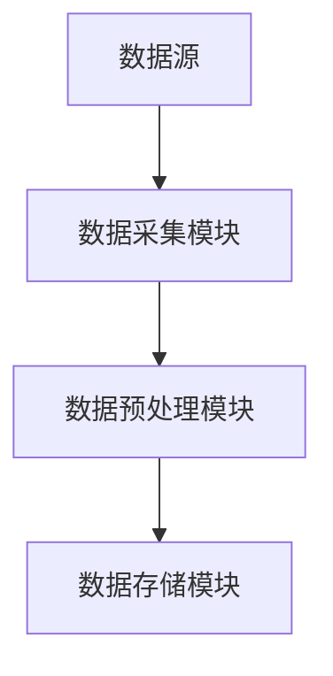

                 


# AI模型训练数据收集与处理技巧

## 关键词：数据收集、数据处理、数据预处理、数据标注、数据增强

## 摘要：  
AI模型的性能高度依赖于训练数据的质量和多样性。本文详细探讨了AI模型训练数据收集与处理的核心技巧，从数据收集的基本原理到数据处理的高级算法，从系统架构设计到实际项目实战，全面解析如何高效、安全地进行数据处理，为AI模型训练提供高质量的数据支持。

---

# 第1章: 数据收集的核心概念与挑战

## 1.1 数据收集的基本原理  
### 1.1.1 数据来源的分类  
- **结构化数据**：如数据库中的表格数据（SQL、NoSQL）。  
- **非结构化数据**：如文本、图像、音频、视频等。  
- **半结构化数据**：如JSON、XML格式的数据。  

### 1.1.2 数据收集的挑战  
- 数据稀疏性：某些数据类别可能非常少，导致模型无法有效训练。  
- 数据噪声：数据中可能包含错误、不完整或无关的信息。  
- 数据隐私：收集和处理数据时需要遵守相关法律法规，如GDPR。  

### 1.1.3 数据收集的流程  
1. 确定数据来源：明确数据将来自哪些渠道（如API、文件、数据库等）。  
2. 设计数据收集策略：根据需求选择合适的数据收集方法。  
3. 实施数据采集：使用工具或脚本从数据源中抓取数据。  
4. 存储数据：将收集到的数据存储在合适的数据仓库中。  

---

# 第2章: 数据预处理的核心技巧

## 2.1 数据清洗与去噪  
### 2.1.1 数据清洗的步骤  
1. **去重**：去除重复的数据记录。  
2. **填补缺失值**：使用均值、中位数或随机填补法填补缺失值。  
3. **处理异常值**：通过统计方法或机器学习方法识别并处理异常值。  

### 2.1.2 数据清洗的代码示例  
```python
import pandas as pd

# 示例数据
data = {'A': [1, 2, np.nan, 4, 5],
        'B': [np.nan, 6, 7, 8, 9]}
df = pd.DataFrame(data)

# 去除缺失值
df_clean = df.dropna()

# 打印结果
print(df_clean)
```

## 2.2 数据特征工程  
### 2.2.1 特征提取的常用方法  
1. **文本特征提取**：使用TF-IDF、Word2Vec等方法提取文本特征。  
2. **图像特征提取**：使用CNN、PCA等方法提取图像特征。  
3. **数值特征提取**：通过标准化、归一化等方法处理数值特征。  

### 2.2.2 特征工程的代码示例  
```python
from sklearn.preprocessing import StandardScaler

# 示例数据
data = {'A': [1, 2, 3, 4, 5],
        'B': [6, 7, 8, 9, 10]}
df = pd.DataFrame(data)

# 标准化处理
scaler = StandardScaler()
df_normalized = scaler.fit_transform(df)

# 打印结果
print(df_normalized)
```

## 2.3 数据增强与扩展  
### 2.3.1 常见的数据增强方法  
1. **图像数据增强**：旋转、翻转、裁剪、添加噪声等。  
2. **文本数据增强**：同义词替换、句子打乱、随机插入无关词等。  
3. **语音数据增强**：改变音调、速度、背景噪声等。  

### 2.3.2 数据增强的代码示例  
```python
import cv2
import numpy as np

# 示例图像数据增强
image = cv2.imread('image.jpg')

# 旋转图像
rotated_image = cv2.rotate(image, cv2.ROTATE_90_CLOCKWISE)

# 转换为RGB格式
rotated_image = cv2.cvtColor(rotated_image, cv2.COLOR_BGR2RGB)

# 显示结果
cv2.imshow('Original Image', image)
cv2.imshow('Rotated Image', rotated_image)
cv2.waitKey(0)
cv2.destroyAllWindows()
```

---

# 第3章: 数据标注与标注工具

## 3.1 数据标注的基本方法  
### 3.1.1 文本标注  
1. **实体识别**：识别文本中的命名实体（如人名、地名、组织名）。  
2. **情感分析**：标注文本的情感倾向（正面、负面、中性）。  
3. **句法分析**：标注句子的语法结构。  

### 3.1.2 图像标注  
1. **目标检测**：标注图像中的目标物体边界框。  
2. **语义分割**：标注图像中每个像素的类别。  
3. **图像配准**：标注图像的关键点或地标。  

---

# 第4章: 数据处理的系统架构与实战

## 4.1 数据处理系统的功能设计  
### 4.1.1 数据采集模块  
- 负责从多种数据源（如数据库、文件、网络）采集数据。  
- 示例：使用Flask框架搭建一个简单的API来接收数据。  

### 4.1.2 数据预处理模块  
- 负责清洗数据、提取特征、数据增强等操作。  
- 示例：使用Pandas和NumPy进行数据清洗和特征工程。  

### 4.1.3 数据存储模块  
- 负责将处理后的数据存储到数据库或文件中。  
- 示例：使用Hadoop或云存储（如AWS S3）存储大规模数据。  

---

## 4.2 数据处理系统的架构设计  


---

# 第5章: 数据安全与隐私保护

## 5.1 数据隐私的法律与伦理问题  
### 5.1.1 数据隐私的法律框架  
- GDPR（通用数据保护条例）：欧盟的数据保护法规。  
- CCPA（加州消费者隐私法案）：美国加州的数据保护法规。  

### 5.1.2 数据隐私的伦理问题  
- 数据收集是否透明？  
- 数据使用是否符合用户同意？  

## 5.2 数据加密与匿名化处理  
### 5.2.1 数据加密方法  
- 对称加密：如AES算法。  
- 非对称加密：如RSA算法。  

### 5.2.2 数据匿名化技术  
- 数据脱敏：通过技术手段将敏感信息脱敏。  
- 数据聚合：通过聚合技术保护数据隐私。  

---

# 第6章: 项目实战与总结

## 6.1 项目背景  
- 某电商公司希望通过AI模型预测用户购买行为。  
- 数据来源：用户点击流数据、购买记录、用户评论等。  

## 6.2 项目实施步骤  
1. 数据收集：从数据库中抓取用户行为数据。  
2. 数据清洗：去除重复数据、填补缺失值。  
3. 数据增强：对文本评论进行同义词替换。  
4. 数据标注：标注用户行为类别（购买、未购买）。  

## 6.3 项目代码实现  
```python
import pandas as pd
from sklearn.preprocessing import LabelEncoder

# 数据收集
data = pd.read_csv('user_behavior.csv')

# 数据清洗
data_clean = data.drop_duplicates().dropna()

# 数据标注
le = LabelEncoder()
data_clean['label'] = le.fit_transform(data_clean['behavior'])

# 保存处理后的数据
data_clean.to_csv('processed_behavior.csv', index=False)
```

## 6.4 项目总结  
- 数据处理是AI模型训练的关键环节。  
- 数据质量和多样性直接影响模型性能。  
- 数据隐私和安全需要高度重视。  

---

# 第7章: 最佳实践与未来展望

## 7.1 最佳实践 tips  
1. 数据收集时，明确数据来源和数据格式。  
2. 数据处理时，遵循数据处理的“4V”原则（Volume、Variety、Velocity、Veracity）。  
3. 数据存储时，选择合适的存储方案（本地存储、云存储等）。  

## 7.2 未来展望  
- 随着AI技术的发展，数据处理的自动化程度将不断提高。  
- 数据隐私保护技术（如联邦学习）将得到广泛应用。  

---

# 结语  
AI模型训练数据的收集与处理是一个复杂而重要的过程。通过本文的详细讲解，读者可以掌握数据收集与处理的核心技巧，并在实际项目中灵活应用这些方法，为AI模型训练提供高质量的数据支持。

