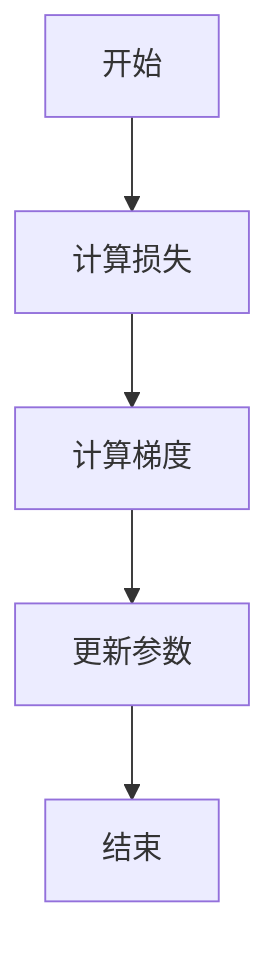
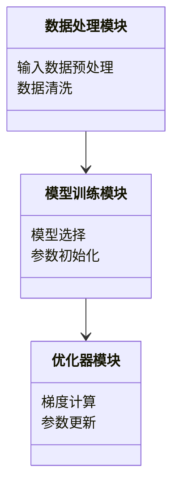

                 


# AI模型训练的步骤与最佳实践

> 关键词：AI模型训练，机器学习，深度学习，算法优化，数据预处理，模型调优，分布式训练

> 摘要：本文系统性地分析了AI模型训练的各个步骤，从数据准备到模型部署，详细讲解了每个环节的关键技术与实践方法。文章结合理论与实践，通过丰富的案例和代码示例，帮助读者掌握AI模型训练的核心要点，并提供了一系列优化建议和最佳实践，以提高模型的训练效率和性能。

---

# 第一部分: AI模型训练的背景与核心概念

## 第1章: AI模型训练的背景与问题背景

### 1.1 问题背景

#### 1.1.1 人工智能与机器学习的快速发展
人工智能（AI）和机器学习（ML）技术近年来取得了飞速发展，广泛应用于图像识别、自然语言处理、推荐系统等领域。AI模型训练是实现这些应用的核心环节，其质量直接影响最终的模型性能。

#### 1.1.2 AI模型训练的必要性
AI模型训练是将数据转化为模型的过程，通过优化算法调整模型参数，使其能够准确地映射输入到输出。训练过程是模型学习数据特征、提升预测能力的关键步骤。

#### 1.1.3 当前AI模型训练的主要挑战
- **数据量大**：现代AI模型需要大量数据进行训练，数据预处理和清洗的复杂性增加。
- **计算资源需求高**：深度学习模型的训练通常需要高性能计算资源，如GPU集群。
- **算法复杂性**：模型训练涉及复杂的数学算法，如梯度下降、反向传播等，对实现者提出了较高要求。

### 1.2 问题描述

#### 1.2.1 AI模型训练的核心问题
AI模型训练的核心问题是如何通过优化算法调整模型参数，使模型在给定数据上的损失函数最小化，同时保证模型在未见数据上的泛化能力。

#### 1.2.2 数据、算法与计算资源的三重挑战
AI模型训练面临数据质量、算法选择和计算资源的三重挑战。数据的质量直接影响模型性能，算法的复杂性决定了训练效率，计算资源的充足性影响训练速度和模型规模。

#### 1.2.3 模型训练的目标与边界
模型训练的目标是在给定数据集上优化模型参数，使其在验证集或测试集上表现最优。训练过程需要在有限的时间和资源约束下完成，避免过拟合和欠拟合问题。

### 1.3 问题解决

#### 1.3.1 AI模型训练的基本方法
AI模型训练的基本方法包括数据预处理、选择合适的算法、调整超参数、模型训练和验证。

#### 1.3.2 现有解决方案的优缺点
- **优点**：数据预处理可以提高模型训练效率；选择合适的算法可以提高模型性能；调整超参数可以优化模型表现。
- **缺点**：数据预处理可能耗时耗力；算法选择需要较高的专业知识；超参数调整需要多次试验。

#### 1.3.3 新兴技术对AI模型训练的推动
新兴技术如自动化机器学习（AutoML）、分布式训练和模型压缩技术，正在逐步改变AI模型训练的方式，提高了训练效率和模型性能。

### 1.4 问题的外延与核心要素

#### 1.4.1 AI模型训练的边界与范围
AI模型训练的边界包括数据范围、模型类型和训练目标。模型训练的范围涉及数据预处理、模型选择、训练过程和模型评估。

#### 1.4.2 核心要素与组成结构
AI模型训练的核心要素包括数据、算法、模型和计算资源。这些要素相互作用，共同决定了训练过程的效率和模型性能。

#### 1.4.3 相关概念的对比与联系
AI模型训练与传统机器学习训练的区别主要体现在数据规模、算法复杂性和计算资源需求上。AI模型训练更注重大数据和深度学习模型的应用。

## 第2章: AI模型训练的核心概念与联系

### 2.1 核心概念原理

#### 2.1.1 数据、模型与训练的关系
数据是模型训练的输入，模型是数据的函数，训练过程通过优化算法调整模型参数，使其更好地拟合数据。

#### 2.1.2 损失函数与优化器的作用
损失函数衡量模型预测值与真实值之间的差异，优化器通过计算损失函数的梯度调整模型参数，最小化损失函数。

#### 2.1.3 模型泛化能力的提升方法
通过数据增强、正则化和交叉验证等方法，可以有效提升模型的泛化能力，防止过拟合。

### 2.2 核心概念属性特征对比

#### 2.2.1 数据特征对比表

| 特征       | 训练数据 | 验证数据 | 测试数据 |
|------------|----------|----------|----------|
| 数据来源    | 训练集    | 验证集    | 测试集    |
| 数据量      | 最大      | 中等      | 最小      |
| 是否用于训练 | 是       | 否       | 否       |

#### 2.2.2 模型特征对比表

| 特征       | 线性回归模型 | 深度学习模型 |
|------------|--------------|--------------|
| 参数数量    | 少           | 多           |
| 训练时间    | 短           | 长           |
| 模型复杂性  | 简单         | 复杂         |

#### 2.2.3 训练过程中的关键参数对比

| 参数         | 学习率（Learning Rate） | 正则化系数（Regularization Coefficient） |
|--------------|-------------------------|------------------------------------------|
| 作用         | 控制参数更新速度         | 防止过拟合                              |
| 调整方式     | 通常需要调整             | 通常需要调整                             |

### 2.3 ER实体关系图架构

```mermaid
er
    actor: 训练工程师
    model: AI模型
    data: 训练数据
    training_process: 训练过程
    actor --> training_process: 执行训练
    data --> training_process: 提供输入
    training_process --> model: 更新模型参数
```

---

# 第二部分: AI模型训练的算法原理

## 第3章: AI模型训练的算法原理

### 3.1 基础算法讲解

#### 3.1.1 梯度下降算法



梯度下降是一种优化算法，用于最小化损失函数。算法步骤如下：
1. 初始化模型参数。
2. 计算当前损失。
3. 计算损失函数对参数的梯度。
4. 更新参数，使其朝着减小损失的方向移动。
5. 重复上述步骤直到收敛。

数学公式如下：

$$
\theta_{new} = \theta_{old} - \eta \cdot \nabla J(\theta_{old})
$$

其中，$\theta$ 表示模型参数，$\eta$ 表示学习率，$\nabla J$ 表示损失函数对$\theta$的梯度。

#### 3.1.2 反向传播算法

反向传播（Backpropagation）是训练深度学习模型的核心算法，用于计算损失函数对各个参数的梯度。算法步骤如下：

1. 前向传播：将输入数据通过模型计算出输出。
2. 计算损失：计算模型输出与真实值之间的损失。
3. 反向传播：从损失函数开始，计算各个层的梯度，并将梯度反向传播到输入层。
4. 更新参数：使用梯度下降等优化算法更新模型参数。

反向传播的数学公式可以表示为链式法则：

$$
\frac{\partial L}{\partial w} = \frac{\partial L}{\partial a} \cdot \frac{\partial a}{\partial w}
$$

其中，$L$ 表示损失函数，$a$ 表示激活函数的输出，$w$ 表示权重参数。

### 3.2 算法实现与代码解析

#### 3.2.1 算法实现

以下是一个简单的梯度下降算法的Python实现示例：

```python
import numpy as np

def compute_loss(y_pred, y_true):
    return np.mean((y_pred - y_true) ** 2)

def compute_gradient(X, y_pred, y_true):
    return 2 * np.mean((y_pred - y_true) * X.T, axis=1)

def gradient_descent(X, y, theta, learning_rate, iterations):
    for _ in range(iterations):
        y_pred = np.dot(theta, X.T)
        loss = compute_loss(y_pred, y)
        gradient = compute_gradient(X, y_pred, y)
        theta -= learning_rate * gradient
    return theta

# 示例数据
X = np.array([[1, 2], [3, 4], [5, 6]])
y = np.array([7, 8, 9])
theta = np.zeros(2)
learning_rate = 0.01
iterations = 1000

theta_optimized = gradient_descent(X, y, theta, learning_rate, iterations)
print(theta_optimized)
```

#### 3.2.2 代码实现解读

1. **数据准备**：定义输入特征矩阵`X`和目标向量`y`。
2. **初始化参数**：初始化模型参数`theta`为全零向量。
3. **梯度下降循环**：进行一定次数的迭代，每次计算预测值、损失和梯度，更新模型参数。
4. **返回优化后的参数**：经过多次迭代后，返回优化后的模型参数。

---

# 第三部分: AI模型训练的系统分析

## 第4章: AI模型训练的系统分析与架构设计

### 4.1 问题场景介绍

AI模型训练通常涉及大量数据和复杂算法，需要高性能计算资源支持。训练系统需要具备数据处理、算法实现和资源管理等功能。

### 4.2 项目介绍

#### 4.2.1 项目目标
开发一个高效的AI模型训练系统，能够支持大规模数据和深度学习模型的训练。

#### 4.2.2 项目范围
系统支持数据预处理、模型训练、超参数调优和模型评估等功能。

### 4.3 系统功能设计

#### 4.3.1 领域模型设计



#### 4.3.2 系统架构设计


### 4.4 系统接口设计

#### 4.4.1 数据处理模块接口

| 方法名称 | 功能描述 |
|----------|----------|
| preprocess_data | 对输入数据进行预处理 |
| clean_data | 清洗数据 |

#### 4.4.2 模型训练模块接口

| 方法名称 | 功能描述 |
|----------|----------|
| train_model | 训练模型 |
| evaluate_model | 评估模型性能 |

### 4.5 系统交互设计

```mermaid
sequenceDiagram
    actor 用户
    system 数据处理模块
    system 模型训练模块
    system 优化器模块
    用户 -> 数据处理模块: 提供原始数据
    数据处理模块 -> 模型训练模块: 返回预处理后的数据
    模型训练模块 -> 优化器模块: 发起训练任务
    优化器模块 -> 模型训练模块: 返回训练结果
    用户 <- 模型训练模块: 提供训练结果
```

---

## 第5章: AI模型训练的项目实战

### 5.1 项目实战环境安装

```bash
pip install numpy matplotlib scikit-learn tensorflow
```

### 5.2 项目核心实现代码

#### 5.2.1 数据预处理代码

```python
import numpy as np
import pandas as pd

# 加载数据
data = pd.read_csv('dataset.csv')

# 数据清洗
data = data.dropna()

# 特征工程
data['new_feature'] = data['feature1'] + data['feature2']

# 数据分割
from sklearn.model_selection import train_test_split
X_train, X_test, y_train, y_test = train_test_split(data.drop('target', axis=1), data['target'])
```

#### 5.2.2 模型训练代码

```python
from tensorflow.keras import layers, models

# 构建模型
model = models.Sequential()
model.add(layers.Dense(64, activation='relu', input_dim=X_train.shape[1]))
model.add(layers.Dense(1, activation='sigmoid'))

# 编译模型
model.compile(optimizer='adam', loss='binary_crossentropy', metrics=['accuracy'])

# 训练模型
model.fit(X_train, y_train, epochs=10, batch_size=32, validation_data=(X_test, y_test))
```

### 5.3 项目实战案例分析

以一个简单的分类任务为例，使用Keras框架训练一个神经网络模型。通过数据预处理、模型构建和训练，最终得到一个准确率较高的分类模型。

---

## 第6章: AI模型训练的最佳实践

### 6.1 最佳实践总结

#### 6.1.1 数据处理建议
- 数据清洗：处理缺失值和异常值。
- 特征工程：创建有意义的特征，提升模型性能。
- 数据增强：增加训练数据的多样性。

#### 6.1.2 模型训练建议
- 选择合适的模型：根据任务选择合适模型。
- 调整超参数：优化学习率、批量大小等参数。
- 使用早停法：防止过拟合。

#### 6.1.3 训练优化建议
- 使用分布式训练：提高训练效率。
- 利用缓存机制：减少数据加载时间。
- 优化算法：采用Adam优化器等先进算法。

### 6.2 注意事项与经验教训

- **数据泄露**：在数据预处理时，确保验证集和测试集不泄露训练数据。
- **过拟合问题**：通过正则化、数据增强和交叉验证等方法防止过拟合。
- **计算资源管理**：合理分配计算资源，避免资源浪费。

### 6.3 拓展阅读与学习资源

- 建议阅读《深度学习》（Deep Learning）- Ian Goodfellow
- 学习Keras和TensorFlow的官方文档
- 关注机器学习领域的最新论文和开源项目

### 6.4 小结

AI模型训练是一个复杂而重要的过程，需要系统的分析和实践。通过本文的详细讲解和最佳实践，读者可以更好地掌握AI模型训练的步骤和技巧，提升模型性能。

---

# 第四部分: 总结与展望

## 第7章: 总结与展望

### 7.1 总结

AI模型训练是人工智能技术的核心环节，涉及数据处理、算法优化和系统设计等多个方面。通过本文的系统分析和实践案例，读者可以全面了解AI模型训练的步骤和最佳实践，提升训练效率和模型性能。

### 7.2 展望

随着AI技术的不断发展，AI模型训练将面临更多挑战和机遇。未来，自动化机器学习、分布式训练和模型压缩技术将进一步推动AI模型训练的发展，为各行各业带来更大的变革。

---

# 结语

AI模型训练是实现人工智能应用的关键步骤，需要系统性地分析和实践。通过本文的详细指导，读者可以掌握AI模型训练的核心要点，优化训练过程，提升模型性能。希望本文对读者在AI模型训练的实践中有所帮助。

