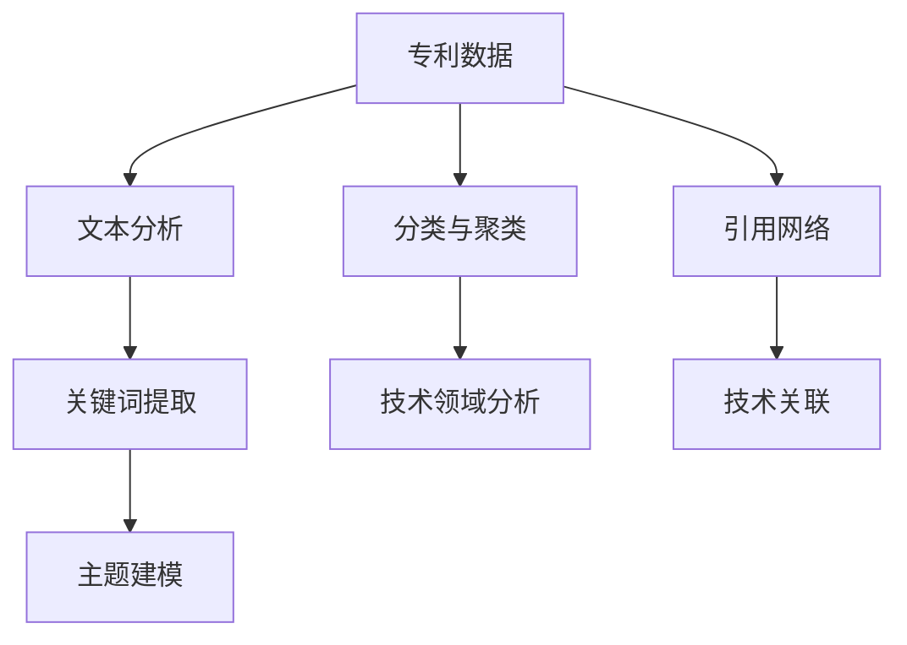
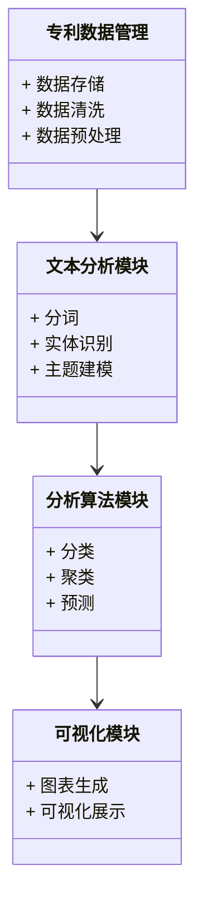
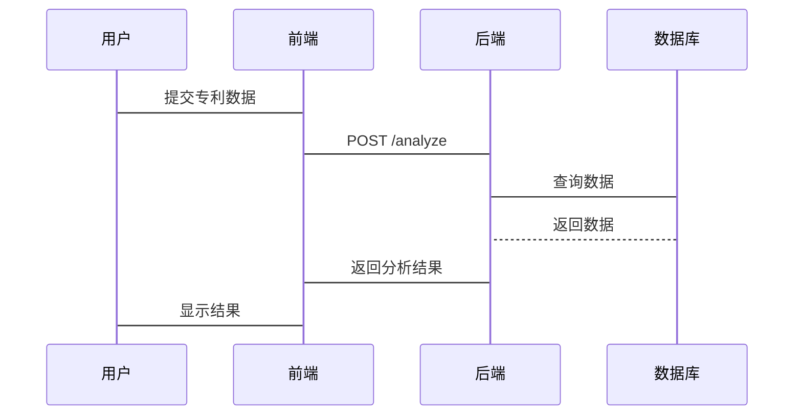

                 


# AI辅助专利分析与技术趋势预测的方法与工具

> 关键词：AI, 专利分析, 技术趋势预测, 自然语言处理, 机器学习, 深度学习

> 摘要：  
本文系统地探讨了AI在专利分析与技术趋势预测中的应用，从核心概念、算法原理到系统架构设计，再到项目实战，详细阐述了如何利用AI技术高效地进行专利数据分析与技术趋势预测。文章结合理论与实践，为读者提供了从入门到进阶的完整指南。

---

## 第一部分: AI辅助专利分析与技术趋势预测的背景与核心概念

### 第1章: 专利分析与技术趋势预测的背景

#### 1.1 专利分析的基本概念
- **1.1.1 专利的基本概念与分类**
  - 专利的定义与类型（发明专利、实用新型专利、外观设计专利）。
  - 专利分析的意义：揭示技术发展动态、企业竞争策略、技术空白点等。
- **1.1.2 专利分析的定义与作用**
  - 专利分析的定义：通过对专利数据的整理、挖掘和分析，提取有价值的技术信息。
  - 专利分析的作用：支持技术研发、市场竞争分析、知识产权保护等。
- **1.1.3 技术趋势预测的重要性**
  - 技术趋势预测的方法：基于专利数据的定量分析与定性研究。
  - 技术趋势预测的挑战：数据的复杂性、技术发展的不确定性。

#### 1.2 AI在专利分析中的应用
- **1.2.1 AI技术如何辅助专利分析**
  - 自然语言处理（NLP）：提取专利文本中的关键词、主题。
  - 机器学习：分类、聚类、预测。
  - 深度学习：生成专利摘要、识别技术趋势。
- **1.2.2 AI在专利数据处理中的优势**
  - 高效性：快速处理海量专利数据。
  - 准确性：基于大数据分析，提高结果的可靠性。
  - 创新性：发现潜在的技术关联和趋势。
- **1.2.3 技术趋势预测的AI方法**
  - 基于时间序列的预测模型（如ARIMA、LSTM）。
  - 基于主题建模的技术趋势分析（如LDA）。

#### 1.3 本章小结
- 介绍了专利分析的基本概念及其在技术趋势预测中的重要性。
- 展述了AI技术在专利分析中的核心作用，为后续章节奠定了基础。

---

## 第2章: AI辅助专利分析的核心概念

### 2.1 专利数据分析的关键要素
#### 2.1.1 专利数据的结构与属性
- 专利号、申请日期、申请人、发明人、专利分类号（IPC分类）、专利摘要、权利要求书等。
- 数据清洗：去重、格式统一、缺失值处理。
- 数据预处理：文本分词、向量化。

#### 2.1.2 专利分类与技术领域
- 国际专利分类（IPC）与美国专利分类（USPC）。
- 专利分类与技术领域的映射关系。
- 技术领域的动态变化与分析。

#### 2.1.3 专利引用与技术关联
- 专利引用网络的构建。
- 技术关联分析：通过引用关系挖掘技术演变路径。

### 2.2 AI技术在专利分析中的应用领域
#### 2.2.1 自然语言处理（NLP）在专利文本分析中的应用
- **文本挖掘**：提取专利文本中的关键词、主题。
- **情感分析**：分析专利文本中的技术评价（未深入应用，但可探索）。
- **文本生成**：基于专利数据生成技术报告或摘要。

#### 2.2.2 机器学习在专利分类与聚类中的应用
- **分类**：将专利按技术领域或IPC分类。
- **聚类**：发现技术热点领域或新兴技术。
- **推荐系统**：基于专利数据推荐相关技术或专利。

#### 2.2.3 深度学习在专利生成与预测中的应用
- **专利生成**：基于现有专利数据生成新的技术方案。
- **趋势预测**：利用深度学习模型预测未来的技术发展方向。
- **关联分析**：挖掘专利之间的隐含关系。

#### 2.2.4 其他AI技术（如知识图谱）
- 构建专利知识图谱，关联技术、企业和研究人员。

### 2.3 核心概念的Mermaid图示


#### 2.3 本章小结
- 详细阐述了专利数据分析的关键要素，包括数据结构、分类、引用关系等。
- 展示了AI技术在专利分析中的多领域应用，构建了核心概念的Mermaid图。

---

## 第3章: 基于NLP的专利文本分析方法

### 3.1 专利文本分析的NLP基础
#### 3.1.1 专利文本的特征与挑战
- 文本长度不一：从几句话到数十页不等。
- 专业术语密集：技术领域差异大。
- 数据清洗困难：格式多样、噪声较多。

#### 3.1.2 分词与实体识别在专利分析中的应用
- 分词：将专利文本分割成词语或短语。
- 实体识别：识别专利中的技术实体（如技术名称、设备名称）。
- 基于词嵌入的向量化：Word2Vec、GloVe。

#### 3.1.3 语义理解在专利摘要分析中的应用
- 基于BERT的摘要理解。
- 摘要提取：提取专利的核心技术点。

### 3.2 基于NLP的专利文本分析算法
#### 3.2.1 基于TF-IDF的关键词提取
- TF-IDF公式：$TF = \frac{\text{词频}}{\text{文档总数}}$, $IDF = \log\left(\frac{\text{文档总数}}{\text{词出现的文档数}}\right)$。
- 示例代码：
  ```python
  from sklearn.feature_extraction.text import TfidfVectorizer
  vectorizer = TfidfVectorizer()
  tfidf = vectorizer.fit_transform(texts)
  ```

#### 3.2.2 基于Word2Vec的专利文本向量化
- Word2Vec模型训练：将专利文本中的词语映射为向量。
- 示例代码：
  ```python
  from gensim.models import Word2Vec
  model = Word2Vec(sentences, vector_size=100, window=5, min_count=1, workers=4)
  ```

#### 3.2.3 基于BERT的专利文本深度分析
- BERT模型的应用：文本摘要、关键词提取。
- 示例代码：
  ```python
  import transformers
  tokenizer = transformers.BertTokenizer.from_pretrained('bert-base-uncased')
  model = transformers.BertForMaskedLanguageModeling.from_pretrained('bert-base-uncased')
  ```

### 3.3 本章小结
- 介绍了基于NLP的专利文本分析方法，包括分词、实体识别、关键词提取和深度语义分析。
- 提供了具体的算法实现代码示例，帮助读者理解NLP技术在专利分析中的应用。

---

## 第4章: 专利数据分析的机器学习方法

### 4.1 专利分类与聚类的机器学习模型
#### 4.1.1 基于K-means的专利技术领域聚类
- K-means算法步骤：
  1. 初始化质心。
  2. 计算每个样本到质心的距离。
  3. 重新计算质心，直到收敛。
- 示例代码：
  ```python
  from sklearn.cluster import KMeans
  kmeans = KMeans(n_clusters=5, random_state=0)
  labels = kmeans.fit_predict(data)
  ```

#### 4.1.2 基于SVM的专利分类算法
- SVM算法原理：寻找最优超平面，最大化类别间隔。
- 示例代码：
  ```python
  from sklearn import svm
  clf = svm.SVC(kernel='linear')
  clf.fit(X, y)
  ```

#### 4.1.3 基于随机森林的专利分类模型
- 随机森林优势：特征重要性分析。
- 示例代码：
  ```python
  from sklearn.ensemble import RandomForestClassifier
  clf = RandomForestClassifier(n_estimators=100, random_state=0)
  clf.fit(X, y)
  ```

### 4.2 专利趋势预测的回归分析方法
#### 4.2.1 时间序列分析在专利趋势预测中的应用
- 时间序列预测模型：ARIMA、Prophet。
- 示例代码：
  ```python
  from statsmodels.tsa.arima_model import ARIMA
  model = ARIMA(train, order=(5,1,0))
  model_fit = model.fit(disp=0)
  ```

#### 4.2.2 基于LSTM的专利趋势预测模型
- LSTM网络结构：遗忘门、输入门、输出门。
- 示例代码：
  ```python
  import keras
  model = keras.models.Sequential()
  model.add(keras.layers.LSTM(128, input_shape=(timesteps, features)))
  model.add(keras.layers.Dense(1))
  model.compile(loss='mean_squared_error', optimizer='adam')
  ```

### 4.3 本章小结
- 介绍了机器学习在专利分类与趋势预测中的应用，包括K-means、SVM、随机森林和LSTM等算法。
- 提供了具体的代码实现示例，帮助读者理解机器学习模型的应用。

---

## 第5章: 系统分析与架构设计

### 5.1 问题场景介绍
- 专利数据分析系统的功能需求：数据采集、清洗、分析、可视化。
- 系统目标：构建一个基于AI的专利分析平台，支持用户进行技术趋势预测和专利检索。

### 5.2 系统功能设计
#### 5.2.1 领域模型（Mermaid类图）


### 5.3 系统架构设计
#### 5.3.1 系统架构（Mermaid架构图）
```mermaid
subgraph 前端
    front-end
end
subgraph 后端
    back-end
    数据库
end
front-end --> back-end
back-end --> 数据库
```

#### 5.3.2 系统接口设计
- API接口：RESTful API设计。
- 接口示例：
  - POST /analyze 接收专利数据，返回分析结果。
  - GET /trend 获取技术趋势预测结果。

#### 5.3.3 系统交互（Mermaid序列图）


### 5.4 本章小结
- 介绍了专利数据分析系统的功能需求和系统架构设计。
- 使用Mermaid图展示了系统的模块划分、接口设计和交互流程。

---

## 第6章: 项目实战——基于AI的专利分析系统实现

### 6.1 环境安装与配置
- Python版本：Python 3.8+。
- 需要的库：
  - `scikit-learn`、`gensim`、`tensorflow`、`keras`、`transformers`、`pandas`、`numpy`。
- 安装命令：
  ```bash
  pip install scikit-learn gensim tensorflow keras transformers pandas numpy
  ```

### 6.2 核心实现代码
#### 6.2.1 数据预处理代码
```python
import pandas as pd
import numpy as np

def preprocess_patents(patents_df):
    # 假设patents_df是包含专利数据的DataFrame
    # 这里进行数据清洗、分词、向量化等处理
    return processed_data
```

#### 6.2.2 基于BERT的主题建模代码
```python
from transformers import BertTokenizer, BertModel
import torch

def bert_topic_modeling(texts):
    tokenizer = BertTokenizer.from_pretrained('bert-base-uncased')
    model = BertModel.from_pretrained('bert-base-uncased')
    # 这里进行主题建模的具体实现
    return topics
```

#### 6.2.3 LSTM预测模型代码
```python
import keras
from keras.layers import LSTM, Dense

def lstm_predict_model():
    model = keras.Sequential()
    model.add(LSTM(128, input_shape=(timesteps, features)))
    model.add(Dense(1))
    model.compile(loss='mean_squared_error', optimizer='adam')
    return model
```

### 6.3 项目实战分析
- 数据来源：公开专利数据库（如USPTO）。
- 案例分析：分析人工智能领域的专利趋势。
- 实验结果：通过可视化展示技术热点和未来趋势。

### 6.4 项目小结
- 介绍了项目的整体实现过程，从环境配置到核心代码实现。
- 提供了实际案例分析，展示了AI技术在专利分析中的应用效果。

---

## 第7章: 最佳实践与总结

### 7.1 最佳实践
- 数据预处理：清洗、去重、格式统一。
- 模型选择：根据具体任务选择合适的算法。
- 结果可视化：直观展示分析结果。

### 7.2 小结
- 本文系统地介绍了AI在专利分析与技术趋势预测中的应用。
- 从理论到实践，详细讲解了核心算法和系统架构设计。

### 7.3 注意事项
- 数据隐私：注意专利数据的隐私保护。
- 模型优化：持续优化模型以适应技术发展。
- 可解释性：确保分析结果的可解释性。

### 7.4 拓展阅读
- 《专利分析的实用方法》。
- 《深度学习在NLP中的应用》。
- 《时间序列分析的高级方法》。

---

## 结语
本文从专利分析的背景出发，详细探讨了AI技术在专利分析与技术趋势预测中的应用，结合理论与实践，为读者提供了从入门到进阶的完整指南。通过本文的学习，读者可以掌握如何利用AI技术高效地进行专利数据分析，并预测技术发展趋势。

