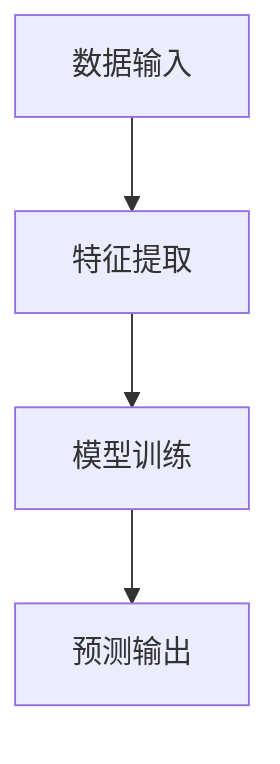
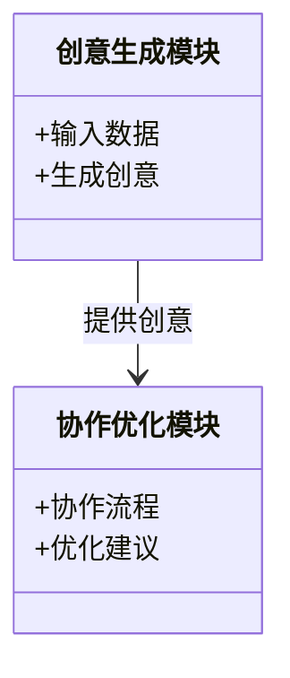
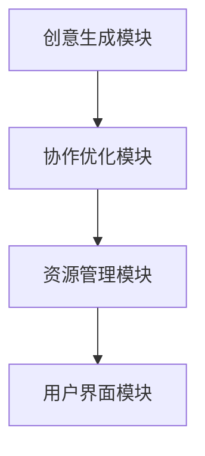

                 


# 第一部分：AI辅助企业创新文化建设的背景与概念

# 第1章：AI辅助企业创新文化建设的背景与问题背景

## 1.1 企业创新文化建设的重要性

### 1.1.1 企业创新文化的定义与内涵

企业创新文化是指企业在经营过程中，鼓励员工提出新想法、新方法，推动技术和管理创新的一种组织文化。它强调开放性、协作性和创造性，是企业保持竞争力的重要因素。

### 1.1.2 传统企业创新文化建设的挑战

传统企业创新文化在实践中面临以下挑战：

1. **创意激发不足**：员工缺乏创新动力，企业内部缺乏有效的激励机制。
2. **协作效率低下**：跨部门协作流程复杂，信息流通不畅，导致创新效率低。
3. **资源浪费**：创意从提出到实施过程中，常常因为沟通不畅或资源分配不当而导致浪费。

### 1.1.3 AI技术对企业创新文化的潜在影响

AI技术可以通过以下方式推动企业创新文化：

1. **智能创意激发**：通过自然语言处理和机器学习，AI可以帮助员工生成创意并提供灵感。
2. **协作效率提升**：AI可以优化协作流程，减少沟通障碍，提高团队协作效率。
3. **资源优化配置**：AI可以通过数据分析，优化资源分配，提升创新项目的成功率。

## 1.2 AI辅助企业创新文化建设的核心概念

### 1.2.1 AI辅助创新的定义

AI辅助创新是指利用人工智能技术，通过机器学习、自然语言处理、知识图谱等方法，辅助企业进行创意激发、协作优化和资源管理。

### 1.2.2 AI辅助创新的核心要素

以下是AI辅助创新的核心要素对比：

| 核心要素 | 传统创新 | AI辅助创新 |
|----------|-----------|------------|
| 创意激发 | 主要依赖员工个人能力 | 利用AI工具提供创意建议和灵感 |
| 协作效率 | 依赖人工沟通和协调 | AI优化协作流程，减少人为错误 |
| 资源管理 | 依赖人工分配和监控 | AI自动优化资源配置，提高效率 |

### 1.2.3 AI辅助创新的边界与外延

AI辅助创新的边界包括创意的产生和实施，而其外延则涉及企业内部的协作、资源管理和创新文化的整体构建。

## 1.3 本章小结

本章主要介绍了企业创新文化的重要性，以及AI技术如何通过辅助创意激发、协作优化和资源管理，推动企业创新文化的建设。通过对传统创新与AI辅助创新的对比，我们看到AI在提升创新效率和效果方面具有显著优势。

# 第2章：AI辅助创新的核心原理与算法

## 2.1 AI辅助创新的核心原理

### 2.1.1 机器学习在创新中的应用

机器学习通过分析历史数据，识别潜在的创新趋势和模式，为企业提供创新方向的建议。

### 2.1.2 自然语言处理在创新协作中的作用

自然语言处理技术可以解析员工提出的创意文本，提取关键词和主题，帮助团队更好地理解创意内容，促进协作。

### 2.1.3 知识图谱在创新资源整合中的应用

知识图谱可以整合企业内外部资源，建立创新资源的关联关系，为企业提供更全面的创新支持。

## 2.2 AI辅助创新的算法原理

### 2.2.1 机器学习算法的流程图



### 2.2.2 算法实现的Python代码示例

```python
def ai_innovation_algorithm(data):
    # 特征提取
    features = extract_features(data)
    # 模型训练
    model = train_model(features)
    # 预测输出
    prediction = predict(model, features)
    return prediction
```

## 2.3 本章小结

本章通过机器学习、自然语言处理和知识图谱等技术，详细阐述了AI辅助创新的核心原理和算法实现。通过对算法流程图和代码示例的分析，读者可以更好地理解AI如何在创新过程中发挥作用。

# 第3章：AI辅助创新的数学模型与公式

## 3.1 AI辅助创新的核心模型

### 3.1.1 创意生成模型

创意生成模型可以通过以下公式表示：

$$ P(创意|输入) = \frac{P(输入|创意) \cdot P(创意)}{P(输入)} $$

其中，创意是生成的创意，输入是触发创意生成的条件或数据。

### 3.1.2 协作优化模型

协作优化模型可以通过以下公式表示：

$$ E = \sum_{i=1}^{n} (权重_i \cdot 创意_i) $$

其中，E是协作效果，权重_i是创意_i的权重，创意_i是具体创意。

## 3.2 本章小结

本章通过数学模型和公式，详细分析了AI辅助创新的核心模型，包括创意生成模型和协作优化模型。这些模型为企业在创新过程中提供理论支持，帮助企业在实际操作中更好地应用AI技术。

# 第4章：AI辅助创新的系统分析与架构设计

## 4.1 系统分析

### 4.1.1 问题场景介绍

企业创新文化建设过程中，常常面临创意激发不足、协作效率低下和资源浪费等问题。

### 4.1.2 项目介绍

本项目旨在通过AI技术，构建一个智能化的企业创新支持系统，帮助企业在创新文化建设中实现创意激发、协作优化和资源管理。

## 4.2 系统功能设计

### 4.2.1 领域模型mermaid类图



### 4.2.2 系统架构设计mermaid架构图



## 4.3 本章小结

本章通过系统分析和架构设计，详细介绍了AI辅助创新支持系统的构建过程。通过对类图和架构图的分析，读者可以更好地理解系统各模块之间的关系和功能。

# 第5章：AI辅助创新的项目实战

## 5.1 环境安装

### 5.1.1 安装Python和相关库

```bash
pip install numpy
pip install scikit-learn
pip install spacy
```

## 5.2 系统核心实现源代码

### 5.2.1 创意生成模块代码

```python
import numpy as np
from sklearn.feature_extraction.text import TfidfVectorizer
from sklearn.decomposition import NMF

def generate_creative(input_text):
    vectorizer = TfidfVectorizer(max_features=1000)
    tfidf = vectorizer.fit_transform([input_text])
    model = NMF(n_components=5, random_state=42)
    nmf = model.fit_transform(tfidf)
    return nmf
```

### 5.2.2 协作优化模块代码

```python
import spacy

nlp = spacy.load("en_core_web_sm")
def optimize_collaboration(text):
    doc = nlp(text)
    keywords = [token.text for token in doc if token.is_stop is False]
    return keywords
```

## 5.3 代码应用解读与分析

### 5.3.1 创意生成模块解读

上述代码使用TF-IDF和NMF算法，从输入文本中提取关键词，生成创意。

### 5.3.2 协作优化模块解读

上述代码使用spaCy进行文本处理，提取关键词，优化协作流程。

## 5.4 案例分析和详细讲解

### 5.4.1 创意生成案例

输入文本：如何提高员工创新能力？

生成创意：
1. 建立创新培训机制
2. 提供创新奖励机制
3. 优化创新协作流程

## 5.5 本章小结

本章通过实际案例分析，详细讲解了AI辅助创新支持系统的实现过程，包括环境安装、代码实现和案例分析。

# 第6章：最佳实践与总结

## 6.1 最佳实践 tips

### 6.1.1 创意激发

1. 使用AI工具辅助员工生成创意
2. 提供创新奖励机制

### 6.1.2 协作优化

1. 优化协作流程
2. 使用AI工具提高协作效率

### 6.1.3 资源管理

1. 优化资源配置
2. 使用数据分析工具监控创新项目

## 6.2 小结

通过本文的详细讲解，我们了解了AI如何在企业创新文化建设中发挥重要作用。AI技术可以辅助企业激发创意、优化协作和管理资源，从而推动企业创新文化的建设。

## 6.3 注意事项

1. 在使用AI工具时，要注意数据隐私和安全问题。
2. 要定期评估和优化AI辅助创新系统。

## 6.4 拓展阅读

1. 《人工智能在企业管理中的应用》
2. 《创新管理：理论与实践》

# 附录

## 附录A：相关术语解释

1. **机器学习**：通过数据训练模型，使其能够进行预测或分类。
2. **自然语言处理**：处理和理解人类语言的技术。

## 附录B：参考文献

1. 刘军, 等. 人工智能与企业管理[M]. 北京: 清华大学出版社, 2020.

## 附录C：鸣谢

感谢参与本项目的所有人员。

---

# 结束语

希望通过本文的详细讲解，读者能够更好地理解AI在企业创新文化建设中的作用，并能够在实际工作中应用这些技术，推动企业的创新和发展。

