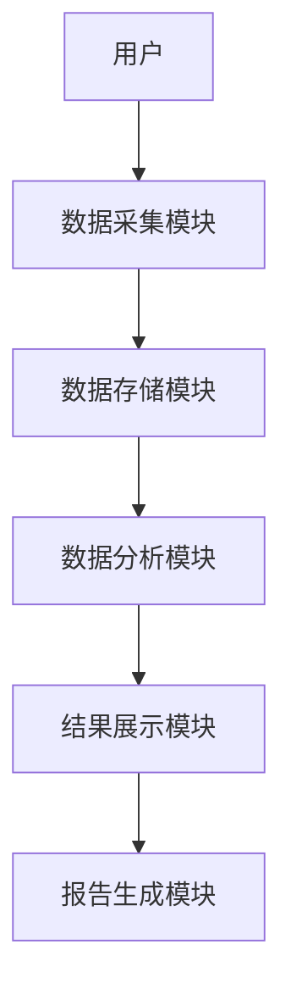
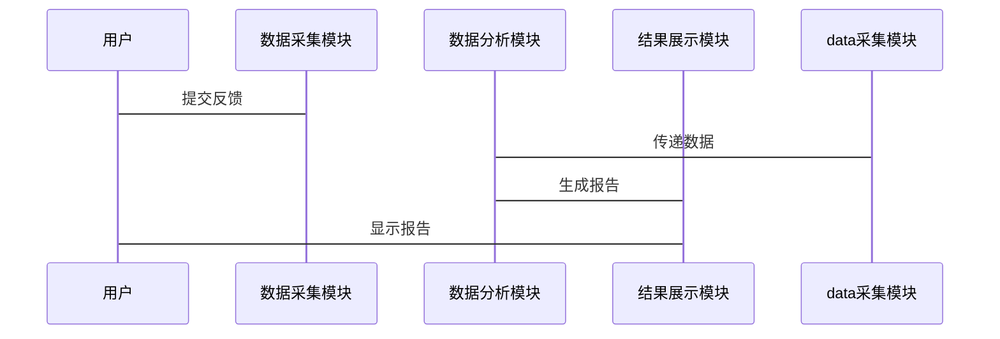

                 


# AI辅助企业创新文化评估：定量与定性指标分析

---

## 关键词：AI、企业创新文化、定量指标、定性指标、自然语言处理、机器学习

---

## 摘要：  
本文探讨了人工智能（AI）在企业创新文化评估中的应用，重点分析了定量与定性指标的结合方法。通过自然语言处理和机器学习技术，AI能够帮助企业从数据中提取关键信息，构建创新文化评估模型，并提供 actionable insights。本文结合实际案例和数学模型，详细阐述了AI在创新文化评估中的技术原理和应用价值。

---

# 第一部分：AI与企业创新文化评估基础

## 第1章：AI与企业创新文化概述

### 1.1 AI技术的基本概念

#### 1.1.1 人工智能的定义与核心原理  
人工智能（AI）是指通过计算机技术模拟人类智能的学科。其核心原理包括：  
- **学习**：通过数据训练模型，使其能够识别模式。  
- **推理**：基于已有知识进行逻辑推理。  
- **自然语言处理（NLP）**：理解并生成人类语言。  
- **计算机视觉**：识别和处理图像信息。  

#### 1.1.2 大模型在AI中的地位与作用  
大模型（如GPT、BERT等）通过海量数据训练，具备强大的语言理解和生成能力，能够帮助企业分析文本数据，提取关键信息。  

#### 1.1.3 企业创新文化的定义与特征  
企业创新文化是指企业在组织内部鼓励创新、促进知识共享和协作的文化氛围。其核心特征包括开放性、包容性和持续改进。

### 1.2 企业创新文化评估的重要性

#### 1.2.1 企业创新文化对企业发展的意义  
创新文化是企业保持竞争力的关键。它能够激发员工创造力，推动产品和服务的创新。  

#### 1.2.2 创新文化评估的必要性与挑战  
- **必要性**：通过评估发现问题，优化创新流程。  
- **挑战**：创新文化涉及主观因素，难以量化。  

#### 1.2.3 AI技术在创新文化评估中的优势  
AI能够通过数据驱动的方法，量化创新文化的多个维度，提供客观的评估结果。

---

## 第2章：AI辅助企业创新文化评估的核心概念

### 2.1 定量与定性指标分析的背景

#### 2.1.1 定量指标的定义与特点  
- **定义**：可量化的指标，如员工创新行为的频率。  
- **特点**：客观、可量化、易于比较。  

#### 2.1.2 定性指标的定义与特点  
- **定义**：不可量化的指标，如员工的创新态度。  
- **特点**：主观、难量化、需深度分析。  

#### 2.1.3 定量与定性指标的对比分析  
| 指标类型 | 定量指标 | 定性指标 |
|----------|----------|----------|
| 特点     | 客观、可量化 | 主观、难量化 |
| 应用场景 | 统计分析 | 深度访谈、文本分析 |

---

### 2.2 AI在创新文化评估中的核心作用

#### 2.2.1 数据采集与处理的自动化  
AI能够从企业文档、员工反馈等数据中提取信息，减少人工干预。  

#### 2.2.2 智能分析与决策支持  
通过机器学习模型，AI能够分析数据，提供创新文化评估的结果和建议。  

#### 2.2.3 评估结果的可视化与反馈  
AI生成可视化报告，帮助企业直观了解创新文化现状，并提供改进建议。

---

## 第3章：AI辅助企业创新文化评估的理论基础

### 3.1 企业创新文化评估的理论框架

#### 3.1.1 创新文化的构成要素  
- **创新氛围**：员工是否愿意尝试新事物。  
- **创新资源**：企业提供的资源支持。  
- **创新机制**：创新项目的管理流程。  

#### 3.1.2 评估模型的构建与优化  
- **模型构建**：基于因子分析构建评估模型。  
- **模型优化**：通过机器学习算法优化模型性能。  

#### 3.1.3 理论框架的适用性分析  
- **适用性**：适用于不同类型的企业。  
- **局限性**：需要结合企业的实际情况进行调整。

### 3.2 AI技术在评估中的应用原理

#### 3.2.1 自然语言处理（NLP）的核心原理  
NLP通过理解文本内容，提取关键词和情感倾向。  

#### 3.2.2 机器学习模型的训练与优化  
- **训练**：使用标注数据训练模型。  
- **优化**：通过交叉验证调整模型参数。  

#### 3.2.3 数据挖掘与分析的流程与方法  
- **数据清洗**：去除噪声数据。  
- **特征提取**：提取关键特征。  
- **模型训练**：训练分类或回归模型。  

---

# 第二部分：定量与定性指标分析

## 第4章：定量指标分析方法

### 4.1 数据采集与处理

#### 4.1.1 数据来源的多样性  
- **员工反馈**：通过问卷调查获取数据。  
- **项目记录**：分析创新项目的文档。  
- **绩效数据**：参考员工绩效指标。  

#### 4.1.2 数据清洗与预处理  
- **去重**：去除重复数据。  
- **填充缺失值**：使用均值或中位数填充。  
- **标准化**：将数据标准化到统一范围。  

### 4.2 统计分析与建模

#### 4.2.1 描述性统计分析  
- **均值**：计算指标的平均值。  
- **方差**：衡量指标的离散程度。  

#### 4.2.2 回归分析与预测模型  
- **线性回归**：建立指标之间的线性关系。  
- **逻辑回归**：预测二分类问题（如创新文化高/低）。  

#### 4.2.3 聚类分析与分类算法  
- **聚类分析**：将相似的企业分成同一类别。  
- **分类算法**：预测企业创新文化类型。  

### 4.3 可视化与结果解读

#### 4.3.1 数据可视化工具与方法  
- **折线图**：展示指标随时间的变化趋势。  
- **柱状图**：比较不同指标的数值。  

#### 4.3.2 结果解读与业务价值分析  
- **解读**：分析指标之间的相关性。  
- **价值**：为企业提供优化方向。  

#### 4.3.3 指标权重的动态调整  
- **动态调整**：根据业务需求调整指标权重。  

---

## 第5章：定性指标分析方法

### 5.1 文本分析与语义理解

#### 5.1.1 文本数据的获取与预处理  
- **获取**：收集员工反馈、会议记录等文本数据。  
- **预处理**：去除停用词、分词处理。  

#### 5.1.2 情感分析与关键词提取  
- **情感分析**：判断文本的情感倾向（正面、负面、中性）。  
- **关键词提取**：提取文本中的关键主题。  

#### 5.1.3 主题建模与语义分析  
- **主题建模**：识别文本的主题分布。  
- **语义分析**：理解文本的深层含义。  

### 5.2 定性指标的综合分析

#### 5.2.1 定性数据与定量数据的结合  
- **结合方法**：将定性数据转化为定量指标。  
- **优势**：提高评估的全面性。  

#### 5.2.2 深度访谈与焦点小组分析  
- **深度访谈**：通过访谈了解员工的真实想法。  
- **焦点小组**：分析小组讨论中的关键点。  

### 5.3 定性评估结果的可视化与应用

#### 5.3.1 可视化方法  
- **词云**：展示关键词的分布。  
- **主题树**：展示主题之间的关系。  

#### 5.3.2 应用场景  
- **优化创新文化**：根据分析结果调整企业策略。  
- **员工反馈**：针对员工需求提供支持。  

---

## 第6章：系统架构与实现

### 6.1 系统功能设计

#### 6.1.1 系统功能模块  
- **数据采集模块**：采集员工反馈、项目记录等数据。  
- **数据分析模块**：进行定量与定性分析。  
- **结果展示模块**：生成可视化报告。  

#### 6.1.2 系统功能流程  
1. 数据采集模块接收输入数据。  
2. 数据分析模块进行预处理和建模。  
3. 结果展示模块生成报告并反馈给用户。  

### 6.2 系统架构设计

#### 6.2.1 系统架构图  


#### 6.2.2 接口设计  
- **API接口**：提供数据接口供其他系统调用。  
- **数据接口**：支持多种数据格式的输入。  

### 6.3 系统交互设计

#### 6.3.1 交互流程图  


---

## 第7章：项目实战与案例分析

### 7.1 环境安装与配置

#### 7.1.1 系统环境  
- **操作系统**：Linux/Windows/MacOS  
- **编程语言**：Python 3.8+  
- **框架与库**：TensorFlow、PyTorch、NLTK  

#### 7.1.2 安装依赖  
```bash
pip install numpy pandas scikit-learn
pip install transformers
```

### 7.2 核心代码实现

#### 7.2.1 数据预处理代码  
```python
import pandas as pd
from sklearn.preprocessing import StandardScaler

# 加载数据
data = pd.read_csv('创新文化数据.csv')

# 删除缺失值
data = data.dropna()

# 标准化处理
scaler = StandardScaler()
data_scaled = scaler.fit_transform(data)
```

#### 7.2.2 模型训练代码  
```python
from sklearn.model import LinearRegression

# 训练模型
model = LinearRegression()
model.fit(X_train, y_train)

# 预测结果
y_pred = model.predict(X_test)
```

#### 7.2.3 可视化代码  
```python
import matplotlib.pyplot as plt

# 绘制散点图
plt.scatter(X, y, color='blue')
plt.plot(X, y_pred, color='red')
plt.xlabel('自变量')
plt.ylabel('因变量')
plt.show()
```

### 7.3 案例分析与解读

#### 7.3.1 案例背景  
某科技公司希望通过AI评估其创新文化。  

#### 7.3.2 数据分析  
通过定量分析发现，员工创新行为的频率与公司绩效呈正相关。  

#### 7.3.3 案例小结  
AI技术能够有效量化创新文化，为企业优化创新流程提供支持。  

---

## 第8章：总结与展望

### 8.1 总结

#### 8.1.1 核心观点回顾  
- AI技术能够量化创新文化中的定量与定性指标。  
- 综合分析能够提供更全面的评估结果。  

#### 8.1.2 本文的创新点  
- 结合定量与定性分析，构建了创新文化评估模型。  
- 使用AI技术优化了评估过程，提高了效率。  

### 8.2 展望

#### 8.2.1 未来发展趋势  
- 更多企业将采用AI技术进行创新文化评估。  
- 多模态分析将成为研究热点。  

#### 8.2.2 应用前景  
- AI技术将帮助企业更好地优化创新文化，提升竞争力。  

---

## 参考文献

（此处列出您参考的相关文献、书籍和在线资源）

---

通过本文的详细分析，您可以了解到AI技术在企业创新文化评估中的应用，以及如何通过定量与定性指标的结合，构建高效的评估模型。希望本文的内容对您有所帮助！

