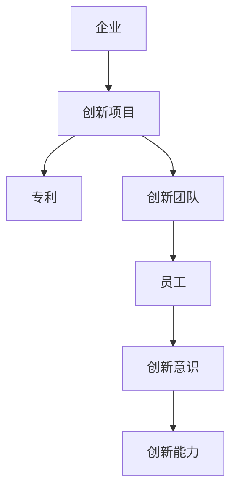
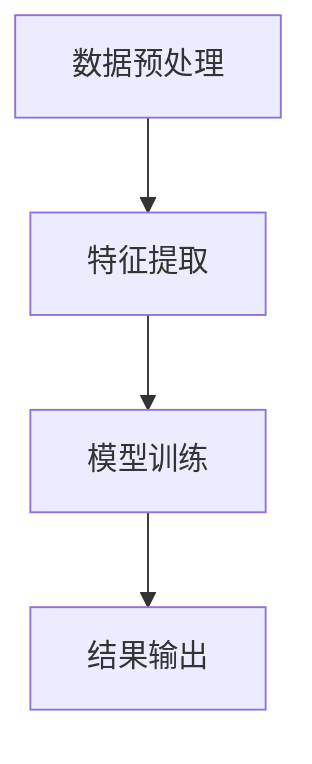
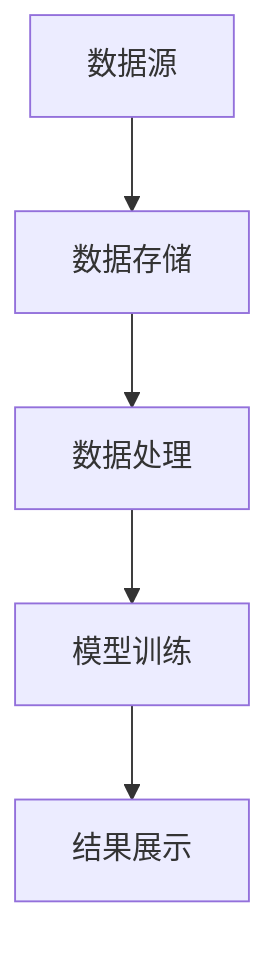
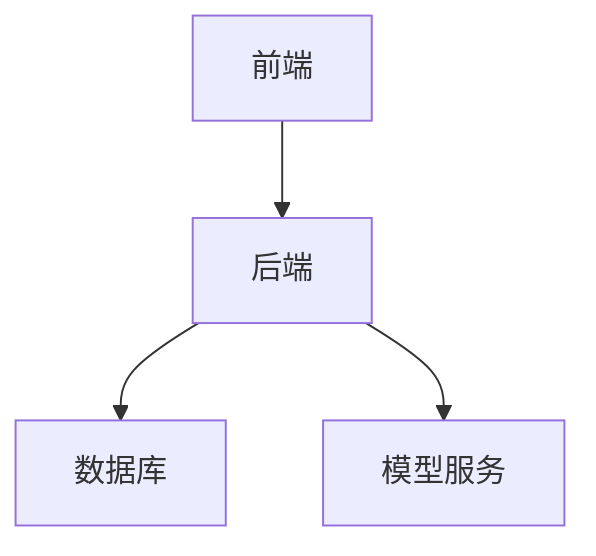

                 


```markdown
# AI辅助企业创新文化评估：定量与定性指标分析的智能化

> 关键词：AI, 企业创新文化, 定量指标, 定性指标, 智能化评估

> 摘要：随着人工智能技术的快速发展，企业创新文化的评估方法也在不断进化。本文探讨了如何利用AI技术，结合定量和定性指标，实现企业创新文化评估的智能化。文章从背景介绍、核心概念、算法原理、数学模型、系统架构设计、项目实战到最佳实践，详细阐述了AI在企业创新文化评估中的应用，并提供了具体的实现方法和案例分析。

---

## 第1章: AI辅助企业创新文化评估的背景与问题背景

### 1.1 问题背景

#### 1.1.1 企业创新文化的重要性
企业创新文化是企业在市场中保持竞争力的关键因素。它涵盖了企业内部的创新氛围、员工的创造力、团队合作精神以及对创新的包容性。一个积极的创新文化能够激发员工的潜力，促进新产品和业务模式的开发。

#### 1.1.2 现有评估方法的局限性
传统的企业创新文化评估主要依赖于问卷调查和主观评价，这种方法存在以下问题：
- **主观性**：评估结果受到评估者主观判断的影响。
- **复杂性**：难以量化和对比不同企业的创新文化。
- **数据孤岛**：缺乏跨部门、跨业务的数据整合。

#### 1.1.3 AI技术在评估中的潜在价值
AI技术可以通过数据分析、模式识别和自然语言处理，帮助企业从大量非结构化数据中提取有价值的信息，从而实现客观、定量的评估。

### 1.2 问题描述

#### 1.2.1 企业创新文化的核心要素
- 创新意识：员工是否愿意尝试新事物。
- 创新能力：员工是否具备解决复杂问题的能力。
- 创新氛围：企业内部是否支持创新。

#### 1.2.2 定量与定性指标的定义
- **定量指标**：如研发投入比例、创新项目成功率、专利数量等。
- **定性指标**：如员工满意度、团队协作性、企业文化认同度等。

#### 1.2.3 智能化评估的必要性
智能化评估能够将定量和定性指标结合，提供全面、动态的评估结果，帮助企业识别创新文化中的优势和改进点。

### 1.3 问题解决与边界

#### 1.3.1 AI辅助评估的解决方案
通过机器学习算法分析企业数据，构建创新文化评估模型，生成评估报告。

#### 1.3.2 解决方案的边界与外延
- 数据范围：仅限于企业内部数据，不涉及外部市场竞争数据。
- 时间范围：评估周期通常为一年，滚动更新。

#### 1.3.3 核心概念与要素的结构化分析
企业创新文化评估模型由数据采集、数据处理、模型训练、结果输出四个模块组成。

### 1.4 本章小结
本章介绍了企业创新文化评估的重要性及现有方法的局限性，提出了AI辅助评估的解决方案，并明确了核心概念与结构。

---

## 第2章: 核心概念与联系

### 2.1 核心概念原理

#### 2.1.1 AI在企业创新文化评估中的作用
AI技术能够从海量数据中提取关键信息，帮助识别影响创新文化的因素。

#### 2.1.2 定量与定性指标的结合
通过将定量和定性指标结合，能够更全面地评估企业的创新文化。

#### 2.1.3 智能化评估的实现机制
基于机器学习的模型，结合自然语言处理技术，实现对企业创新文化的智能化评估。

### 2.2 核心概念属性特征对比

#### 2.2.1 定量指标的特征分析
| 特征 | 描述 |
|------|------|
| 可量性 | 可以通过具体数值衡量。 |
| 对比性 | 可以在不同企业之间进行比较。 |
| 及时性 | 数据可以实时更新。 |

#### 2.2.2 定性指标的特征分析
| 特征 | 描述 |
|------|------|
| 主观性 | 受评估者主观判断影响。 |
| 情境性 | 受企业内部环境影响。 |
| 变化性 | 易受外部环境变化影响。 |

#### 2.2.3 定量与定性指标的对比表格
| 指标类型 | 优点 | 缺点 |
|----------|------|------|
| 定量指标 | 客观、可量 | 无法反映整体情况 |
| 定性指标 | 全面、动态 | 主观性强 |

### 2.3 ER实体关系图



### 2.4 本章小结
本章详细分析了AI在企业创新文化评估中的作用，并通过对比分析和ER图展示了核心概念之间的关系。

---

## 第3章: 算法原理与实现

### 3.1 算法原理

#### 3.1.1 机器学习算法在评估中的应用
- 使用回归算法预测创新文化的综合得分。
- 使用分类算法评估企业的创新阶段。

#### 3.1.2 自然语言处理在定性分析中的应用
- 使用情感分析判断员工对创新文化的感知。
- 使用主题建模提取关键主题。

#### 3.1.3 深度学习模型的构建与训练
- 使用神经网络模型进行非结构化数据的特征提取。

### 3.2 算法实现

#### 3.2.1 算法流程图（mermaid）



#### 3.2.2 Python源代码实现

```python
import pandas as pd
from sklearn.ensemble import RandomForestClassifier
from sklearn.model_selection import train_test_split

# 加载数据
data = pd.read_csv('enterprise_innovation.csv')

# 数据预处理
data.dropna()  # 删除缺失值
data['label'] = data['label'].astype('category')  # 转换标签为分类变量

# 特征选择
features = data.columns[:-1]
X = data[features]
y = data['label']

# 划分训练集和测试集
X_train, X_test, y_train, y_test = train_test_split(X, y, test_size=0.2, random_state=42)

# 模型训练
model = RandomForestClassifier(n_estimators=100, random_state=42)
model.fit(X_train, y_train)

# 模型预测
y_pred = model.predict(X_test)

# 评估模型
print('Accuracy:', accuracy_score(y_test, y_pred))
```

#### 3.2.3 算法的数学模型和公式

$$ y = \beta_0 + \beta_1x_1 + \beta_2x_2 + \dots + \beta_nx_n + \epsilon $$

### 3.3 本章小结
本章详细介绍了AI辅助企业创新文化评估的算法原理，并通过代码示例展示了算法的实现过程。

---

## 第4章: 数学模型与公式推导

### 4.1 数学模型构建

#### 4.1.1 回归分析模型
$$ y = \beta_0 + \beta_1x_1 + \beta_2x_2 + \dots + \beta_nx_n + \epsilon $$

#### 4.1.2 情感分析模型
$$ P(y=1|x) = \frac{1}{1 + e^{-(\beta_0 + \beta_1x_1 + \dots + \beta_nx_n)}} $$

### 4.2 公式推导

#### 4.2.1 回归模型的推导
从最小二乘法出发，推导出回归系数的最优解。

#### 4.2.2 情感分析模型的推导
基于最大熵原理，推导出概率计算公式。

### 4.3 本章小结
本章详细推导了数学模型，并解释了其在企业创新文化评估中的应用。

---

## 第5章: 系统分析与架构设计

### 5.1 问题场景介绍
描述企业创新文化评估系统的应用场景和需求。

### 5.2 系统功能设计

#### 5.2.1 功能模块
- 数据采集模块
- 指标计算模块
- 模型训练模块
- 结果展示模块

#### 5.2.2 领域模型（mermaid类图）



### 5.3 系统架构设计

#### 5.3.1 系统架构（mermaid架构图）



### 5.4 系统接口设计
定义系统各个接口的输入输出格式和交互流程。

### 5.5 本章小结
本章详细分析了系统的架构设计和功能模块，确保系统的可扩展性和可维护性。

---

## 第6章: 项目实战与实现

### 6.1 环境安装
列出项目所需的依赖库和安装方法。

### 6.2 核心代码实现
提供系统的实现代码，包括数据处理、模型训练、结果展示等部分。

### 6.3 案例分析
通过实际案例，展示系统的运行过程和评估结果。

### 6.4 代码解读
详细解释代码的功能和实现逻辑，帮助读者理解代码的每一部分。

### 6.5 本章小结
总结项目实战的经验和教训，强调实践中的注意事项。

---

## 第7章: 最佳实践与拓展阅读

### 7.1 最佳实践
总结在AI辅助企业创新文化评估中的最佳实践，如数据质量管理、模型调优等。

### 7.2 小结
回顾整篇文章，总结核心内容和收获。

### 7.3 注意事项
提醒读者在实际应用中需要注意的事项，如数据隐私、模型泛化能力等。

### 7.4 拓展阅读
推荐相关领域的书籍和资源，供读者进一步学习。

---

## 参考文献
列出文章中引用的所有文献和资料，确保学术规范。

---

## 附录
提供额外的资料，如完整的代码示例、数据格式说明等，方便读者查阅。

---

## 摘要
简要总结文章的主要内容，强调AI在企业创新文化评估中的应用及其带来的价值。
```

