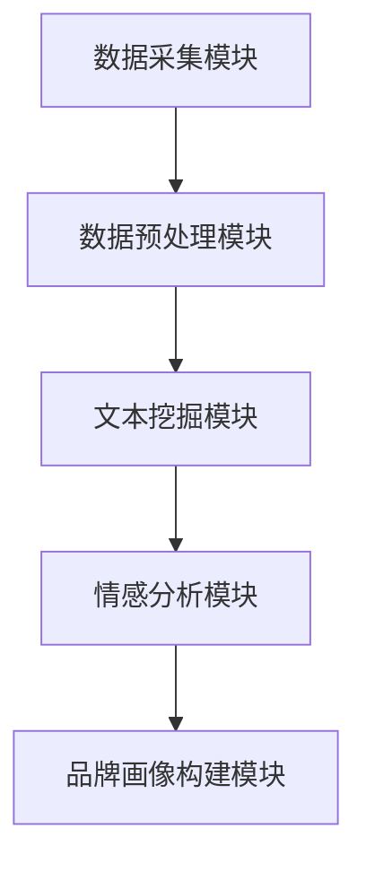

                 


# AI辅助企业品牌定位与差异化战略制定

> 关键词：人工智能、品牌定位、差异化战略、文本挖掘、情感分析、用户画像、算法模型

> 摘要：本文将详细探讨人工智能技术如何辅助企业进行品牌定位与差异化战略的制定。通过分析AI技术的核心原理及其在品牌定位中的应用，结合实际案例，介绍如何利用AI算法和系统架构来优化品牌定位和制定有效的差异化战略。本文将涵盖从理论基础到技术实现，再到项目实战的全过程，为企业提供一套基于AI的品牌定位与差异化战略制定的完整解决方案。

---

## 第1章：引言

### 1.1 AI在企业战略中的重要性
#### 1.1.1 人工智能技术的发展与应用
人工智能（AI）作为一项颠覆性技术，正在改变各个行业的商业模式和运营方式。从数据分析到决策支持，AI技术为企业提供了前所未有的洞察力和效率提升。特别是在品牌定位和差异化战略领域，AI的应用为企业提供了更精准、更高效的解决方案。

#### 1.1.2 企业品牌定位与差异化战略的核心意义
品牌定位是企业在市场中找到独特位置的过程，而差异化战略则是通过提供独特的产品或服务来吸引目标客户。在竞争日益激烈的市场环境中，准确的品牌定位和有效的差异化战略是企业成功的关键。

#### 1.1.3 AI如何赋能品牌定位与差异化战略
AI技术通过大数据分析、自然语言处理和机器学习等技术，帮助企业从海量数据中提取有价值的信息，从而优化品牌定位和差异化战略的制定过程。AI不仅提高了决策的效率，还为企业提供了更精准的市场洞察。

---

## 第2章：AI辅助品牌定位的理论基础

### 2.1 品牌定位的核心要素
#### 2.1.1 品牌定位的定义与目标
品牌定位是指确定品牌在目标客户心智中的位置。其目标是通过独特的价值主张和品牌形象，吸引目标客户并建立长期的竞争优势。

#### 2.1.2 品牌定位的关键维度
品牌定位的核心维度包括目标客户、品牌价值、品牌个性和品牌主张。这些维度共同决定了品牌在市场中的位置。

#### 2.1.3 品牌定位与企业战略的关系
品牌定位是企业战略的重要组成部分。通过准确的品牌定位，企业可以制定出与之匹配的市场进入策略、产品开发策略和营销策略。

### 2.2 AI在品牌定位中的作用
#### 2.2.1 数据驱动的品牌定位方法
AI技术通过大数据分析，帮助企业从海量数据中提取客户行为、市场趋势和竞争对手的信息，从而支持品牌定位的决策。

#### 2.2.2 品牌画像的构建与分析
基于AI的文本挖掘和情感分析技术，企业可以构建品牌画像，全面了解目标客户的需求、偏好和痛点。

#### 2.2.3 AI如何提升品牌定位的精准性
通过机器学习算法，AI可以分析客户的语言习惯、购买行为和社交媒体互动，从而帮助企业更精准地定位品牌目标客户。

---

## 第3章：AI辅助品牌定位的技术实现

### 3.1 基于文本挖掘的品牌定位
#### 3.1.1 文本挖掘的基本原理
文本挖掘是从大量文本数据中提取有用信息的过程。通过自然语言处理（NLP）技术，AI可以从客户的评论、社交媒体帖子和产品评价中提取关键词和主题。

#### 3.1.2 品牌关键词提取与主题建模
使用TF-IDF算法提取品牌相关的关键词，并通过主题建模技术（如LDA）识别品牌的核心主题。

#### 3.1.3 品牌定位的文本分析案例
通过Python代码实现文本挖掘，提取品牌相关的关键词和主题。

```python
from sklearn.feature_extraction.text import TfidfVectorizer
from sklearn.decomposition import LatentDirichletAllocation

# 示例文本数据
texts = ["品牌A的产品非常优质，价格合理。",
         "品牌B的服务态度非常好，值得推荐。",
         "品牌C的设计独特，符合年轻消费者的审美。"]

# 计算TF-IDF
tfidf = TfidfVectorizer(max_features=10)
tfidf_matrix = tfidf.fit_transform(texts)

# 主题建模
lda = LatentDirichletAllocation(n_components=3)
lda.fit(tfidf_matrix)

# 提取主题
for topic in lda.components_:
    print(tfidf.get_feature_names()[topic.argsort()[::-1][:5]])
```

---

## 第4章：AI辅助差异化战略的制定

### 4.1 基于竞争对手分析的差异化策略
#### 4.1.1 竞争对手分析的AI方法
通过爬取竞争对手的网站、社交媒体和产品评价，利用自然语言处理技术进行情感分析，识别竞争对手的优势和劣势。

#### 4.1.2 基于客户反馈的差异化策略设计
通过分析客户的评论和反馈，识别客户的需求痛点，并制定针对性的差异化策略。

#### 4.1.3 AI驱动的差异化战略执行方案
结合品牌定位和竞争对手分析的结果，制定个性化的差异化战略，并通过机器学习模型预测策略的实施效果。

---

## 第5章：AI算法在品牌定位中的应用

### 5.1 基于深度学习的文本相似度计算
#### 5.1.1 余弦相似度的计算公式
$$ \text{相似度} = \frac{\vec{A} \cdot \vec{B}}{|\vec{A}| \times |\vec{B}|} $$

#### 5.1.2 基于Word2Vec的文本向量化
通过Word2Vec将文本转化为向量表示，从而计算文本的相似度。

#### 5.1.3 基于BERT的文本相似度计算
使用预训练的BERT模型计算文本的相似度，提升文本分析的准确性和深度。

---

## 第6章：系统架构与实现

### 6.1 品牌定位系统的架构设计
#### 6.1.1 系统功能模块
- 数据采集模块
- 数据预处理模块
- 文本挖掘模块
- 情感分析模块
- 品牌画像构建模块

#### 6.1.2 系统架构图


---

## 第7章：项目实战

### 7.1 品牌定位与差异化战略的案例分析
#### 7.1.1 项目背景
假设一家科技公司希望利用AI技术优化其品牌定位和制定差异化战略。

#### 7.1.2 项目实施步骤
- 数据采集与清洗
- 文本挖掘与主题建模
- 竞争对手分析与差异化策略设计
- 系统实现与效果评估

#### 7.1.3 项目总结
通过AI技术辅助品牌定位和差异化战略的制定，企业能够更精准地识别目标客户，制定更具竞争力的市场策略。

---

## 第8章：最佳实践与小结

### 8.1 最佳实践
- 数据质量是AI分析的基础，确保数据的完整性和准确性。
- 组合使用多种AI技术（如文本挖掘、情感分析和聚类分析）以提升品牌定位的精准性。
- 定期更新和优化AI模型，以适应市场的变化和客户需求的变化。

### 8.2 小结
AI技术为企业品牌定位与差异化战略的制定提供了强大的工具和方法。通过本文的探讨和案例分析，读者可以全面了解如何利用AI技术优化品牌定位和制定有效的差异化战略，从而在激烈的市场竞争中占据优势地位。

---

# 结语

通过本文的详细讲解，读者可以系统地了解AI技术在品牌定位与差异化战略中的应用。从理论基础到技术实现，再到项目实战，本文提供了一套完整的解决方案。希望本文能够为企业的品牌建设和市场竞争提供有益的指导和启示。

