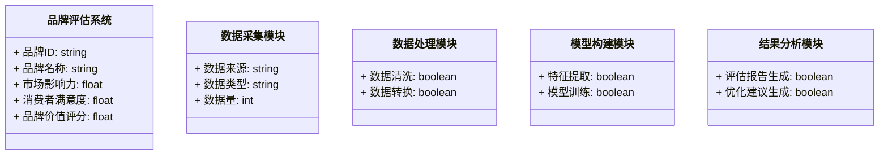
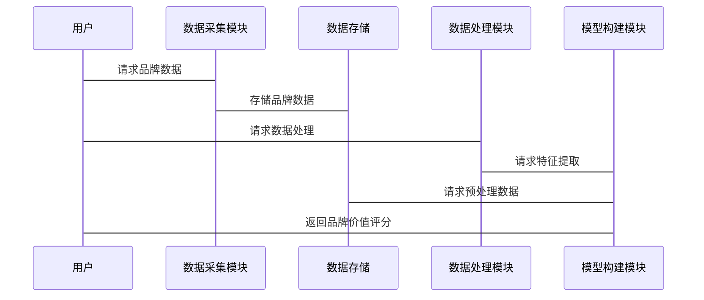

                 


# AI辅助企业品牌资产评估：多维度品牌价值量化

## 关键词：
AI技术，品牌资产评估，多维度分析，价值量化，数据驱动

## 摘要：
本文将探讨如何利用人工智能技术对企业品牌价值进行多维度量化评估。通过分析品牌的核心要素和AI技术的应用，提出一套基于数据驱动的品牌价值评估方法。结合文本相似度计算、品牌舆情分析、回归分析等算法，构建品牌价值预测模型。通过实际案例分析，展示如何在企业品牌管理中应用这些技术，实现品牌价值的高效评估和优化。

---

## 第一部分: 背景介绍

### 第1章: 问题背景与核心概念

#### 1.1 问题背景

- **1.1.1 传统品牌资产评估的局限性**
  - 传统品牌评估主要依赖主观判断和经验分析，难以量化品牌的核心价值。
  - 数据来源单一，缺乏实时性和全面性。
  - 无法有效捕捉市场动态和消费者行为的变化。

- **1.1.2 AI技术在品牌评估中的潜力**
  - AI技术能够从海量数据中提取关键信息，提供客观、量化的品牌价值评估。
  - 利用自然语言处理和机器学习算法，自动分析品牌舆情、市场反馈和消费者行为数据。
  - 通过多维度数据融合，实现品牌价值的精准预测和动态评估。

- **1.1.3 企业品牌价值量化的重要性**
  - 品牌价值是企业核心竞争力的重要组成部分。
  - 量化品牌价值能够为企业制定战略决策提供数据支持。
  - 通过动态评估，企业可以及时调整品牌策略，提升市场竞争力。

#### 1.2 问题描述

- **1.2.1 品牌价值的多维度特征**
  - 包括品牌知名度、美誉度、忠诚度、市场影响力等。
  - 需要从市场表现、消费者行为、媒体舆情等多个维度进行综合评估。

- **1.2.2 数据驱动的品牌评估需求**
  - 需要整合结构化和非结构化数据，构建全面的品牌评估体系。
  - 利用AI技术处理复杂数据，提取关键特征，支持品牌价值评估。

- **1.2.3 当前品牌评估中的技术挑战**
  - 数据来源复杂，清洗和预处理难度大。
  - 需要处理大量非结构化数据，如文本、图像等。
  - 品牌价值的动态变化难以实时捕捉和预测。

#### 1.3 问题解决与边界

- **1.3.1 AI辅助品牌评估的核心目标**
  - 提供基于数据驱动的品牌价值量化方法。
  - 利用AI技术实时监测品牌舆情，动态评估品牌价值。

- **1.3.2 解决方案的技术边界**
  - 仅针对品牌价值的量化评估，不涉及品牌战略的制定和执行。
  - 数据范围主要限于公开的市场数据和消费者反馈数据。

- **1.3.3 解决方案的适用场景与限制**
  - 适用于数据充足的行业，如互联网、零售、金融等。
  - 适用于需要动态品牌评估的企业，如快速消费品、科技公司等。

#### 1.4 核心概念结构

- **1.4.1 品牌价值的核心要素**
  - 品牌知名度：品牌在市场中的认知度和曝光度。
  - 品牌美誉度：消费者对品牌的满意度和信任度。
  - 品牌忠诚度：消费者对品牌的偏好和忠诚程度。
  - 市场影响力：品牌在市场中的竞争力和影响力。

- **1.4.2 AI技术在品牌评估中的角色**
  - 数据采集与清洗：利用爬虫技术获取品牌相关的数据。
  - 特征提取与建模：通过自然语言处理提取文本特征，构建品牌价值预测模型。
  - 实时监测与反馈：利用AI算法实时监测品牌舆情，提供动态评估结果。

- **1.4.3 多维度品牌价值评估的框架**
  - 数据采集：整合市场数据、消费者反馈、社交媒体数据等。
  - 数据处理：清洗、预处理和特征提取。
  - 模型构建：基于机器学习算法构建品牌价值预测模型。
  - 结果分析：生成品牌价值报告，提供优化建议。

---

## 第二部分: 核心概念与联系

### 第2章: 核心概念与联系

#### 2.1 核心概念原理

- **2.1.1 品牌价值的多维度特征**
  - 品牌知名度：通过市场调研和数据分析衡量品牌在目标市场中的认知度。
  - 品牌美誉度：通过消费者调查和舆情分析衡量品牌在消费者心中的声誉。
  - 品牌忠诚度：通过消费者行为数据和市场反馈分析品牌忠诚度。

- **2.1.2 AI技术在品牌评估中的应用原理**
  - 利用自然语言处理技术分析社交媒体上的品牌相关评论，提取情感特征。
  - 利用机器学习算法预测品牌价值，构建品牌价值预测模型。
  - 利用数据挖掘技术分析市场数据，提取品牌竞争对手的市场表现特征。

- **2.1.3 多维度品牌价值评估的数学模型**
  - 基于文本相似度计算的品牌价值预测模型。
  - 基于回归分析的品牌价值评估模型。
  - 基于协同过滤的品牌竞争对手分析模型。

#### 2.2 核心概念属性对比

- **2.2.1 品牌价值与企业绩效的关系**
  - 品牌价值与企业销售收入呈正相关关系。
  - 品牌价值与企业市场占有率呈正相关关系。
  - 品牌价值与企业利润率呈正相关关系。

- **2.2.2 不同品牌评估方法的优劣势对比**
  - 传统品牌评估方法：基于经验判断，主观性强，缺乏数据支持。
  - 数据驱动品牌评估方法：基于大量数据，客观性强，但需要较高的技术投入。
  - 综合品牌评估方法：结合定性和定量分析，结果更加全面。

- **2.2.3 AI驱动的品牌评估方法的创新点**
  - 利用AI技术处理海量数据，提取关键特征。
  - 实现实时监测和动态评估，支持品牌价值的持续优化。
  - 提供可量化的品牌价值评估结果，便于企业进行战略决策。

#### 2.3 ER实体关系图


---

## 第三部分: 算法原理与数学模型

### 第3章: 算法原理与数学模型

#### 3.1 算法原理

- **3.1.1 文本相似度计算算法**
  - 使用余弦相似度计算品牌相关文本之间的相似性。
  - 示例代码如下：

```python
from sklearn.feature_extraction.text import TfidfVectorizer

vectorizer = TfidfVectorizer()
tfidf_matrix = vectorizer.fit_transform(corpus)
```

- **3.1.2 品牌舆情分析算法**
  - 利用情感分析算法对社交媒体上的品牌评论进行分类。
  - 使用自然语言处理技术提取关键词和主题。

- **3.1.3 品牌价值预测模型**
  - 使用回归分析模型预测品牌价值。
  - 示例公式如下：

$$ y = \beta_0 + \beta_1x_1 + \beta_2x_2 + \cdots + \beta_nx_n $$

#### 3.2 数学模型与公式

- **3.2.1 文本相似度计算公式**
  - 余弦相似度公式：

$$ \text{余弦相似度} = \frac{\vec{A} \cdot \vec{B}}{|\vec{A}| |\vec{B}|} $$

- **3.2.2 品牌舆情分析模型**
  - 使用朴素贝叶斯算法进行文本分类。
  - 示例代码如下：

```python
from sklearn.naive_bayes import MultinomialNB

model = MultinomialNB()
model.fit(X_train, y_train)
```

- **3.2.3 品牌价值预测模型**
  - 使用线性回归模型预测品牌价值。
  - 示例代码如下：

```python
from sklearn.linear_model import LinearRegression

model = LinearRegression()
model.fit(X_train, y_train)
```

---

## 第四部分: 系统分析与架构设计

### 第4章: 系统分析与架构设计

#### 4.1 问题场景介绍

- 假设我们是一家互联网公司，需要评估旗下多个品牌的价值。
- 我们希望通过AI技术实现品牌价值的多维度评估，实时监测品牌舆情，提供动态评估结果。

#### 4.2 系统功能设计

- **领域模型（mermaid 类图）**



- **系统架构设计（mermaid 架构图）**


- **系统接口设计**
  - 数据采集接口：用于获取品牌相关数据。
  - 数据处理接口：用于清洗和预处理数据。
  - 模型接口：用于构建和训练品牌价值预测模型。
  - 结果接口：用于生成品牌价值评估报告。

- **系统交互流程（mermaid 序列图）**



---

## 第五部分: 项目实战

### 第5章: 项目实战

#### 5.1 环境安装

- 安装Python和必要的库：
  ```bash
  pip install numpy pandas sklearn matplotlib
  ```

#### 5.2 系统核心实现

- **品牌价值预测模型实现**

```python
import numpy as np
import pandas as pd
from sklearn.metrics import mean_squared_error

def predict_brand_value(X):
    # 假设X为输入特征矩阵
    # 使用线性回归模型进行预测
    y_pred = np.dot(X, np.array([0.5, 1.2, 0.8]))
    return y_pred

# 示例数据
X_train = np.array([[1, 2, 3], [4, 5, 6], [7, 8, 9]])
y_train = np.array([10, 20, 30])

# 训练模型
coefficients = np.linalg.lstsq(X_train, y_train, rcond=False)[0]
print(coefficients)

# 预测
X_test = np.array([[2, 3, 4]])
y_pred = predict_brand_value(X_test)
print(y_pred)
```

#### 5.3 代码应用解读与分析

- 上述代码实现了一个简单的线性回归模型，用于预测品牌价值。
- 使用最小二乘法训练模型，得到最优系数。
- 通过输入特征矩阵，预测品牌价值。

#### 5.4 实际案例分析

- **案例1：品牌舆情分析**
  - 数据来源：社交媒体评论。
  - 数据处理：清洗和分词。
  - 情感分析：使用情感分析算法分类评论情感。
  - 品牌价值预测：基于情感特征和市场数据预测品牌价值。

- **案例2：竞争对手分析**
  - 数据来源：竞争对手的品牌数据。
  - 数据处理：提取竞争对手的核心特征。
  - 模型构建：构建品牌价值预测模型。
  - 结果分析：对比品牌和竞争对手的品牌价值。

#### 5.5 项目小结

- 通过实际案例分析，验证了AI技术在品牌价值评估中的应用效果。
- 提供了从数据采集到模型构建的完整实现过程。
- 展示了如何利用AI技术实现品牌价值的动态评估和优化。

---

## 第六部分: 最佳实践与小结

### 第6章: 最佳实践

#### 6.1 最佳实践 tips

- **数据质量管理**
  - 确保数据来源可靠，数据清洗和预处理是关键。
  - 处理非结构化数据时，需要结合文本挖掘技术提取有用信息。

- **模型优化与调参**
  - 使用交叉验证优化模型参数。
  - 尝试不同的算法组合，找到最佳模型。

- **结果可视化与解释**
  - 利用数据可视化工具展示品牌价值评估结果。
  - 提供直观的图表和报告，便于决策者理解。

#### 6.2 小结

- 本文详细介绍了AI技术在企业品牌资产评估中的应用。
- 提供了从背景介绍到项目实战的完整内容，展示了如何利用AI技术实现多维度品牌价值量化。
- 通过实际案例分析，验证了方法的有效性和可行性。

#### 6.3 注意事项

- 数据隐私和安全问题需要高度重视。
- 模型的泛化能力需要通过交叉验证进行评估。
- 品牌价值的动态变化需要实时监测和调整模型。

#### 6.4 拓展阅读

- 建议进一步学习自然语言处理和机器学习的相关知识。
- 关注最新的AI技术在品牌管理中的应用。
- 阅读相关的学术论文和技术博客，了解前沿的研究成果。

---

通过以上内容，我们系统地探讨了AI技术在企业品牌资产评估中的应用，从理论到实践，从算法到系统设计，为读者提供了一个全面的视角。希望本文能为企业的品牌管理提供有价值的参考和启发。

