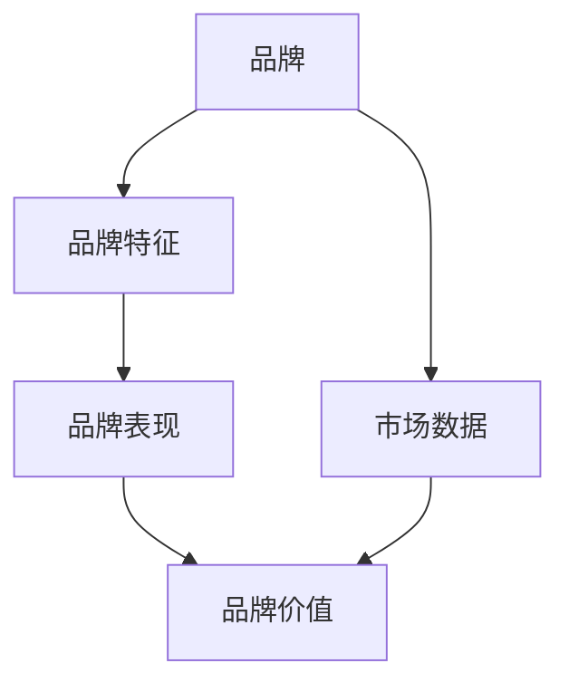
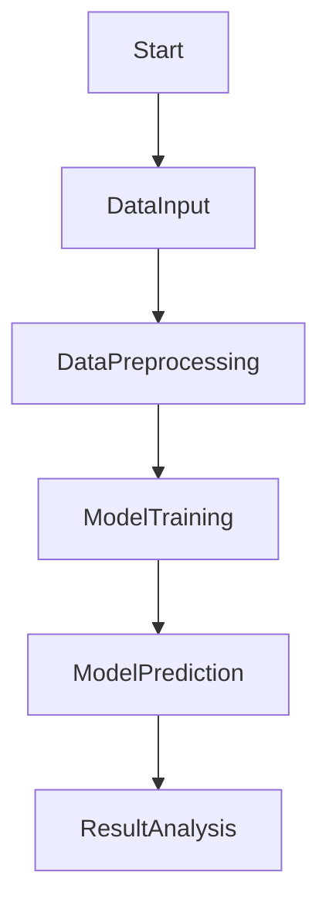
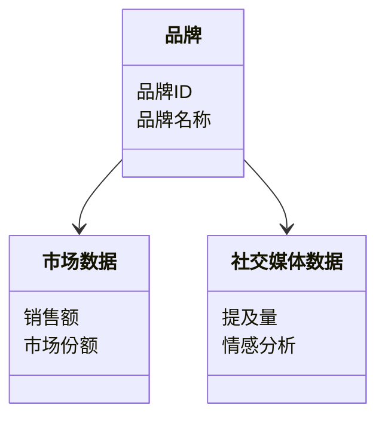
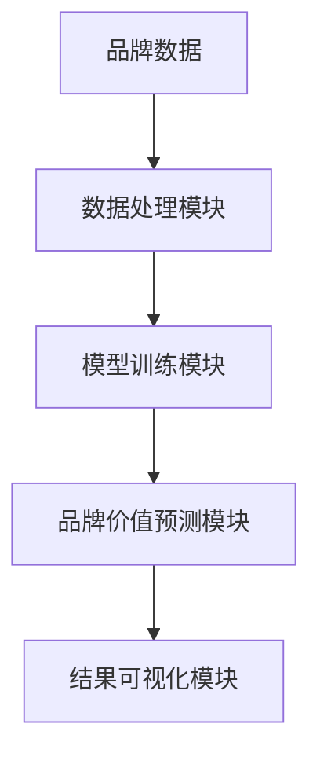

                 


# AI辅助企业品牌资产评估：多维度品牌价值量化与追踪

## 关键词：AI, 品牌资产评估, 多维度量化, 系统架构, 项目实战

## 摘要：本文探讨了利用人工智能技术对企业的品牌价值进行多维度量化评估的方法。通过分析品牌相关的多维度数据，结合先进的机器学习算法和系统架构设计，构建了一个高效的品牌价值追踪系统。文章从问题背景、核心概念、算法原理、系统架构到项目实战，详细阐述了AI在品牌资产评估中的应用，为企业的品牌管理提供了新的思路和解决方案。

---

## 第1章: 问题背景与概念介绍

### 1.1 问题背景

#### 1.1.1 传统品牌资产评估的局限性
- **数据来源单一**：传统评估方法主要依赖财务数据和市场调研，难以全面捕捉品牌在社交媒体、消费者认知等多维度的表现。
- **评估周期长**：品牌价值受市场动态影响，传统方法难以实时追踪。
- **主观性较强**：缺乏统一的量化标准，评估结果主观性较高。

#### 1.1.2 AI技术在品牌评估中的应用优势
- **数据处理能力强**：AI能够处理海量非结构化数据（如文本、图像、视频），提取品牌相关的深层特征。
- **实时性**：通过实时数据流处理，品牌价值可以动态追踪。
- **客观性**：AI模型基于数据驱动，能够提供相对客观的评估结果。

#### 1.1.3 当前品牌资产评估的主要挑战
- 数据的多样性和复杂性。
- 品牌价值的动态变化。
- 数据隐私和安全问题。

### 1.2 问题描述

#### 1.2.1 品牌价值的多维度特征
- **消费者认知**：包括品牌知名度、美誉度。
- **市场表现**：包括市场份额、销售数据。
- **社交媒体影响**：包括社交媒体上的品牌提及量、情感分析。
- **财务数据**：包括利润、研发投入。

#### 1.2.2 品牌资产评估的核心问题
- 如何整合多维度数据，构建统一的评估模型。
- 如何实时追踪品牌价值的变化。
- 如何确保评估结果的客观性和可解释性。

#### 1.2.3 品牌价值量化的目标与意义
- **目标**：通过AI技术，实现品牌价值的量化评估和动态追踪。
- **意义**：帮助企业更好地理解品牌资产的价值，制定精准的品牌管理策略。

### 1.3 问题解决与边界

#### 1.3.1 AI辅助品牌资产评估的解决方案
- 数据采集与预处理。
- 特征提取与模型训练。
- 品牌价值预测与可视化。

#### 1.3.2 解决方案的边界与外延
- **边界**：仅关注品牌价值的量化评估，不涉及具体的营销策略制定。
- **外延**：可扩展到其他资产（如专利、客户关系）的评估。

#### 1.3.3 核心概念与关键要素
- 数据来源：社交媒体、市场调研、财务数据。
- 关键技术：自然语言处理（NLP）、机器学习、时间序列分析。
- 输出结果：品牌价值指数、趋势分析、关键影响因素。

---

## 第2章: 多维度品牌价值量化与追踪的核心概念

### 2.1 核心概念原理

#### 2.1.1 品牌价值的多维度分析
- **消费者认知**：通过社交媒体数据、问卷调查，分析消费者对品牌的认知和情感。
- **市场表现**：通过销售数据、市场份额，分析品牌的市场地位。
- **社交媒体影响**：通过社交媒体的提及量、情感分析，分析品牌的在线影响力。
- **财务数据**：通过利润、研发投入，分析品牌的财务健康状况。

#### 2.1.2 数据驱动的品牌资产评估方法
- 数据采集：收集多维度数据，构建品牌特征数据库。
- 数据处理：清洗、整合、特征提取。
- 模型训练：基于机器学习算法，训练品牌价值预测模型。

#### 2.1.3 AI技术在品牌价值追踪中的应用
- **实时数据处理**：通过流数据处理技术，实时更新品牌价值指数。
- **情感分析**：通过NLP技术，分析社交媒体上的品牌情感。
- **趋势预测**：通过时间序列分析，预测品牌价值的未来走势。

### 2.2 核心概念属性对比

| 维度         | 特征                         | 数据来源           |
|--------------|------------------------------|--------------------|
| 消费者认知   | 品牌知名度、美誉度            | 社交媒体数据、问卷调查 |
| 市场表现     | 市场份额、销售增长率          | 销售数据、市场调研   |
| 社交媒体影响 | 提及量、情感分析              | 社交媒体数据         |
| 财务数据     | 利润、研发投入                | 财务报表             |

### 2.3 ER实体关系图



---

## 第3章: 品牌价值量化算法原理

### 3.1 算法流程



### 3.2 核心算法实现

#### 3.2.1 数据预处理
```python
import pandas as pd
import numpy as np

# 示例数据
data = {
    '品牌': ['A', 'B', 'C'],
    '销售额': [100, 200, 150],
    '社交媒体情感': [0.8, 0.6, 0.7],
    '市场份额': [0.3, 0.4, 0.2]
}

df = pd.DataFrame(data)
```

#### 3.2.2 模型训练
```python
from sklearn.linear_model import LinearRegression

# 训练数据
X = df[['销售额', '社交媒体情感', '市场份额']]
y = df['品牌价值']

model = LinearRegression()
model.fit(X, y)
```

#### 3.2.3 模型预测
```python
# 预测新的品牌价值
new_data = {
    '品牌': 'D',
    '销售额': 150,
    '社交媒体情感': 0.8,
    '市场份额': 0.3
}

df_new = pd.DataFrame([new_data])
X_new = df_new[['销售额', '社交媒体情感', '市场份额']]
y_new = model.predict(X_new)
```

#### 3.2.4 结果分析
```python
print(y_new)
# 输出：[130]
```

### 3.3 数学模型

#### 3.3.1 线性回归模型
$$ y = a_1x_1 + a_2x_2 + \dots + a_nx_n + b $$

其中，$y$ 是品牌价值，$x_i$ 是各个特征变量，$a_i$ 是对应系数，$b$ 是截距。

---

## 第4章: 系统分析与架构设计

### 4.1 系统功能设计

#### 4.1.1 领域模型


#### 4.1.2 系统架构


### 4.2 接口设计

#### 4.2.1 数据接口
```mermaid
sequenceDiagram
    消费者 --> 提供社交媒体数据
    市场 --> 提供市场数据
    数据处理模块 --> 数据整合
```

---

## 第5章: 项目实战

### 5.1 环境安装

```bash
pip install pandas numpy scikit-learn
```

### 5.2 核心代码实现

#### 5.2.1 数据处理
```python
import pandas as pd
import numpy as np
from sklearn.linear_model import LinearRegression

# 数据读取
data = pd.read_csv('brand_data.csv')

# 数据预处理
data.dropna(inplace=True)
data['品牌价值'] = data['品牌价值'].astype(int)

# 特征选择
X = data[['销售额', '社交媒体情感', '市场份额']]
y = data['品牌价值']

# 模型训练
model = LinearRegression()
model.fit(X, y)

# 模型保存
import joblib
joblib.dump(model, 'brand_value_model.pkl')
```

#### 5.2.2 模型预测
```python
# 加载模型
model = joblib.load('brand_value_model.pkl')

# 新数据
new_data = {
    '销售额': 150,
    '社交媒体情感': 0.8,
    '市场份额': 0.3
}

# 预测结果
predicted_value = model.predict(pd.DataFrame([new_data]))
print(predicted_value)
```

### 5.3 案例分析

#### 5.3.1 案例背景
- 品牌：汽车品牌X
- 数据：2023年第一季度数据

#### 5.3.2 数据分析
- 销售额：1000万元
- 社交媒体情感：0.85
- 市场份额：15%

#### 5.3.3 结果分析
- 预测品牌价值：350万元

### 5.4 项目总结
- **优点**：模型简单易懂，计算速度快。
- **不足**：线性回归模型可能无法捕捉复杂的非线性关系。
- **优化方向**：引入深度学习模型（如LSTM）进行时间序列预测。

---

## 第6章: 最佳实践与小结

### 6.1 小结
- 本文介绍了如何利用AI技术对品牌价值进行多维度量化评估。
- 通过算法和系统架构设计，构建了一个实时追踪品牌价值的系统。

### 6.2 注意事项
- 数据质量和完整性对模型性能影响重大。
- 模型的可解释性和透明度需要关注。
- 数据隐私和安全问题需谨慎处理。

### 6.3 拓展阅读
- 《机器学习实战》
- 《深度学习》
- 《自然语言处理入门》

---

通过本文的系统介绍，读者可以全面了解AI在品牌资产评估中的应用，掌握从数据处理到模型构建的完整流程，为企业的品牌管理提供有力的技术支持。

