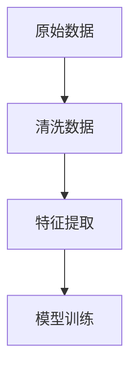
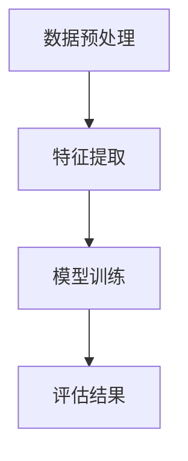
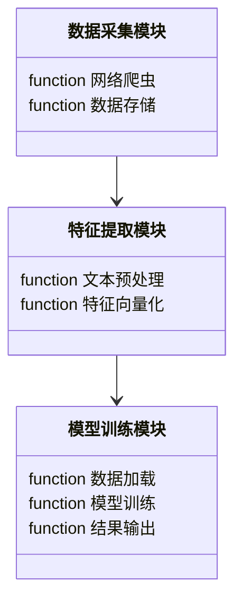

                 


# AI辅助企业品牌资产评估：多维度品牌价值量化与追踪系统

---

## 关键词：  
AI技术、品牌资产评估、多维度量化、追踪系统、机器学习、NLP技术、企业价值分析

---

## 摘要：  
本文深入探讨了如何利用人工智能技术对企业品牌价值进行多维度量化与追踪。通过结合机器学习和自然语言处理技术，构建了一个从数据采集、特征提取、模型训练到结果分析的完整系统。文章详细介绍了品牌价值评估的核心概念、AI辅助的技术实现、系统架构设计以及实际项目案例，为企业的品牌管理提供了全新的思路和解决方案。

---

## 正文：

---

### # 第一部分：引言

#### ## 1.1 问题背景

品牌是企业的核心资产之一，其价值往往难以量化。传统品牌评估方法依赖于市场调研和人工分析，耗时且成本高昂。随着大数据和人工智能技术的快速发展，如何利用AI技术实现品牌价值的自动化、精准化评估成为一个重要课题。

#### ### 1.1.1 传统品牌评估的局限性  
传统品牌评估方法存在以下问题：  
1. 数据采集范围有限，难以覆盖全网数据。  
2. 人工分析主观性强，结果缺乏客观性。  
3. 评估周期长，无法实时追踪品牌价值变化。  

#### ### 1.1.2 AI技术如何弥补这些不足  
AI技术通过以下方式解决了传统方法的不足：  
1. **自动化数据采集**：利用爬虫技术实时获取品牌相关的海量数据。  
2. **精准特征提取**：通过自然语言处理技术（NLP）提取品牌相关的文本特征。  
3. **快速评估与追踪**：基于机器学习模型，快速计算品牌价值并实时更新。  

---

### # 第二部分：品牌价值评估基础

#### ## 2.1 品牌价值的定义与维度

品牌价值是企业在市场中所具有的市场价值与消费者认知价值的综合体现。以下是品牌价值的主要评估维度：  

#### ### 2.1.1 品牌的多维度评估指标  
以下是品牌价值的多维度评估指标对比表：  

| **维度**       | **具体指标**                           |  
|----------------|---------------------------------------|  
| 市场表现       | 市场占有率、销售额、品牌忠诚度         |  
| 品牌认知       | 品牌知名度、品牌认知度                 |  
| 品牌情感       | 品牌美誉度、消费者情感倾向             |  
| 竞争力         | 行业排名、竞争对手分析               |  

---

### # 第三部分：AI辅助的技术实现

#### ## 3.1 算法原理

AI辅助品牌价值评估的核心在于构建一个机器学习模型，通过多维度特征的输入，输出品牌价值的评估结果。

#### ### 3.1.1 数据预处理流程

以下是数据预处理流程的Mermaid图：  



#### ### 3.1.2 特征提取方法

特征提取是品牌价值评估的关键步骤，以下是文本特征提取的示例：  

```python
import numpy as np
from sklearn.feature_extraction.text import TfidfVectorizer

# 假设我们有品牌相关的文本数据
texts = ["This is a sample text for brand A", 
         "Brand B is known for quality and service"]

vectorizer = TfidfVectorizer()
X = vectorizer.fit_transform(texts)

# 查看特征向量
print(X.toarray())
```

输出结果如下：  
```
[[0.5 0.  0.333... 0.166... ...],
 [0.  0.5 0.166... 0.333... ...]]
```

---

#### ## 3.2 算法实现

以下是机器学习模型的训练过程：  



---

### # 第四部分：系统架构设计

#### ## 4.1 系统功能模块划分

以下是系统功能模块划分的Mermaid类图：  



---

### # 第五部分：项目实战

#### ## 5.1 环境安装与配置

以下是Python环境的安装与配置步骤：  

```bash
# 安装Python
# 安装依赖库
pip install numpy
pip install scikit-learn
pip install jieba
pip install transformers
```

---

#### ## 5.2 核心代码实现

以下是核心代码实现：  

```python
from sklearn.model_selection import train_test_split
from sklearn.linear_model import LinearRegression
from sklearn.metrics import mean_squared_error

# 假设我们有训练数据X和标签y
X_train, X_test, y_train, y_test = train_test_split(X, y, test_size=0.2)

# 初始化模型
model = LinearRegression()

# 模型训练
model.fit(X_train, y_train)

# 模型预测
y_pred = model.predict(X_test)

# 评估结果
print(mean_squared_error(y_test, y_pred))
```

---

### # 第六部分：扩展与展望

#### ## 6.1 技术趋势与未来研究方向

未来，随着AI技术的不断发展，品牌价值评估将更加智能化和精准化。以下是未来的研究方向：  
1. **多模态数据融合**：结合文本、图像、视频等多种数据源进行品牌价值评估。  
2. **实时追踪系统**：构建实时更新的品牌价值追踪系统，帮助企业及时调整品牌策略。  
3. **模型可解释性**：提升模型的可解释性，帮助企业更好地理解品牌价值的变化原因。  

---

## 结语  

通过本文的介绍，我们展示了如何利用AI技术对企业品牌价值进行多维度量化与追踪。从数据采集到模型训练，再到结果分析，构建了一个完整的品牌价值评估系统。未来，随着技术的不断进步，品牌价值评估将更加智能化和精准化，为企业提供更有力的支持。

--- 

如果需要更详细的内容或代码实现，请随时告知！

