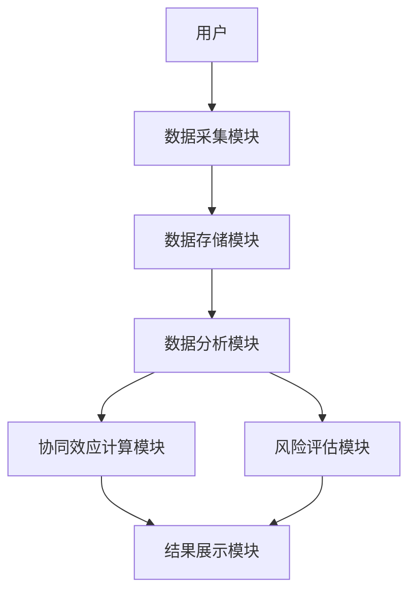

                 


# AI辅助企业并购估值：多维度协同效应量化与风险评估

---

## 关键词：
AI技术，企业并购，协同效应，风险评估，数学模型，系统架构，项目实战

---

## 摘要：
本文深入探讨了AI技术在企业并购估值中的应用，重点分析了协同效应的多维度量化与风险评估的方法。通过结合机器学习、数据挖掘和系统架构设计，本文提出了基于AI的协同效应量化模型和风险评估体系，为企业的并购决策提供了科学依据和实践指导。文章内容涵盖背景介绍、算法原理、系统设计、项目实战等多个方面，旨在为企业并购估值提供创新的解决方案。

---

## 第1章: 企业并购估值概述

### 1.1 企业并购的基本概念
企业并购是指一家企业收购另一家企业的一部分或全部股权，以实现战略目标、扩大市场占有率或获取新技术、新资源。并购可以分为横向并购、纵向并购和混合并购三种类型。横向并购是指同一行业内的企业并购，旨在扩大市场份额；纵向并购是上下游产业的企业并购，以增强供应链控制能力；混合并购则是为了 diversify 业务，降低经营风险。

### 1.2 企业并购的流程与关键阶段
企业并购的流程通常包括以下几个阶段：
1. **战略规划与目标筛选**：明确并购目标，筛选潜在并购企业。
2. **尽职调查**：对目标企业的财务状况、市场表现、法律风险等进行全面调查。
3. **估值与定价**：评估目标企业价值，确定并购价格。
4. **交易结构设计**：设计并购交易的具体结构，包括支付方式、股权分配等。
5. **整合与实施**：完成并购后的资源整合，包括文化整合、业务整合等。

### 1.3 协同效应的定义与重要性
协同效应是指并购后的企业通过资源整合，实现超过单独两家企业价值总和的效果。协同效应可以分为财务协同效应、战略协同效应和运营协同效应。财务协同效应包括成本节约、收入增长等；战略协同效应包括市场扩展、技术互补等；运营协同效应包括生产效率提升、供应链优化等。

---

## 第2章: 协同效应的多维度分析

### 2.1 协同效应的类型与量化方法
协同效应的类型可以分为财务协同效应、战略协同效应和运营协同效应。财务协同效应可以通过财务指标（如EBITDA）的提升来量化；战略协同效应可以通过市场扩展和品牌价值提升来评估；运营协同效应可以通过生产效率和供应链优化来衡量。

### 2.2 协同效应的量化模型
协同效应的量化模型可以采用以下方法：
1. **简单加和模型**：将协同效应的各项指标相加，得到总协同效应。
2. **加权平均模型**：根据各项协同效应的重要性，赋予不同的权重，计算加权平均值。
3. **回归分析模型**：通过回归分析，量化各项协同效应对整体价值的影响。

### 2.3 协同效应的动态评估
协同效应的动态评估可以通过时间序列分析、情景分析和模拟分析等方法实现。时间序列分析可以帮助识别协同效应的变化趋势；情景分析可以评估不同假设条件下的协同效应；模拟分析可以通过 Monte Carlo 方法量化协同效应的不确定性。

---

## 第3章: 风险评估与AI辅助

### 3.1 并购中的主要风险
并购过程中面临的主要风险包括市场风险、财务风险和运营风险。市场风险包括市场需求变化、竞争加剧等；财务风险包括债务过高、现金流不稳定等；运营风险包括整合困难、管理不善等。

### 3.2 风险评估的AI方法
AI技术在风险评估中的应用主要包括：
1. **机器学习模型**：通过训练数据，预测并购后的风险概率。
2. **自然语言处理（NLP）**：分析企业财报和新闻，识别潜在风险因素。
3. **图神经网络（GNN）**：通过构建企业关系图，识别系统性风险。

---

## 第4章: 数学模型与算法原理

### 4.1 协同效应量化模型
协同效应的量化模型可以通过以下公式表示：
$$
\text{协同效应} = \sum_{i=1}^{n} w_i \times x_i
$$
其中，\( w_i \) 是第 \( i \) 项协同效应的权重，\( x_i \) 是第 \( i \) 项协同效应的值。

### 4.2 风险评估模型
风险评估模型可以通过以下公式表示：
$$
\text{风险评分} = \sum_{j=1}^{m} p_j \times r_j
$$
其中，\( p_j \) 是第 \( j \) 项风险因素的概率，\( r_j \) 是第 \( j \) 项风险因素的影响程度。

---

## 第5章: 系统架构设计

### 5.1 系统功能设计
系统功能设计包括数据采集模块、数据分析模块和风险评估模块。数据采集模块负责收集企业并购的相关数据；数据分析模块利用机器学习算法量化协同效应；风险评估模块基于AI模型评估并购风险。

### 5.2 系统架构设计
系统架构设计如下：


### 5.3 系统接口设计
系统接口设计包括数据输入接口、模型调用接口和结果输出接口。数据输入接口负责接收企业数据；模型调用接口负责调用机器学习模型；结果输出接口负责展示分析结果。

---

## 第6章: 项目实战

### 6.1 环境安装
需要安装的工具包括Python、机器学习库（如Scikit-learn、XGBoost）和数据可视化库（如Matplotlib、Seaborn）。

### 6.2 核心实现代码
以下是协同效应量化的核心代码：
```python
import pandas as pd
import numpy as np
from sklearn.linear_model import LinearRegression

# 数据预处理
data = pd.read_csv('merger_data.csv')
X = data[['revenue', 'cost', 'profit']]
y = data['协同效应']

# 模型训练
model = LinearRegression()
model.fit(X, y)

# 预测协同效应
new_data = pd.DataFrame({'revenue': [1000], 'cost': [500], 'profit': [200]})
predicted_synergy = model.predict(new_data)
print(predicted_synergy)
```

### 6.3 案例分析
以某公司并购案例为例，详细分析协同效应的量化过程和风险评估结果。

---

## 第7章: 总结与展望

### 7.1 总结
本文详细探讨了AI技术在企业并购估值中的应用，提出了协同效应量化和风险评估的创新方法，为企业并购提供了新的思路。

### 7.2 展望
未来，随着AI技术的不断发展，企业并购估值将更加精准和高效。建议企业结合自身特点，充分利用AI技术提升并购决策的科学性和准确性。

---

## 附录
### 附录A: 术语表
解释文章中涉及的专业术语。

### 附录B: 工具安装指南
详细说明如何安装和配置所需的工具和库。

### 附录C: 参考文献
列出文章中引用的文献和资料。

---

通过本文的分析与实践，我们相信AI技术将在企业并购估值中发挥越来越重要的作用，为企业创造更大的价值。

