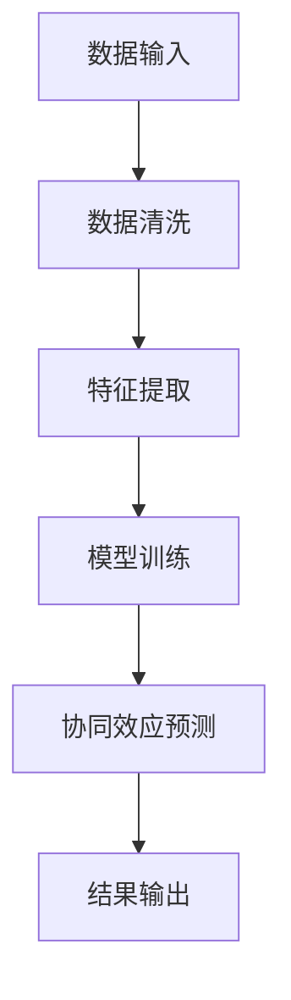
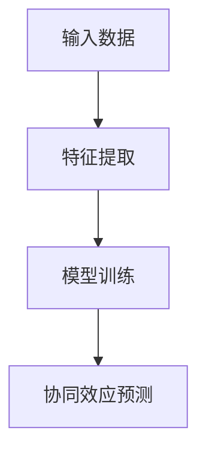
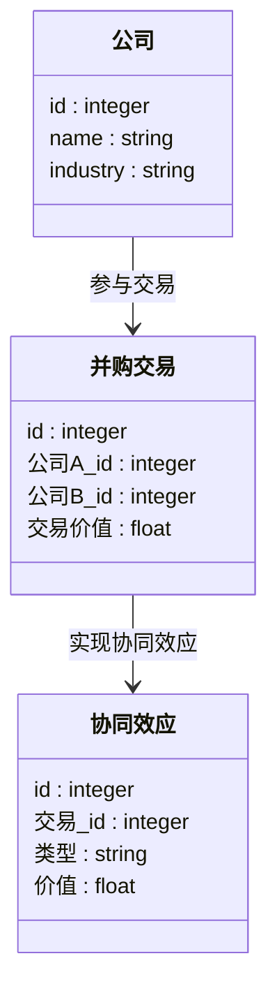
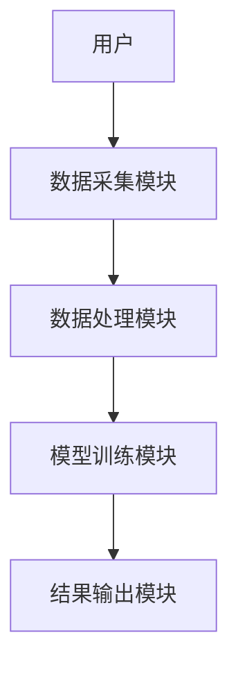
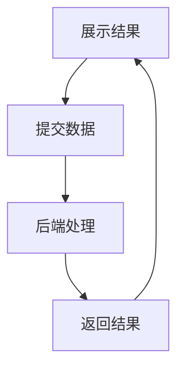

                 


# AI辅助企业并购估值：多维度财务模型与协同效应量化

## 关键词
- 人工智能 (AI)
- 企业并购
- 财务模型
- 协同效应
- 估值分析

## 摘要
随着企业并购活动的不断增加，传统的估值方法面临着数据复杂性、模型单一性和协同效应难以量化的挑战。本文介绍了一种基于人工智能的多维度财务模型，通过构建协同效应的量化方法，为企业并购估值提供了新的思路。文章详细讲解了AI技术在企业并购中的应用、多维度财务模型的构建、协同效应的量化方法，以及系统架构设计。通过实际案例分析和代码实现，展示了AI如何提升企业并购估值的效率和准确性。本文适合企业并购领域的专业人士、数据科学家以及对AI技术感兴趣的读者阅读。

---

# 第1章 AI辅助企业并购估值的背景与核心概念

## 1.1 企业并购的定义与重要性

### 1.1.1 企业并购的定义
企业并购（Mergers and Acquisitions，M&A）是指两个或多个企业之间通过合并、收购或重组等方式，将两个或多个独立的企业结合成一个企业的行为。并购是企业战略发展的重要手段，通常用于扩大规模、优化资源、增强市场竞争力等。

### 1.1.2 并购在企业战略中的地位
并购是企业实现快速扩张和资源整合的重要方式，尤其在行业整合和技术创新驱动的市场中，企业通过并购可以迅速获取技术、人才、市场资源等。例如，科技公司通过并购快速获取关键专利技术，或零售企业通过并购扩张门店网络。

### 1.1.3 并购的驱动因素与趋势
- **驱动因素**：市场扩张、技术获取、成本协同、管理优化等。
- **趋势**：数字化转型背景下，技术驱动的并购活动增加；绿色金融背景下，ESG因素成为并购的重要考量。

## 1.2 企业估值的基本概念

### 1.2.1 企业估值的定义
企业估值是指对企业的整体价值或部分价值进行评估的过程。常见的估值方法包括DCF模型（ discounted cash flow）、市盈率法、市净率法等。

### 1.2.2 估值的基本方法与模型
- **DCF模型**：通过预测企业未来现金流，折现计算企业价值。
- **相对估值法**：通过比较可比公司或交易的估值指标（如市盈率、市净率）进行估算。
- **重置成本法**：估算重建企业所需成本。

### 1.2.3 并购估值的核心挑战
- 数据复杂性：并购涉及的历史财务数据、市场数据、协同效应预测等多维度数据。
- 模型单一性：传统模型难以捕捉复杂市场环境下的动态变化。
- 协同效应的不确定性：协同效应的实现依赖于企业整合后的实际效果，难以量化。

## 1.3 AI技术在企业并购中的应用潜力

### 1.3.1 AI技术的定义与特点
人工智能（AI）是模拟人类智能的技术，具有数据驱动、自动化、自我学习等特点。AI技术在数据处理、模式识别、预测分析等领域具有显著优势。

### 1.3.2 AI在企业并购中的应用场景
- 数据清洗与预处理：AI可以自动识别和处理数据中的异常值、缺失值等。
- 估值模型优化：通过机器学习算法优化估值模型的参数和结构。
- 协同效应预测：AI可以基于历史数据和市场环境预测协同效应的实现程度。

### 1.3.3 AI辅助估值的优势与局限性
- **优势**：提高估值效率、增强模型的准确性、降低人为误差。
- **局限性**：数据质量依赖性强、模型的可解释性有限、需要大量计算资源。

## 1.4 本章小结
企业并购是企业战略发展的重要手段，但传统估值方法面临数据复杂性、模型单一性和协同效应难以量化的挑战。AI技术在数据处理、模型优化和协同效应预测方面具有显著优势，为解决这些问题提供了新的思路。

---

# 第2章 多维度财务模型与协同效应的量化

## 2.1 多维度财务模型的构建

### 2.1.1 财务模型的定义与分类
财务模型是基于财务数据和假设构建的数学模型，用于评估企业的价值或预测未来的财务表现。常见的财务模型包括DCF模型、情景分析模型等。

### 2.1.2 多维度财务模型的特点
- **多维度**：考虑财务、市场、运营等多个维度的数据。
- **动态性**：能够捕捉市场环境的变化对估值的影响。
- **可扩展性**：适用于不同规模和行业的企业。

### 2.1.3 多维度模型在并购估值中的作用
通过整合多维度数据，多维度模型能够更全面地评估企业的价值，同时考虑协同效应、整合成本等因素。

## 2.2 协同效应的定义与量化

### 2.2.1 协同效应的定义
协同效应是指并购后的企业通过资源整合、成本节约、收入增长等方式实现的额外价值。

### 2.2.2 协同效应的分类与影响
- **成本协同效应**：通过整合供应链、减少管理成本等实现的成本节约。
- **收入协同效应**：通过市场扩展、产品互补等方式实现的收入增长。

### 2.2.3 协同效应的量化方法
- **定量分析**：基于财务数据预测协同效应的实现程度。
- **定性分析**：通过专家判断和市场分析评估协同效应的可能性。

## 2.3 AI与多维度财务模型的结合

### 2.3.1 AI在数据处理中的应用
通过自然语言处理（NLP）技术提取非结构化数据，通过机器学习算法处理结构化数据。

### 2.3.2 AI在模型优化中的作用
通过神经网络算法优化财务模型的参数和结构，提高模型的预测精度。

### 2.3.3 AI在协同效应预测中的应用
通过时间序列分析预测协同效应的实现程度，并基于实时数据动态调整模型。

## 2.4 实体关系图与流程图

### 2.4.1 实体关系图（ER图）
```mermaid
erDiagram
    company {
        id : integer
        name : string
        industry : string
    }
    deal {
        id : integer
        companyA_id : integer
        companyB_id : integer
        value : float
    }
   协同效应 {
        id : integer
        deal_id : integer
        type : string
        value : float
    }
    company --> deal : 参与交易
    deal --> 协同效应 : 实现协同效应
```

### 2.4.2 协同效应量化流程图


## 2.5 本章小结
多维度财务模型通过整合多维度数据，能够更全面地评估企业的价值。协同效应是并购的重要驱动力，但其量化需要结合定量和定性分析。AI技术在数据处理、模型优化和协同效应预测方面具有显著优势，为多维度财务模型的构建提供了新的思路。

---

# 第3章 基于AI的多维度财务模型实现

## 3.1 数据收集与预处理

### 3.1.1 数据来源
- **财务数据**：企业财务报表、并购案例数据。
- **市场数据**：行业指数、股价数据。
- **文本数据**：新闻、公告等。

### 3.1.2 数据清洗
- 处理缺失值：使用均值、中位数或插值法填补缺失值。
- 处理异常值：通过箱线图识别并剔除异常值。

### 3.1.3 数据标准化
- 标准化：将数据缩放到同一尺度，例如归一化。
- 编码：将分类变量转换为数值变量，例如独热编码。

## 3.2 模型构建与训练

### 3.2.1 神经网络模型
```python
import tensorflow as tf
from tensorflow.keras import layers

model = tf.keras.Sequential([
    layers.Dense(64, activation='relu'),
    layers.Dense(32, activation='relu'),
    layers.Dense(1, activation='linear')
])
```

### 3.2.2 模型训练
```python
model.compile(optimizer='adam', loss='mean_squared_error')
model.fit(X_train, y_train, epochs=100, batch_size=32)
```

### 3.2.3 模型评估
```python
loss = model.evaluate(X_test, y_test)
print(f"模型损失: {loss}")
```

## 3.3 协同效应预测

### 3.3.1 协同效应预测模型


### 3.3.2 案例分析
假设我们有两家公司A和B，A的财务数据为X，B的财务数据为Y，预测协同效应为Z。通过神经网络模型训练，我们得到Z = f(X, Y)。

## 3.4 本章小结
通过AI技术，我们可以构建基于多维度数据的神经网络模型，实现企业并购估值的自动化和高精度预测。协同效应的预测可以通过神经网络模型实现，从而提高估值的准确性。

---

# 第4章 系统架构设计与实现

## 4.1 问题场景介绍
在企业并购估值中，传统的财务模型难以处理多维度数据和复杂的协同效应预测问题。通过构建一个基于AI的系统，可以实现数据的自动化处理、模型的优化和协同效应的动态预测。

## 4.2 系统功能设计

### 4.2.1 领域模型


### 4.2.2 功能模块划分
- 数据采集模块：负责收集企业财务数据、市场数据等。
- 数据处理模块：对数据进行清洗、标准化和特征提取。
- 模型训练模块：构建并训练神经网络模型。
- 结果输出模块：展示估值结果和协同效应预测结果。

## 4.3 系统架构设计

### 4.3.1 系统架构图


### 4.3.2 技术选型
- 前端：React.js
- 后端：Python Flask
- 模型训练：TensorFlow/Keras
- 数据存储：MySQL

## 4.4 系统接口设计

### 4.4.1 API接口定义
- GET /api/valuation：获取企业估值结果。
- POST /api/predict：提交数据进行协同效应预测。

### 4.4.2 接口调用流程
1. 用户通过前端页面提交企业数据。
2. 前端通过API调用后端接口。
3. 后端接收数据并调用模型进行预测。
4. 前端展示预测结果。

## 4.5 系统交互设计

### 4.5.1 交互流程图


### 4.5.2 用户界面设计
- 输入界面：用户填写企业数据。
- 输出界面：展示估值结果和协同效应预测结果。

## 4.6 本章小结
通过系统架构设计，我们可以构建一个高效的企业并购估值系统，实现数据的自动化处理和模型的优化。系统架构的设计为后续的开发和优化提供了清晰的方向。

---

# 第5章 项目实战与案例分析

## 5.1 环境安装

### 5.1.1 安装Python
```bash
python --version
pip install --upgrade pip
```

### 5.1.2 安装依赖库
```bash
pip install numpy pandas scikit-learn tensorflow keras matplotlib
```

## 5.2 代码实现

### 5.2.1 数据预处理
```python
import pandas as pd
import numpy as np

# 加载数据
data = pd.read_csv('并购数据.csv')

# 处理缺失值
data = data.dropna()

# 标准化处理
from sklearn.preprocessing import StandardScaler
scaler = StandardScaler()
data_scaled = scaler.fit_transform(data)
```

### 5.2.2 模型训练
```python
from tensorflow.keras import layers, models

# 构建模型
model = models.Sequential()
model.add(layers.Dense(64, activation='relu', input_shape=(data_scaled.shape[1],)))
model.add(layers.Dense(32, activation='relu'))
model.add(layers.Dense(1, activation='linear'))

# 编译模型
model.compile(optimizer='adam', loss='mean_squared_error')

# 训练模型
model.fit(data_scaled, labels, epochs=100, batch_size=32)
```

### 5.2.3 模型评估
```python
import matplotlib.pyplot as plt

# 预测值
y_pred = model.predict(data_scaled)

# 可视化
plt.scatter(y_true, y_pred)
plt.xlabel('真实值')
plt.ylabel('预测值')
plt.show()
```

## 5.3 案例分析

### 5.3.1 案例背景
假设我们有两家公司A和B，A的财务数据为X，B的财务数据为Y，预测协同效应为Z。

### 5.3.2 案例分析
通过神经网络模型训练，我们得到了协同效应的预测值Z = f(X, Y)。通过对比实际协同效应和预测协同效应，验证模型的准确性。

## 5.4 本章小结
通过项目实战，我们验证了基于AI的多维度财务模型在企业并购估值中的应用。案例分析表明，AI技术能够显著提高估值的准确性和效率。

---

# 第6章 总结与展望

## 6.1 总结
本文介绍了AI技术在企业并购估值中的应用，通过构建多维度财务模型和协同效应量化方法，解决了传统估值方法的局限性。通过实际案例分析，验证了AI技术在企业并购估值中的优势。

## 6.2 最佳实践 tips
- 数据预处理是关键，确保数据的准确性和完整性。
- 模型选择要结合实际业务需求，选择合适的算法。
- 协同效应的预测要结合定量和定性分析。

## 6.3 未来展望
随着AI技术的不断发展，企业并购估值将更加智能化和自动化。未来的研究方向包括更复杂的模型构建、实时数据处理以及动态协同效应预测。

## 6.4 拓展阅读
- 《企业并购与财务分析》
- 《人工智能在金融领域的应用》
- 《深度学习在时间序列分析中的应用》

---

# 结语
企业并购是企业战略发展的重要手段，AI技术的应用为并购估值提供了新的思路。通过多维度财务模型和协同效应量化方法，企业可以更准确地评估并购价值，降低并购风险。未来，随着AI技术的不断进步，企业并购估值将更加智能化和高效化。

