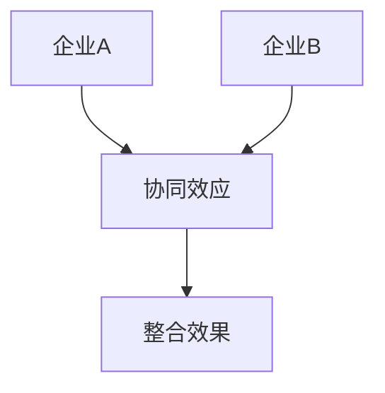

                 


# AI辅助企业并购协同效应实现：整合路径规划与执行

---

## 关键词：企业并购、协同效应、人工智能、整合路径、系统架构、数学模型、项目实战

---

## 摘要：  
随着企业并购活动的日益频繁，协同效应作为并购成功的关键因素，越来越受到关注。然而，传统的企业并购协同效应实现过程中存在数据复杂、路径不清晰、执行难度大等问题。本文将深入探讨如何利用人工智能技术辅助企业并购中的协同效应实现，从整合路径规划到具体执行，系统地分析其原理、算法和实现方案。通过数学模型、系统架构设计和实际案例分析，本文为读者提供一套完整的AI辅助企业并购协同效应实现的方法论。

---

# 第一部分: AI辅助企业并购协同效应实现的基础

---

# 第1章: 企业并购与协同效应概述

## 1.1 企业并购的基本概念

### 1.1.1 企业并购的定义与分类  
企业并购（Mergers and Acquisitions，M&A）是指一家企业与其他企业通过合并或收购的方式，整合资源、扩大规模或提升竞争力的过程。并购可以分为横向并购、纵向并购和混合并购三种类型。

- 横向并购：同一行业内的企业并购，旨在扩大市场份额。
- 纵向并购：上下游产业的企业并购，旨在优化供应链。
- 混合并购：不同行业或业务领域的企业并购，旨在多元化发展。

### 1.1.2 协同效应的定义与类型  
协同效应（Synergy）是指并购后的企业通过资源整合所产生的额外价值。协同效应可以分为以下几类：

- **成本协同效应**：通过资源共享降低成本。
- **收入协同效应**：通过市场扩展或产品互补增加收入。
- **技术创新协同效应**：通过技术整合提升创新能力。
- **管理协同效应**：通过管理经验共享提升效率。

### 1.1.3 协同效应在企业并购中的重要性  
协同效应是企业并购成功的核心因素之一。通过实现协同效应，企业可以降低并购后的整合成本，提升整体竞争力，并实现长期价值增长。

---

## 1.2 AI技术在企业并购中的应用背景

### 1.2.1 传统企业并购的挑战  
传统企业并购过程中存在以下主要挑战：

- 数据分散且难以整合。
- 协同效应的识别和量化困难。
- 整合路径不清晰，执行风险高。
- 跨文化、跨组织的管理复杂性。

### 1.2.2 AI技术如何解决并购中的问题  
人工智能技术可以通过以下方式解决企业并购中的问题：

- 数据整合与分析：利用自然语言处理（NLP）和机器学习（ML）技术，整合和分析来自不同来源的海量数据。
- 协同效应预测：通过机器学习模型，预测并购后的协同效应，并制定最优整合路径。
- 风险评估与管理：利用AI进行风险分析，降低并购失败的概率。

### 1.2.3 协同效应实现的路径与目标  
实现协同效应的关键路径包括：

1. 数据采集与清洗。
2. 协同效应识别与量化。
3. 整合路径规划。
4. 风险评估与控制。
5. 执行与监控。

目标是通过AI技术，优化整合路径，最大化协同效应，降低整合成本。

---

## 1.3 本章小结  
本章从企业并购的基本概念出发，介绍了协同效应的定义、类型及其重要性，并探讨了AI技术在企业并购中的应用背景和实现路径。接下来，我们将深入探讨协同效应的数学模型与计算方法。

---

# 第2章: 协同效应的数学模型与计算方法

## 2.1 协同效应的量化指标

### 2.1.1 协同效应的度量标准  
协同效应可以通过以下指标进行量化：

- 价值协同效应：并购后企业价值的增加。
- 效率协同效应：成本降低或效率提升。
- 市场协同效应：市场份额的增加。

### 2.1.2 协同效应的计算公式  
协同效应的计算公式可以表示为：

$$ \text{协同效应} = \text{并购后价值} - \text{并购前价值} $$

其中，并购前价值为两家企业的价值之和，并购后价值为整合后的实际价值。

### 2.1.3 协同效应的评估方法  
常用的协同效应评估方法包括：

- **加成法（Add-on Method）**：基于目标企业的未来现金流进行评估。
- **现值法（Present Value Method）**：基于并购后的净现值（NPV）进行评估。
- **市场法（Market Approach）**：基于可比公司的市场价值进行评估。

---

## 2.2 协同效应的实现路径

### 2.2.1 数据整合与分析  
数据整合是协同效应实现的基础。通过自然语言处理技术，可以将文本数据转化为结构化数据，便于后续分析。

### 2.2.2 业务流程优化  
利用机器学习技术，可以识别并购后的业务流程中的冗余环节，并提出优化建议。

### 2.2.3 资源共享与配置  
通过数学优化模型，可以实现资源的最优配置，最大化协同效应。

---

## 2.3 协同效应的实现模型

### 2.3.1 协同效应的系统模型  
协同效应的系统模型可以表示为：

$$ \text{协同效应} = f(\text{资源整合}, \text{业务流程}, \text{资源配置}) $$

其中，$f$ 表示协同效应的计算函数。

### 2.3.2 协同效应的网络图表示  
协同效应的网络图可以表示为：



### 2.3.3 协同效应的动态演化  
协同效应的动态演化可以通过以下步骤实现：

1. 数据采集与预处理。
2. 模型训练与优化。
3. 模型部署与监控。

---

## 2.4 本章小结  
本章从数学模型的角度，探讨了协同效应的量化指标、实现路径和动态演化过程。接下来，我们将深入探讨AI辅助企业并购协同效应实现的算法与技术。

---

# 第3章: 协同效应识别的算法原理

## 3.1 协同效应识别的算法概述

### 3.1.1 基于机器学习的协同效应识别  
机器学习（ML）技术可以通过以下步骤实现协同效应识别：

1. 数据预处理与特征提取。
2. 模型训练与优化。
3. 模型评估与部署。

### 3.1.2 基于深度学习的协同效应识别  
深度学习（DL）技术可以通过以下步骤实现协同效应识别：

1. 数据预处理与特征提取。
2. 神经网络模型训练。
3. 模型评估与部署。

### 3.1.3 基于图论的协同效应识别  
图论技术可以通过以下步骤实现协同效应识别：

1. 数据建模为图结构。
2. 图的分析与挖掘。
3. 协同效应的识别与量化。

---

## 3.2 协同效应识别的数学模型

### 3.2.1 协同效应识别的线性回归模型  
线性回归模型可以表示为：

$$ y = \beta_0 + \beta_1x_1 + \beta_2x_2 + \dots + \beta_nx_n + \epsilon $$

其中，$y$ 是协同效应，$x_i$ 是影响协同效应的特征变量，$\beta_i$ 是回归系数，$\epsilon$ 是误差项。

### 3.2.2 协同效应识别的决策树模型  
决策树模型可以通过以下步骤实现：

1. 数据预处理与特征提取。
2. 决策树的构建与优化。
3. 模型评估与部署。

### 3.2.3 协同效应识别的神经网络模型  
神经网络模型可以通过以下步骤实现：

1. 数据预处理与特征提取。
2. 神经网络的构建与训练。
3. 模型评估与部署。

---

## 3.3 协同效应识别的实现步骤

### 3.3.1 数据预处理与特征提取  
数据预处理包括数据清洗、数据转换和数据增强。特征提取包括特征选择和特征工程。

### 3.3.2 模型训练与优化  
模型训练包括数据划分、模型训练和模型调优。模型优化包括参数调整和模型评估。

### 3.3.3 模型评估与部署  
模型评估包括准确率、召回率和F1分数的计算。模型部署包括模型封装和模型应用。

---

## 3.4 本章小结  
本章从算法原理的角度，探讨了协同效应识别的机器学习、深度学习和图论方法。接下来，我们将深入探讨AI辅助企业并购协同效应实现的系统架构与设计。

---

# 第4章: 系统架构设计

## 4.1 系统功能模块划分

### 4.1.1 数据采集与处理模块  
数据采集与处理模块负责从多种数据源采集数据，并进行清洗和转换。

### 4.1.2 协同效应分析模块  
协同效应分析模块负责对数据进行分析，并识别协同效应。

### 4.1.3 优化建议模块  
优化建议模块负责根据分析结果，提出优化建议。

---

## 4.2 系统架构设计

### 4.2.1 分层架构设计  
分层架构设计包括数据层、业务层和应用层。

### 4.2.2 微服务架构设计  
微服务架构设计包括数据服务、分析服务和优化服务。

### 4.2.3 可扩展性设计  
可扩展性设计包括模块化设计和分布式设计。

---

## 4.3 系统接口设计

### 4.3.1 数据接口设计  
数据接口包括数据输入接口和数据输出接口。

### 4.3.2 用户接口设计  
用户接口包括用户输入接口和用户输出接口。

### 4.3.3 第三方服务接口设计  
第三方服务接口包括API接口和数据库接口。

---

## 4.4 本章小结  
本章从系统架构设计的角度，探讨了协同效应实现的模块划分、架构设计和接口设计。接下来，我们将深入探讨AI辅助企业并购协同效应实现的项目实战。

---

# 第5章: 项目实战

## 5.1 项目环境与工具安装

### 5.1.1 开发环境配置  
开发环境配置包括操作系统安装、编程语言安装和开发工具安装。

### 5.1.2 工具安装  
工具安装包括数据分析工具、机器学习框架和可视化工具。

---

## 5.2 系统核心实现源代码

### 5.2.1 数据预处理代码  
数据预处理代码示例：

```python
import pandas as pd
import numpy as np

data = pd.read_csv('input.csv')
data = data.dropna()
data = pd.get_dummies(data)
```

### 5.2.2 模型训练代码  
模型训练代码示例：

```python
from sklearn.tree import DecisionTreeRegressor
from sklearn.model_selection import train_test_split

X = data.drop('target', axis=1)
y = data['target']

X_train, X_test, y_train, y_test = train_test_split(X, y, test_size=0.2)

model = DecisionTreeRegressor()
model.fit(X_train, y_train)
```

### 5.2.3 模型部署代码  
模型部署代码示例：

```python
import joblib

model = joblib.load('model.pkl')
```

---

## 5.3 实际案例分析

### 5.3.1 案例背景  
案例背景包括企业A和企业B的并购情况。

### 5.3.2 数据分析与结果  
数据分析与结果包括协同效应识别和优化建议。

### 5.3.3 案例小结  
案例小结包括案例的总结和经验教训。

---

## 5.4 本章小结  
本章通过实际案例，展示了AI辅助企业并购协同效应实现的项目实战过程。接下来，我们将总结AI辅助企业并购协同效应实现的最佳实践。

---

# 第6章: 最佳实践与总结

## 6.1 最佳实践 tips

### 6.1.1 数据预处理  
数据预处理包括数据清洗、特征提取和数据增强。

### 6.1.2 模型选择  
模型选择包括模型评估、模型调优和模型部署。

### 6.1.3 系统优化  
系统优化包括模块化设计、分布式部署和性能调优。

---

## 6.2 项目总结  
项目总结包括项目目标、项目成果和项目经验。

---

## 6.3 注意事项  
注意事项包括数据隐私、模型泛化能力和系统稳定性。

---

## 6.4 拓展阅读  
拓展阅读包括相关书籍、论文和在线资源。

---

# 附录

## 附录A: 算法代码  
附录A包括数据预处理代码、模型训练代码和模型部署代码。

## 附录B: 系统架构图  
附录B包括系统功能模块划分图、系统架构图和系统接口设计图。

---

# 参考文献  
（此处列出相关参考文献）

---

通过以上步骤，我们系统地探讨了AI辅助企业并购协同效应实现的整合路径规划与执行。希望本文能够为读者提供有价值的参考和启发。

