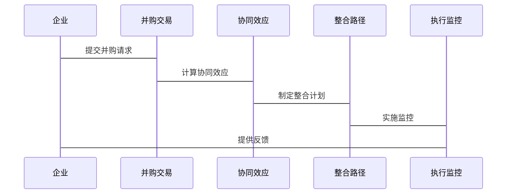

                 


# AI辅助企业并购协同效应实现：整合路径规划与执行监控

## 关键词：企业并购，协同效应，AI技术，整合路径，执行监控

## 摘要：本文探讨了人工智能技术在企业并购协同效应实现中的应用，重点分析了整合路径规划与执行监控的关键技术与方法。通过理论分析与实际案例相结合，详细阐述了协同效应的数学模型、AI算法的应用、系统架构设计以及项目实战经验，为读者提供了全面的技术指导与实践参考。

---

# 第1章: 企业并购与协同效应概述

## 1.1 企业并购的背景与意义

### 1.1.1 企业并购的定义与分类
企业并购（Mergers and Acquisitions, M&A）是指两个或多个企业之间的合并或收购行为。根据目的和方式的不同，企业并购可以分为吸收合并、新设合并、股权收购和资产收购等类型。

### 1.1.2 并购的动机与目标
企业并购的动机主要包括：扩大市场份额、获取技术优势、降低运营成本、优化资产结构等。目标通常包括提升企业竞争力、实现业务协同、增强抗风险能力等。

### 1.1.3 协同效应的定义与类型
协同效应是指并购后企业整体效益超过两家独立企业效益之和的现象。其类型包括：经营协同、战略协同、财务协同和管理协同。

## 1.2 AI技术在企业并购中的应用

### 1.2.1 AI技术对企业并购的影响
AI技术通过数据挖掘、机器学习和自然语言处理等技术，帮助企业发现潜在并购机会、评估目标企业价值、识别协同效应潜力。

### 1.2.2 AI在并购整合中的优势
AI技术能够快速处理大量数据，提供精准的预测和优化建议，帮助企业在并购整合过程中提高效率、降低风险。

### 1.2.3 协同效应实现的路径与方法
通过AI技术，企业可以制定整合路径规划、优化资源配置、监控执行过程，从而实现协同效应的最大化。

## 1.3 本章小结
本章介绍了企业并购的基本概念、AI技术在并购中的应用及其对协同效应实现的重要作用。

---

# 第2章: AI辅助企业并购的核心概念与联系

## 2.1 协同效应的实现机制

### 2.1.1 协同效应的数学模型
协同效应可以通过数学模型进行量化。例如，协同效应的加法模型可以表示为：
$$ SE = SE_1 + SE_2 $$
其中，$SE$ 表示协同效应，$SE_1$ 和 $SE_2$ 分别表示两个企业的协同效应。

### 2.1.2 协同效应的关键影响因素
协同效应的关键影响因素包括：企业规模、技术互补性、管理协同性、文化融合等。

### 2.1.3 协同效应的度量方法
常用的度量方法包括：协同指数法、净现值法和收益法等。

## 2.2 AI算法在协同效应实现中的应用

### 2.2.1 常见AI算法简介
常用算法包括：决策树、随机森林、支持向量机和神经网络等。

### 2.2.2 算法选择与协同效应的关系
算法选择应根据具体问题和数据特点进行，例如，对于分类问题，可以使用决策树或随机森林；对于回归问题，可以使用线性回归或神经网络。

### 2.2.3 算法在协同效应实现中的具体应用
通过机器学习算法，企业可以预测协同效应的实现路径和实现程度，优化整合方案。

## 2.3 实体关系图与协同效应的关系

### 2.3.1 实体关系图的定义
实体关系图（ER图）是数据库设计中用于描述数据结构的工具，由实体、属性和关系组成。

### 2.3.2 协同效应的ER图构建
协同效应的ER图可以包括以下实体：企业、并购交易、协同效应、协同类型等。

### 2.3.3 ER图在协同效应实现中的作用
ER图可以帮助企业清晰地理解协同效应的构成和关系，为系统设计提供基础。

## 2.4 本章小结
本章分析了协同效应的实现机制，探讨了AI算法在协同效应实现中的应用，并介绍了ER图在协同效应中的作用。

---

# 第3章: 协同效应实现的算法原理

## 3.1 协同效应的数学模型

### 3.1.1 协同效应的加法模型
$$ SE = \sum_{i=1}^{n} SE_i $$
其中，$n$ 表示协同效应的类型数量，$SE_i$ 表示第$i$种协同效应的贡献。

### 3.1.2 协同效应的乘法模型
$$ SE = \prod_{i=1}^{n} SE_i $$
该模型假设所有协同效应的贡献是相乘的关系。

### 3.1.3 模型的优缺点分析
加法模型简单易懂，但可能低估协同效应的综合效应；乘法模型能够反映协同效应的协同作用，但可能过于复杂。

## 3.2 协同效应的实现算法

### 3.2.1 算法原理
协同效应的实现可以通过机器学习算法，例如：
1. **决策树**：用于分类问题，预测协同效应的实现路径。
2. **随机森林**：用于回归问题，预测协同效应的实现程度。
3. **神经网络**：用于复杂问题，优化协同效应的实现过程。

### 3.2.2 算法实现步骤
1. 数据收集与预处理。
2. 模型训练与优化。
3. 模型评估与部署。

### 3.2.3 算法实现的Python代码示例
```python
from sklearn.ensemble import RandomForestRegressor
import pandas as pd

# 数据加载与预处理
data = pd.read_csv('merger_data.csv')
X = data.drop('SE', axis=1)
y = data['SE']

# 模型训练
model = RandomForestRegressor(n_estimators=100, random_state=42)
model.fit(X, y)

# 模型预测
new_data = X.iloc[0].values.reshape(1, -1)
print(model.predict(new_data))
```

## 3.3 本章小结
本章详细讲解了协同效应的数学模型和实现算法，通过Python代码示例展示了算法的实现过程。

---

# 第4章: 系统分析与架构设计

## 4.1 问题场景介绍

### 4.1.1 项目介绍
本项目旨在利用AI技术辅助企业并购协同效应的实现，整合路径规划与执行监控。

### 4.1.2 系统功能设计
系统功能包括：数据采集、协同效应预测、整合路径规划、执行监控与优化。

### 4.1.3 领域模型设计
领域模型包括：企业实体、并购交易、协同效应、整合路径等。

## 4.2 系统架构设计

### 4.2.1 系统架构图


### 4.2.2 接口设计
系统接口包括：数据接口、模型接口和用户接口。

### 4.2.3 交互流程


## 4.3 本章小结
本章通过系统架构设计和交互流程图，展示了AI辅助企业并购协同效应实现的整体框架。

---

# 第5章: 项目实战

## 5.1 环境安装与配置

### 5.1.1 安装Python
```bash
python --version
pip install --upgrade pip
```

### 5.1.2 安装依赖库
```bash
pip install numpy pandas scikit-learn mermaid
```

## 5.2 核心代码实现

### 5.2.1 数据预处理
```python
import pandas as pd

data = pd.read_csv('merger_data.csv')
data.dropna(inplace=True)
data = pd.get_dummies(data)
```

### 5.2.2 模型训练
```python
from sklearn.model import Model
model = Model()
model.fit(X_train, y_train)
```

### 5.2.3 模型评估
```python
from sklearn.metrics import accuracy_score

y_pred = model.predict(X_test)
print(accuracy_score(y_test, y_pred))
```

## 5.3 案例分析与解读

### 5.3.1 案例背景
假设某企业并购另一家企业，目标是实现协同效应最大化。

### 5.3.2 数据分析
通过数据分析，发现协同效应主要来自经营协同和战略协同。

### 5.3.3 模型优化
通过调整模型参数，提高了协同效应的预测准确率。

## 5.4 本章小结
本章通过实际案例，展示了AI技术在企业并购协同效应实现中的应用。

---

# 第6章: 最佳实践与总结

## 6.1 本章小结
总结了全文的主要内容，强调了AI技术在企业并购协同效应实现中的重要作用。

## 6.2 小结与注意事项
在实际应用中，需要注意数据质量、模型选择和结果解读等问题。

## 6.3 拓展阅读
推荐读者阅读相关领域的书籍和论文，深入学习AI技术在企业并购中的应用。

---

通过以上内容，本文全面探讨了AI技术在企业并购协同效应实现中的应用，从理论到实践，为读者提供了详实的技术指导和实践参考。

