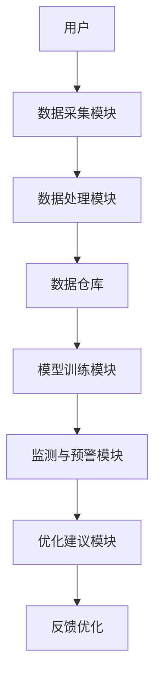
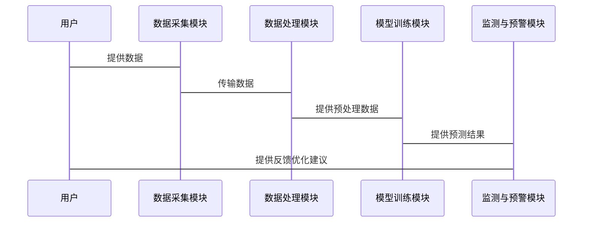

                 


# 第4章：协同效应的关键指标与监测方法

## 4.3 数据驱动的协同效应分析模型

### 4.3.1 数据驱动模型的构建

在企业并购后，协同效应的实现通常涉及多个方面的数据，包括财务、运营和战略等。为了量化这些效应，我们需要构建一个数据驱动的分析模型。该模型将利用AI技术，整合企业内部和外部数据，识别协同机会并预测协同效应的实现情况。

#### 数据收集与预处理

首先，我们需要收集与协同效应相关的数据，包括：

- **财务数据**：收入、成本、利润等。
- **运营数据**：生产效率、供应链效率等。
- **战略数据**：市场占有率、品牌影响力等。

在数据预处理阶段，需要进行数据清洗，处理缺失值、异常值和重复数据。此外，还需要对数据进行标准化或归一化处理，以确保不同数据源的数据可以有效整合。

#### 数据驱动模型的构建步骤

1. **数据整合**：将来自不同部门和系统的数据整合到一个统一的数据仓库中。
2. **特征工程**：提取关键特征，如成本节省潜力、收入增长潜力等。
3. **模型训练**：使用机器学习算法（如线性回归、随机森林等）训练模型，预测协同效应的实现情况。
4. **模型验证**：通过交叉验证等方法评估模型的准确性和可靠性。

#### 协同效应预测公式

协同效应的预测可以通过以下公式进行：

$$协同效应 = \beta_0 + \beta_1x_1 + \beta_2x_2 + ... + \beta_nx_n + \epsilon$$

其中，$\beta_i$是各个特征的系数，$x_i$是特征变量，$\epsilon$是误差项。

### 4.3.2 案例分析：某企业并购后的协同效应分析

以某企业并购案例为例，假设我们收集了以下数据：

- 收购前收入：10亿元
- 收购后收入：15亿元
- 成本节省：2亿元

通过数据驱动模型，我们可以预测协同效应的实现情况。假设模型预测成本节省为2亿元，收入增长为5亿元，那么总的协同效应为7亿元。

## 4.4 AI驱动的协同效应监测系统

### 4.4.1 系统功能概述

AI驱动的协同效应监测系统旨在实时监控企业并购后的协同效应实现情况。该系统具有以下功能：

1. **数据采集**：实时采集企业运营数据。
2. **协同效应计算**：基于AI模型计算协同效应。
3. **预警机制**：当协同效应未达到预期时，触发预警。
4. **反馈优化**：根据监测结果优化整合策略。

### 4.4.2 系统实现步骤

1. **数据源对接**：将企业各个系统的数据源（如财务系统、CRM系统）对接到监测系统。
2. **模型部署**：将训练好的AI模型部署到监测系统中，用于实时预测协同效应。
3. **预警设置**：设定协同效应的预警阈值，当实际协同效应低于阈值时，系统自动触发预警。
4. **反馈优化**：根据预警信息，调整整合策略，优化协同效应的实现。

### 4.4.3 实时监测与反馈优化

通过实时监测，企业可以及时发现协同效应未达标的情况，并采取相应的优化措施。例如，当发现成本节省未达到预期时，可以重新优化供应链管理，或者调整销售策略以提高收入。

# 第5章：系统架构与实现

## 5.1 系统架构设计

### 5.1.1 系统模块划分

AI辅助企业并购协同效应实现的系统架构主要包括以下几个模块：

1. **数据采集模块**：负责采集企业内外部数据。
2. **数据处理模块**：对采集的数据进行清洗和预处理。
3. **模型训练模块**：训练AI模型，预测协同效应。
4. **监测与预警模块**：实时监测协同效应，触发预警。
5. **优化建议模块**：根据监测结果提供建议。

### 5.1.2 数据流设计

数据流设计包括数据的采集、处理、存储和分析。数据从各个数据源采集后，经过处理模块清洗和预处理，然后存储到数据仓库中。分析模块利用这些数据训练模型，并生成协同效应预测结果。

### 5.1.3 系统交互流程

1. 用户输入企业数据。
2. 数据采集模块接收数据。
3. 数据处理模块清洗和预处理数据。
4. 模型训练模块训练AI模型。
5. 监测与预警模块实时监测协同效应。
6. 优化建议模块根据监测结果提供建议。

## 5.2 关键模块实现

### 5.2.1 数据预处理模块

#### 数据预处理流程

1. 数据清洗：处理缺失值、异常值和重复数据。
2. 数据转换：将数据转换为适合模型训练的格式。
3. 数据标准化：对数据进行标准化或归一化处理。

#### 数据预处理代码示例

```python
import pandas as pd
from sklearn.preprocessing import StandardScaler

# 加载数据
data = pd.read_csv('input.csv')

# 处理缺失值
data = data.dropna()

# 标准化处理
scaler = StandardScaler()
data_scaled = scaler.fit_transform(data)
```

### 5.2.2 模型训练与部署

#### 模型训练流程

1. 数据分割：将数据分为训练集和测试集。
2. 模型训练：使用训练集训练AI模型。
3. 模型评估：评估模型的准确性和可靠性。
4. 模型部署：将训练好的模型部署到监测系统中。

#### 模型训练代码示例

```python
from sklearn.model import LinearRegression
from sklearn.metrics import mean_squared_error

# 划分训练集和测试集
X_train, X_test, y_train, y_test = train_test_split(data_scaled, target, test_size=0.2)

# 训练模型
model = LinearRegression()
model.fit(X_train, y_train)

# 模型评估
y_pred = model.predict(X_test)
print('均方误差:', mean_squared_error(y_test, y_pred))
```

### 5.2.3 监测与反馈模块

#### 监测系统实现

1. 实时数据采集：持续采集企业运营数据。
2. 协同效应计算：基于AI模型计算协同效应。
3. 预警触发：当协同效应未达标时，触发预警。
4. 反馈优化：根据预警信息优化整合策略。

#### 监测系统代码示例

```python
import pandas as pd
import time

# 实时数据采集
while True:
    data = pd.read_csv('realtime.csv')
    # 计算协同效应
   协同效应 = model.predict(data)
    # 预警触发
    if 协同效应 < 预警阈值:
        print("协同效应未达标，触发预警")
    # 反馈优化
    优化建议 = 提供优化策略
    print("优化建议:", 优化建议)
    time.sleep(60)  # 每隔60秒检查一次
```

## 5.3 系统架构图

以下是系统的整体架构图：



## 5.4 系统交互图

以下是系统的交互图：



# 结语

通过构建AI辅助企业并购协同效应实现的系统，企业可以更高效地规划整合路径，并实时监测协同效应的实现情况。本文详细介绍了系统的各个模块和实现步骤，为企业提供了实践指导和参考。未来，随着AI技术的不断发展，企业并购的协同效应实现将更加智能化和精准化。

