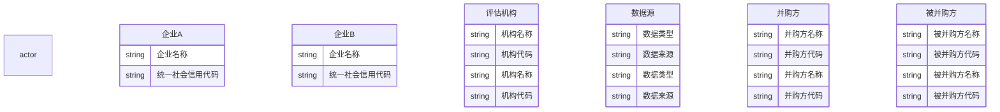
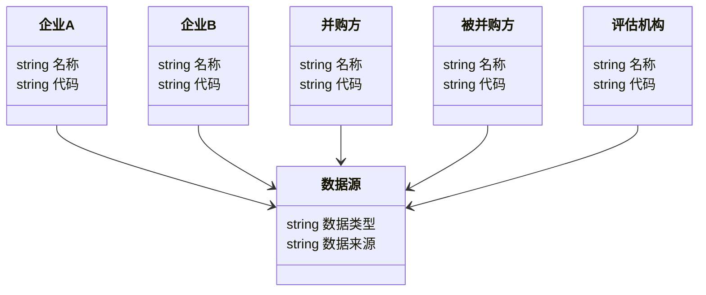

                 


# AI辅助企业并购协同效应评估：整合路径规划与效果预测

## 关键词：AI, 企业并购, 协同效应, 整合路径规划, 效果预测

## 摘要：
本文详细探讨了人工智能在企业并购协同效应评估中的应用，结合整合路径规划与效果预测的关键技术，分析了传统方法的局限性，并提出基于机器学习的解决方案。通过构建协同效应预测模型，结合实际案例，展示了如何利用AI技术优化企业并购决策，实现协同效应的精准预测与最大化。

---

# 第1章: 企业并购与协同效应概述

## 1.1 企业并购的基本概念
### 1.1.1 企业并购的定义与类型
企业并购是指一家企业通过购买或合并另一家企业来扩大规模、增强竞争力或实现战略目标的过程。常见的并购类型包括：
- **横向并购**：同一行业内的并购，旨在扩大市场份额。
- **纵向并购**：产业链上下游的并购，优化供应链。
- **混合并购**：跨行业并购，寻求多元化发展。

### 1.1.2 并购的动机与目标
企业并购的动机包括：
- **市场扩展**：进入新市场或扩大现有市场。
- **成本优势**：通过规模经济降低生产成本。
- **技术获取**：获取新技术或研发能力。
- **战略协同**：实现业务互补或协同效应。

### 1.1.3 并购的历程与现状
近年来，企业并购活动日益频繁，技术驱动型并购成为趋势，尤其是在科技、医疗和金融领域。

## 1.2 协同效应的定义与分类
### 1.2.1 协同效应的定义
协同效应是指企业在并购后，通过资源整合、效率提升和业务协同所产生的额外价值。

### 1.2.2 协同效应的主要类型
- **成本协同**：通过合并减少重复投资。
- **收入协同**：通过市场扩展或产品互补提升收入。
- **创新协同**：通过技术整合加速创新。

## 1.3 传统企业并购中的协同效应评估
### 1.3.1 传统评估方法的优缺点
- **优点**：简单易懂，易于操作。
- **缺点**：主观性强，难以量化。

## 1.4 AI技术在企业并购中的应用潜力
### 1.4.1 AI技术的基本概念与特点
AI通过数据挖掘和机器学习，能够高效处理复杂问题，提供精准预测。

### 1.4.2 AI在企业并购中的应用场景
- **协同效应预测**：通过AI模型预测并购后的协同效应。
- **整合路径规划**：优化整合流程，降低整合风险。
- **风险评估**：识别潜在风险，制定应对策略。

---

# 第2章: 协同效应评估的核心概念与模型

## 2.1 协同效应评估的理论基础
### 2.1.1 协同效应的经济学理论基础
协同效应是企业并购的经济价值，通常通过**协同效应价值**公式计算：
$$ \text{协同效应价值} = V_a + V_b - V_a^* - V_b^* $$
其中，\( V_a \) 和 \( V_b \) 分别是并购双方的独立价值，\( V_a^* \) 和 \( V_b^* \) 是并购后的价值。

### 2.1.2 协同效应的管理学理论基础
协同效应的实现需要组织文化、管理流程和人力资源的整合。

## 2.2 协同效应的多维度分析框架
### 2.2.1 协同效应的维度划分
- **财务协同**：成本节约、收入增长。
- **战略协同**：市场扩展、技术整合。
- **组织协同**：管理优化、文化融合。

## 2.3 协同效应的动态变化模型
### 2.3.1 协同效应的时间序列分析
使用ARIMA模型预测协同效应的动态变化。

## 2.4 协同效应的实体关系图（ER图）


---

# 第3章: 协同效应预测的AI算法原理

## 3.1 协同效应预测模型的构建
### 3.1.1 数据预处理
- 数据清洗：处理缺失值、异常值。
- 特征工程：提取关键特征，如收入增长率、成本节约潜力。

## 3.2 机器学习算法的选择与实现
### 3.2.1 算法选择
使用随机森林（Random Forest）进行特征重要性分析，预测协同效应。

### 3.2.2 算法实现
```python
from sklearn.ensemble import RandomForestRegressor
from sklearn.metrics import mean_squared_error

# 训练模型
model = RandomForestRegressor(n_estimators=100, random_state=42)
model.fit(X_train, y_train)

# 预测
y_pred = model.predict(X_test)
print(f"预测结果: {y_pred}")
print(f"均方误差: {mean_squared_error(y_test, y_pred)}")
```

## 3.3 协同效应预测的数学模型
### 3.3.1 线性回归模型
$$ y = \beta_0 + \beta_1 x_1 + \beta_2 x_2 + \dots + \beta_n x_n + \epsilon $$
其中，\( y \) 是协同效应，\( x_i \) 是特征变量。

### 3.3.2 随机森林模型
随机森林通过集成学习提高预测准确性。

---

# 第4章: 系统分析与架构设计

## 4.1 系统功能设计
### 4.1.1 领域模型


## 4.2 系统架构设计
```mermaid
docker
    service 前端 {
        publish 80
        command npm start
    }
    service 后端 {
        publish 3000
        command python manage.py runserver
    }
    service 数据库 {
        publish 5432
        command postgres -d postgres
    }
    前端 --> 后端
    后端 --> 数据库
```

## 4.3 系统接口设计
- **API接口**：提供RESTful API，供前端调用。
- **数据接口**：与第三方数据源对接。

---

# 第5章: 项目实战与案例分析

## 5.1 环境安装
安装Python、Jupyter、Scikit-learn等工具。

## 5.2 核心代码实现
```python
import pandas as pd
from sklearn.model_selection import train_test_split
from sklearn.ensemble import RandomForestRegressor
from sklearn.metrics import r2_score

# 加载数据
data = pd.read_csv('并购数据.csv')

# 特征与目标变量分离
X = data.drop('协同效应', axis=1)
y = data['协同效应']

# 划分训练集与测试集
X_train, X_test, y_train, y_test = train_test_split(X, y, test_size=0.2, random_state=42)

# 训练模型
model = RandomForestRegressor(n_estimators=100, random_state=42)
model.fit(X_train, y_train)

# 预测与评估
y_pred = model.predict(X_test)
print(f"R²得分: {r2_score(y_test, y_pred)}")
```

## 5.3 案例分析
以某科技公司并购为例，展示AI如何预测协同效应，优化整合路径。

---

# 第6章: 总结与展望

## 6.1 最佳实践 tips
- 数据质量是关键。
- 模型选择要结合业务场景。

## 6.2 小结
AI技术为协同效应评估提供了新的思路，但仍需在实践中不断完善。

## 6.3 注意事项
- 数据隐私问题。
- 模型的可解释性。

## 6.4 拓展阅读
推荐阅读相关领域的学术论文和行业报告。

---

通过本文的详细分析，读者可以全面了解AI在企业并购协同效应评估中的应用，并能够实际操作相关技术，为企业并购决策提供有力支持。

