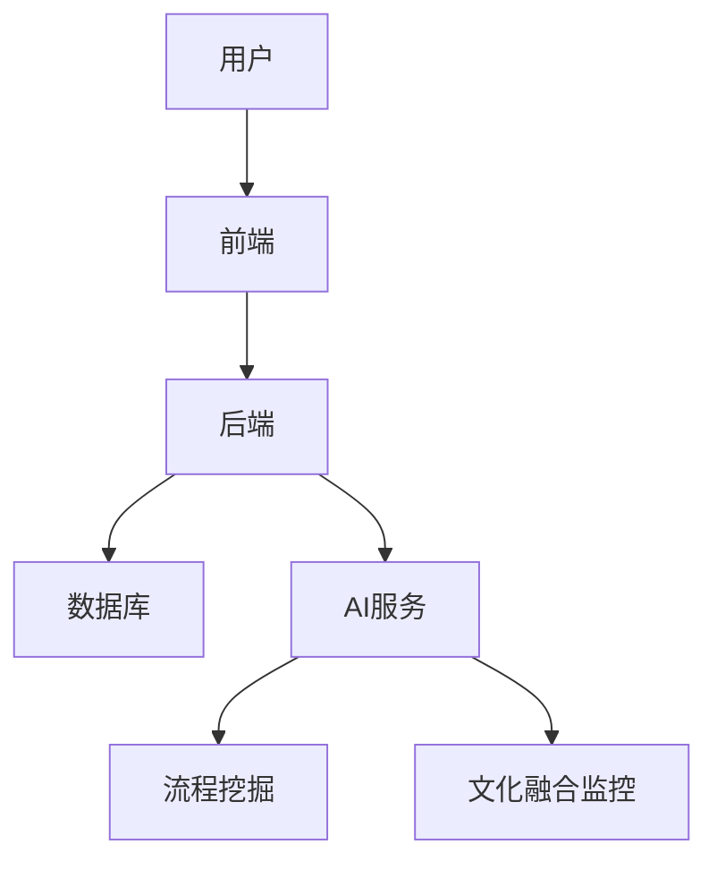
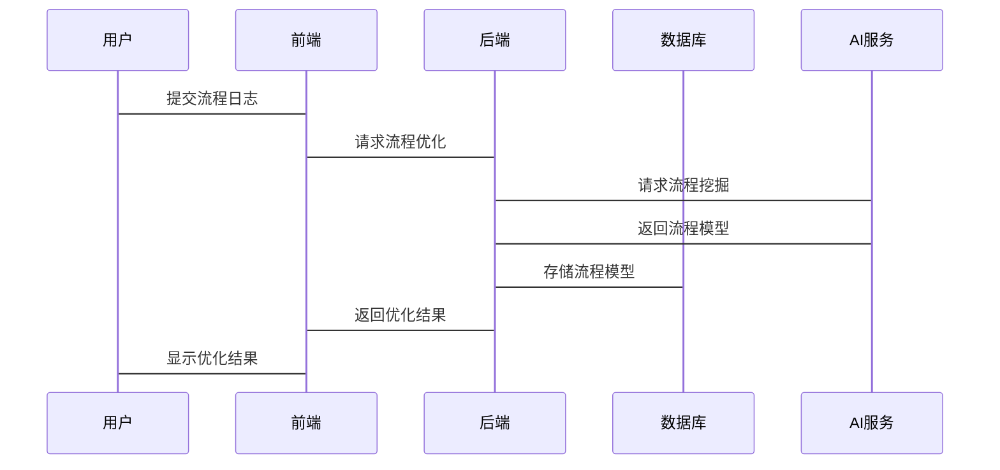

                 


# AI辅助企业并购后整合：业务流程优化与文化融合监控

## 关键词：AI、企业并购、整合、业务流程优化、文化融合、机器学习

## 摘要

在企业并购过程中，整合是决定并购成功与否的关键因素。AI技术的应用为整合提供了新的可能性。本文将探讨AI在企业并购后整合中的应用，特别是业务流程优化与文化融合监控。通过分析AI技术的基础、算法原理、系统架构及项目实战，本文旨在为企业提供一种高效、智能的整合方法。

---

## 第一章：企业并购与整合背景

### 1.1 企业并购的基本概念

#### 1.1.1 企业并购的定义与类型
企业并购（Mergers and Acquisitions, M&A）是指两个或多个企业之间的合并或收购。根据战略目标，企业并购可以分为横向并购、纵向并购和混合并购。

- 横向并购：同一行业内的企业并购，旨在扩大市场份额。
- 纵向并购：供应链上下游企业的并购，以增强控制力。
- 混合并购：不同行业之间的并购，寻求多元化发展。

#### 1.1.2 并购整合的核心目标
企业并购的整合目标通常包括：
- **协同效应**：通过资源共享降低成本，提高效率。
- **战略目标**：增强市场地位，扩大业务范围。
- **风险管理**：降低并购后的经营风险。

#### 1.1.3 并购整合的挑战与风险
并购整合面临的主要挑战包括：
- 文化冲突：不同企业文化的融合困难。
- 业务流程不兼容：原有流程的冲突与整合难度。
- 数据孤岛：信息分散，难以形成统一的数据体系。

### 1.2 AI技术在企业整合中的应用价值

#### 1.2.1 AI技术对企业整合的赋能
AI技术可以通过自动化、智能化的方式，解决整合中的复杂问题，例如：
- 数据清洗与整合。
- 业务流程自动化。
- 文化融合监控。

#### 1.2.2 AI技术在业务流程优化中的作用
AI技术可以通过以下方式优化业务流程：
- **流程挖掘**：识别流程中的瓶颈和优化点。
- **智能推荐**：基于历史数据推荐最优流程。
- **实时监控**：动态调整流程以适应变化。

#### 1.2.3 AI技术在文化融合中的潜在价值
AI技术可以通过以下方式促进文化融合：
- **情感分析**：分析员工情绪，识别文化冲突。
- **知识共享**：促进跨文化知识的传播。
- **行为预测**：预测员工行为，提前制定融合策略。

---

## 第二章：AI技术基础

### 2.1 机器学习基础

#### 2.1.1 机器学习的基本概念
机器学习是一种通过数据学习模式的技术，分为监督学习、无监督学习和强化学习。

- **监督学习**：基于标注数据进行学习，例如分类和回归。
- **无监督学习**：基于未标注数据进行学习，例如聚类和降维。
- **强化学习**：通过与环境交互学习策略。

#### 2.1.2 监督学习与无监督学习的对比
| 特性          | 监督学习         | 无监督学习       |
|---------------|------------------|------------------|
| 数据类型      | 标签数据         | 无标签数据       |
| 任务类型      | 分类、回归       | 聚类、降维       |
| 应用场景      | 预测、分类       | 群组分析         |

#### 2.1.3 算法选择与优化
常用的监督学习算法包括：
- **线性回归**：用于回归任务。
- **决策树**：适用于分类和回归。
- **支持向量机（SVM）**：适用于分类任务。

---

### 2.2 自然语言处理（NLP）基础

#### 2.2.1 NLP的基本概念与技术
NLP是研究人机交互中自然语言的处理技术，包括文本分类、实体识别和情感分析。

- **文本分类**：将文本归类到预定义的类别中。
- **实体识别**：从文本中提取命名实体。
- **情感分析**：判断文本的情感倾向。

#### 2.2.2 常见的NLP任务与应用
| 任务类型       | 应用场景         |
|----------------|------------------|
| 文本分类       | 情感分析、垃圾邮件检测 |
| 实体识别       | 信息抽取         |
| 机器翻译       | 跨语言交流         |

#### 2.2.3 NLP在文化融合中的应用
- **情感分析**：分析员工对并购的态度。
- **文本摘要**：总结企业文化文档。
- **知识图谱构建**：构建企业文化知识库。

---

### 2.3 知识图谱与语义理解

#### 2.3.1 知识图谱的基本概念
知识图谱是一种结构化的数据表示方法，由节点和边组成，表示实体及其关系。

- **节点**：代表实体或概念。
- **边**：代表实体之间的关系。

#### 2.3.2 语义理解的实现方法
语义理解可以通过以下步骤实现：
1. **分词**：将文本分割成词语。
2. **实体识别**：识别文本中的实体。
3. **关系抽取**：抽取实体之间的关系。
4. **语义推理**：基于关系进行推理。

#### 2.3.3 知识图谱在业务流程优化中的应用
- **流程挖掘**：通过知识图谱分析流程中的瓶颈。
- **智能推荐**：基于知识图谱推荐优化方案。

---

## 第三章：AI算法

### 3.1 流程挖掘算法

#### 3.1.1 流程挖掘的基本概念
流程挖掘是一种从日志数据中发现流程模型的技术。

- **日志数据**：记录流程执行的日志。
- **流程模型**：表示流程的结构和行为。

#### 3.1.2 流程挖掘的算法实现
流程挖掘的算法包括：
- **Prefix Tree**：用于发现流程的前缀结构。
- **Tree Miner**：用于发现流程的树结构。
- **Non-Dominated Prefix Tree**：用于发现流程的无支配前缀树。

#### 3.1.3 流程挖掘的应用场景
- **流程优化**：发现流程中的瓶颈。
- **异常检测**：识别流程中的异常行为。
- **知识共享**：促进流程知识的共享。

#### 3.1.4 流程挖掘的数学模型
流程挖掘的数学模型可以通过以下公式表示：
$$
\text{支持度} = \frac{\text{子过程出现的次数}}{\text{总日志数}}
$$

---

### 3.2 文化融合监控算法

#### 3.2.1 文化融合监控的基本概念
文化融合监控是通过AI技术监控文化融合的过程，识别潜在的文化冲突。

- **文化冲突**：指并购后的企业文化不兼容。
- **文化融合**：指并购后的企业文化逐渐统一。

#### 3.2.2 文化融合监控的算法实现
文化融合监控的算法包括：
- **情感分析**：分析员工对并购的态度。
- **聚类分析**：将员工分为不同的文化群体。
- **关联规则挖掘**：发现文化融合中的关联规则。

#### 3.2.3 文化融合监控的应用场景
- **文化冲突识别**：识别潜在的文化冲突。
- **文化融合预测**：预测文化融合的趋势。
- **文化融合优化**：优化文化融合的过程。

#### 3.2.4 文化融合监控的数学模型
文化融合监控的数学模型可以通过以下公式表示：
$$
\text{文化融合度} = \frac{\text{文化相似度}}{\text{文化差异度}}
$$

---

## 第四章：系统架构与设计

### 4.1 系统功能设计

#### 4.1.1 业务流程优化模块
- **流程挖掘**：发现流程中的瓶颈。
- **流程建模**：基于流程日志构建流程模型。
- **流程优化**：基于流程模型优化流程。

#### 4.1.2 文化融合监控模块
- **文化数据采集**：采集员工的文化数据。
- **文化融合分析**：分析文化融合的过程。
- **文化融合优化**：优化文化融合的过程。

### 4.2 系统架构设计

#### 4.2.1 系统架构图


#### 4.2.2 系统接口设计
- **前端接口**：提供用户交互界面。
- **后端接口**：处理用户请求。
- **数据库接口**：提供数据访问接口。
- **AI服务接口**：提供AI服务调用接口。

### 4.3 系统交互设计

#### 4.3.1 业务流程优化流程


---

## 第五章：项目实战

### 5.1 环境安装

#### 5.1.1 安装Python
```bash
# 安装Python
sudo apt-get install python3
```

#### 5.1.2 安装机器学习库
```bash
# 安装机器学习库
pip install scikit-learn
pip install numpy
pip install pandas
```

### 5.2 系统核心实现

#### 5.2.1 流程挖掘实现
```python
from sklearn.tree import DecisionTreeClassifier
from sklearn.metrics import accuracy_score

# 训练决策树模型
model = DecisionTreeClassifier()
model.fit(X_train, y_train)

# 预测测试数据
y_pred = model.predict(X_test)
print("准确率：", accuracy_score(y_test, y_pred))
```

#### 5.2.2 文化融合监控实现
```python
from sklearn.cluster import KMeans

# 训练聚类模型
model = KMeans(n_clusters=2)
model.fit(X_train)

# 预测测试数据
y_pred = model.predict(X_test)
print("聚类结果：", y_pred)
```

---

## 第六章：总结与展望

### 6.1 最佳实践

#### 6.1.1 小结
- AI技术可以显著提高企业并购后的整合效率。
- 业务流程优化和文化融合监控是整合的关键环节。

#### 6.1.2 注意事项
- 数据质量是整合的基础，需谨慎处理。
- 文化融合需要时间和耐心，需制定长期计划。

#### 6.1.3 拓展阅读
- 《企业并购与整合》
- 《人工智能在企业中的应用》

### 6.2 未来展望
- **更智能的AI算法**：开发更高效的AI算法，提升整合效果。
- **更广泛的应用场景**：探索AI在更多领域的应用。
- **更强大的数据处理能力**：提升数据处理能力，支持更大规模的整合。

---

以上是《AI辅助企业并购后整合：业务流程优化与文化融合监控》的技术博客文章的完整目录和内容框架。

