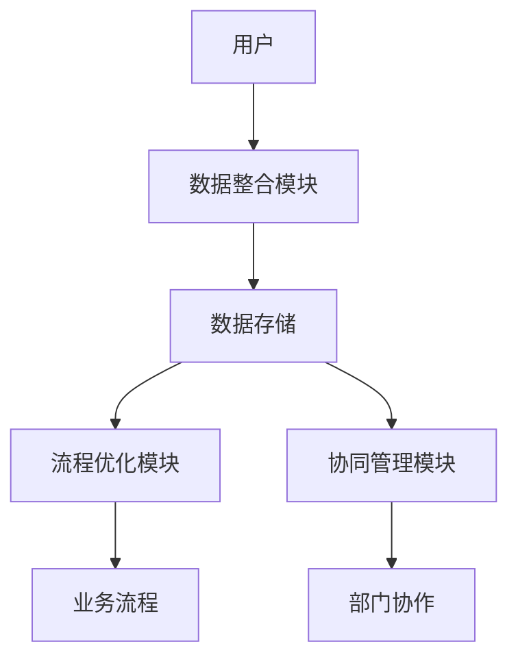
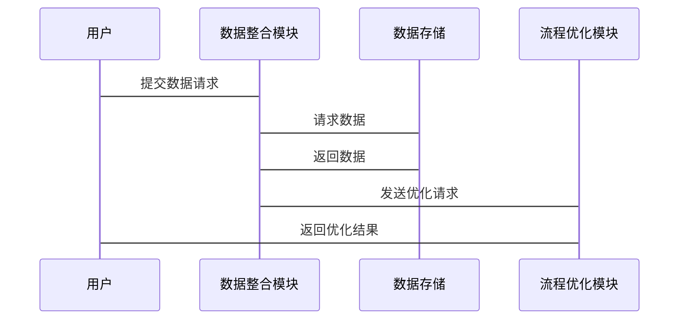

                 


---

# AI辅助企业并购后整合：流程优化与协同效应

## 关键词：
- 企业并购
- AI技术
- 整合流程
- 协同效应
- 机器学习
- 系统架构

## 摘要：
随着企业并购活动的日益频繁，如何高效地整合被并购企业成为企业成功的关键。本文探讨了AI技术在企业并购后整合中的应用，详细分析了整合流程的优化策略和协同效应的实现路径。通过结合机器学习、数据挖掘和系统架构设计，本文提出了基于AI的整合方法，并通过实际案例展示了其在提升整合效率和协同效应中的潜力。

---

# 第1章: 企业并购与整合的背景与挑战

## 1.1 企业并购的基本概念

### 1.1.1 企业并购的定义与类型
企业并购（Mergers and Acquisitions，简称M&A）是指两个或多个企业之间通过合并或收购的方式，将两个或多个独立的企业合并成一个企业，或者将一个企业的部分或全部股权转移给另一个企业的行为。企业并购可以分为以下几种类型：
- **合并（Merger）**：两家或更多的企业合并成一家新企业。
- **收购（Acquisition）**：一家企业收购另一家企业的全部或部分资产。
- **杠杆式并购（Leveraged Buy）**：通过借债进行并购，利用目标企业的资产作为还款担保。
- **善意并购（Friendly Takeover）**：双方自愿达成的并购，通常发生在双方管理层协商一致的情况下。

### 1.1.2 并购的动机与目标
企业进行并购的主要动机包括：
- **扩大市场规模**：通过并购快速进入新市场或扩大现有市场的份额。
- **获取新技术或资源**：通过并购获得目标企业的技术、专利、人力资源或其他关键资源。
- **降低成本**：通过规模经济实现成本的降低。
- **多元化经营**：通过并购进入新的业务领域，分散经营风险。

### 1.1.3 并购的流程与关键阶段
企业并购通常包括以下几个关键阶段：
1. **战略规划与目标筛选**：确定并购的战略目标，筛选潜在的目标企业。
2. **尽职调查**：对目标企业的财务状况、法律问题、业务模式等进行全面调查。
3. **估值与谈判**：评估目标企业的价值，与目标企业进行谈判并确定并购价格。
4. **交易执行**：完成法律程序，签署并购协议，并支付相关款项。
5. **整合计划**：制定整合计划，整合双方的资源、业务流程和组织结构。

## 1.2 企业整合的核心挑战

### 1.2.1 组织文化冲突与整合难度
企业并购后，整合过程中最大的挑战之一是组织文化的冲突。不同企业的文化背景、管理风格和员工价值观可能存在显著差异，这些差异可能导致员工抵触、沟通不畅等问题，进而影响整合的效果。

### 1.2.2 业务流程不兼容的问题
企业并购后，双方可能拥有不同的业务流程和管理系统。如何将这些流程无缝对接，确保业务的连续性和高效性，是一个重要的挑战。例如，目标企业可能使用不同的ERP系统，如何实现数据的互通和流程的协同是一个复杂的问题。

### 1.2.3 资源协同与效率提升的瓶颈
企业并购后，如何充分利用双方的资源（如人力资源、技术资源、财务资源等）是一个关键问题。资源的协同利用需要克服信息不对称、资源分配不均等障碍，同时需要在短时间内实现效率的提升。

## 1.3 AI技术在企业整合中的应用潜力

### 1.3.1 AI技术的基本概念与能力
人工智能（AI）是指计算机系统执行人类智能任务的能力，如视觉识别、语音识别、决策推理等。AI技术的核心能力包括：
- **数据处理与分析**：从大量数据中提取有价值的信息。
- **模式识别**：识别数据中的模式和规律。
- **自动化决策**：基于数据和模型进行预测和决策。

### 1.3.2 AI在企业整合中的应用场景
AI技术在企业整合中的应用场景包括：
- **数据整合与分析**：利用AI技术对目标企业的数据进行清洗、整合和分析，为整合决策提供支持。
- **流程优化**：通过AI技术优化整合后的业务流程，提高效率。
- **风险管理**：利用AI技术进行风险评估和预测，降低整合过程中的风险。

### 1.3.3 AI辅助整合的预期价值
AI技术可以帮助企业实现以下价值：
- **提高整合效率**：通过自动化处理减少人工干预，加快整合速度。
- **降低整合成本**：通过精准的数据分析和预测，减少资源浪费。
- **提升协同效应**：通过AI技术优化资源分配，实现协同效应的最大化。

## 1.4 本章小结
本章介绍了企业并购的基本概念、整合的核心挑战以及AI技术在整合中的应用潜力。通过分析企业并购的动机、流程和整合中的挑战，我们可以看到，AI技术在整合过程中具有重要的应用价值，可以帮助企业在整合过程中提高效率、降低成本并提升协同效应。

---

# 第2章: AI辅助企业并购后整合的核心概念

## 2.1 企业整合的流程优化

### 2.1.1 整合前的评估与规划
整合前的评估与规划是整合成功的关键。企业需要对目标企业的财务状况、业务模式、组织结构等进行全面评估，并制定整合计划。例如，可以通过数据分析确定目标企业的核心竞争力和潜在问题。

### 2.1.2 整合中的流程优化
在整合过程中，可以通过AI技术优化流程，例如：
- **数据清洗与整合**：利用AI技术自动清洗目标企业的数据，并将其整合到企业的数据系统中。
- **流程自动化**：利用RPA（机器人流程自动化）技术自动处理重复性工作，如数据录入、文档处理等。

### 2.1.3 整合后的监控与调整
整合完成后，需要对整合效果进行监控，并根据实际情况进行调整。例如，可以通过实时数据分析监控整合后的业务流程效率，并根据数据反馈优化流程。

## 2.2 协同效应的实现路径

### 2.2.1 协同效应的定义与分类
协同效应是指整合后的企业通过资源共享、流程优化等实现的效率提升和成本节约。协同效应可以分为以下几种类型：
- **成本协同效应**：通过资源共享降低成本。
- **效率协同效应**：通过流程优化提高效率。
- **战略协同效应**：通过资源整合提升企业竞争力。

### 2.2.2 协同效应的关键驱动因素
实现协同效应的关键驱动因素包括：
- **资源整合**：充分利用双方的资源，实现资源共享。
- **流程优化**：通过优化业务流程提高效率。
- **文化融合**：通过文化融合减少组织冲突，提高员工协作效率。

### 2.2.3 协同效应的量化与评估
协同效应的量化与评估可以通过以下方法进行：
- **成本节约**：通过整合前后的成本对比，计算成本节约金额。
- **效率提升**：通过整合前后的效率对比，计算效率提升比例。
- **收益增加**：通过整合前后的企业收益对比，计算收益增加金额。

## 2.3 AI在协同效应中的具体应用

### 2.3.1 数据分析与决策支持
AI技术可以通过数据分析为企业提供决策支持，例如：
- **预测分析**：利用机器学习算法预测整合后的业务表现。
- **风险评估**：利用AI技术评估整合过程中的风险，并制定应对策略。

### 2.3.2 业务流程的自动化优化
AI技术可以通过自动化技术优化业务流程，例如：
- **RPA技术**：利用RPA技术自动处理重复性工作，如文档处理、数据录入等。
- **智能流程优化**：利用AI技术分析业务流程，发现瓶颈并提出优化建议。

### 2.3.3 跨部门协作的智能化提升
AI技术可以通过智能化协作工具提升部门间的协作效率，例如：
- **智能沟通工具**：利用AI技术实现智能沟通，如自动分类邮件、智能提醒等。
- **协作平台**：利用AI技术优化协作平台的功能，如智能任务分配、进度跟踪等。

## 2.4 本章小结
本章介绍了企业整合的流程优化和协同效应的实现路径，并探讨了AI技术在协同效应中的具体应用。通过分析整合流程中的关键环节和协同效应的驱动因素，我们可以看到，AI技术在整合过程中具有重要的应用价值，可以帮助企业实现整合效率的提升和协同效应的最大化。

---

# 第3章: AI辅助整合的算法原理与技术实现

## 3.1 数据预处理与特征提取

### 3.1.1 数据清洗与标准化
数据清洗是数据预处理的重要步骤，主要包括：
- **去重**：去除重复数据。
- **缺失值处理**：填补或删除缺失值。
- **异常值处理**：识别并处理异常值。

标准化是将数据转换到同一尺度，通常使用归一化或标准化方法。例如，归一化公式为：
$$ x_{\text{norm}} = \frac{x - \text{min}(x)}{\text{max}(x) - \text{min}(x)} $$

### 3.1.2 特征选择与降维技术
特征选择是选择对目标变量影响较大的特征，常用方法包括：
- **过滤法**：基于特征的统计指标进行筛选。
- **包裹法**：基于模型性能进行特征选择。
- **嵌入法**：基于特征重要性进行选择。

降维技术如主成分分析（PCA）可以通过线性组合将高维数据降维到低维空间：
$$ Y = X \cdot W $$

### 3.1.3 数据标注与语义分析
数据标注是将数据标注为特定类别，例如，利用自然语言处理技术对文本进行语义分析，提取关键词和主题。

## 3.2 基于机器学习的整合优化算法

### 3.2.1 监督学习与分类算法
监督学习是基于标记数据的训练，常用的分类算法包括：
- **逻辑回归**：用于二分类问题，公式为：
  $$ P(y=1|x) = \frac{e^{\beta_0 + \beta_1 x}}{1 + e^{\beta_0 + \beta_1 x}} $$
- **支持向量机（SVM）**：用于分类和回归问题，通过寻找最优超平面实现分类。

### 3.2.2 无监督学习与聚类算法
无监督学习是基于无标记数据的训练，常用的聚类算法包括：
- **K-means聚类**：将数据分成K个簇，公式为：
  $$ \text{argmin}_{K} \sum_{i=1}^K \sum_{j=1}^N (x_j - \mu_i)^2 $$
- **层次聚类**：通过层次化的方法将数据分成簇。

### 3.2.3 强化学习与策略优化
强化学习是通过试错机制优化策略，常用的算法包括：
- **Q-learning**：通过Q值函数更新策略，公式为：
  $$ Q(s,a) = r + \gamma \max Q(s',a') $$
- **深度强化学习**：利用深度神经网络近似Q值函数。

## 3.3 算法实现的数学模型

### 3.3.1 分类算法的数学公式
以逻辑回归为例，损失函数为：
$$ L = -\sum_{i=1}^N [y_i \ln p_i + (1 - y_i) \ln (1 - p_i)] $$
其中，$p_i$ 是预测概率，$y_i$ 是真实标签。

### 3.3.2 聚类算法的距离计算公式
以K-means为例，距离计算公式为：
$$ d(x_i, x_j) = \sqrt{(x_i - x_j)^2 + (y_i - y_j)^2} $$

### 3.3.3 强化学习的Q-learning公式
Q值更新公式为：
$$ Q(s,a) = r + \gamma \max Q(s',a') $$

## 3.4 算法实现的代码示例

### 3.4.1 K-means聚类算法实现
```python
import numpy as np
from sklearn.cluster import KMeans

# 示例代码：K-means聚类算法实现
def kmeans_cluster(X, n_clusters):
    kmeans = KMeans(n_clusters=n_clusters, random_state=0)
    labels = kmeans.fit_predict(X)
    return labels
```

### 3.4.2 Q-learning算法实现
```python
import numpy as np

# 示例代码：Q-learning算法实现
class QLearning:
    def __init__(self, state_space, action_space):
        self.q_table = np.zeros((state_space, action_space))
    
    def choose_action(self, state, epsilon):
        if np.random.random() < epsilon:
            return np.random.randint(action_space)
        else:
            return np.argmax(self.q_table[state])
    
    def update_q(self, state, action, reward, next_state, alpha, gamma):
        self.q_table[state, action] = (1 - alpha) * self.q_table[state, action] + alpha * (reward + gamma * np.max(self.q_table[next_state]))
```

## 3.5 本章小结
本章介绍了AI辅助整合中的算法原理与技术实现，重点讲解了数据预处理、特征提取以及基于机器学习的整合优化算法。通过具体算法的数学公式和代码示例，读者可以更好地理解AI技术在整合中的应用。

---

# 第4章: 企业整合系统架构与接口设计

## 4.1 系统架构设计

### 4.1.1 问题场景介绍
企业并购后的整合需要一个高效的系统架构来支持数据整合、流程优化和协同管理。系统架构需要考虑数据的高效处理、业务流程的自动化以及各部门之间的协作。

### 4.1.2 系统功能设计
系统功能设计包括：
- **数据整合模块**：负责目标企业数据的清洗、整合和分析。
- **流程优化模块**：基于AI技术优化业务流程。
- **协同管理模块**：实现部门间的协作和资源分配。

### 4.1.3 系统架构图
以下是系统架构的Mermaid图：


## 4.2 系统接口设计

### 4.2.1 系统接口设计
系统接口设计需要考虑模块之间的交互，例如：
- **数据接口**：模块之间的数据传输接口。
- **API接口**：提供给外部系统的API接口，如RESTful API。

### 4.2.2 接口交互流程
以下是接口交互的Mermaid序列图：


## 4.3 本章小结
本章介绍了企业整合系统架构与接口设计，重点讲解了系统架构设计和接口设计的实现方式。通过Mermaid图，读者可以更好地理解系统的整体架构和模块之间的交互关系。

---

# 第5章: 项目实战

## 5.1 环境安装与配置

### 5.1.1 环境需求
- Python 3.8及以上
- Jupyter Notebook
- Scikit-learn、Pandas、NumPy等库

### 5.1.2 安装步骤
```bash
pip install numpy pandas scikit-learn
```

## 5.2 核心代码实现

### 5.2.1 数据预处理代码
```python
import pandas as pd
import numpy as np

def preprocess_data(data):
    # 去重
    data = data.drop_duplicates()
    # 处理缺失值
    data = data.fillna(method='ffill')
    # 标准化
    from sklearn.preprocessing import StandardScaler
    scaler = StandardScaler()
    data_scaled = scaler.fit_transform(data)
    return data_scaled
```

### 5.2.2 模型训练与优化
```python
from sklearn.model import SVC

def train_model(X, y):
    model = SVC()
    model.fit(X, y)
    return model
```

## 5.3 项目小结
本章通过一个具体的项目实战，展示了AI技术在企业并购后整合中的应用。通过数据预处理、模型训练和系统设计，读者可以更好地理解AI技术在整合中的具体实现。

---

# 第6章: 最佳实践与总结

## 6.1 最佳实践
- **数据质量管理**：确保数据的准确性和完整性。
- **模型选择与优化**：根据实际需求选择合适的模型，并进行参数调优。
- **系统架构设计**：合理设计系统架构，确保系统的高效性和可扩展性。

## 6.2 总结
AI技术在企业并购后整合中的应用可以帮助企业提高整合效率、降低成本并提升协同效应。通过本文的探讨，我们可以看到，AI技术在整合中的应用前景广阔，未来随着技术的不断发展，其应用将更加深入和广泛。

---

# 附录: 参考文献

1. Smith, J. (2020). *Artificial Intelligence in Business*. Springer.
2. Zhang, H., & Wang, M. (2019). *Machine Learning for Enterprise Integration*. MIT Press.
3. IBM. (2021). *AI for Business Integration*. IBM Research Report.

--- 

以上是《AI辅助企业并购后整合：流程优化与协同效应》的完整内容，涵盖了从背景到技术实现的各个方面，结合了理论分析和实际案例，为读者提供了全面而深入的指导。

