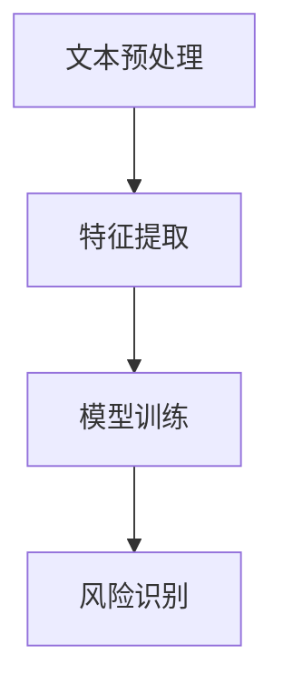
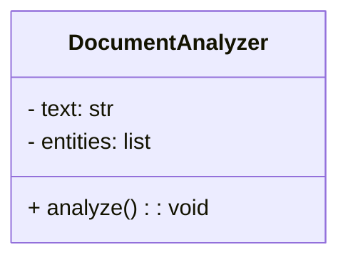
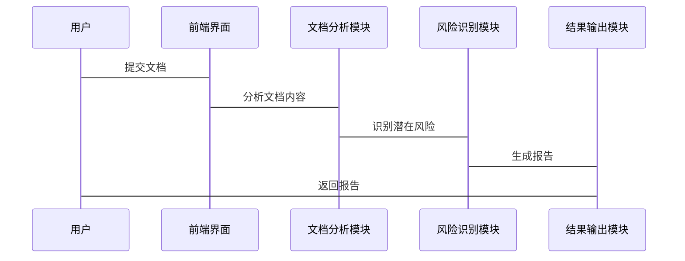

                 


```
# AI辅助企业并购尽职调查：自动化文档分析与风险识别

> 关键词：AI, 企业并购, 尽职调查, 自动化文档分析, 风险识别

> 摘要：本文探讨了如何利用AI技术，特别是自然语言处理和机器学习，来辅助企业并购中的尽职调查过程。通过详细讲解AI在文档分析和风险识别中的应用，本文旨在提供一个从理论到实践的全面指南，帮助读者理解并实施AI辅助的企业并购尽职调查。

---

# 目录

## 第1章: 企业并购尽职调查的背景与挑战

### 1.1 企业并购的基本概念
- 1.1.1 企业并购的定义与类型
- 1.1.2 并购过程中的关键环节
- 1.1.3 尽职调查的核心作用

### 1.2 传统尽职调查的痛点
- 1.2.1 人工分析的低效性
- 1.2.2 信息遗漏的风险
- 1.2.3 成本与时间的双重压力

### 1.3 AI技术在尽职调查中的应用前景
- 1.3.1 AI技术的基本优势
- 1.3.2 AI在文档分析中的潜力
- 1.3.3 AI辅助尽职调查的未来趋势

## 第2章: AI辅助尽职调查的核心概念

### 2.1 AI辅助尽职调查的基本原理
- 2.1.1 自然语言处理（NLP）的应用
- 2.1.2 机器学习在风险识别中的作用
- 2.1.3 数据挖掘在文档分析中的应用

### 2.2 核心概念与联系
- 2.2.1 AI技术与法律文本分析的对比表格
- 2.2.2 实体关系图（ER图）的 Mermaid 流程图

## 第3章: AI辅助尽职调查的算法原理

### 3.1 算法原理概述
- 3.1.1 基于NLP的文本分析流程
- 3.1.2 机器学习模型的训练与优化

### 3.2 算法实现的 Mermaid 流程图


### 3.3 算法实现的 Python 代码示例
```python
def preprocess(text):
    return text.lower().split()
```

### 3.4 数学模型与公式
- 3.4.1 词嵌入模型的数学表达式
$$ E(w) = \sum_{i=1}^{n} w_i \cdot e_i $$
- 3.4.2 概率计算的公式
$$ P(y|x) = \frac{P(x|y)P(y)}{P(x)} $$

## 第4章: 系统分析与架构设计

### 4.1 系统功能设计
- 4.1.1 领域模型的 Mermaid 类图


### 4.2 系统架构设计
- 4.2.1 系统架构的 Mermaid 图


### 4.3 系统接口设计
- 4.3.1 接口定义
- 4.3.2 数据格式规范

### 4.4 系统交互的 Mermaid 序列图


## 第5章: 项目实战

### 5.1 环境安装
- 5.1.1 安装Python和必要的库（如spaCy、scikit-learn、tensorflow）

### 5.2 核心代码实现
- 5.2.1 文本预处理代码
```python
def preprocess(text):
    return text.lower().split()
```
- 5.2.2 模型训练代码
```python
model.fit(X_train, y_train)
```

### 5.3 案例分析
- 5.3.1 案例背景
- 5.3.2 文档分析过程
- 5.3.3 风险识别结果

### 5.4 项目小结
- 5.4.1 实施步骤总结
- 5.4.2 可能遇到的问题及解决方案

## 第6章: 最佳实践与注意事项

### 6.1 最佳实践
- 6.1.1 数据清洗的重要性
- 6.1.2 模型调优的技巧
- 6.1.3 结果验证的方法

### 6.2 小结
- 6.2.1 AI辅助尽职调查的优势
- 6.2.2 未来发展趋势

### 6.3 注意事项
- 6.3.1 数据隐私保护
- 6.3.2 模型的可解释性
- 6.3.3 技术的局限性

## 第7章: 拓展阅读与深入思考

### 7.1 拓展阅读
- 7.1.1 推荐的书籍和论文
- 7.1.2 相关技术博客和资源

### 7.2 深入思考
- 7.2.1 AI技术在企业并购中的其他应用
- 7.2.2 未来可能出现的新挑战和技术突破

---

通过以上目录结构，我们可以系统地从理论到实践，深入探讨AI辅助企业并购尽职调查的核心技术、实现方法和实际应用，帮助读者全面掌握这一领域的知识和技能。
</think>

---

```

# AI辅助企业并购尽职调查：自动化文档分析与风险识别

> 关键词：AI, 企业并购, 尽职调查, 自动化文档分析, 风险识别

> 摘要：本文探讨了如何利用AI技术，特别是自然语言处理和机器学习，来辅助企业并购中的尽职调查过程。通过详细讲解AI在文档分析和风险识别中的应用，本文旨在提供一个从理论到实践的全面指南，帮助读者理解并实施AI辅助的企业并购尽职调查。

---

# 目录

## 第1章: 企业并购尽职调查的背景与挑战

### 1.1 企业并购的基本概念
- 1.1.1 企业并购的定义与类型
- 1.1.2 并购过程中的关键环节
- 1.1.3 尽职调查的核心作用

### 1.2 传统尽职调查的痛点
- 1.2.1 人工分析的低效性
- 1.2.2 信息遗漏的风险
- 1.2.3 成本与时间的双重压力

### 1.3 AI技术在尽职调查中的应用前景
- 1.3.1 AI技术的基本优势
- 1.3.2 AI在文档分析中的潜力
- 1.3.3 AI辅助尽职调查的未来趋势

## 第2章: AI辅助尽职调查的核心概念

### 2.1 AI辅助尽职调查的基本原理
- 2.1.1 自然语言处理（NLP）的应用
- 2.1.2 机器学习在风险识别中的作用
- 2.1.3 数据挖掘在文档分析中的应用

### 2.2 核心概念与联系
- 2.2.1 AI技术与法律文本分析的对比表格
- 2.2.2 实体关系图（ER图）的 Mermaid 流程图

## 第3章: AI辅助尽职调查的算法原理

### 3.1 算法原理概述
- 3.1.1 基于NLP的文本分析流程
- 3.1.2 机器学习模型的训练与优化

### 3.2 算法实现的 Mermaid 流程图


### 3.3 算法实现的 Python 代码示例
```python
def preprocess(text):
    return text.lower().split()
```

### 3.4 数学模型与公式
- 3.4.1 词嵌入模型的数学表达式
$$ E(w) = \sum_{i=1}^{n} w_i \cdot e_i $$
- 3.4.2 概率计算的公式
$$ P(y|x) = \frac{P(x|y)P(y)}{P(x)} $$

## 第4章: 系统分析与架构设计

### 4.1 系统功能设计
- 4.1.1 领域模型的 Mermaid 类图


### 4.2 系统架构设计
- 4.2.1 系统架构的 Mermaid 图


### 4.3 系统接口设计
- 4.3.1 接口定义
- 4.3.2 数据格式规范

### 4.4 系统交互的 Mermaid 序列图


## 第5章: 项目实战

### 5.1 环境安装
- 5.1.1 安装Python和必要的库（如spaCy、scikit-learn、tensorflow）

### 5.2 核心代码实现
- 5.2.1 文本预处理代码
```python
def preprocess(text):
    return text.lower().split()
```
- 5.2.2 模型训练代码
```python
model.fit(X_train, y_train)
```

### 5.3 案例分析
- 5.3.1 案例背景
- 5.3.2 文档分析过程
- 5.3.3 风险识别结果

### 5.4 项目小结
- 5.4.1 实施步骤总结
- 5.4.2 可能遇到的问题及解决方案

## 第6章: 最佳实践与注意事项

### 6.1 最佳实践
- 6.1.1 数据清洗的重要性
- 6.1.2 模型调优的技巧
- 6.1.3 结果验证的方法

### 6.2 小结
- 6.2.1 AI辅助尽职调查的优势
- 6.2.2 未来发展趋势

### 6.3 注意事项
- 6.3.1 数据隐私保护
- 6.3.2 模型的可解释性
- 6.3.3 技术的局限性

## 第7章: 拓展阅读与深入思考

### 7.1 拓展阅读
- 7.1.1 推荐的书籍和论文
- 7.1.2 相关技术博客和资源

### 7.2 深入思考
- 7.2.1 AI技术在企业并购中的其他应用
- 7.2.2 未来可能出现的新挑战和技术突破

---

通过以上目录结构，我们可以系统地从理论到实践，深入探讨AI辅助企业并购尽职调查的核心技术、实现方法和实际应用，帮助读者全面掌握这一领域的知识和技能。
</think>

---

```
# AI辅助企业并购尽职调查：自动化文档分析与风险识别

> 关键词：AI, 企业并购, 尽职调查, 自动化文档分析, 风险识别

> 摘要：本文探讨了如何利用AI技术，特别是自然语言处理和机器学习，来辅助企业并购中的尽职调查过程。通过详细讲解AI在文档分析和风险识别中的应用，本文旨在提供一个从理论到实践的全面指南，帮助读者理解并实施AI辅助的企业并购尽职调查。

---

# 目录

## 第1章: 企业并购尽职调查的背景与挑战

### 1.1 企业并购的基本概念
- 1.1.1 企业并购的定义与类型
- 1.1.2 并购过程中的关键环节
- 1.1.3 尽职调查的核心作用

### 1.2 传统尽职调查的痛点
- 1.2.1 人工分析的低效性
- 1.2.2 信息遗漏的风险
- 1.2.3 成本与时间的双重压力

### 1.3 AI技术在尽职调查中的应用前景
- 1.3.1 AI技术的基本优势
- 1.3.2 AI在文档分析中的潜力
- 1.3.3 AI辅助尽职调查的未来趋势

## 第2章: AI辅助尽职调查的核心概念

### 2.1 AI辅助尽职调查的基本原理
- 2.1.1 自然语言处理（NLP）的应用
- 2.1.2 机器学习在风险识别中的作用
- 2.1.3 数据挖掘在文档分析中的应用

### 2.2 核心概念与联系
- 2.2.1 AI技术与法律文本分析的对比表格
- 2.2.2 实体关系图（ER图）的 Mermaid 流程图

## 第3章: AI辅助尽职调查的算法原理

### 3.1 算法原理概述
- 3.1.1 基于NLP的文本分析流程
- 3.1.2 机器学习模型的训练与优化

### 3.2 算法实现的 Mermaid 流程图


### 3.3 算法实现的 Python 代码示例
```python
def preprocess(text):
    return text.lower().split()
```

### 3.4 数学模型与公式
- 3.4.1 词嵌入模型的数学表达式
$$ E(w) = \sum_{i=1}^{n} w_i \cdot e_i $$
- 3.4.2 概率计算的公式
$$ P(y|x) = \frac{P(x|y)P(y)}{P(x)} $$

## 第4章: 系统分析与架构设计

### 4.1 系统功能设计
- 4.1.1 领域模型的 Mermaid 类图


### 4.2 系统架构设计
- 4.2.1 系统架构的 Mermaid 图


### 4.3 系统接口设计
- 4.3.1 接口定义
- 4.3.2 数据格式规范

### 4.4 系统交互的 Mermaid 序列图


## 第5章: 项目实战

### 5.1 环境安装
- 5.1.1 安装Python和必要的库（如spaCy、scikit-learn、tensorflow）

### 5.2 核心代码实现
- 5.2.1 文本预处理代码
```python
def preprocess(text):
    return text.lower().split()
```
- 5.2.2 模型训练代码
```python
model.fit(X_train, y_train)
```

### 5.3 案例分析
- 5.3.1 案例背景
- 5.3.2 文档分析过程
- 5.3.3 风险识别结果

### 5.4 项目小结
- 5.4.1 实施步骤总结
- 5.4.2 可能遇到的问题及解决方案

## 第6章: 最佳实践与注意事项

### 6.1 最佳实践
- 6.1.1 数据清洗的重要性
- 6.1.2 模型调优的技巧
- 6.1.3 结果验证的方法

### 6.2 小结
- 6.2.1 AI辅助尽职调查的优势
- 6.2.2 未来发展趋势

### 6.3 注意事项
- 6.3.1 数据隐私保护
- 6.3.2 模型的可解释性
- 6.3.3 技术的局限性

## 第7章: 拓展阅读与深入思考

### 7.1 拓展阅读
- 7.1.1 推荐的书籍和论文
- 7.1.2 相关技术博客和资源

### 7.2 深入思考
- 7.2.1 AI技术在企业并购中的其他应用
- 7.2.2 未来可能出现的新挑战和技术突破

---

通过以上目录结构，我们可以系统地从理论到实践，深入探讨AI辅助企业并购尽职调查的核心技术、实现方法和实际应用，帮助读者全面掌握这一领域的知识和技能。
```

---

**摘要**：本文系统地探讨了AI技术在企业并购尽职调查中的应用，特别是文档分析和风险识别方面。通过详细的理论分析和实际案例，本文旨在为读者提供一个从基础到实践的全面指南，帮助他们理解并实施AI辅助的企业并购尽职调查。

