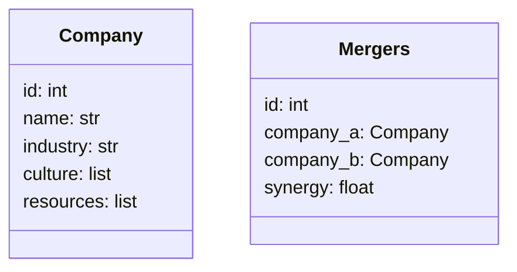
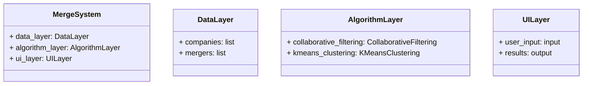

                 


# AI辅助企业并购整合规划：文化融合与业务协同路径的智能设计

> 关键词：AI, 企业并购, 文化融合, 业务协同, 系统架构, 项目实战

> 摘要：本文详细探讨了人工智能在企业并购整合中的应用，重点分析了文化融合与业务协同的智能设计路径。通过结合实际案例和系统架构，阐述了AI技术在数据挖掘、自然语言处理和机器学习等领域的核心作用，并提出了智能化整合规划的最佳实践方法。

---

# 第一部分: AI辅助企业并购整合规划的背景与核心概念

## 第1章: 企业并购整合的基本概念与挑战

### 1.1 企业并购的定义与流程
#### 1.1.1 企业并购的定义
企业并购（Mergers and Acquisitions, M&A）是指两个或多个企业之间的合并或收购行为，旨在通过资源整合、优势互补，实现更大的市场竞争力和经济效益。

#### 1.1.2 并购的基本流程
企业并购通常包括以下几个阶段：
1. **战略规划**：确定并购目标和战略意图。
2. **目标筛选**：识别潜在的并购标的。
3. **尽职调查**：对目标企业进行详细评估。
4. **整合规划**：制定文化融合和业务协同的具体方案。
5. **实施与监控**：执行整合计划并持续优化。

#### 1.1.3 并购的类型与特点
企业并购可以分为横向并购、纵向并购和混合并购。每种类型的并购都有其独特的特点和适用场景。

---

### 1.2 企业并购整合的核心问题
#### 1.2.1 文化融合的挑战
文化差异可能导致团队冲突、沟通不畅等问题，影响整合效果。

#### 1.2.2 业务协同的难点
业务流程的标准化、资源共享和协同效率等问题需要克服。

#### 1.2.3 资源整合的复杂性
如何高效整合人力资源、技术资源和财务资源是并购整合的关键。

---

### 1.3 传统企业并购整合的局限性
#### 1.3.1 信息不对称的问题
传统方法难以全面、精准地评估目标企业的核心竞争力。

#### 1.3.2 整合效率低下
手工整合方式耗时长、成本高，且容易出现遗漏和错误。

#### 1.3.3 文化冲突的风险
文化差异可能导致团队合作失败，影响企业长期发展。

---

### 1.4 AI技术在企业并购整合中的应用前景
#### 1.4.1 AI技术的核心优势
AI技术能够通过数据挖掘、机器学习和自然语言处理等手段，帮助企业在并购过程中实现高效决策。

#### 1.4.2 AI在文化融合与业务协同中的作用
AI可以帮助企业识别文化差异、优化业务流程，并预测整合后的协同效应。

#### 1.4.3 企业并购整合的智能化趋势
随着AI技术的不断发展，智能化整合将成为企业并购的主流方式。

---

## 第2章: AI辅助企业并购整合的核心概念与联系

### 2.1 AI技术在企业并购中的核心应用领域
#### 2.1.1 数据挖掘与分析
通过分析企业历史数据，识别潜在并购目标和整合风险。

#### 2.1.2 自然语言处理
利用NLP技术分析企业文档和文化差异，辅助文化融合决策。

#### 2.1.3 机器学习与预测
通过机器学习模型预测并购后的协同效应和整合风险。

---

### 2.2 企业并购整合的关键要素与AI技术的结合
#### 2.2.1 企业文化的数字化表示
将企业文化转化为数据，便于AI模型进行分析和匹配。

#### 2.2.2 业务流程的智能化优化
通过AI技术优化业务流程，提高整合效率和协同效果。

---

> **本章小结**：AI技术在企业并购整合中的应用前景广阔，尤其是在数据挖掘、自然语言处理和机器学习领域。通过AI技术，企业可以更高效地解决文化融合和业务协同的问题，提升并购整合的整体效果。

---

# 第二部分: AI辅助企业并购整合的算法原理与系统架构

## 第3章: AI辅助企业并购整合的核心算法原理

### 3.1 协同过滤算法
#### 3.1.1 算法原理
协同过滤是一种基于用户行为数据的推荐算法，常用于寻找潜在的并购目标。

#### 3.1.2 算法实现
```python
def collaborative_filtering(user_matrix):
    # 计算用户相似性
    similarity_matrix = compute_similarity(user_matrix)
    # 生成推荐结果
    recommendations = []
    for user in user_matrix:
        similar_users = find_top_k(similarity_matrix, user)
        recommendations.append(weighted_avg(similar_users))
    return recommendations
```

#### 3.1.3 应用场景
协同过滤算法可以用于预测并购后的协同效应。

---

### 3.2 聚类分析算法
#### 3.2.1 算法原理
聚类分析是一种无监督学习算法，用于将企业分成不同的类别，便于目标筛选。

#### 3.2.2 算法实现
```python
from sklearn.cluster import KMeans

def kmeans_clustering(data, n_clusters):
    model = KMeans(n_clusters=n_clusters)
    model.fit(data)
    return model.predict(data)
```

#### 3.2.3 应用场景
聚类分析可以用于识别具有相似特征的潜在并购目标。

---

### 3.3 系统架构设计方案
#### 3.3.1 领域模型


#### 3.3.2 系统架构
```mermaid
rect
    分为三个主要部分：数据层、算法层和应用层。数据层包含企业数据，算法层包括各种AI算法，应用层提供用户界面和结果展示。
```

---

## 第4章: 企业并购整合的系统分析与架构设计方案

### 4.1 问题场景介绍
企业并购整合过程中，文化差异和业务协同问题亟待解决。

### 4.2 系统功能设计


---

### 4.3 系统架构设计
```mermaid
rect
    系统架构包括数据层、算法层和应用层。数据层负责存储企业数据，算法层负责处理数据并生成结果，应用层负责与用户交互并展示结果。
```

---

## 第5章: 项目实战与案例分析

### 5.1 项目环境安装
需要安装Python、机器学习库（如scikit-learn）和自然语言处理库（如spaCy）。

### 5.2 核心代码实现
```python
import pandas as pd
from sklearn.metrics.pairwise import cosine_similarity

def compute_similarity(data):
    return cosine_similarity(data)
```

### 5.3 案例分析
通过一个具体案例，展示如何利用AI技术进行企业并购整合。

---

## 第6章: 最佳实践与总结

### 6.1 小结
AI技术在企业并购整合中的应用前景广阔，尤其是在数据挖掘和机器学习领域。

### 6.2 注意事项
数据质量和模型可解释性是AI辅助并购整合的关键。

### 6.3 拓展阅读
推荐阅读相关领域的书籍和论文，深入理解AI在企业并购中的应用。

---

**本文通过系统的分析和详细的案例，展示了AI技术在企业并购整合中的巨大潜力和实际应用价值。未来，随着AI技术的不断进步，企业并购整合将更加智能化和高效化。**

