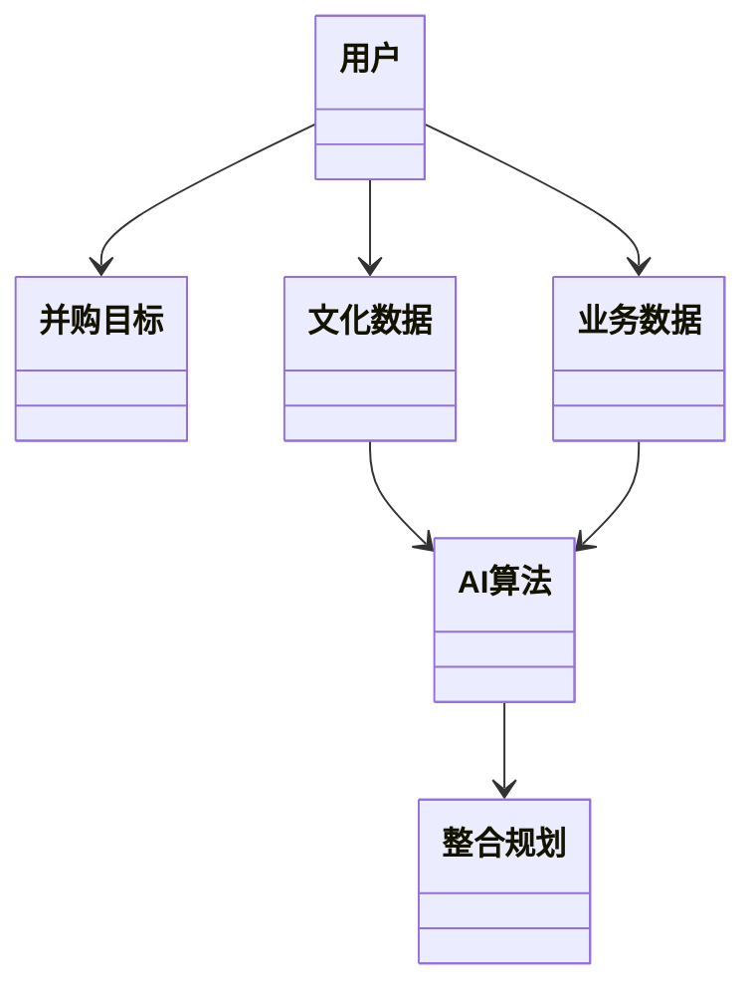

                 


# AI辅助企业并购整合规划：文化融合与业务协同路径设计

> 关键词：企业并购、AI辅助、文化融合、业务协同、整合规划

> 摘要：随着企业并购活动的日益频繁，如何有效进行整合规划成为关键。本文探讨了AI技术在企业并购整合中的应用，特别是文化融合与业务协同路径的设计。通过分析整合规划的框架、协同过滤算法的应用、系统架构设计以及实际案例，本文详细阐述了如何利用AI技术优化企业并购过程，确保文化融合与业务协同的成功。

---

## 目录大纲：

1. 背景与概述
2. 核心概念与联系
3. 算法原理讲解
4. 系统分析与架构设计方案
5. 项目实战
6. 最佳实践与总结
7. 拓展阅读

---

# 第一部分：背景与概述

## 第1章：企业并购整合的背景与挑战

### 1.1 企业并购的现状与趋势

#### 1.1.1 全球企业并购的现状分析

企业并购（Mergers and Acquisitions, M&A）是企业战略发展的重要手段，通过并购可以快速扩大规模、获取技术优势、进入新市场等。近年来，全球企业并购活动持续活跃，尤其在科技领域，AI技术的应用使得并购整合更加高效。

#### 1.1.2 数字化转型对企业并购的影响

数字化转型推动企业业务模式和管理方式的变革，企业并购也随之发生变化。AI技术的应用帮助企业更好地分析并购目标的潜力，优化整合规划，降低整合风险。

#### 1.1.3 并购整合中的主要挑战

企业在并购后整合过程中面临诸多挑战，如文化冲突、业务协同不畅、组织结构调整困难等。传统的整合方法效率低下，难以应对复杂多变的市场环境。

### 1.2 AI技术在企业并购中的应用背景

#### 1.2.1 AI技术对企业并购的推动作用

AI技术在企业并购中的应用主要体现在数据处理、模式识别和决策支持等方面。通过AI技术，企业可以更快速地分析目标企业的情况，评估整合风险，制定最优整合策略。

#### 1.2.2 数据驱动的整合规划的重要性

企业并购整合需要基于大量的数据进行分析，包括财务数据、业务数据、组织数据等。AI技术能够从这些数据中提取有价值的信息，为整合规划提供科学依据。

#### 1.2.3 AI辅助并购的优势与局限性

AI辅助并购的优势在于高效性、精准性和可扩展性，但其局限性在于依赖数据质量和模型准确性。AI无法完全替代人类的判断，需要结合实际情况进行调整。

### 1.3 文化融合与业务协同的重要性

#### 1.3.1 文化冲突对企业并购的影响

文化差异可能导致企业并购后的管理混乱、员工士气低落，进而影响企业绩效。因此，文化融合是并购整合成功的关键因素之一。

#### 1.3.2 业务协同对并购成功的关键作用

业务协同是指并购后的企业在业务流程、资源分配、市场开拓等方面的协调一致。良好的业务协同能够提高企业效率，增强竞争力。

#### 1.3.3 AI如何促进文化融合与业务协同

AI技术可以通过分析企业文化和业务数据，帮助企业制定文化融合策略和业务协同方案，优化整合过程。

---

## 第二部分：核心概念与联系

## 第2章：AI辅助企业并购整合的核心概念

### 2.1 整合规划的框架

#### 2.1.1 整合规划的定义与目标

整合规划是企业并购后对组织结构、业务流程、资源分配等方面进行系统性规划的过程。其目标是实现并购后的协同效应，最大化企业价值。

#### 2.1.2 整合规划的关键要素

整合规划的关键要素包括战略目标、组织结构、业务流程、资源分配等。这些要素需要在并购前进行详细分析和规划。

#### 2.1.3 AI在整合规划中的应用

AI技术可以通过数据分析、预测建模等方式，帮助企业在整合规划中识别潜在风险，制定最优策略。

### 2.2 文化融合的模型

#### 2.2.1 文化融合的定义与分类

文化融合是指并购后的企业在文化理念、管理风格、企业制度等方面的融合过程。常见的文化融合模式包括吸收式融合、合作式融合等。

#### 2.2.2 不同文化背景下的融合策略

不同文化背景下，企业并购的文化融合策略有所不同。例如，在跨国并购中，需要考虑东道国的文化差异，制定相应的融合策略。

#### 2.2.3 AI在文化融合中的作用

AI技术可以通过分析企业文化和员工行为数据，帮助企业制定文化融合策略，优化文化融合过程。

### 2.3 业务协同的路径设计

#### 2.3.1 业务协同的定义与层次

业务协同是指并购后的企业在业务流程、资源分配、市场开拓等方面的协调一致。业务协同的层次包括战略层、管理层、操作层等。

#### 2.3.2 不同业务模式的协同路径

不同业务模式下，业务协同的路径有所不同。例如，在制造企业中，协同路径可能包括供应链整合、生产流程优化等。

#### 2.3.3 AI如何优化业务协同流程

AI技术可以通过数据分析、预测建模等方式，帮助企业在业务协同过程中优化流程，提高效率。

---

## 第三部分：算法原理讲解

## 第3章：协同过滤算法在企业并购中的应用

### 3.1 协同过滤算法概述

#### 3.1.1 协同过滤的基本原理

协同过滤是一种基于用户行为数据推荐系统。通过分析用户的历史行为，预测用户的兴趣，推荐相关内容。

#### 3.1.2 基于用户的协同过滤

基于用户的协同过滤是通过分析用户之间的相似性，推荐用户感兴趣的内容。其核心在于计算用户之间的相似度。

#### 3.1.3 基于物品的协同过滤

基于物品的协同过滤是通过分析物品之间的相似性，推荐用户可能感兴趣的内容。其核心在于计算物品之间的相似度。

### 3.2 协同过滤算法的实现

#### 3.2.1 数据预处理与特征提取

数据预处理包括数据清洗、特征提取等。特征提取是通过选择相关特征，提高模型的准确性。

#### 3.2.2 相似度计算公式

$$sim(i,j) = \frac{\sum_{k=1}^{n} w_{ik} w_{jk}}{\sqrt{\sum_{k=1}^{n} w_{ik}^2} \sqrt{\sum_{k=1}^{n} w_{jk}^2}}$$

其中，$w_{ik}$和$w_{jk}$分别表示用户$i$和$j$对物品$k$的评分。

#### 3.2.3 协同过滤算法的实现步骤

1. 数据预处理：清洗数据，提取特征。
2. 计算相似度：基于用户或物品的相似度计算。
3. 推荐生成：根据相似度排序，生成推荐列表。

---

## 第四部分：系统分析与架构设计方案

## 第4章：系统架构设计

### 4.1 问题场景介绍

#### 4.1.1 企业并购中的整合问题

企业在并购后需要解决组织结构、业务流程、资源分配等方面的问题，确保整合顺利进行。

#### 4.1.2 系统目标

系统目标是通过AI技术辅助企业并购整合，优化文化融合与业务协同过程。

#### 4.1.3 系统范围

系统范围包括企业并购前的分析、并购后的整合规划，以及整合过程中的监控与调整。

### 4.2 系统功能设计

#### 4.2.1 领域模型类图



#### 4.2.2 系统架构图

```mermaid
aws
  ```

---

## 第五部分：项目实战

## 第5章：项目实战

### 5.1 环境安装

#### 5.1.1 安装Python

```bash
python --version
pip install --upgrade pip
```

#### 5.1.2 安装所需库

```bash
pip install numpy pandas scikit-learn
```

### 5.2 核心代码实现

#### 5.2.1 协同过滤算法实现

```python
from sklearn.metrics.pairwise import cosine_similarity

def calculate_similarity(matrix):
    return cosine_similarity(matrix)
```

---

## 第六部分：最佳实践与总结

## 第6章：最佳实践与总结

### 6.1 小结

企业在并购整合过程中需要结合实际情况，灵活运用AI技术，确保整合规划的顺利进行。

### 6.2 注意事项

在使用AI技术辅助企业并购时，需要注意数据质量、模型选择和实际应用效果。

### 6.3 拓展阅读

建议读者进一步阅读相关书籍和文献，深入了解AI在企业并购中的应用。

---

## 第七部分：拓展阅读

## 第7章：拓展阅读

### 7.1 推荐书籍

1. 《企业并购与整合管理》
2. 《人工智能在商业中的应用》

### 7.2 相关论文

1. "AI in Mergers and Acquisitions" by Smith et al.
2. "Data-Driven Integration Planning" by Johnson et al.

---

# 结语

通过本文的详细阐述，读者可以全面了解AI技术在企业并购整合中的应用，特别是文化融合与业务协同路径的设计。希望本文能够为企业的并购整合提供有价值的参考和指导。

--- 

**注：由于篇幅限制，本文仅为目录大纲和部分内容的展示，完整文章将按照上述结构详细展开。**

