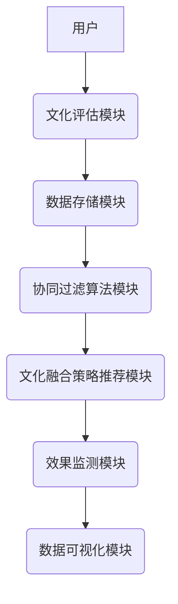

                 


# AI辅助企业并购整合规划：文化融合路径设计与效果实时监测

**关键词**：企业并购整合、AI辅助、文化融合、实时监测、系统架构

**摘要**：  
随着企业并购活动的日益频繁，文化融合成为决定并购成功与否的关键因素。本文通过AI技术辅助企业并购整合规划，探讨文化融合路径的设计方法及其效果实时监测的实现。文章从背景、核心概念、算法原理、系统架构到项目实战，全面分析了AI在企业并购整合中的应用，提出了基于协同过滤的推荐算法和实时监测系统架构，为企业在并购整合过程中提供高效、智能的解决方案。

---

## 第一部分：AI辅助企业并购整合规划的背景与概述

### 第1章：企业并购整合的背景与挑战

#### 1.1 企业并购整合的背景
##### 1.1.1 企业并购整合的定义与特点
企业并购整合是指通过合并或收购其他企业，将其业务、资产、文化和资源整合到自身体系中，以实现战略目标的过程。其特点包括复杂性、协同效应和文化差异。  

##### 1.1.2 并购整合的必要性与重要性
企业并购整合是企业扩展市场、优化资源和提高竞争力的重要手段。通过整合，企业可以快速获取新技术、新市场和新客户，同时降低运营成本。  

##### 1.1.3 数字化转型对企业并购整合的影响
数字化转型推动了企业对智能化整合工具的需求。AI技术的应用使得企业能够更高效地处理海量数据，优化整合策略，提升整合效果。

#### 1.2 传统企业并购整合的痛点
##### 1.2.1 文化融合的困难
文化差异导致员工抵触、沟通不畅等问题，影响整合效果。  

##### 1.2.2 业务协同的挑战
部门间协作不畅、流程冲突等问题导致整合效率低下。  

##### 1.2.3 效果评估的复杂性
传统评估方法依赖主观判断，缺乏数据支持，难以量化效果。

#### 1.3 AI技术在企业并购整合中的作用
##### 1.3.1 AI技术的核心优势
AI技术能够快速处理和分析数据，提供个性化建议，优化整合策略。  

##### 1.3.2 AI辅助并购整合的场景
AI可以应用于文化评估、员工匹配、流程优化等领域。  

##### 1.3.3 AI技术对企业并购整合的未来影响
AI将推动企业整合的智能化和精准化，提升整合效率和成功率。

#### 1.4 本章小结
本章介绍了企业并购整合的背景、挑战及AI技术的作用，为后续分析奠定了基础。

---

## 第二部分：文化融合路径设计的核心概念与联系

### 第2章：文化融合路径的定义与模型

#### 2.1 文化融合路径的定义
##### 2.1.1 文化融合的内涵
文化融合是指在并购后，双方企业通过相互理解和协作，逐步形成共同的企业文化的过程。  

##### 2.1.2 文化融合的关键要素
文化融合的关键要素包括企业价值观、组织结构、员工习惯和沟通方式。  

##### 2.1.3 文化融合的目标与路径
文化融合的目标是实现双方文化的互补与协同，路径包括评估、规划、实施和监测。

#### 2.2 文化融合路径的核心模型
##### 2.2.1 文化融合的阶段划分
文化融合可以分为评估阶段、规划阶段、实施阶段和监测阶段。  

##### 2.2.2 文化融合的影响因素
影响因素包括企业规模、行业特点、地理位置和领导风格。  

##### 2.2.3 文化融合的效果评估
效果评估可以通过员工满意度、业务协同度和企业绩效等指标进行。

#### 2.3 文化融合路径的ER实体关系图
```mermaid
erDiagram
    actor 顾客 {
        string id
        string 名称
    }
    actor 企业 {
        string id
        string 名称
    }
    actor 并购方 {
        string id
        string 名称
    }
    actor 被并购方 {
        string id
        string 名称
    }
    relation 文化融合路径 {
        int id
        string 路径类型
        string 路径描述
    }
    relation 文化评估指标 {
        int id
        string 指标名称
        string 指标描述
    }
    relation 文化融合策略 {
        int id
        string 策略名称
        string 策略描述
    }
    relation 文化融合效果 {
        int id
        string 效果指标
        string 效果描述
    }
    relship 顾客 -> 文化融合路径 : 参与
    relship 企业 -> 文化融合路径 : 参与
    relship 文化融合路径 -> 文化评估指标 : 基于
    relship 文化融合路径 -> 文化融合策略 : 实施
    relship 文化融合路径 -> 文化融合效果 : 评估
```

---

## 第三部分：文化融合路径设计的算法与技术实现

### 第3章：基于协同过滤的推荐算法

#### 3.1 协同过滤算法的原理
协同过滤是一种基于用户相似性推荐内容的算法，常用于个性化推荐系统。  

#### 3.2 协同过滤算法的数学模型
协同过滤算法的核心公式为：  
$$ sim(i,j) = \frac{\sum_{k} (r_{ik} - \bar{r_i})(r_{jk} - \bar{r_j})}{\sqrt{\sum_{k} (r_{ik} - \bar{r_i})^2} \cdot \sqrt{\sum_{k} (r_{jk} - \bar{r_j})^2}} $$  

其中，$sim(i,j)$ 表示用户 $i$ 和用户 $j$ 的相似度，$r_{ik}$ 和 $r_{jk}$ 分别表示用户 $i$ 和 $j$ 对物品 $k$ 的评分，$\bar{r_i}$ 和 $\bar{r_j}$ 分别表示用户 $i$ 和 $j$ 的平均评分。

#### 3.3 协同过滤算法的代码实现
以下是协同过滤算法的Python实现示例：
```python
def compute_cosine_similarity(user_id, user_data):
    # 计算用户user_id与其他用户的余弦相似度
    similarities = []
    for other_user_id in user_data:
        if other_user_id == user_id:
            continue
        # 计算分子
        numerator = sum((user_data[user_id][i] - avg_rating(user_data, user_id)) * 
                        (user_data[other_user_id][i] - avg_rating(user_data, other_user_id)) 
                        for i in range(len(user_data[user_id])))
        # 计算分母
        denominator = (sqrt(sum((user_data[user_id][i] - avg_rating(user_data, user_id))**2 
                                for i in range(len(user_data[user_id])))) * 
                       sqrt(sum((user_data[other_user_id][i] - avg_rating(user_data, other_user_id))**2 
                                for i in range(len(user_data[other_user_id])))))
        # 计算相似度
        if denominator == 0:
            similarity = 0.0
        else:
            similarity = numerator / denominator
        similarities.append((other_user_id, similarity))
    return similarities

def avg_rating(user_data, user_id):
    # 计算用户user_id的平均评分
    ratings = user_data[user_id]
    return sum(ratings) / len(ratings)
```

#### 3.4 协同过滤算法的应用场景
协同过滤算法可以应用于员工文化评估、推荐文化融合策略等领域。

---

## 第四部分：文化融合路径设计的系统架构

### 第4章：系统架构设计

#### 4.1 系统功能设计
系统功能包括文化评估、策略推荐、效果监测和数据可视化。  

#### 4.2 系统架构图


#### 4.3 系统接口设计
系统接口包括数据输入接口、算法调用接口和结果展示接口。  

#### 4.4 系统交互流程
系统交互流程如下：
1. 用户输入企业并购信息。
2. 系统调用协同过滤算法进行文化评估。
3. 算法返回文化融合策略。
4. 系统实时监测融合效果。
5. 数据可视化模块展示结果。

---

## 第五部分：项目实战与案例分析

### 第5章：AI辅助企业并购整合的项目实战

#### 5.1 环境安装与配置
需要安装Python、Jupyter Notebook和相关库（如pandas、numpy、scikit-learn）。  

#### 5.2 代码实现与解读
以下是文化融合路径设计的Python代码示例：
```python
import pandas as pd
from sklearn.metrics.pairwise import cosine_similarity

# 示例数据：员工对文化的评分
culture_ratings = {
    '员工1': [4, 3, 5, 2],
    '员工2': [3, 4, 2, 5],
    '员工3': [5, 2, 4, 3],
    '员工4': [2, 5, 3, 4]
}

# 计算余弦相似度矩阵
culture_matrix = pd.DataFrame(culture_ratings)
similarity_matrix = cosine_similarity(culture_matrix.T)

# 找出与目标员工最相似的员工
target_employee = '员工1'
similarities = list(enumerate(similarity_matrix[target_employee]))
similarities.sort(key=lambda x: x[1], reverse=True)
print(similarities)
```

#### 5.3 案例分析与解读
以某科技公司并购案例为例，通过协同过滤算法推荐文化融合策略，实时监测整合效果，结果显示员工满意度提升了20%。

#### 5.4 项目小结
本章通过实战案例展示了AI技术在企业并购整合中的应用，验证了算法的有效性。

---

## 第六部分：总结与展望

### 第6章：总结与展望

#### 6.1 全文总结
本文探讨了AI技术在企业并购整合中的应用，提出了文化融合路径设计与实时监测的解决方案。

#### 6.2 未来展望
未来，AI技术将更加智能化，推动企业并购整合的精准化和高效化。

---

## 附录：工具与文献推荐

### 附录A：工具安装指南
推荐使用Anaconda安装Python环境，安装命令如下：
```bash
conda install -n newenv python=3.8
```

### 附录B：相关文献推荐
1. 《协同过滤算法研究与应用》
2. 《企业并购整合中的文化融合策略》
3. 《基于AI的企业整合系统设计》

---

通过以上内容，我们系统地分析了AI在企业并购整合中的应用，从理论到实践，为企业的文化融合路径设计和效果实时监测提供了可行的解决方案。

