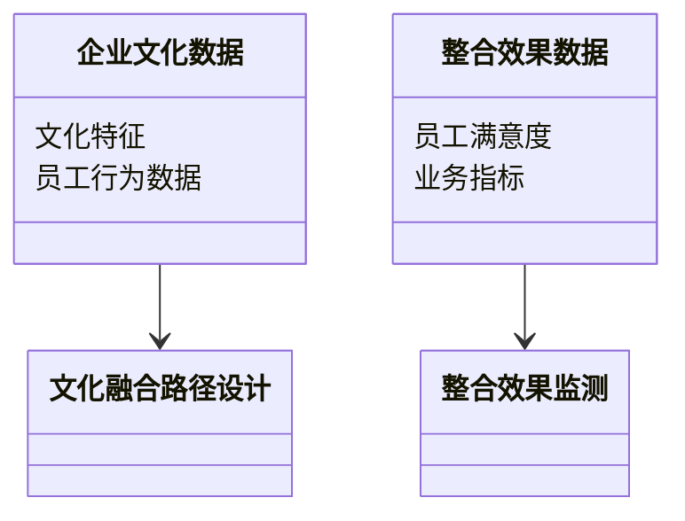
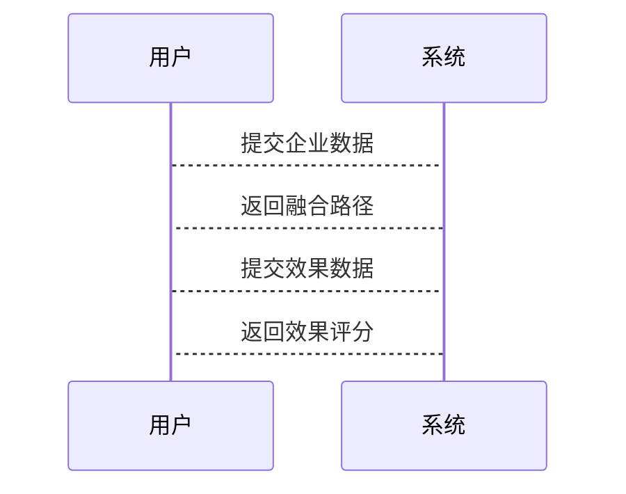

                 


# AI辅助企业并购整合规划：文化融合路径设计与效果监测

---

## 关键词：AI辅助、企业并购、文化融合、效果监测、路径设计、系统架构

---

## 摘要：  
在企业并购过程中，文化融合是整合成功与否的关键因素之一。本文通过分析AI技术在企业并购整合中的应用，提出了一种基于AI的路径设计与效果监测方法。我们从文化融合的核心概念出发，结合协同过滤和聚类分析算法，设计了一套完整的AI辅助系统架构。通过实际案例分析和系统实现，展示了如何利用AI技术优化文化融合路径并实时监测整合效果。文章最后总结了AI辅助企业并购整合的实践经验和未来发展方向。

---

# 正文

## 第1章: 企业并购整合的背景与挑战

### 1.1 企业并购的背景与现状

#### 1.1.1 企业并购的定义与分类  
企业并购（Mergers and Acquisitions，M&A）是指两个或多个企业之间的合并或收购行为。根据目的和方式的不同，企业并购可以分为吸收合并、新设合并、控股合并等多种形式。并购的目的是为了优化资源配置、扩大市场份额、提升竞争力等。

#### 1.1.2 并购整合的必要性与挑战  
企业并购后，整合是确保并购成功的关键环节。整合的核心在于组织结构、业务流程、企业文化和人力资源的融合。然而，文化差异、组织惯性、信息不对称等因素常常导致整合失败或效果不佳。AI技术的引入为解决这些问题提供了新的思路。

#### 1.1.3 数字化时代的企业整合趋势  
随着数字化转型的推进，企业并购整合越来越依赖技术手段。AI技术的应用不仅提高了整合的效率，还能够通过数据分析发现潜在问题，优化整合路径。

---

### 1.2 AI技术在企业整合中的作用

#### 1.2.1 AI技术对企业整合的赋能  
AI技术可以通过数据挖掘、机器学习等方法，帮助企业发现潜在的文化冲突、优化整合策略，并实时监测整合效果。

#### 1.2.2 AI在文化融合中的应用潜力  
文化融合是企业整合的核心，AI可以通过分析员工行为数据、组织文化特征，设计个性化的融合路径。

#### 1.2.3 效果监测的智能化路径  
通过自然语言处理（NLP）和情感分析技术，AI可以实时监测员工满意度、文化融合程度等指标，为整合决策提供数据支持。

---

## 第2章: 文化融合与效果监测的核心概念

### 2.1 文化融合的定义与关键要素

#### 2.1.1 文化融合的内涵  
文化融合是指在企业并购后，将两家企业的文化和价值观进行有机结合，形成新的组织文化。它不仅包括显性文化（如企业制度、价值观）的融合，还包括隐性文化（如员工习惯、信仰）的融合。

#### 2.1.2 文化融合的关键维度  
- **组织结构**：包括企业层级、管理风格、决策流程等。  
- **企业价值观**：包括企业使命、愿景、核心价值观等。  
- **员工行为**：包括工作习惯、沟通方式、团队协作等。  

#### 2.1.3 文化融合的实现路径  
文化融合的实现路径包括文化评估、文化匹配、文化整合和文化优化四个阶段。

---

### 2.2 效果监测的定义与指标体系

#### 2.2.1 效果监测的内涵  
效果监测是指在企业并购整合过程中，通过数据采集和分析，评估整合效果的过程。它可以帮助企业及时发现问题并调整整合策略。

#### 2.2.2 监测指标的设计原则  
- **可量化性**：指标应能够量化，便于数据采集和分析。  
- **相关性**：指标应与整合目标密切相关。  
- **动态性**：指标应能够反映整合过程中的动态变化。  

#### 2.2.3 监测指标的分类与应用  
- **定量指标**：如员工满意度、业务指标达成率等。  
- **定性指标**：如组织氛围、文化冲突程度等。  

---

## 第3章: AI辅助企业并购整合的核心概念

### 3.1 AI辅助整合的定义与特点

#### 3.1.1 定义与核心要素  
AI辅助整合是指利用人工智能技术，为企业并购整合提供智能化支持的过程。其核心要素包括数据采集、模型构建、算法设计和效果反馈。

#### 3.1.2 AI辅助整合的优势  
- **高效性**：AI可以快速处理大量数据，提高整合效率。  
- **精准性**：AI可以通过数据分析发现潜在问题，提高整合的精准性。  
- **可扩展性**：AI技术可以应用于不同规模和类型的企业并购。  

#### 3.1.3 AI辅助整合的局限性  
- **数据依赖性**：AI技术需要大量高质量的数据支持。  
- **模型局限性**：AI模型的预测能力受到数据质量和算法限制。  

---

### 3.2 文化融合路径设计的AI模型

#### 3.2.1 模型的输入与输出  
- **输入**：企业文化数据、员工行为数据等。  
- **输出**：文化融合路径、文化匹配度评分等。  

#### 3.2.2 模型的训练与优化  
通过协同过滤算法，模型可以学习企业的文化特征，并根据相似性推荐融合路径。

#### 3.2.3 模型的评估与验证  
通过混淆矩阵、准确率、召回率等指标，评估模型的性能。

---

### 3.3 效果监测的AI算法框架

#### 3.3.1 算法的输入与输出  
- **输入**：员工满意度数据、业务指标数据等。  
- **输出**：整合效果评分、问题预警等。  

#### 3.3.2 算法的核心步骤  
1. 数据采集与预处理。  
2. 模型训练与优化。  
3. 效果预测与反馈。  

#### 3.3.3 算法的可扩展性与适应性  
- **可扩展性**：算法可以扩展到更多企业类型和场景。  
- **适应性**：算法可以根据企业需求进行参数调整。  

---

## 第4章: 文化融合路径设计的算法原理

### 4.1 协同过滤算法

#### 4.1.1 算法的基本原理  
协同过滤算法通过分析用户行为数据，找到相似用户的偏好，推荐个性化的内容。

#### 4.1.2 算法的实现步骤  
1. 数据预处理：去除缺失值、标准化数据。  
2. 计算相似度：使用余弦相似度或欧氏距离。  
3. 推荐路径：基于相似度排序，生成融合路径。  

#### 4.1.3 算法的优缺点分析  
- **优点**：简单易懂，计算效率高。  
- **缺点**：对稀疏数据敏感，可能存在过拟合问题。  

---

### 4.2 聚类分析算法

#### 4.2.1 算法的基本原理  
聚类分析算法通过将相似的对象分组，发现数据中的潜在结构。

#### 4.2.2 算法的实现步骤  
1. 数据预处理：去除噪声数据、归一化数据。  
2. 选择聚类方法：如K-means、层次聚类等。  
3. 聚类结果分析：根据聚类结果优化融合路径。  

#### 4.2.3 算法的优缺点分析  
- **优点**：能够发现数据中的潜在模式。  
- **缺点**：需要人工干预选择聚类数目，计算复杂度较高。  

---

## 第5章: 效果监测的数学模型与公式

### 5.1 文化融合效果的数学模型

#### 5.1.1 模型的输入与输出  
- **输入**：员工满意度、文化冲突度等指标。  
- **输出**：融合效果评分、问题预警等。  

#### 5.1.2 模型的核心公式  
$$ \text{融合效果评分} = \alpha \cdot \text{员工满意度} + \beta \cdot \text{文化冲突度} $$  
其中，$\alpha$ 和 $\beta$ 是权重系数，根据企业需求调整。

---

## 第6章: 系统分析与架构设计方案

### 6.1 问题场景介绍

#### 6.1.1 系统目标  
设计一个基于AI的企业并购整合系统，支持文化融合路径设计和效果监测。

#### 6.1.2 项目介绍  
通过AI技术实现企业并购整合的智能化支持，优化文化融合路径，实时监测整合效果。

---

### 6.2 系统功能设计

#### 6.2.1 领域模型设计  


#### 6.2.2 系统架构设计  


#### 6.2.3 系统接口设计  
- **输入接口**：企业文化数据接口、员工行为数据接口。  
- **输出接口**：融合路径输出接口、效果监测输出接口。  

---

### 6.3 系统交互设计

#### 6.3.1 交互流程  


---

## 第7章: 项目实战

### 7.1 环境安装

#### 7.1.1 系统环境  
- Python 3.8+  
- PyTorch 1.9+  
- Pandas 1.3+  
- Scikit-learn 0.24+  

#### 7.1.2 安装依赖  
```bash
pip install numpy pandas scikit-learn
```

---

### 7.2 系统核心实现

#### 7.2.1 文化融合路径设计代码  
```python
import numpy as np
from sklearn.metrics.pairwise import cosine_similarity

# 示例数据：企业A和企业B的文化特征向量
A = np.array([0.8, 0.2, 0.5])
B = np.array([0.6, 0.7, 0.4])

# 计算相似度
similarity = cosine_similarity([A, B])[0, 1]
print(f"文化相似度：{similarity}")
```

#### 7.2.2 效果监测代码  
```python
import pandas as pd
from sklearn.cluster import KMeans

# 示例数据：员工满意度数据
data = pd.DataFrame({
    '员工ID': [1, 2, 3, 4, 5],
    '满意度': [85, 70, 90, 60, 80]
})

# 模型训练
model = KMeans(n_clusters=2)
model.fit(data[['满意度']])
print(f"聚类结果：{model.labels_}")
```

---

### 7.3 实际案例分析

#### 7.3.1 案例背景  
某跨国企业并购一家本地企业，希望通过AI技术优化文化融合路径。

#### 7.3.2 数据分析  
- 企业A文化特征：创新、开放、协作。  
- 企业B文化特征：严谨、规范、团队。  

#### 7.3.3 融合路径设计  
通过协同过滤算法，推荐企业A和B的融合路径为“协作创新”，并实时监测员工满意度。

---

## 第8章: 总结与展望

### 8.1 最佳实践

#### 8.1.1 小结  
本文提出了一种基于AI的企业并购整合方法，通过协同过滤和聚类分析算法，优化文化融合路径并实时监测整合效果。

#### 8.1.2 注意事项  
- 数据质量对模型性能影响较大，需确保数据的完整性和准确性。  
- 模型的可解释性需进一步优化，便于企业理解和应用。  

#### 8.1.3 拓展阅读  
推荐阅读《企业并购整合的AI优化策略》和《基于机器学习的文化融合路径设计》。

---

## 关键词：AI辅助、企业并购、文化融合、效果监测、路径设计、系统架构

---

## 摘要：  
在企业并购过程中，文化融合是整合成功与否的关键因素之一。本文通过分析AI技术在企业并购整合中的应用，提出了一种基于AI的路径设计与效果监测方法。我们从文化融合的核心概念出发，结合协同过滤和聚类分析算法，设计了一套完整的AI辅助系统架构。通过实际案例分析和系统实现，展示了如何利用AI技术优化文化融合路径并实时监测整合效果。文章最后总结了AI辅助企业并购整合的实践经验和未来发展方向。

