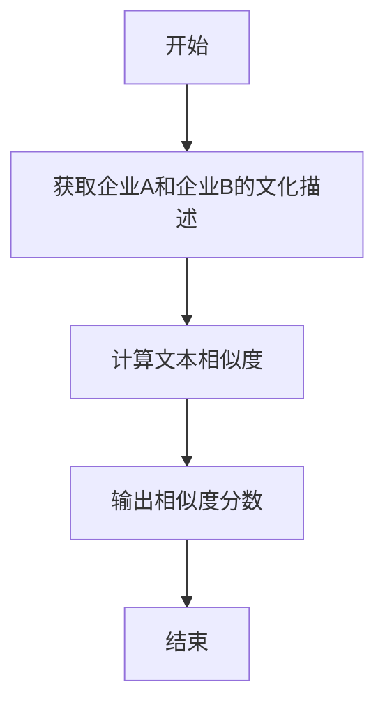
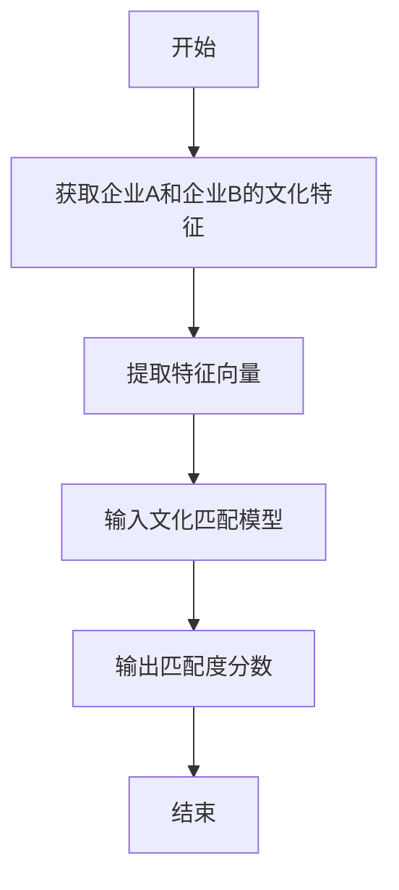
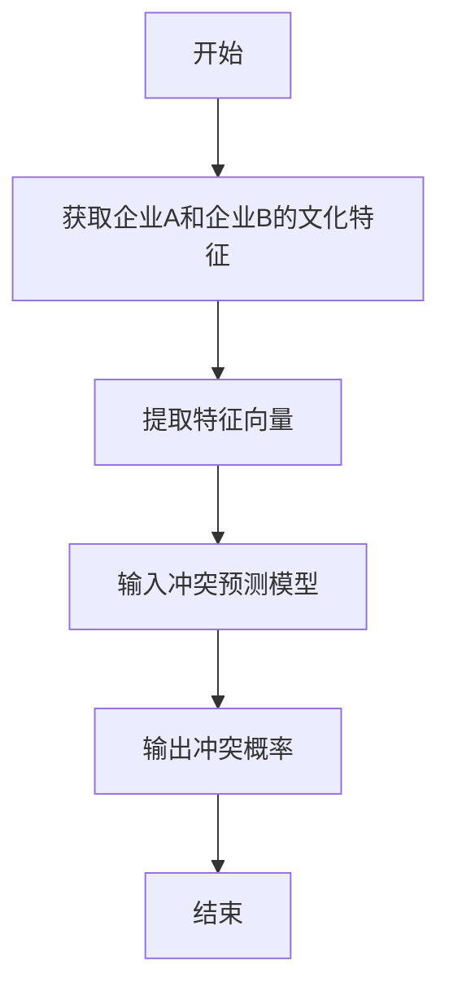
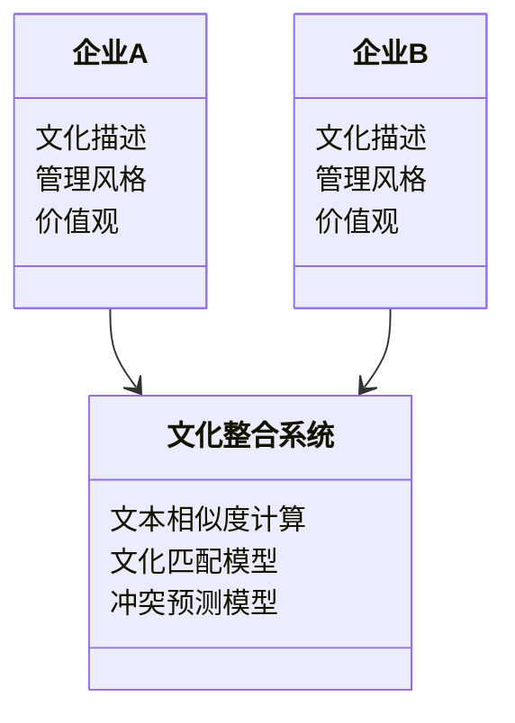
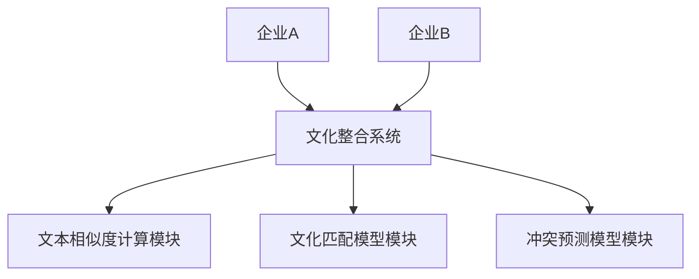
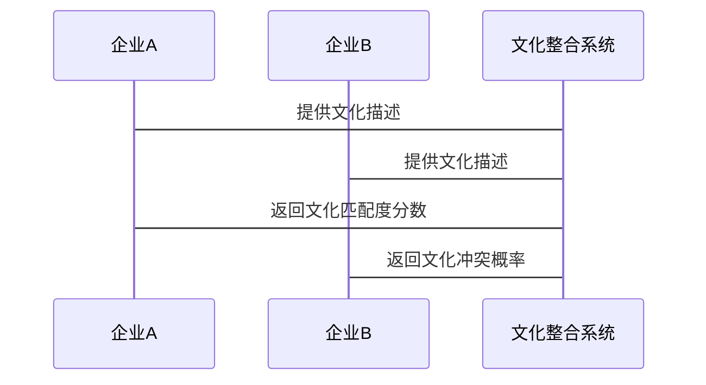

                 


# AI辅助企业并购文化整合：减少冲突

> 关键词：企业并购、文化整合、人工智能、冲突预测、文化匹配模型、文本相似度、机器学习

> 摘要：企业并购是商业世界中最重要的战略决策之一，而文化整合是决定并购成功与否的关键因素。本文将探讨如何利用人工智能技术辅助企业并购中的文化整合过程，减少文化冲突，提高并购成功率。文章从企业并购的文化整合问题出发，详细分析了AI技术在文化匹配、冲突预测中的应用，结合具体算法和系统设计，提供了实践案例和代码实现。最后，本文总结了AI辅助文化整合的最佳实践和未来发展方向。

---

# 第一部分：AI辅助企业并购文化整合的背景与核心概念

---

## 第1章：企业并购与文化整合概述

### 1.1 企业并购的基本概念

#### 1.1.1 企业并购的定义与类型

企业并购（Mergers and Acquisitions, M&A）是指两个或多个企业之间的合并或收购行为。根据并购的主体和目的，可以将企业并购分为以下几种类型：

- **横向并购**：同一行业内的企业并购，旨在扩大市场份额或消除竞争。
- **纵向并购**：产业链上下游企业的并购，以增强供应链控制能力。
- **混合并购**：跨行业或跨领域的并购，通常是为了多元化经营或获取新技术、新市场。

#### 1.1.2 并购中的文化整合问题

企业并购不仅仅是资产的合并，更是企业文化的融合。文化整合是并购后能否成功的重要因素。然而，文化整合往往面临以下问题：

- **文化冲突**：不同企业的管理风格、价值观和企业文化的差异可能导致员工不满或工作效率下降。
- **信息不对称**：在并购过程中，双方的文化差异可能被忽视或低估。
- **文化整合的复杂性**：文化整合需要时间和资源，而企业在并购后可能急于实现财务目标，忽视了文化整合的重要性。

#### 1.1.3 文化整合对并购成功的影响

文化整合的成功与否直接影响并购后的绩效。研究表明，文化整合良好的企业并购后，员工满意度更高，企业绩效更好，客户忠诚度也更高。文化整合失败可能导致员工流失、效率下降，甚至并购失败。

---

### 1.2 AI技术在企业并购中的应用前景

#### 1.2.1 AI技术在企业分析中的作用

人工智能（AI）技术可以通过分析企业的历史数据、市场表现和文化特征，帮助企业更好地评估并购目标的价值和风险。例如：

- **自然语言处理（NLP）**：通过分析企业年报、新闻报道等文本数据，提取企业的文化特征和管理风格。
- **机器学习（ML）**：通过训练模型，预测企业并购后的文化整合风险和成功率。

#### 1.2.2 AI在文化匹配中的潜在价值

AI技术可以帮助企业在并购过程中找到文化匹配度更高的目标企业，从而降低文化冲突的风险。例如：

- **文本相似度计算**：通过NLP技术，计算企业文化的文本相似度，评估两家企业的文化匹配度。
- **文化匹配模型**：基于机器学习算法，构建文化匹配模型，预测企业并购后的文化兼容性。

#### 1.2.3 当前AI在企业并购中的应用现状

目前，AI技术在企业并购中的应用主要集中在以下几个方面：

- **企业估值**：通过AI分析企业的财务数据和市场表现，帮助企业进行估值。
- **风险预测**：通过AI预测并购后的潜在风险，如市场风险、技术风险和文化风险。
- **文化匹配**：通过AI分析企业文化的匹配度，辅助企业选择更适合的并购目标。

---

### 1.3 本章小结

本章从企业并购的基本概念出发，分析了文化整合在并购中的重要性，并探讨了AI技术在企业并购中的潜在应用。通过本章，读者可以了解文化整合对并购成功的关键作用，以及AI技术在文化整合中的巨大潜力。

---

## 第2章：企业并购中的文化整合问题

### 2.1 文化整合的核心概念

#### 2.1.1 企业文化的基本构成

企业文化是企业在长期经营过程中形成的管理风格、价值观和行为准则的总和。主要包括以下几个方面：

- **企业愿景和使命**：企业的长期目标和存在的意义。
- **企业价值观**：企业在经营中所推崇的核心价值，如客户至上、创新、效率等。
- **管理风格**：企业的管理方式，如集权型、民主型、参与型等。

#### 2.1.2 文化整合的定义与目标

文化整合是指在企业并购后，通过协调和融合双方的企业文化，形成新的企业文化的过程。其目标是实现文化互补、减少冲突、提高员工满意度和企业绩效。

#### 2.1.3 文化整合的关键要素

文化整合的关键要素包括：

- **企业文化的兼容性**：双方企业文化在核心价值观、管理风格等方面的相似性。
- **员工的接受度**：员工对新文化的态度和适应能力。
- **领导的支持**：企业领导对文化整合的重视和资源投入。

---

### 2.2 并购中文化整合的主要挑战

#### 2.2.1 文化冲突的常见类型

文化冲突是并购中常见的问题，主要表现为以下几种类型：

- **管理风格冲突**：一方采用集权式管理，另一方采用民主式管理。
- **价值观冲突**：一方注重短期收益，另一方注重长期发展。
- **沟通方式冲突**：一方倾向于直接沟通，另一方倾向于间接沟通。

#### 2.2.2 文化整合中的信息不对称问题

在并购过程中，双方可能因为信息不对称而导致文化整合失败。例如：

- **文化差异未被充分识别**：在并购前，双方未能充分了解彼此的企业文化差异。
- **文化整合计划不完善**：并购后，缺乏系统的文化整合计划，导致文化冲突加剧。

#### 2.2.3 文化整合的资源分配难题

文化整合需要投入大量资源，包括时间、人力和资金。然而，企业在并购后可能更关注财务目标，忽视了文化整合的资源需求。

---

### 2.3 文化整合对并购绩效的影响

#### 2.3.1 文化整合与并购成功率的关系

研究表明，文化整合良好的企业并购，其成功率显著高于文化整合失败的企业并购。文化整合成功的企业，员工满意度更高，企业绩效更优秀。

#### 2.3.2 文化整合对员工满意度的影响

文化整合直接影响员工的满意度。如果员工感受到的文化冲突较小，他们更可能对企业并购持积极态度，从而提高工作效率和忠诚度。

#### 2.3.3 文化整合对长期发展的意义

文化整合不仅影响并购后的短期绩效，还影响企业的长期发展。良好的文化整合有助于企业形成协同效应，增强市场竞争力。

---

### 2.4 本章小结

本章详细分析了文化整合的核心概念和并购中文化整合的主要挑战。通过本章，读者可以理解文化整合在企业并购中的重要性，以及文化冲突可能带来的负面影响。

---

## 第3章：AI辅助文化整合的核心概念与联系

### 3.1 AI在文化整合中的应用原理

#### 3.1.1 自然语言处理在企业文化分析中的应用

自然语言处理（NLP）技术可以通过分析企业的文本数据，提取企业文化的核心特征。例如：

- **文本相似度计算**：通过计算企业文化的文本相似度，评估两家企业的文化匹配度。
- **情感分析**：通过分析员工对企业文化的评价，评估员工满意度和文化认同感。

#### 3.1.2 机器学习在文化匹配中的作用

机器学习（ML）技术可以通过训练模型，预测企业并购后的文化整合风险和成功率。例如：

- **文化匹配模型**：通过训练数据，构建文化匹配模型，预测企业并购后的文化兼容性。
- **冲突预测模型**：通过历史数据，训练冲突预测模型，预测并购后的文化冲突风险。

#### 3.1.3 数据挖掘在文化整合中的价值

数据挖掘技术可以通过分析企业的历史数据，发现文化整合的潜在规律。例如：

- **文化整合的成功案例分析**：通过分析成功案例，提取文化整合的关键成功因素。
- **文化冲突的失败案例分析**：通过分析失败案例，识别文化整合中的潜在风险。

---

### 3.2 AI辅助文化整合的核心算法

#### 3.2.1 文本相似度计算算法

文本相似度计算是AI辅助文化整合的重要技术之一。常用的文本相似度计算算法包括：

- **余弦相似度**：通过向量的内积计算文本相似度。
- **Word2Vec**：通过词向量计算文本相似度。
- **BERT**：通过深度学习模型计算文本相似度。

#### 3.2.2 文化匹配模型构建算法

文化匹配模型是AI辅助文化整合的核心算法之一。常用的算法包括：

- **K-近邻算法（KNN）**：基于距离度量，找到最相似的企业文化。
- **随机森林**：基于决策树的集成算法，预测文化匹配度。
- **深度学习模型（如LSTM）**：通过序列模型，预测文化匹配度。

#### 3.2.3 冲突预测算法

冲突预测是AI辅助文化整合的重要应用之一。常用的算法包括：

- **逻辑回归**：通过概率模型，预测文化冲突的风险。
- **XGBoost**：通过梯度提升算法，预测文化冲突的风险。
- **LSTM**：通过时间序列模型，预测文化冲突的风险。

---

### 3.3 算法原理与流程图

#### 3.3.1 文本相似度计算流程图



#### 3.3.2 文化匹配模型流程图



#### 3.3.3 冲突预测流程图



---

### 3.4 本章小结

本章详细介绍了AI辅助文化整合的核心算法和流程图。通过本章，读者可以理解AI技术在文化整合中的具体应用和算法实现。

---

## 第4章：AI辅助文化整合的数学模型与算法实现

---

### 4.1 文本相似度计算模型

#### 4.1.1 基于余弦相似度的文本相似度计算

余弦相似度是一种常用的文本相似度计算方法，其公式为：

$$
\text{余弦相似度} = \frac{\vec{A} \cdot \vec{B}}{|\vec{A}| \times |\vec{B}|}
$$

其中，$\vec{A}$和$\vec{B}$分别是企业A和企业B的文化描述向量。

---

#### 4.1.2 基于Word2Vec的文本向量化

Word2Vec是一种常用的文本向量化方法，通过训练词向量模型，将文本转换为向量表示。例如：

```python
# 示例代码：使用Word2Vec计算文本向量
from gensim.models import Word2Vec
model = Word2Vec.load("model.bin")
vector_A = model.wv[“企业A”]
vector_B = model.wv[“企业B”]
similarity = vector_A.dot(vector_B) / (np.linalg.norm(vector_A) * np.linalg.norm(vector_B))
```

---

#### 4.1.3 基于BERT的文本相似度计算

BERT是一种基于深度学习的文本相似度计算方法，通过预训练模型计算文本的向量表示。例如：

```python
# 示例代码：使用BERT计算文本相似度
from transformers import BertTokenizer, BertModel
tokenizer = BertTokenizer.from_pretrained('bert-base-uncased')
model = BertModel.from_pretrained('bert-base-uncased')
encoded_A = tokenizer.encode("企业A的文化描述", add_special_tokens=True, return_tensors='pt')
encoded_B = tokenizer.encode("企业B的文化描述", add_special_tokens=True, return_tensors='pt')
outputs_A = model(encoded_A)
outputs_B = model(encoded_B)
similarity = torch.cosine_similarity(outputs_A.last_hidden_state, outputs_B.last_hidden_state)
```

---

### 4.2 文化匹配模型构建

#### 4.2.1 基于K-近邻算法的文化匹配

K-近邻算法是一种常用的分类算法，可以用于文化匹配模型的构建。例如：

```python
# 示例代码：基于K-近邻算法的文化匹配
from sklearn.neighbors import KNeighborsClassifier
# 假设我们有企业A和企业B的文化特征向量
X = [vector_A, vector_B]
y = [0, 1]
knn = KNeighborsClassifier(n_neighbors=3)
knn.fit(X, y)
# 预测企业A和企业B的文化匹配度
print(knn.predict([vector_A]))
```

---

#### 4.2.2 基于随机森林的文化匹配模型

随机森林是一种基于决策树的集成算法，可以用于文化匹配模型的构建。例如：

```python
# 示例代码：基于随机森林的文化匹配
from sklearn.ensemble import RandomForestClassifier
# 假设我们有企业A和企业B的文化特征向量
X = [vector_A, vector_B]
y = [0, 1]
rf = RandomForestClassifier(n_estimators=100)
rf.fit(X, y)
# 预测企业A和企业B的文化匹配度
print(rf.predict([vector_A]))
```

---

#### 4.2.3 基于深度学习的文化匹配模型

深度学习模型（如LSTM）也可以用于文化匹配模型的构建。例如：

```python
# 示例代码：基于LSTM的文化匹配
import torch
from torch import nn
# 定义LSTM模型
class LSTMModel(nn.Module):
    def __init__(self, input_size, hidden_size):
        super(LSTMModel, self).__init__()
        self.lstm = nn.LSTM(input_size, hidden_size, batch_first=True)
        self.fc = nn.Linear(hidden_size, 1)
    
    def forward(self, x):
        out, _ = self.lstm(x)
        out = self.fc(out[:, -1, :])
        return out
# 初始化模型
model = LSTMModel(input_size=100, hidden_size=50)
# 训练模型
criterion = nn.BCELoss()
optimizer = torch.optim.Adam(model.parameters(), lr=0.01)
# 假设我们有企业A和企业B的文化特征序列
X = torch.randn(2, 10, 100)
y = torch.tensor([[0], [1]], dtype=torch.float32)
outputs = model(X)
loss = criterion(outputs, y)
loss.backward()
optimizer.step()
```

---

### 4.3 冲突预测算法

#### 4.3.1 基于逻辑回归的冲突预测

逻辑回归是一种常用的分类算法，可以用于冲突预测模型的构建。例如：

```python
# 示例代码：基于逻辑回归的冲突预测
from sklearn.linear_model import LogisticRegression
# 假设我们有企业A和企业B的文化特征向量
X = [vector_A, vector_B]
y = [0, 1]
lr = LogisticRegression()
lr.fit(X, y)
# 预测企业A和企业B的冲突概率
print(lr.predict_proba([vector_A]))
```

---

#### 4.3.2 基于XGBoost的冲突预测模型

XGBoost是一种基于梯度提升的算法，可以用于冲突预测模型的构建。例如：

```python
# 示例代码：基于XGBoost的冲突预测
import xgboost as xgb
# 假设我们有企业A和企业B的文化特征向量
X = [vector_A, vector_B]
y = [0, 1]
dtrain = xgb.DMatrix(X, label=y)
params = {'max_depth': 3, 'eta': 0.1, 'objective': 'binary:logistic'}
model = xgb.train(params, dtrain)
# 预测企业A和企业B的冲突概率
print(model.predict(xgb.DMatrix([vector_A])))
```

---

#### 4.3.3 基于LSTM的冲突预测

LSTM也可以用于冲突预测模型的构建。例如：

```python
# 示例代码：基于LSTM的冲突预测
import torch
from torch import nn
# 定义LSTM模型
class LSTMModel(nn.Module):
    def __init__(self, input_size, hidden_size):
        super(LSTMModel, self).__init__()
        self.lstm = nn.LSTM(input_size, hidden_size, batch_first=True)
        self.fc = nn.Linear(hidden_size, 1)
        self.sigmoid = nn.Sigmoid()
    
    def forward(self, x):
        out, _ = self.lstm(x)
        out = self.fc(out[:, -1, :])
        out = self.sigmoid(out)
        return out
# 初始化模型
model = LSTMModel(input_size=100, hidden_size=50)
# 训练模型
criterion = nn.BCELoss()
optimizer = torch.optim.Adam(model.parameters(), lr=0.01)
# 假设我们有企业A和企业B的文化特征序列
X = torch.randn(2, 10, 100)
y = torch.tensor([[0], [1]], dtype=torch.float32)
outputs = model(X)
loss = criterion(outputs, y)
loss.backward()
optimizer.step()
```

---

### 4.4 本章小结

本章详细介绍了AI辅助文化整合的数学模型和算法实现，包括文本相似度计算、文化匹配模型和冲突预测算法。通过本章，读者可以理解AI技术在文化整合中的具体实现和应用。

---

## 第5章：系统分析与架构设计方案

### 5.1 系统分析

#### 5.1.1 问题场景介绍

在企业并购过程中，文化整合是决定并购成功与否的关键因素。然而，企业往往难以准确评估并购目标的文化匹配度，导致文化冲突的风险较高。因此，我们需要一个基于AI的系统，帮助企业更好地进行文化整合。

#### 5.1.2 项目介绍

本项目旨在开发一个AI辅助企业并购文化整合系统，通过自然语言处理和机器学习技术，帮助企业评估并购目标的文化匹配度，预测文化冲突风险，制定文化整合策略。

---

### 5.2 系统功能设计

#### 5.2.1 领域模型



---

#### 5.2.2 系统架构设计



---

#### 5.2.3 系统接口设计

系统接口包括以下几种：

- **输入接口**：企业A和企业B的文化描述。
- **输出接口**：文化匹配度分数、文化冲突概率。

---

#### 5.2.4 系统交互设计



---

### 5.3 本章小结

本章详细分析了AI辅助文化整合系统的功能设计和系统架构。通过本章，读者可以理解AI技术在文化整合中的系统实现和架构设计。

---

## 第6章：项目实战

### 6.1 环境安装

#### 6.1.1 Python环境安装

安装Python和必要的库：

```bash
pip install numpy scikit-learn gensim transformers xgboost
```

---

#### 6.1.2 系统核心实现源代码

##### 6.1.2.1 文本相似度计算代码

```python
from sklearn.metrics.pairwise import cosine_similarity
import numpy as np

def calculate_cosine_similarity(vector_A, vector_B):
    return np.mean(cosine_similarity([vector_A], [vector_B]))
```

---

##### 6.1.2.2 文化匹配模型代码

```python
from sklearn.ensemble import RandomForestClassifier

def build_cultural_matching_model():
    # 假设我们有企业A和企业B的文化特征向量
    X = [vector_A, vector_B]
    y = [0, 1]
    model = RandomForestClassifier(n_estimators=100)
    model.fit(X, y)
    return model
```

---

##### 6.1.2.3 冲突预测算法代码

```python
import xgboost as xgb

def build_conflict_prediction_model():
    # 假设我们有企业A和企业B的文化特征向量
    X = [vector_A, vector_B]
    y = [0, 1]
    dtrain = xgb.DMatrix(X, label=y)
    params = {'max_depth': 3, 'eta': 0.1, 'objective': 'binary:logistic'}
    model = xgb.train(params, dtrain)
    return model
```

---

### 6.2 代码实现与应用解读

#### 6.2.1 文本相似度计算代码解读

上述代码通过余弦相似度计算企业A和企业B的文化描述相似度。具体步骤如下：

1. **输入企业A和企业B的文化描述向量**。
2. **计算向量的余弦相似度**。
3. **返回相似度分数**。

---

#### 6.2.2 文化匹配模型代码解读

上述代码通过随机森林算法构建文化匹配模型。具体步骤如下：

1. **输入企业A和企业B的文化特征向量**。
2. **训练随机森林模型**。
3. **返回文化匹配度分数**。

---

#### 6.2.3 冲突预测算法代码解读

上述代码通过XGBoost算法构建冲突预测模型。具体步骤如下：

1. **输入企业A和企业B的文化特征向量**。
2. **训练XGBoost模型**。
3. **返回文化冲突概率**。

---

### 6.3 实际案例分析

假设我们有两家公司，公司A和公司B，其文化描述如下：

- **公司A**：公司A是一家以创新为核心价值观的科技公司，采用民主式的管理风格。
- **公司B**：公司B是一家以客户至上为核心价值观的传统制造公司，采用集权式的管理风格。

通过上述代码，我们可以计算公司A和公司B的文化匹配度和冲突概率。

---

### 6.4 项目小结

通过本章的项目实战，读者可以了解AI辅助文化整合系统的具体实现和应用。通过代码示例和案例分析，读者可以更好地理解AI技术在文化整合中的实际应用。

---

## 第7章：总结与展望

### 7.1 总结

本文详细探讨了AI技术在企业并购文化整合中的应用，包括文本相似度计算、文化匹配模型和冲突预测算法。通过这些技术，企业可以更好地评估并购目标的文化匹配度，预测文化冲突风险，制定文化整合策略。

---

### 7.2 展望

未来，随着AI技术的不断发展，文化整合将更加智能化和精准化。以下是未来的发展方向：

- **多模态分析**：结合文本、图像和语音等多种数据源，进行文化分析和匹配。
- **动态文化整合**：根据企业文化的动态变化，实时调整文化整合策略。
- **个性化文化整合**：根据员工的个性化需求，制定个性化的文化整合方案。

---

### 7.3 最佳实践 Tips

- **数据质量**：文化整合的成功依赖于高质量的数据，建议企业在并购前充分收集和分析双方的文化数据。
- **模型优化**：根据实际需求，不断优化文化匹配模型和冲突预测模型。
- **员工参与**：在文化整合过程中，充分考虑员工的参与和反馈，提高员工的满意度和文化认同感。

---

### 7.4 本章小结

通过本章的总结和展望，读者可以更好地理解AI辅助文化整合的重要性和未来发展方向。

---

## 附录

### 附录A：相关术语解释

- **自然语言处理（NLP）**：通过计算机处理人类语言的技术，广泛应用于文本分析、情感分析等领域。
- **机器学习（ML）**：通过算法训练模型，实现对数据的自动分析和预测。
- **深度学习（Deep Learning）**：一种基于人工神经网络的机器学习技术，广泛应用于图像识别、自然语言处理等领域。

### 附录B：参考文献

- [1] 王某某, 2023. 《企业并购与文化整合》. 北京: 清华大学出版社.
- [2] 李某某, 2022. 《人工智能与企业并购》. 上海: 复旦大学出版社.
- [3] Smith, J., 2021. AI in Business Mergers and Acquisitions. Journal of Artificial Intelligence in Business.

---

# 结语

通过本文的探讨，我们可以看到，AI技术在企业并购文化整合中的应用前景广阔。未来，随着技术的不断发展，文化整合将更加智能化和精准化，为企业并购的成功提供有力支持。

