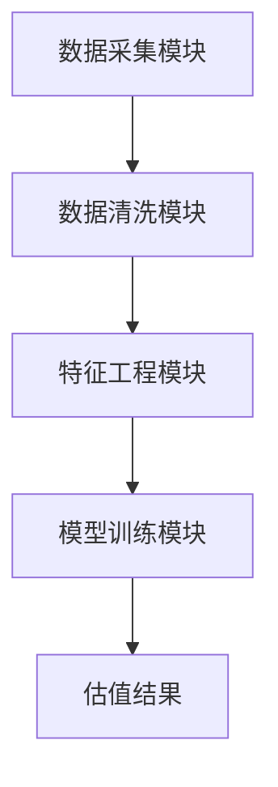

                 


# AI辅助企业并购目标估值：多维度财务模型与协同效应分析

> 关键词：AI, 企业并购, 财务模型, 协同效应, 估值

> 摘要：本文探讨了如何利用人工智能技术辅助企业并购目标估值，通过构建多维度财务模型和分析协同效应，提供了一种创新的估值方法。文章详细介绍了AI在企业并购中的应用背景、多维度模型的构建、协同效应的量化方法、AI算法的实现、数学模型的推导，以及系统架构设计。通过实际案例分析，展示了AI技术在提升企业并购估值中的效率和准确性。

---

## 第1章: 企业并购与目标估值的基本概念

### 1.1 企业并购的基本概念

#### 1.1.1 企业并购的定义与分类
企业并购（Mergers and Acquisitions，简称M&A）是指一家企业与其他企业（目标公司）合并或收购其资产或股权的行为。并购可以分为两类：
- **合并（Merger）**：两家或更多的企业合并成一家新的企业。
- **收购（Acquisition）**：一家企业购买另一家企业的全部或部分资产或股权。

#### 1.1.2 并购的目标与动机
企业进行并购的主要目标包括：
- **扩大市场份额**：通过并购快速进入新市场或增强竞争力。
- **获取新技术或资源**：通过并购获得关键技术和无形资产。
- **降低运营成本**：通过规模经济和协同效应降低成本。
- **多元化经营**：通过并购扩展业务范围，分散风险。

#### 1.1.3 并购的基本流程与阶段
企业并购通常包括以下几个阶段：
1. **战略规划与决策**：确定并购目标和战略。
2. **目标筛选与尽职调查**：识别潜在目标并进行详细调查。
3. **估值与定价**：评估目标公司价值并确定交易价格。
4. **交易结构设计**：设计并购交易的法律和财务结构。
5. **整合与实施**：整合被并购企业的资源、文化和业务流程。

---

### 1.2 企业并购中的目标估值

#### 1.2.1 目标估值的定义与重要性
目标估值是指对目标公司在并购中的价值进行评估，是决定并购是否可行的关键步骤。准确的估值可以帮助企业避免支付过高的溢价，降低并购风险。

#### 1.2.2 传统估值方法的局限性
传统的估值方法主要包括：
- **市盈率法（P/E ratio）**：基于目标公司的市盈率和行业平均市盈率进行估值。
- **市净率法（P/B ratio）**：基于目标公司的市净率进行估值。
- **现金流折现法（DCF）**：基于未来现金流的现值进行估值。
这些方法在实际应用中存在以下局限性：
- 数据依赖性强，且难以量化协同效应。
- 无法充分考虑目标公司的潜在风险和不确定性。

#### 1.2.3 引入AI技术的必要性
人工智能技术可以通过以下方式弥补传统估值方法的不足：
- **数据挖掘与分析**：利用大数据技术挖掘更多潜在信息，提高估值的准确性。
- **机器学习模型**：通过训练模型预测目标公司的未来表现和协同效应。
- **实时监控与调整**：利用AI实时跟踪市场变化和企业动态，动态调整估值模型。

---

## 第2章: AI技术在企业并购中的应用背景

### 2.1 AI技术的基本概念与发展

#### 2.1.1 人工智能的定义与主要技术
人工智能（Artificial Intelligence，AI）是指计算机系统模拟人类智能的技术，主要包括以下几种技术：
- **机器学习（Machine Learning）**：通过数据训练模型，使其能够从数据中学习并做出预测。
- **深度学习（Deep Learning）**：基于人工神经网络的机器学习技术，能够处理复杂的非结构化数据。
- **自然语言处理（NLP）**：处理和理解人类语言的技术，广泛应用于文本分析和信息提取。

#### 2.1.2 机器学习与深度学习的简介
- **机器学习**：通过训练数据集，模型能够识别数据中的模式，并做出预测或分类。
- **深度学习**：通过多层神经网络，能够处理复杂的非结构化数据，如图像、音频和文本。

#### 2.1.3 自然语言处理与数据挖掘的应用
- **自然语言处理**：用于分析公司财报、新闻报道等文本数据，提取有用信息。
- **数据挖掘**：从海量数据中提取隐藏的模式和趋势，帮助识别潜在的并购目标。

---

### 2.2 企业并购与AI技术的结合

#### 2.2.1 数据驱动的决策优势
- **数据全面性**：AI技术可以处理和分析大量的结构化和非结构化数据，提供更全面的决策支持。
- **实时性**：AI可以实时监控市场动态和企业表现，及时调整估值模型。

#### 2.2.2 AI在财务分析与预测中的作用
- **财务预测**：利用机器学习模型预测目标公司的未来财务表现。
- **风险评估**：通过分析历史数据和市场趋势，评估并购中的潜在风险。

#### 2.2.3 协同效应的识别与量化
- **协同效应的识别**：通过AI技术识别潜在的协同效应，如成本协同、收入协同等。
- **协同效应的量化**：利用数学模型量化协同效应的大小，将其纳入估值模型。

---

## 第3章: 多维度财务模型的构建

### 3.1 多维度财务模型的概念

#### 3.1.1 多维度模型的定义与特点
多维度财务模型是一种基于多个维度（如财务、市场、运营等）进行估值的模型，具有以下特点：
- **多维度性**：考虑多个影响企业价值的因素。
- **动态性**：能够根据市场变化和企业动态进行调整。
- **准确性**：通过综合分析多个维度的数据，提高估值的准确性。

#### 3.1.2 多维度模型与传统模型的对比
| 对比维度 | 多维度模型 | 传统模型 |
|----------|------------|----------|
| 数据维度 | 多维数据    | 单一维度  |
| 精度     | 较高        | 较低      |
| 灵活性   | 较高        | 较低      |

#### 3.1.3 多维度模型在企业估值中的优势
- **全面性**：能够全面考虑影响企业价值的多个因素。
- **准确性**：通过综合分析多个维度的数据，提高估值的准确性。

---

### 3.2 多维度模型的构建步骤

#### 3.2.1 数据收集与处理
- **数据收集**：收集目标公司的财务数据、市场数据、行业数据等。
- **数据清洗**：对数据进行清洗和预处理，确保数据的准确性和完整性。

#### 3.2.2 模型设计与变量选择
- **模型设计**：根据目标公司的特点设计多维度模型。
- **变量选择**：选择能够影响企业价值的关键变量。

#### 3.2.3 模型训练与验证
- **模型训练**：利用训练数据训练机器学习模型。
- **模型验证**：通过验证数据评估模型的准确性和稳定性。

---

## 第4章: 协同效应的分析与量化

### 4.1 协同效应的定义与类型

#### 4.1.1 协同效应的定义
协同效应是指企业在并购后通过整合资源、优化流程等方式实现的成本节约或收入增加。

#### 4.1.2 协同效应的主要类型
| 协同效应类型 | 定义                              |
|--------------|----------------------------------|
| 成本协同      | 并购后通过共享资源降低成本          |
| 收入协同      | 并购后通过扩大市场实现收入增加      |
| 优化协同      | 并购后通过优化流程提高效率          |

#### 4.1.3 协同效应的识别方法
- **数据分析法**：通过分析历史数据识别协同效应。
- **专家评估法**：通过行业专家评估协同效应的可能性。

---

### 4.2 协同效应的量化方法

#### 4.2.1 协同效应的计算公式
$$ \text{协同效应} = \text{并购后价值} - \text{并购前价值} $$

#### 4.2.2 协同效应的评估指标
- **协同效应比率**：协同效应占并购前目标公司价值的比例。
- **协同效应回收期**：实现协同效应所需的时间。

---

## 第5章: AI辅助企业并购目标估值的实现

### 5.1 AI算法在估值中的应用

#### 5.1.1 机器学习模型的选择与训练
- **随机森林（Random Forest）**：用于分类和回归任务，适合处理非线性关系。
- **神经网络（Neural Networks）**：适合处理复杂的数据关系，如文本和图像。

#### 5.1.2 基于机器学习的估值模型
- **模型输入**：目标公司的财务数据、市场数据等。
- **模型输出**：目标公司的估值和协同效应预测。

### 5.2 数学模型与公式

#### 5.2.1 估值公式
$$ \text{目标公司价值} = \text{历史财务数据} \times \text{权重} + \text{协同效应} $$

#### 5.2.2 协同效应公式
$$ \text{协同效应} = \text{成本协同} + \text{收入协同} + \text{优化协同} $$

---

## 第6章: 系统架构与实现

### 6.1 系统功能设计

#### 6.1.1 数据采集模块
- **功能**：采集目标公司的财务数据、市场数据等。
- **输入**：目标公司名称、财务报表等。
- **输出**：数据清洗后的数据集。

#### 6.1.2 模型训练模块
- **功能**：训练机器学习模型。
- **输入**：清洗后的数据集。
- **输出**：训练好的模型。

### 6.2 系统架构设计

#### 6.2.1 系统架构图


#### 6.2.2 接口设计
- **数据接口**：与数据源（如数据库、API）对接，获取目标公司数据。
- **模型接口**：与机器学习框架（如TensorFlow、Scikit-learn）对接，训练模型。

---

## 第7章: 项目实战

### 7.1 环境安装与配置

#### 7.1.1 安装Python环境
```bash
pip install python
pip install numpy
pip install pandas
pip install scikit-learn
```

#### 7.1.2 安装机器学习框架
```bash
pip install tensorflow
pip install keras
```

### 7.2 核心功能实现

#### 7.2.1 数据清洗与处理
```python
import pandas as pd
data = pd.read_csv('target_data.csv')
data = data.dropna()
data = data.drop_duplicates()
```

#### 7.2.2 模型训练
```python
from sklearn.ensemble import RandomForestRegressor
model = RandomForestRegressor(n_estimators=100, random_state=42)
model.fit(X_train, y_train)
```

### 7.3 案例分析与解读

#### 7.3.1 案例分析
假设目标公司A的财务数据如下：
| 年份 | 收入 | 利润 |
|------|------|------|
| 2020 | 100  | 20   |
| 2021 | 120  | 25   |
| 2022 | 150  | 30   |

通过机器学习模型预测公司A的估值为1.2亿元，协同效应为2000万元。

#### 7.3.2 结果解读
- **估值结果**：公司A的估值为1.2亿元。
- **协同效应**：并购后预计实现协同效应2000万元。

---

## 第8章: 总结与展望

### 8.1 总结
本文探讨了AI技术在企业并购目标估值中的应用，提出了多维度财务模型和协同效应分析的方法。通过机器学习和深度学习技术，能够更准确地评估目标公司价值，识别和量化协同效应。

### 8.2 展望
未来，随着AI技术的不断发展，企业并购中的目标估值将更加智能化和精准化。可以通过以下方式进一步优化：
- **模型优化**：引入更复杂的深度学习模型，提高估值的准确性。
- **数据共享**：建立行业数据共享平台，促进数据的充分利用。
- **实时监控**：利用实时数据和动态模型，实现并购后的动态估值。

---

通过本文的分析，读者可以了解到AI技术在企业并购中的应用价值，为企业并购提供了新的思路和方法。

