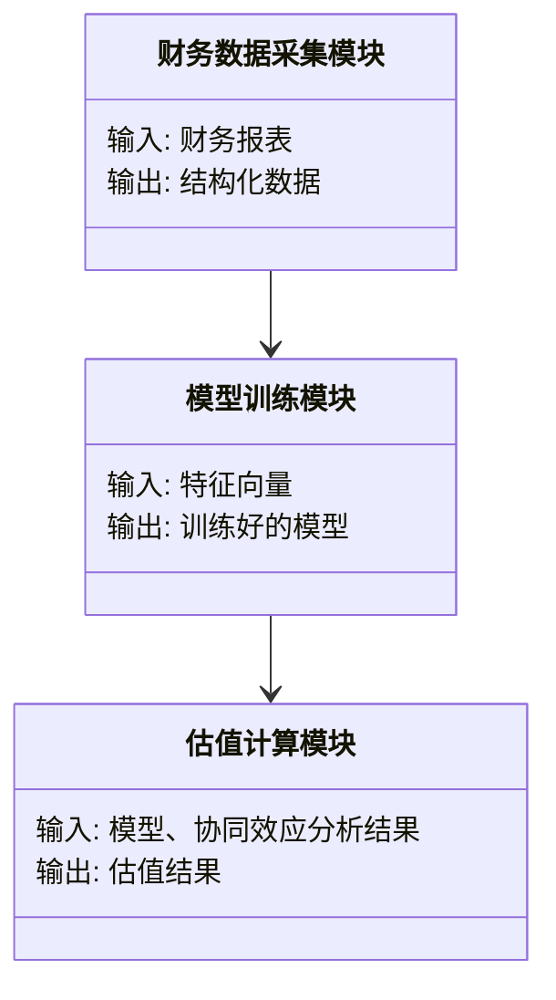
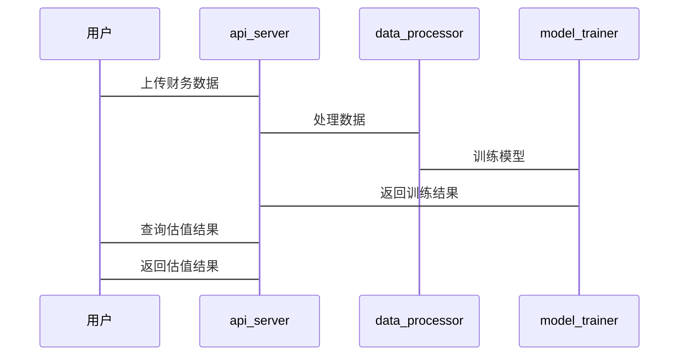

                 


# AI辅助企业并购目标估值：多维度财务模型与协同效应分析系统

**关键词**：企业并购，目标估值，AI技术，多维度财务模型，协同效应分析，机器学习，系统架构

**摘要**：  
企业并购是企业战略发展的重要手段之一，而目标估值是并购决策中的核心环节。传统估值方法依赖于人工分析，存在主观性强、效率低下、难以量化协同效应等问题。随着人工智能技术的快速发展，基于AI的多维度财务模型和协同效应分析系统为解决这些问题提供了新的可能性。本文将详细探讨AI技术在企业并购目标估值中的应用，从多维度财务模型的构建到协同效应的量化分析，再到AI算法的原理和系统架构设计，最后结合实际案例进行深入分析，为读者提供一套系统化的解决方案。

---

## 第1章: 企业并购与目标估值概述

### 1.1 企业并购的基本概念

企业并购（Mergers and Acquisitions, M&A）是指一家企业与其他企业合并或收购其资产、股权等行为。并购的核心目标是通过整合资源、优化资产配置、提升市场竞争力来实现企业价值的最大化。

#### 1.1.1 企业并购的定义与类型
- **定义**：企业并购是指一家企业（收购方）对另一家企业（目标方）进行合并或收购的行为。
- **类型**：
  - **横向并购**：同一行业内的并购，旨在扩大市场份额。
  - **纵向并购**：上下游产业的并购，优化供应链。
  - **混合并购**：跨行业并购，寻求新的业务增长点。

#### 1.1.2 并购目标估值的重要性
- 并购目标估值是并购决策的核心依据，直接影响交易价格和投资回报。
- 估值结果决定了并购的可行性和经济性，是并购交易成功与否的关键因素。

#### 1.1.3 传统估值方法的局限性
- **主观性强**：传统估值方法依赖分析师的经验判断，容易受到主观因素影响。
- **效率低下**：手动分析耗时长，难以应对海量数据。
- **协同效应难量化**：传统方法难以准确量化并购后的协同效应。

---

### 1.2 AI技术在企业并购中的应用背景

AI技术的快速发展为企业并购目标估值带来了新的可能性。

#### 1.2.1 AI技术的快速发展
- **计算能力提升**：云计算和大数据技术的普及，为AI应用提供了强大的支持。
- **数据量爆炸式增长**：企业内外部数据的丰富性为AI分析提供了基础。

#### 1.2.2 数据驱动的估值方法
- AI技术可以通过对海量数据的分析，提取关键财务指标和市场信息，辅助估值。

#### 1.2.3 多维度分析的需求
- 企业并购涉及多个维度的分析，包括财务、市场、技术、法律等，AI技术可以实现多维度数据的整合与分析。

---

### 1.3 多维度财务模型与协同效应分析

#### 1.3.1 多维度模型的定义
- 多维度财务模型是指从多个维度（如财务、市场、运营等）对目标企业进行综合评估的模型。

#### 1.3.2 协同效应的内涵
- 协同效应是指并购后企业之间在资源、技术、市场等方面产生的协同作用，带来额外的价值。

#### 1.3.3 系统化分析的优势
- 通过系统化分析，可以更准确地评估并购后的价值，降低估值偏差。

---

### 1.4 本章小结

本章介绍了企业并购的基本概念、目标估值的重要性以及传统估值方法的局限性，同时探讨了AI技术在企业并购中的应用背景。通过多维度财务模型和协同效应分析，AI技术为解决传统估值方法的不足提供了新的思路。

---

## 第2章: 多维度财务模型的构建与分析

### 2.1 财务模型的核心要素

#### 2.1.1 财务指标的选择
- **核心指标**：收入、利润、现金流、资产、负债等。
- **数据来源**：财务报表、行业数据、市场信息等。

#### 2.1.2 数据来源与处理
- **数据预处理**：清洗、标准化、特征提取。
- **数据融合**：整合多源数据，构建综合评估体系。

#### 2.1.3 模型的构建逻辑
- 基于AI算法（如回归分析、神经网络）构建预测模型，评估企业价值。

---

### 2.2 协同效应的量化分析

#### 2.2.1 协同效应的定义与分类
- **协同效应的类型**：成本协同、收入协同、技术协同等。
- **量化方法**：通过对比并购前后的数据变化，评估协同效应的大小。

#### 2.2.2 协同效应的计算方法
- **成本协同**：通过规模效应降低运营成本。
- **收入协同**：通过市场整合提升销售收入。

#### 2.2.3 协同效应的评估指标
- **协同效应率**：协同效应带来的价值占总价值的比例。

---

### 2.3 多维度模型的构建流程

#### 2.3.1 数据预处理
- 清洗数据，处理缺失值和异常值。

#### 2.3.2 模型设计与验证
- 选择合适的AI算法（如随机森林、支持向量机），进行模型训练和验证。

#### 2.3.3 模型的优化与调整
- 调参优化，提升模型的准确性和稳定性。

---

### 2.4 本章小结

本章详细探讨了多维度财务模型的构建与分析，包括财务指标的选择、数据处理、模型设计以及协同效应的量化分析。通过系统化的建模流程，可以更准确地评估企业并购的目标价值。

---

## 第3章: AI算法与数学模型的原理

### 3.1 机器学习在估值中的应用

#### 3.1.1 监督学习与无监督学习
- **监督学习**：基于标记数据进行预测（如回归分析）。
- **无监督学习**：基于无标记数据进行聚类分析。

#### 3.1.2 神经网络的基本原理
- **神经网络结构**：输入层、隐藏层、输出层。
- **训练过程**：通过反向传播算法优化权重。

#### 3.1.3 深度学习的最新进展
- **卷积神经网络（CNN）**：适用于图像识别。
- **长短期记忆网络（LSTM）**：适用于时间序列分析。

---

### 3.2 财务数据的特征提取

#### 3.2.1 文本数据的处理
- **自然语言处理（NLP）**：提取财务报告中的关键词和情感信息。

#### 3.2.2 结构化数据的处理
- **特征选择**：筛选对估值影响较大的指标。
- **特征工程**：构建高维特征向量。

#### 3.2.3 图数据的处理
- **图神经网络（GNN）**：分析企业间的关联关系。

---

### 3.3 算法原理的数学模型

#### 3.3.1 回归分析
- **线性回归**：$y = \beta_0 + \beta_1x + \epsilon$
- **逻辑回归**：$P(y=1|x) = \frac{1}{1 + e^{-\beta x}}$

#### 3.3.2 神经网络的数学表达
- **激活函数**：$f(x) = \frac{1}{1 + e^{-x}}$（sigmoid函数）
- **损失函数**：$L = \frac{1}{2m}\sum_{i=1}^m (y_i - \hat{y_i})^2$

---

### 3.4 本章小结

本章详细介绍了AI算法在企业并购估值中的应用，包括机器学习、深度学习的基本原理以及财务数据的特征提取方法。通过数学模型的构建，可以更深入地理解AI技术在估值中的作用。

---

## 第4章: 系统分析与架构设计

### 4.1 问题场景介绍

企业并购目标估值系统需要解决以下问题：
- 如何高效地收集和处理多源数据。
- 如何构建多维度财务模型。
- 如何量化协同效应并优化估值。

---

### 4.2 系统功能设计

#### 4.2.1 领域模型（Mermaid类图）


---

### 4.3 系统架构设计

#### 4.3.1 系统架构图（Mermaid架构图）
```mermaid
docker
    services {
        api_server: HTTP API
        data_processor: 数据处理服务
        model_trainer: 模型训练服务
        storage: 数据存储
    }
```

---

### 4.4 系统接口设计

- **API接口**：RESTful API，支持数据上传、模型调用、结果查询。
- **数据接口**：与财务系统、第三方数据源对接。

---

### 4.5 系统交互流程（Mermaid序列图）


---

### 4.6 本章小结

本章通过系统分析与架构设计，构建了一个完整的AI辅助企业并购目标估值系统。通过模块化设计和系统架构优化，可以实现高效的数据处理和模型训练。

---

## 第5章: 项目实战

### 5.1 环境安装与配置

- **工具安装**：Python、TensorFlow、Keras、Pandas。
- **数据准备**：收集目标企业的财务数据、市场数据。

---

### 5.2 核心代码实现

#### 5.2.1 数据预处理代码
```python
import pandas as pd

# 数据清洗
data = pd.read_csv('input.csv')
data.dropna(inplace=True)
data['收入'] = data['收入'].apply(lambda x: x * 1.1 if x < 100 else x)
```

#### 5.2.2 模型训练代码
```python
from tensorflow.keras import layers

# 构建神经网络模型
model = tf.keras.Sequential([
    layers.Dense(64, activation='relu'),
    layers.Dense(1, activation='linear')
])
model.compile(optimizer='adam', loss='mean_squared_error')
model.fit(X_train, y_train, epochs=100, batch_size=32)
```

#### 5.2.3 估值计算代码
```python
import numpy as np

# 预测估值
predictions = model.predict(X_test)
valuation = np.mean(predictions)
```

---

### 5.3 实际案例分析

#### 5.3.1 案例背景
- **目标企业**：某科技公司，年收入10亿元，净利润2亿元。
- **并购方**：某上市公司，希望通过并购整合资源。

#### 5.3.2 数据分析
- **收入预测**：通过AI模型预测未来三年的收入增长率。
- **协同效应**：通过模型量化收入协同和成本协同。

---

### 5.4 本章小结

本章通过实际案例分析，展示了AI辅助企业并购目标估值系统的实现过程，包括环境配置、数据处理、模型训练以及结果分析。

---

## 第6章: 最佳实践与小结

### 6.1 最佳实践

- **数据质量**：确保数据的准确性和完整性。
- **模型优化**：根据实际需求调整模型参数。
- **协同效应评估**：结合多维度因素进行综合分析。

---

### 6.2 小结

本文详细探讨了AI辅助企业并购目标估值的多维度财务模型与协同效应分析系统。通过系统化的建模流程和AI算法的应用，可以更准确地评估企业并购的价值。未来，随着AI技术的不断发展，企业并购目标估值将更加智能化和精准化。

---

## 附录

### 附录A: 进一步阅读资料

- 《机器学习实战》
- 《深度学习》
- 《企业并购与财务分析》

---

通过本文的系统化分析和实际案例展示，读者可以全面了解AI技术在企业并购目标估值中的应用，并能够结合实际场景进行应用和优化。

