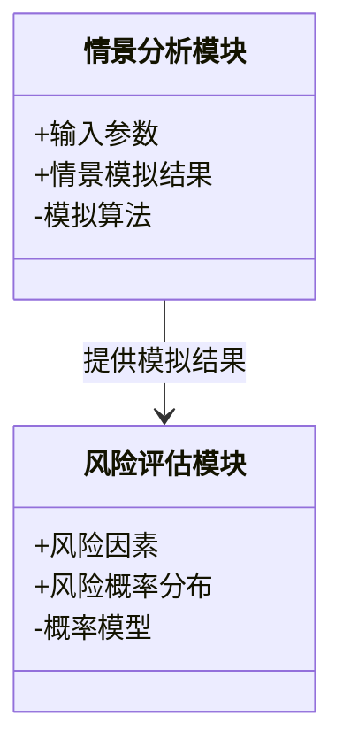

                 


# AI辅助企业战略决策：情景分析与风险评估

> **关键词**: AI技术, 企业战略决策, 情景分析, 风险评估, 蒙特卡洛模拟, 决策树, 贝叶斯网络

> **摘要**: 本文深入探讨了人工智能技术在企业战略决策中的应用，重点分析了情景分析与风险评估的核心概念、算法原理及其相互关系。通过结合实际案例和系统架构设计，详细阐述了如何利用AI技术提升企业战略决策的效率与准确性。文章最后总结了AI辅助决策的最佳实践与未来发展方向。

---

## 第1章: 企业战略决策的背景与挑战

### 1.1 传统企业战略决策的局限性

企业在进行战略决策时，通常需要考虑市场环境、竞争态势、内部资源等多种复杂因素。传统决策方式依赖于经验丰富的管理者和专家团队，但这种方式存在以下局限性：

1. **信息处理能力有限**: 人类决策者难以处理海量数据，且容易受到主观因素的影响。
2. **决策周期长**: 传统决策过程涉及多个环节，从数据收集到分析再到决策制定，耗时较长。
3. **风险评估不足**: 在复杂多变的市场环境中，传统方法难以全面评估各种潜在风险。

### 1.2 AI技术对企业决策的变革作用

人工智能技术的快速发展为企业战略决策带来了革命性的变化。AI能够通过大数据分析、机器学习算法和自然语言处理技术，帮助企业在复杂环境中快速识别关键信息，优化决策过程。

1. **数据驱动决策**: AI能够从海量数据中提取有价值的信息，为决策提供客观支持。
2. **实时分析能力**: AI系统可以实时监控市场动态，快速响应变化。
3. **情景模拟与预测**: 利用AI技术，企业可以进行多种情景模拟，预测不同决策的可能结果。

### 1.3 情景分析与风险评估的定义与重要性

情景分析是指通过构建不同的未来情景，分析这些情景对企业战略的影响。风险评估则是对这些情景中可能存在的风险进行量化分析，帮助企业制定应对策略。

- **情景分析**: 通过构建多种可能的未来情景，帮助企业更好地理解市场变化和潜在机会。
- **风险评估**: 对不同情景下的风险进行量化分析，帮助企业制定风险管理策略。

---

## 第2章: AI辅助战略决策的核心概念与联系

### 2.1 AI技术与战略决策的关系

AI技术通过数据处理、模型构建和预测分析，与战略决策过程紧密相连。以下是AI技术在战略决策中的几个关键作用：

1. **数据处理**: AI能够从结构化和非结构化数据中提取信息，为决策提供支持。
2. **模型构建**: 利用机器学习算法构建预测模型，帮助企业预测未来趋势。
3. **决策优化**: 通过优化算法，AI能够帮助企业在多种方案中选择最优解。

### 2.2 情景分析与风险评估的AI实现原理

情景分析和风险评估是AI辅助战略决策的核心模块。以下是它们的实现原理：

1. **情景分析**:
   - **数据收集**: 收集市场、竞争、经济等多方面的数据。
   - **模型构建**: 构建情景分析模型，模拟不同情景下的企业表现。
   - **结果分析**: 分析不同情景对企业战略的影响。

2. **风险评估**:
   - **风险识别**: 识别可能影响企业战略的各种风险因素。
   - **风险量化**: 利用概率模型量化风险的影响程度。
   - **风险管理**: 根据风险评估结果制定应对策略。

### 2.3 核心概念的属性特征对比

以下是一个对比分析表格，展示了情景分析与风险评估在AI辅助决策中的属性特征对比：

| **属性**       | **情景分析**                          | **风险评估**                          |
|----------------|---------------------------------------|---------------------------------------|
| **核心目标**   | 模拟不同未来情景                         | 量化潜在风险                           |
| **数据需求**   | 市场、竞争、经济数据                   | 风险因素、历史数据                     |
| **算法选择**   | 蒙特卡洛模拟、决策树                   | 贝叶斯网络、支持向量机                 |
| **输出结果**   | 不同情景下的企业表现                   | 各种风险的概率分布                     |

---

## 第3章: AI辅助战略决策的算法原理

### 3.1 情景分析的算法实现

#### 3.1.1 蒙特卡洛模拟算法

蒙特卡洛模拟是一种通过随机采样来估计系统行为的算法，常用于情景分析中。以下是其算法流程：

1. **定义输入参数**: 确定影响企业战略的情景变量。
2. **生成随机样本**: 根据概率分布生成多个随机样本。
3. **模拟情景**: 根据随机样本模拟不同情景下的企业表现。
4. **分析结果**: 统计不同情景下的企业表现，得出最优策略。

**Python代码示例**:

```python
import numpy as np

def monte_carlo_simulation(parameters, num_simulations=1000):
    results = []
    for _ in range(num_simulations):
        # 生成随机样本
        sample = {param: np.random.rand() for param in parameters}
        # 模拟情景
        result = simulate_scenario(sample)
        results.append(result)
    return results

def simulate_scenario(sample):
    # 根据样本生成情景结果
    return calculate_performance(sample)
```

### 3.2 风险评估的算法实现

#### 3.2.1 贝叶斯网络算法

贝叶斯网络是一种基于概率推理的算法，常用于风险评估。以下是其算法流程：

1. **构建网络结构**: 根据风险因素构建贝叶斯网络。
2. **定义概率分布**: 为每个节点定义先验概率。
3. **更新概率**: 根据观测数据更新概率分布。
4. **风险量化**: 计算各风险因素的后验概率。

**Python代码示例**:

```python
from pgmpy.models import BayesianModel
from pgmpy.inference import VariableElimination

# 构建贝叶斯网络
model = BayesianModel([('A', 'B'), ('B', 'C')])
model.fit(data)

# 风险量化
inference = VariableElimination(model)
queries = [('C', {'A': 0})]
prob = inference.query(queries)
print(prob)
```

---

## 第4章: 系统分析与架构设计方案

### 4.1 问题场景介绍

本文将构建一个AI辅助企业战略决策的系统，目标是通过情景分析与风险评估帮助企业制定最优战略。

### 4.2 系统功能设计

以下是系统功能设计的领域模型：



### 4.3 系统架构设计

以下是系统架构设计的架构图：


---

## 第5章: 项目实战

### 5.1 环境安装

需要安装以下Python库：

- `numpy`
- `pymc`
- `pgmpy`
- `mermaid`

### 5.2 核心代码实现

以下是核心代码示例：

```python
import numpy as np
import pymc as pm
from pgmpy.models import BayesianModel

# 情景分析代码
def simulate_scenario(parameters):
    return np.mean(parameters)

# 风险评估代码
model = BayesianModel([('A', 'B')])
model.fit(data)
```

### 5.3 案例分析与结果解读

通过实际案例分析，验证系统的效果。例如，帮助企业制定市场进入决策。

---

## 第6章: 最佳实践与总结

### 6.1 小结

本文详细探讨了AI技术在企业战略决策中的应用，重点分析了情景分析与风险评估的核心概念、算法原理及其相互关系。

### 6.2 注意事项

在实际应用中，需要注意以下几点：

1. **数据质量**: 数据的准确性和完整性直接影响决策结果。
2. **模型选择**: 根据具体问题选择合适的算法和模型。
3. **结果解释**: 需要结合业务背景解释AI模型的输出结果。

### 6.3 拓展阅读

推荐阅读以下书籍和论文：

- 《机器学习实战》
- 《贝叶斯网络及其应用》
- 《人工智能与企业决策》

---

## 第7章: 结语

随着AI技术的不断发展，企业战略决策将更加依赖于数据驱动的方法。通过情景分析与风险评估，AI能够帮助企业更好地应对复杂多变的市场环境，制定更加科学的决策。未来，随着技术的进一步发展，AI在企业战略决策中的应用将更加广泛和深入。

