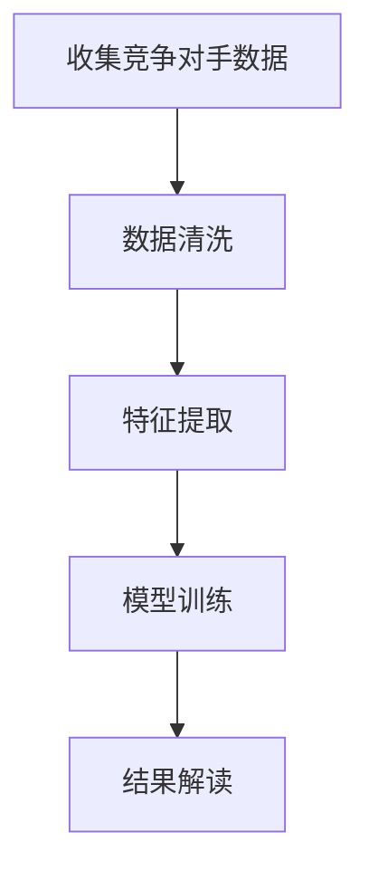
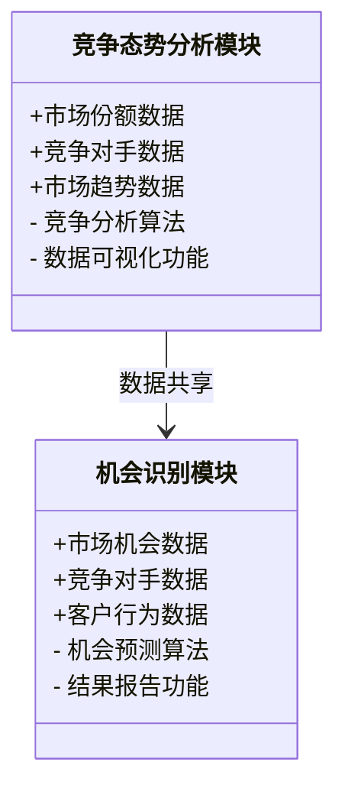
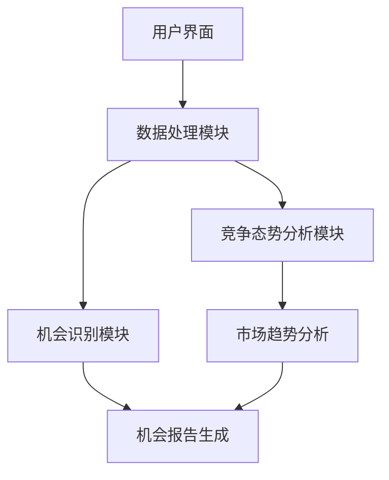
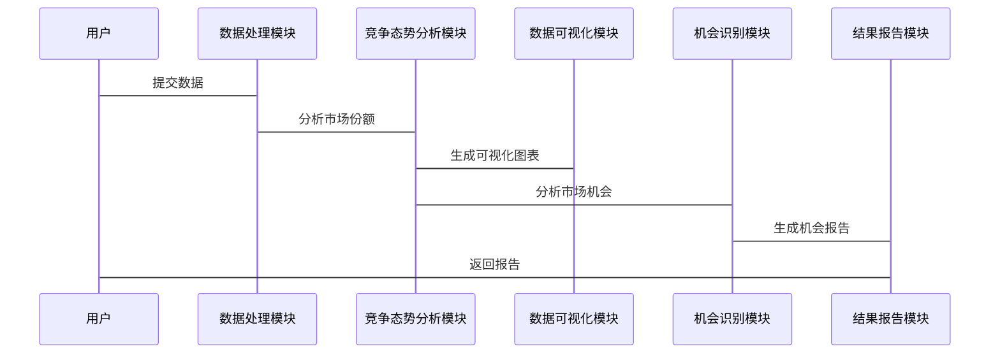

                 


# AI辅助企业战略制定：竞争态势分析与机会识别

> 关键词：AI，企业战略，竞争态势分析，机会识别，机器学习，数据驱动

> 摘要：本文详细探讨了AI技术在企业战略制定中的应用，特别是如何利用AI进行竞争态势分析和机会识别。通过分析传统方法的局限性，介绍了AI在数据驱动决策中的优势，并详细讲解了相关算法原理和系统架构设计，结合实际案例，展示了AI如何帮助企业制定更科学、更有效的战略。

---

## 第一部分：AI辅助企业战略制定的背景与基础

### 第1章：AI辅助企业战略制定概述

#### 1.1 企业战略制定的背景与挑战

##### 1.1.1 企业战略制定的传统方法与局限性

企业战略制定通常依赖于经验丰富的管理者的判断和市场调研数据。传统方法包括SWOT分析、PEST分析等，但存在以下问题：

- 数据量有限，难以捕捉市场动态。
- 分析主观性强，缺乏客观性。
- 无法实时更新，难以应对快速变化的市场环境。

##### 1.1.2 AI技术对企业战略制定的变革作用

AI技术通过大数据分析和机器学习模型，能够实时处理海量数据，提供更精准的市场洞察和预测。AI的优势包括：

- 数据驱动决策，提高准确性。
- 实时更新，适应快速变化的市场。
- 提供个性化建议，优化企业战略。

##### 1.1.3 企业战略制定的边界与外延

企业战略制定不仅包括市场分析，还涉及内部资源优化、竞争对手分析、客户行为预测等多个方面。AI技术的应用可以将这些方面整合起来，形成一个完整的决策支持系统。

#### 1.2 AI在企业战略制定中的核心作用

##### 1.2.1 数据驱动的决策优势

AI通过分析海量数据，发现潜在的市场机会和风险，为决策提供数据支持。例如，通过自然语言处理（NLP）分析社交媒体数据，了解客户情绪和市场趋势。

##### 1.2.2 竞争态势分析的AI方法

AI可以通过爬虫技术获取竞争对手的公开数据，结合机器学习模型进行竞争分析，识别市场领导者和新兴竞争者。

##### 1.2.3 机会识别的智能化路径

AI可以通过聚类分析和分类算法，识别市场中的空白点和高潜力领域，帮助企业在竞争中找到差异化的机会。

### 第2章：竞争态势分析的核心概念与方法

#### 2.1 竞争态势分析的理论基础

##### 2.1.1 竞争态势分析的定义与目标

竞争态势分析是通过对市场、行业、竞争对手的分析，评估企业在市场中的地位和竞争优势。其目标是帮助企业制定更有针对性的战略。

##### 2.1.2 竞争态势分析的关键要素

- 市场结构：包括市场集中度、竞争对手数量等。
- 竞争对手分析：包括竞争对手的市场份额、产品特点、战略动向等。
- 行业趋势：包括行业增长率、技术发展趋势等。

#### 2.2 机会识别的理论基础

##### 2.2.1 机会识别的定义与分类

机会识别是指通过分析市场环境，发现潜在的市场机会。机会可以分为市场机会、技术机会、产品机会等。

##### 2.2.2 机会识别的关键步骤

- 数据收集：收集市场、行业、竞争对手等数据。
- 数据分析：通过数据分析发现潜在机会。
- 机会评估：评估机会的可行性、潜在收益和风险。

### 第3章：AI辅助竞争态势分析与机会识别的方法论

#### 3.1 数据驱动的分析框架

##### 3.1.1 数据收集与预处理

- 数据来源：公开数据、社交媒体数据、行业报告等。
- 数据清洗：去除噪声数据，处理缺失值。
- 数据标准化：统一数据格式，便于分析。

##### 3.1.2 数据分析与特征提取

- 数据可视化：通过图表展示市场趋势和竞争对手动态。
- 特征提取：提取关键特征，如市场份额、品牌关注度等。

#### 3.2 AI模型在竞争态势分析中的应用

##### 3.2.1 常见AI模型及其特点

- 逻辑回归：用于分类问题，如判断竞争对手的市场地位。
- 支持向量机（SVM）：用于模式识别，如识别市场趋势。
- 神经网络：用于复杂模式识别，如分析客户行为。

##### 3.2.2 竞争态势分析的AI流程

1. 数据收集与预处理
2. 模型训练与调优
3. 模型应用与结果解读

---

## 第二部分：AI辅助企业战略制定的核心算法与实现

### 第4章：竞争态势分析的算法原理

#### 4.1 竞争态势分析的指标计算

##### 4.1.1 市场份额计算

- 市场份额公式：
  $$ \text{市场份额} = \frac{\text{企业销售额}}{\text{行业总销售额}} $$

- 示例：某企业销售额为1000万元，行业总销售额为5000万元，则市场份额为20%。

##### 4.1.2 竞争对手分析

- 竞争对手分析流程图：



#### 4.2 基于AI的竞争态势分析流程

##### 4.2.1 数据输入与特征提取

- 数据输入：竞争对手的产品、价格、市场份额等。
- 特征提取：提取竞争对手的市场地位、产品优势等。

##### 4.2.2 模型训练与预测

- 模型选择：根据数据特点选择合适的模型，如逻辑回归或SVM。
- 模型训练：使用历史数据训练模型。
- 模型预测：预测未来市场趋势。

##### 4.2.3 结果解读与优化

- 结果解读：分析模型预测结果，识别市场机会和风险。
- 模型优化：根据实际结果调整模型参数，提高预测准确性。

### 第5章：机会识别的算法原理

#### 5.1 机会识别的关键算法

##### 5.1.1 基于NLP的机会识别

- 自然语言处理（NLP）：通过分析新闻、评论等文本数据，识别市场机会。
- 示例：通过分析社交媒体上的客户评论，发现客户对某些产品的不满，从而识别改进机会。

##### 5.1.2 基于机器学习的机会预测

- 机器学习模型：如随机森林、XGBoost，用于预测市场机会。
- 示例：通过分析历史销售数据，预测未来某个产品的市场需求。

#### 5.2 机会识别的数学模型

##### 5.2.1 基于线性回归的机会评估

- 线性回归模型：
  $$ y = \beta_0 + \beta_1x + \epsilon $$

- 示例：通过线性回归分析，发现产品价格与销量之间的关系，从而优化定价策略。

##### 5.2.2 基于决策树的机会分类

- 决策树模型：通过特征分裂，将机会分为高、中、低风险类别。
- 示例：通过决策树分析，识别哪些市场区域具有较高的增长潜力。

### 第6章：算法实现与代码解析

#### 6.1 竞争态势分析的Python实现

##### 6.1.1 环境搭建与数据准备

- 环境搭建：安装Python、Pandas、Scikit-learn等库。
- 数据准备：收集竞争对手的市场份额、产品价格等数据。

##### 6.1.2 竞争态势分析的代码实现

```python
import pandas as pd
from sklearn.linear_model import LinearRegression

# 数据准备
data = pd.DataFrame({
    '市场份额': [20, 25, 30, 35, 40],
    '竞争对手数量': [5, 4, 3, 2, 1]
})

# 模型训练
model = LinearRegression()
model.fit(data[['竞争对手数量']], data['市场份额'])

# 预测结果
print(model.predict([[3]]))  # 预测当竞争对手数量为3时的市场份额
```

##### 6.1.3 代码解读与优化建议

- 代码解读：使用线性回归模型预测市场份额，竞争对手数量越少，市场份额越高。
- 优化建议：可以尝试其他模型，如随机森林，以提高预测准确性。

#### 6.2 机会识别的Python实现

##### 6.2.1 机会识别模型的代码实现

```python
from sklearn.ensemble import RandomForestClassifier

# 数据准备
data = pd.DataFrame({
    '市场增长率': [10, 15, 20, 25],
    '竞争程度': [高, 中, 低, 高],
    '机会类别': ['高', '中', '低', '高']
})

# 模型训练
model = RandomForestClassifier()
model.fit(data[['市场增长率', '竞争程度']], data['机会类别'])

# 预测结果
print(model.predict([[20, '高']]))  # 预测市场增长率为20%，竞争程度为高的机会类别
```

##### 6.2.2 模型训练与调优

- 模型训练：使用随机森林模型进行分类。
- 调优：调整参数，如n_estimators、max_depth，以提高模型性能。

##### 6.2.3 结果可视化与分析

- 结果可视化：使用混淆矩阵和ROC曲线评估模型性能。
- 结果分析：识别哪些特征对机会分类影响最大。

---

## 第三部分：系统架构与项目实战

### 第7章：系统架构设计

#### 7.1 项目介绍

- 项目目标：开发一个AI辅助企业战略制定的系统，帮助企业在竞争激烈的市场中制定更有效的战略。
- 项目范围：包括竞争态势分析和机会识别两大模块。
- 项目技术选型：使用Python、Pandas、Scikit-learn等工具。

#### 7.2 系统功能设计

##### 7.2.1 领域模型（Mermaid类图）



##### 7.2.2 系统架构设计（Mermaid架构图）



#### 7.3 系统接口设计

##### 7.3.1 竞争态势分析模块接口

- 输入：竞争对手数据、市场份额数据。
- 输出：竞争分析报告、可视化图表。

##### 7.3.2 机会识别模块接口

- 输入：市场机会数据、客户行为数据。
- 输出：机会预测结果、结果报告。

#### 7.4 系统交互设计（Mermaid序列图）



### 第8章：项目实战

#### 8.1 环境搭建

- 安装必要的库：Python、Pandas、Scikit-learn、Plotly等。
- 数据准备：收集竞争对手的市场份额、产品价格、客户评论等数据。

#### 8.2 系统核心实现源代码

##### 8.2.1 竞争态势分析模块

```python
import pandas as pd
from sklearn.linear_model import LinearRegression

# 数据准备
data = pd.DataFrame({
    '市场份额': [20, 25, 30, 35, 40],
    '竞争对手数量': [5, 4, 3, 2, 1]
})

# 模型训练
model = LinearRegression()
model.fit(data[['竞争对手数量']], data['市场份额'])

# 预测结果
print(model.predict([[3]]))  # 预测当竞争对手数量为3时的市场份额
```

##### 8.2.2 机会识别模块

```python
from sklearn.ensemble import RandomForestClassifier

# 数据准备
data = pd.DataFrame({
    '市场增长率': [10, 15, 20, 25],
    '竞争程度': ['高', '中', '低', '高'],
    '机会类别': ['高', '中', '低', '高']
})

# 模型训练
model = RandomForestClassifier()
model.fit(data[['市场增长率', '竞争程度']], data['机会类别'])

# 预测结果
print(model.predict([[20, '高']]))  # 预测市场增长率为20%，竞争程度为高的机会类别
```

#### 8.3 代码应用解读与分析

##### 8.3.1 竞争态势分析模块

- 数据准备：收集竞争对手的市场份额和数量，建立数据框。
- 模型训练：使用线性回归模型，训练数据。
- 预测结果：预测当竞争对手数量为3时的市场份额。

##### 8.3.2 机会识别模块

- 数据准备：收集市场增长率、竞争程度和机会类别，建立数据框。
- 模型训练：使用随机森林模型，训练数据。
- 预测结果：预测市场增长率为20%，竞争程度为高的机会类别。

#### 8.4 案例分析与详细讲解

##### 8.4.1 案例背景

某企业希望通过AI技术进行竞争态势分析和机会识别，优化其市场战略。

##### 8.4.2 竞争态势分析

- 数据收集：收集竞争对手的市场份额和数量。
- 模型训练：使用线性回归模型预测市场份额。
- 结果解读：当竞争对手数量为3时，预测市场份额为25%。

##### 8.4.3 机会识别

- 数据收集：收集市场增长率、竞争程度和机会类别。
- 模型训练：使用随机森林模型预测机会类别。
- 结果解读：市场增长率为20%，竞争程度为高时，机会类别为高。

#### 8.5 实际案例分析和详细讲解剖析

##### 8.5.1 竞争态势分析结果解读

- 预测市场份额为25%，说明当竞争对手数量为3时，企业的市场份额为25%。
- 企业可以根据预测结果调整市场策略，如增加市场份额。

##### 8.5.2 机会识别结果解读

- 预测机会类别为高，说明市场增长率为20%，竞争程度为高时，存在较高的市场机会。
- 企业可以根据预测结果制定相应的市场进入策略。

### 第9章：总结与展望

#### 9.1 最佳实践 Tips

- 数据质量：确保数据准确、完整，提高模型性能。
- 模型选择：根据数据特点选择合适的模型，提高预测准确性。
- 持续优化：定期更新数据和模型，适应市场变化。

#### 9.2 小结

本文详细介绍了AI技术在企业战略制定中的应用，特别是竞争态势分析和机会识别方面。通过理论分析和实际案例，展示了AI如何帮助企业制定更科学、更有效的战略。

#### 9.3 注意事项

- 数据隐私：在数据收集和处理过程中，注意保护数据隐私。
- 模型解释性：选择解释性好的模型，便于结果解读。
- 实际应用：结合企业实际情况，灵活应用AI技术。

#### 9.4 拓展阅读

- 《机器学习实战》：学习更多机器学习算法和应用。
- 《竞争战略》：深入理解竞争战略理论。
- 《Python数据分析》：提高数据分析能力。

---

通过本文的详细介绍，读者可以全面了解AI在企业战略制定中的应用，掌握竞争态势分析和机会识别的核心方法和实现技术。希望本文能够为企业的战略制定提供有价值的参考和指导。

