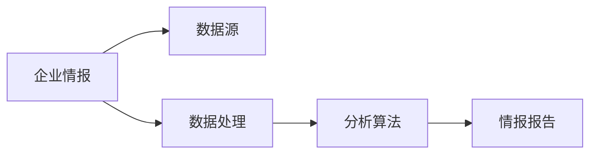
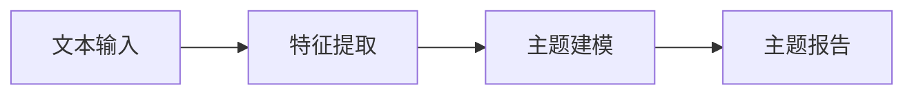
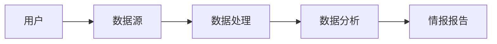
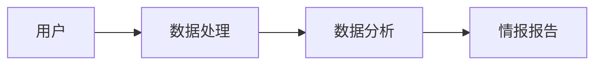

                 


# AI辅助企业战略情报收集：市场趋势与竞争分析

> 关键词：AI技术、战略情报收集、市场趋势、竞争分析、自然语言处理（NLP）、机器学习、数据挖掘

> 摘要：本文深入探讨了人工智能技术如何辅助企业进行战略情报收集，重点分析了市场趋势和竞争情报的收集方法。通过结合自然语言处理、数据挖掘和机器学习等技术，本文详细阐述了AI在情报收集中的应用原理、实现方法和系统设计，并通过实际案例展示了如何利用AI技术提升企业战略决策的效率和准确性。

---

# 第一部分: AI辅助企业战略情报收集的背景与基础

## 第1章: AI辅助战略情报收集的背景与概念

### 1.1 战略情报收集的背景与问题背景

#### 1.1.1 企业战略情报收集的重要性
企业战略情报收集是企业在市场竞争中获取先发优势的关键环节。通过收集和分析市场趋势、竞争对手动态、行业政策变化等信息，企业能够做出更科学的决策，优化资源配置，提升市场竞争力。

#### 1.1.2 问题背景与传统方法的局限性
传统的战略情报收集方法主要依赖人工调研和数据分析，存在效率低、成本高、信息滞后等问题。随着市场竞争的加剧，企业需要更高效、更精准的情报收集方式。

#### 1.1.3 AI技术对企业情报收集的变革作用
人工智能技术（AI）的快速发展为企业情报收集带来了新的可能性。通过自然语言处理（NLP）、机器学习和数据挖掘等技术，企业可以更快速、更准确地从海量数据中提取有价值的信息。

### 1.2 AI辅助战略情报收集的核心概念

#### 1.2.1 战略情报的定义与属性
战略情报是指企业在市场竞争中需要关注的关键信息，包括市场趋势、竞争对手动态、行业政策变化等。其核心属性包括实时性、准确性、全面性和可操作性。

#### 1.2.2 AI在情报收集中的角色与价值
AI技术在情报收集中的角色主要体现在数据处理、模式识别和预测分析等方面。其价值在于能够快速处理海量数据，发现潜在规律，为企业提供决策支持。

#### 1.2.3 战略情报收集的边界与外延
战略情报收集的边界在于企业核心业务相关的外部信息，而其外延则包括内部数据和外部数据的结合分析。

### 1.3 AI辅助情报收集的系统架构

#### 1.3.1 核心要素与组成关系
AI辅助情报收集系统的核心要素包括数据源、数据处理模块、分析算法、情报报告生成模块等。

#### 1.3.2 实体关系图（ER图）的Mermaid表示


### 1.4 本章小结
本章介绍了AI辅助战略情报收集的背景、核心概念和系统架构，为后续章节的分析奠定了基础。

---

## 第2章: AI辅助战略情报收集的实现原理

### 2.1 情报收集的核心技术

#### 2.1.1 数据预处理
数据预处理是情报收集的关键步骤，包括数据清洗、文本标准化、数据转换等。

#### 2.1.2 自然语言处理（NLP）技术
NLP技术用于从文本数据中提取关键词、主题和情感倾向，帮助企业理解市场趋势和竞争对手动态。

#### 2.1.3 机器学习算法
机器学习算法用于模式识别和预测分析，帮助企业预测市场变化和竞争对手行为。

### 2.2 TF-IDF与主题建模的实现流程

#### 2.2.1 TF-IDF计算公式
$$TF_{word} = \frac{count(word)}{count(words)}$$
$$IDF_{word} = \log\left(\frac{N}{N_{word}}\right)$$
$$TF-IDF_{word} = TF_{word} \times IDF_{word}$$

#### 2.2.2 主题建模（LDA）的实现流程


### 2.3 本章小结
本章详细介绍了AI辅助情报收集的核心技术，包括数据预处理、NLP技术和机器学习算法，并通过实例展示了TF-IDF和主题建模的实现流程。

---

## 第3章: 竞争对手分析的AI方法

### 3.1 竞争对手分析的核心原理

#### 3.1.1 竞争情报的获取与处理
通过网络爬虫、社交媒体分析等手段获取竞争对手的公开信息，并进行数据清洗和结构化处理。

#### 3.1.2 竞争对手行为预测的逻辑
基于历史数据和机器学习模型，预测竞争对手的市场行为，如新产品发布、价格调整等。

### 3.2 竞争对手分析的算法实现

#### 3.2.1 基于规则的竞争对手画像构建
通过设定特定规则，从海量数据中提取竞争对手的核心信息，构建竞争对手画像。

#### 3.2.2 基于深度学习的竞争对手行为预测
利用深度学习模型（如LSTM）对竞争对手的历史行为数据进行建模，预测其未来的市场行为。

### 3.3 本章小结
本章探讨了AI技术在竞争对手分析中的应用，介绍了基于规则和深度学习的竞争对手行为预测方法。

---

## 第4章: AI辅助情报收集的系统设计

### 4.1 系统功能设计

#### 4.1.1 数据采集模块
通过网络爬虫、API接口等方式采集市场和竞争情报数据。

#### 4.1.2 数据处理模块
对采集的数据进行清洗、标准化和结构化处理。

#### 4.1.3 数据分析模块
利用NLP和机器学习算法对数据进行分析，提取关键信息。

#### 4.1.4 情报报告生成模块
根据分析结果生成市场趋势和竞争情报报告。

### 4.2 系统架构设计

#### 4.2.1 系统架构的Mermaid图表示


### 4.3 系统接口设计

#### 4.3.1 数据采集接口
API接口用于从外部数据源获取市场和竞争情报数据。

#### 4.3.2 数据分析接口
API接口用于调用数据分析模块进行情报分析。

### 4.4 系统交互设计

#### 4.4.1 情报报告的生成流程


### 4.5 本章小结
本章详细设计了AI辅助情报收集系统的架构、功能和接口，并展示了系统的交互流程。

---

## 第5章: 项目实战与案例分析

### 5.1 环境配置与数据采集

#### 5.1.1 环境配置
安装Python、爬虫框架（如Scrapy）、NLP库（如NLTK）和机器学习库（如Scikit-learn）。

#### 5.1.2 数据采集
通过网络爬虫采集市场和竞争情报数据，如新闻报道、社交媒体评论等。

### 5.2 代码实现与分析

#### 5.2.1 TF-IDF计算代码
```python
from sklearn.feature_extraction.text import TfidfVectorizer

vectorizer = TfidfVectorizer()
tfidf_matrix = vectorizer.fit_transform(documents)
```

#### 5.2.2 主题建模代码
```python
from gensim import corpora, models

corpus = corpora.Dictionary(texts).build()
lda_model = models.LdaModel(corpus, num_topics=5, id2word=corpus)
```

### 5.3 案例分析与结果解读
通过实际案例展示AI技术在市场趋势分析和竞争对手分析中的应用，并解读分析结果对企业决策的支持作用。

### 5.4 本章小结
本章通过实际项目展示了AI辅助情报收集的实现过程，并通过案例分析验证了其有效性。

---

## 第6章: 最佳实践与注意事项

### 6.1 最佳实践

#### 6.1.1 数据质量的重要性
确保数据来源可靠，数据清洗和预处理是关键。

#### 6.1.2 模型选择与调优
根据具体需求选择合适的算法，并进行模型调优以提高准确性。

### 6.2 注意事项

#### 6.2.1 数据隐私与合规性
确保数据采集和处理符合相关法律法规，保护用户隐私。

#### 6.2.2 模型的可解释性
避免使用“黑箱”模型，确保模型结果的可解释性。

### 6.3 未来展望
随着AI技术的不断发展，企业战略情报收集将更加智能化和自动化，为企业决策提供更强大的支持。

---

## 附录

### 附录A: 常用工具与库
- 网络爬虫：Scrapy、BeautifulSoup
- NLP处理：NLTK、spaCy
- 机器学习：Scikit-learn、TensorFlow

### 附录B: 参考文献
- [1] 《自然语言处理实战》
- [2] 《机器学习实战》
- [3] 《数据分析与挖掘实战》

---

## 本章小结与总结

通过本文的详细讲解，读者可以全面了解AI辅助企业战略情报收集的方法和实现过程。从背景与基础到技术实现，再到系统设计和项目实战，本文为读者提供了一个完整的解决方案。未来，随着AI技术的进一步发展，企业战略情报收集将更加高效和智能化，为企业决策提供更强大的支持。

