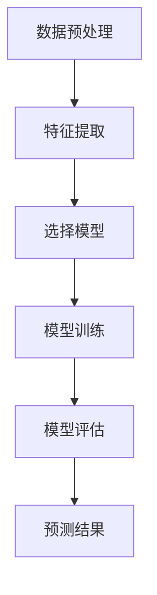
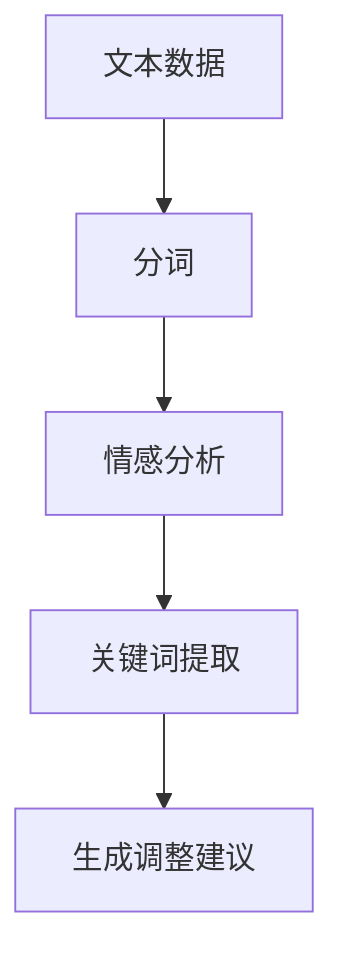
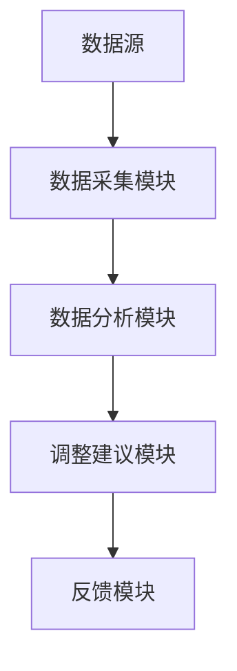
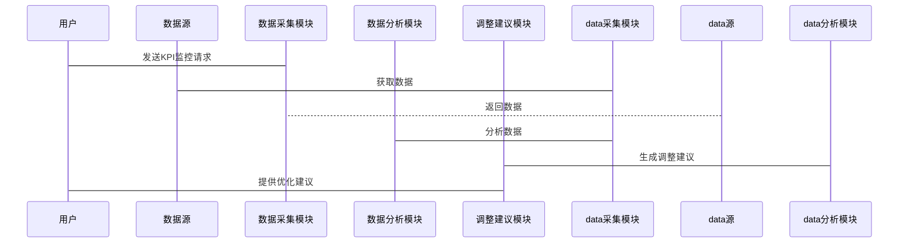

                 


# AI辅助企业战略执行：KPI监控与调整

## 关键词：KPI监控、AI辅助、战略执行、KPI调整、企业绩效

## 摘要：  
随着企业竞争的日益激烈，KPI（关键绩效指标）监控与调整在企业战略执行中的作用越来越重要。传统的KPI监控方法依赖于人工分析和经验判断，存在效率低、实时性差、精准度不足等问题。随着人工智能（AI）技术的快速发展，AI辅助KPI监控与调整为企业提供了更高效、更智能的解决方案。本文将深入探讨AI在KPI监控与调整中的应用，分析其核心原理、系统架构、实际案例及最佳实践，为企业在战略执行中提供新的思路和方法。

---

## 第1章：背景介绍

### 1.1 企业战略执行的重要性  
企业战略执行是将企业战略目标转化为具体行动的过程，其成功与否直接关系到企业的生存与发展。KPI作为企业战略执行的核心工具，能够量化目标的实现程度，帮助企业管理者评估战略执行的效果，并及时调整策略。然而，传统KPI监控方法存在以下问题：  
1. 数据来源分散，难以实时获取。  
2. 数据分析依赖人工经验，效率低且容易出错。  
3. KPI调整缺乏数据支持，难以实现精准优化。  

AI技术的引入为企业KPI监控与调整提供了新的可能性。通过AI技术，企业可以实时采集和分析海量数据，快速识别KPI的变化趋势，并自动生成优化建议，从而提升战略执行的效率和精准度。

### 1.2 KPI监控与调整的挑战与机遇  
KPI监控与调整的核心挑战在于数据的复杂性和动态性。企业需要监控的KPI种类繁多，数据来源多样，且受外部环境变化的影响较大。传统方法难以应对这些挑战，而AI技术则可以通过机器学习、自然语言处理等手段，帮助企业更好地应对这些挑战。  

AI技术的应用为企业带来了以下机遇：  
1. **实时监控**：AI可以实时采集和分析数据，帮助企业快速识别KPI的变化趋势。  
2. **智能预测**：通过机器学习模型，AI可以预测KPI的未来走势，并提前制定应对策略。  
3. **自动化调整**：AI可以根据KPI的分析结果，自动生成优化建议，并协助企业进行调整。  

---

## 第2章：KPI监控与调整的核心概念

### 2.1 KPI的核心原理  
KPI是企业战略执行中的关键工具，其核心原理是通过量化目标的实现程度，帮助企业管理者评估战略执行的效果。KPI的监控与调整需要关注以下几个方面：  
1. **KPI的定义与分类**：KPI可以根据不同的业务目标进行分类，例如财务类KPI、客户满意度KPI等。  
2. **KPI的计算方法**：KPI的计算通常基于企业的业务数据，例如销售额、利润、客户满意度评分等。  
3. **KPI与企业战略目标的关系**：KPI是企业战略目标的具体化，其变化直接影响企业战略的执行效果。  

### 2.2 AI在KPI监控中的应用  
AI技术在KPI监控中的应用主要体现在以下几个方面：  
1. **数据采集与预处理**：AI可以通过多种数据源（如数据库、传感器、社交媒体等）采集KPI相关数据，并进行清洗和转换，确保数据的准确性和完整性。  
2. **KPI预测与分析**：通过机器学习算法（如线性回归、时间序列分析等），AI可以预测KPI的变化趋势，并分析其影响因素。  
3. **KPI调整建议**：AI可以根据KPI的分析结果，自动生成优化建议，并协助企业进行调整。  

### 2.3 KPI监控与调整的实体关系图  
以下是KPI监控与调整的实体关系图（ER图）：  

```mermaid
er
    %% KPI监控与调整的实体关系图
    classDiagram
        class KPI指标 {
            名称
            类型
            计算公式
        }
        class 数据源 {
            类型
            数据格式
            数据更新频率
        }
        class 监控系统 {
            数据采集模块
            数据分析模块
            调整建议模块
        }
        class 调整策略 {
            调整目标
            调整措施
            调整效果评估
        }
        KPI指标 --> 数据源: 来源于
        监控系统 --> 数据源: 采集自
        监控系统 --> KPI指标: 监控
        监控系统 --> 调整策略: 生成
        调整策略 --> KPI指标: 实施调整
```

---

## 第3章：AI算法在KPI监控中的应用

### 3.1 基于机器学习的KPI预测  
机器学习是AI技术的核心之一，广泛应用于KPI预测。以下是基于机器学习的KPI预测流程：  



#### 3.1.1 示例代码实现  
以下是使用Python和Scikit-learn进行KPI预测的代码示例：

```python
# 数据预处理
import pandas as pd
from sklearn.model_selection import train_test_split
from sklearn.linear_model import LinearRegression

# 加载数据
data = pd.read_csv('kpi_data.csv')

# 特征提取
X = data[['销售额', '利润']]
y = data['客户满意度']

# 数据分割
X_train, X_test, y_train, y_test = train_test_split(X, y, test_size=0.2, random_state=42)

# 模型训练
model = LinearRegression()
model.fit(X_train, y_train)

# 模型预测
y_pred = model.predict(X_test)

# 模型评估
from sklearn.metrics import r2_score
print(r2_score(y_test, y_pred))
```

#### 3.1.2 数学模型与公式  
线性回归模型的数学公式为：  
$$ y = \beta_0 + \beta_1x_1 + \beta_2x_2 + ... + \beta_nx_n + \epsilon $$  
其中，$y$ 是目标变量（客户满意度），$x_i$ 是自变量（销售额、利润等），$\beta_i$ 是回归系数，$\epsilon$ 是误差项。

### 3.2 基于自然语言处理的KPI调整建议  
自然语言处理（NLP）技术可以用于分析客户反馈文本，提取KPI相关的改进意见。以下是基于NLP的KPI调整建议流程：  



#### 3.2.1 示例代码实现  
以下是使用Python和NLTK进行关键词提取的代码示例：

```python
import nltk
from nltk.tokenize import word_tokenize
from nltk.corpus import stopwords

# 示例文本
text = "客户对我们的服务非常满意，但希望我们能够更快地响应他们的需求。"

# 分词
tokens = word_tokenize(text)

# 去除停用词
stop_words = set(stopwords.words('english'))
filtered_tokens = [word for word in tokens if word not in stop_words]

# 提取关键词
from collections import defaultdict
word_counts = defaultdict(int)
for word in filtered_tokens:
    word_counts[word] += 1

# 输出关键词
for word, count in word_counts.items():
    print(f"{word}: {count}")
```

---

## 第4章：系统分析与架构设计方案

### 4.1 问题场景介绍  
企业在实际运营中，通常需要监控多个KPI，例如销售额、客户满意度、生产效率等。这些KPI的变化可能受到多种因素的影响，例如市场需求变化、内部管理问题等。传统的KPI监控方法难以实时捕捉这些变化，而AI辅助的KPI监控系统可以实时采集和分析数据，帮助企业快速识别问题并进行调整。

### 4.2 系统架构设计  
以下是AI辅助KPI监控与调整系统的架构图：  



### 4.3 接口设计与交互流程  
以下是系统交互流程图：  



---

## 第5章：项目实战

### 5.1 环境安装与配置  
要实现AI辅助KPI监控与调整系统，需要安装以下环境：  
1. **Python**：推荐使用Python 3.8及以上版本。  
2. **机器学习库**：如Scikit-learn、XGBoost等。  
3. **NLP库**：如NLTK、spaCy等。  
4. **数据可视化工具**：如Matplotlib、Seaborn等。  

### 5.2 核心代码实现  
以下是KPI预测的核心代码实现：

```python
# 数据预处理
import pandas as pd
import numpy as np
from sklearn.model_selection import train_test_split
from sklearn.ensemble import RandomForestRegressor
from sklearn.metrics import mean_squared_error

# 加载数据
data = pd.read_csv('kpi_data.csv')

# 特征工程
X = data[['销售额', '利润', '客户数量']]
y = data['净利润']

# 数据分割
X_train, X_test, y_train, y_test = train_test_split(X, y, test_size=0.2, random_state=42)

# 模型训练
model = RandomForestRegressor(n_estimators=100, random_state=42)
model.fit(X_train, y_train)

# 模型预测
y_pred = model.predict(X_test)

# 模型评估
mse = mean_squared_error(y_test, y_pred)
rmse = np.sqrt(mse)
print(f"均方误差：{mse}\n根均方误差：{rmse}")
```

### 5.3 代码解读与分析  
上述代码实现了一个基于随机森林回归模型的KPI预测系统。通过数据预处理、特征工程、模型训练和预测，可以实现对KPI的智能预测。模型评估部分使用了均方误差（MSE）和根均方误差（RMSE）来衡量模型的预测精度。

### 5.4 案例分析与优化建议  
以某企业为例，假设该企业需要监控销售额KPI。通过AI辅助的KPI监控系统，企业可以实时获取销售额数据，并通过机器学习模型预测未来的销售额趋势。如果预测结果显示销售额可能下降，系统会自动生成优化建议，例如增加市场推广投入、优化产品定价策略等。

---

## 第6章：最佳实践、小结与展望

### 6.1 最佳实践  
1. **数据质量管理**：确保数据的准确性和完整性，是AI辅助KPI监控的基础。  
2. **模型可解释性**：选择易于解释的模型，便于企业理解和调整策略。  
3. **实时监控与反馈**：建立实时监控机制，及时发现和解决问题。  

### 6.2 小结  
本文详细探讨了AI在KPI监控与调整中的应用，分析了其核心原理、系统架构和实际案例。通过AI技术，企业可以实现KPI的智能监控与优化，显著提升战略执行的效率和精准度。

### 6.3 展望与注意事项  
随着AI技术的不断发展，未来KPI监控与调整将更加智能化和自动化。企业在应用AI技术时，需要注意数据隐私、模型泛化能力等问题，确保系统的稳定性和可靠性。

### 6.4 拓展阅读  
1. 《机器学习实战》——周志华  
2. 《数据挖掘导论》——Ian H. Witten  
3. 《自然语言处理实战》——Dmitry S. Y. 莫洛丁夫  

---

通过本文的分析，企业可以更好地理解和应用AI技术，优化KPI监控与调整流程，从而在激烈的市场竞争中占据优势。

