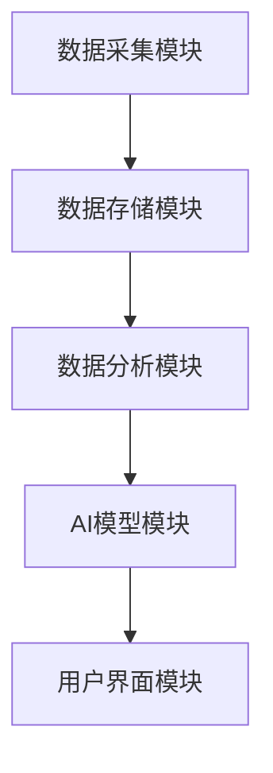

                 


# AI辅助企业战略执行：OKR自动化跟踪与动态调整

> 关键词：AI，企业战略，OKR，动态调整，自动化跟踪，机器学习，系统架构

> 摘要：本文探讨了AI技术如何辅助企业战略执行，特别是OKR（目标与关键成果）的自动化跟踪与动态调整。通过分析OKR的基本结构、AI在OKR管理中的应用，结合系统架构设计与项目实战，详细阐述了AI驱动的OKR自动化跟踪与动态调整的方法和实现方案，为企业在数字化转型中提供参考和指导。

---

# 第1章: OKR与AI的结合概述

## 1.1 OKR的基本概念与特点

### 1.1.1 目标与关键成果（OKR）的定义

OKR（Objective and Key Results）是一种目标设定和管理方法，由目标（Objective）和关键成果（Key Results）组成。目标是定性的、激励性的，而关键成果是可测量的、具体的结果。例如，目标可以是“提高客户满意度”，关键成果可以是“客户满意度评分提升20%”。

### 1.1.2 OKR的核心特点

- **明确性**：OKR强调目标的明确性和可衡量性。
- **聚焦性**：通过关键成果聚焦资源，避免分散精力。
- **动态性**：OKR可以随着企业环境的变化进行调整。
- **激励性**：OKR通常具有挑战性，激励团队全力以赴。

### 1.1.3 OKR在企业战略执行中的作用

OKR通过明确目标、分解任务、跟踪进度，帮助企业在复杂环境中高效执行战略。OKR的动态性和聚焦性使其成为企业应对不确定性的重要工具。

## 1.2 AI在企业战略执行中的应用

### 1.2.1 AI技术对企业战略执行的支持

AI可以通过数据分析、预测建模和自动化工具支持企业战略的制定、执行和调整。例如，AI可以分析市场趋势、预测风险、优化资源配置。

### 1.2.2 AI在OKR管理中的潜在价值

- **自动化跟踪**：AI可以实时收集和分析数据，跟踪OKR的执行情况。
- **动态调整**：基于数据和反馈，AI可以建议调整OKR，以应对变化。
- **智能推荐**：AI可以辅助制定目标，推荐关键成果。

### 1.2.3 企业战略执行中的AI辅助工具

AI工具可以通过自然语言处理（NLP）解析目标，通过机器学习预测进度，通过自动化流程跟踪和调整OKR。

---

# 第2章: OKR的结构与AI分析

## 2.1 OKR的基本结构

### 2.1.1 目标（Objective）的定义与特点

目标是高层次的战略性目标，通常具有长期性和挑战性。例如，“打造全球领先的人工智能平台”。

### 2.1.2 关键成果（Key Results）的定义与特点

关键成果是可测量的具体结果，通常有时间、数量或质量的指标。例如，“在6个月内将平台用户数增加50%”。

### 2.1.3 OKR与KPI的区别与联系

| 属性 | OKR | KPI |
|------|------|------|
| 定义 | 定性的目标 | 定量的指标 |
| 时间跨度 | 短期或长期 | 短期 |
| 聚焦 | 整体战略 | 具体任务 |
| 调整 | 动态调整 | 固定周期调整 |

---

## 2.2 AI在OKR结构分析中的应用

### 2.2.1 基于NLP的目标分解方法

自然语言处理技术可以将模糊的目标分解为具体的关键成果。例如，将“提高客户满意度”分解为“客户满意度评分提升20%”。

### 2.2.2 关键成果识别的自然语言处理技术

通过NLP分析文档、会议记录等，识别潜在的关键成果。例如，从公司战略文档中提取“在6个月内将平台用户数增加50%”。

### 2.2.3 基于机器学习的OKR优先级排序

通过机器学习模型分析历史数据，预测哪些OKR更有可能实现，从而优先级排序。例如，使用随机森林模型预测OKR的实现概率。

---

# 第3章: OKR的自动化跟踪方法

## 3.1 数据采集与处理

### 3.1.1 数据源的多样化

数据可以来自CRM、ERP、项目管理工具等系统。例如，客户满意度数据、销售数据、项目进度数据。

### 3.1.2 数据清洗与预处理

- **数据清洗**：去除重复数据、填补缺失值。
- **数据转换**：将数据转换为可分析的格式。

### 3.1.3 数据存储与管理

使用数据库（如MySQL）或数据仓库（如AWS Redshift）存储数据，并建立数据模型（如星型模型）。

---

## 3.2 基于AI的指标分析

### 3.2.1 时间序列分析与预测

使用时间序列分析模型（如ARIMA）预测OKR的进度。例如，预测客户满意度评分的变化趋势。

### 3.2.2 基于机器学习的进度预测

使用回归模型（如线性回归）预测OKR的实现进度。例如，预测用户数增长的速率。

### 3.2.3 异常检测与偏差识别

通过异常检测算法（如Isolation Forest）识别OKR执行中的异常情况。例如，发现客户满意度突然下降。

---

# 第4章: OKR的动态调整策略

## 4.1 动态调整的必要性

### 4.1.1 战略执行中的不确定性

市场变化、资源变动等因素可能导致OKR需要调整。

### 4.1.2 环境变化对OKR的影响

例如，疫情导致市场需求变化，需要调整销售目标。

### 4.1.3 动态调整的益处

提高战略执行的灵活性和响应速度，确保目标与实际环境一致。

## 4.2 AI驱动的动态调整方法

### 4.2.1 基于反馈的自动调整

通过实时反馈调整OKR。例如，根据每周销售数据自动调整销售目标。

### 4.2.2 基于预测的主动调整

通过预测模型主动建议调整OKR。例如，预测到市场需求下降，建议降低目标。

### 4.2.3 多目标优化的动态调整

在多个目标之间进行优化，选择最优的调整方案。例如，平衡产品开发和市场推广的目标。

---

# 第5章: 系统架构与实现方案

## 5.1 系统架构设计

### 5.1.1 系统模块划分

- 数据采集模块
- 数据分析模块
- AI模型模块
- 用户界面模块

### 5.1.2 系统功能设计

- 数据采集与存储
- AI模型训练与部署
- 动态调整建议生成
- 用户界面展示

### 5.1.3 系统架构图（Mermaid）



## 5.2 系统功能实现

### 5.2.1 数据采集与处理

```python
import pandas as pd

# 数据清洗
data = pd.read_csv('okr.csv')
data.drop_duplicates(inplace=True)
data.dropna(inplace=True)
```

### 5.2.2 AI模型训练与部署

```python
from sklearn.linear_model import LinearRegression

# 训练模型
model = LinearRegression()
model.fit(X_train, y_train)

# 预测结果
y_pred = model.predict(X_test)
```

### 5.2.3 动态调整建议生成

```python
def generate_adjustment建议(current_progress, target_progress):
    if current_progress < target_progress * 0.5:
        return "降低目标"
    elif current_progress > target_progress * 0.9:
        return "保持不变"
    else:
        return "调整关键成果"
```

---

# 第6章: 项目实战

## 6.1 环境配置

### 6.1.1 安装依赖

```bash
pip install pandas scikit-learn mermaid
```

## 6.2 核心代码实现

### 6.2.1 数据分析代码

```python
import pandas as pd
from sklearn.linear_model import LinearRegression

# 加载数据
data = pd.read_csv('okr.csv')

# 数据预处理
data.dropna(inplace=True)

# 训练模型
model = LinearRegression()
model.fit(data[['time', 'progress']], data['target'])
```

### 6.2.2 AI模型代码

```python
def predict_progress(days):
    return model.predict([[days, initial_progress]])
```

## 6.3 实际案例分析

### 6.3.1 案例背景

某公司希望在6个月内将用户数从1000增加到1500。

### 6.3.2 数据分析

通过模型预测，发现用户数增长速度低于预期，建议调整目标为1200。

---

# 第7章: 最佳实践与未来展望

## 7.1 最佳实践

- 定期回顾和优化模型
- 结合业务场景选择合适的AI算法
- 建立数据安全和隐私保护机制

## 7.2 小结

AI辅助OKR的自动化跟踪与动态调整，能够提高战略执行的效率和效果。通过数据驱动的决策，企业能够更好地应对变化，实现目标。

## 7.3 注意事项

- 数据质量是模型准确性的重要保障
- 需要结合企业实际场景进行调整
- 系统设计需要考虑可扩展性和可维护性

## 7.4 拓展阅读

- 《机器学习实战》
- 《OKR：源于Google的目标管理方法》
- 《企业架构设计：模型与方法》

---

# 总结

通过本文的详细阐述，我们了解了AI如何辅助企业战略执行中的OKR管理。从背景介绍到系统设计，从项目实战到最佳实践，AI的强大能力为企业的OKR管理提供了新的思路和方法。未来，随着AI技术的不断发展，OKR的自动化跟踪与动态调整将更加智能化和精准化，为企业创造更大的价值。

