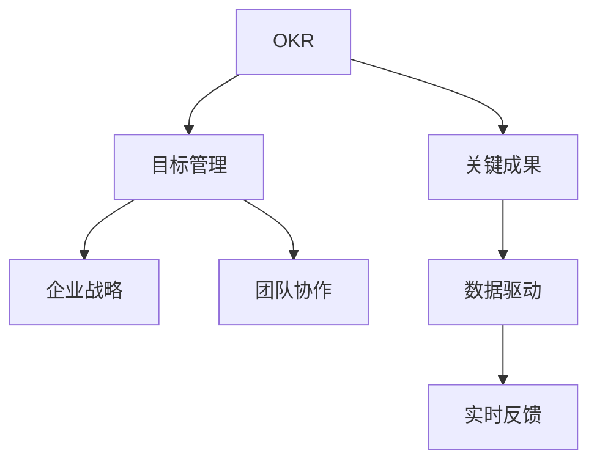
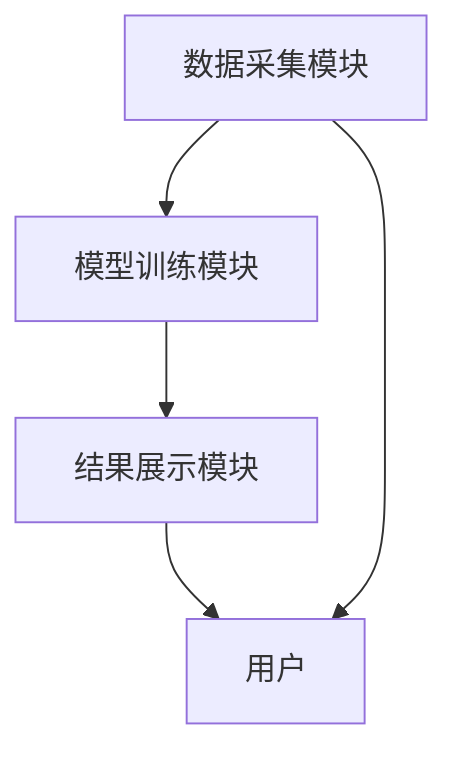
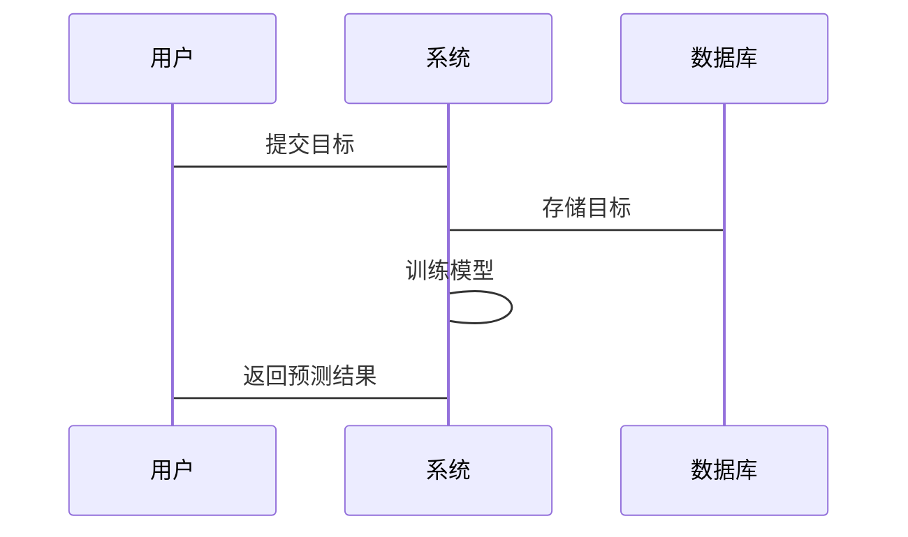

                 


# AI辅助企业战略执行：OKR自动化跟踪与调整

**关键词**：OKR，人工智能，战略执行，自动化跟踪，企业目标管理

**摘要**：  
本文探讨了如何利用人工智能技术辅助企业战略执行，特别是在OKR（目标与关键成果）管理中的自动化跟踪与调整。文章从OKR的基本概念出发，分析了传统OKR执行的挑战，并详细阐述了AI技术在OKR目标设定、跟踪、调整和评估等环节中的应用场景。通过介绍机器学习和自然语言处理技术的原理，结合系统架构设计和实际案例，本文展示了如何实现OKR的智能化管理。最后，文章总结了AI辅助OKR执行的优势和未来发展方向。

---

## 正文

### 第一部分：引言

#### 第1章：OKR与AI辅助执行概述

##### 1.1 什么是OKR
- **1.1.1 OKR的定义**
  OKR（目标与关键成果）是一种目标管理方法，由目标（Objective）和关键成果（Key Results）组成。目标是长期的、定性的，而关键成果是可量化的、具体的成果，用于衡量目标的实现程度。

- **1.1.2 OKR的特点**
  - **透明性**：OKR通常公开透明，便于团队协作。
  - **时间限制**：OKR通常设置在特定的时间段内（如季度、半年）。
  - **激励性**：OKR鼓励创新和冒险，通常设置为有一定挑战性的目标。

- **1.1.3 OKR在企业中的作用**
  - **战略分解**：将企业战略分解为可执行的目标。
  - **目标对齐**：确保团队目标与企业目标一致。
  - **激励与透明**：通过透明的目标设定，增强团队的协作和激励。

##### 1.2 AI辅助OKR执行的背景
- **1.2.1 传统OKR执行的挑战**
  - **手动跟踪**：传统OKR执行依赖人工记录和跟踪，效率低下且容易出错。
  - **数据孤岛**：各部门的数据分散，难以整合，影响目标的协同实现。
  - **缺乏动态调整**：目标在设定后难以根据实时数据和反馈进行快速调整。

- **1.2.2 AI如何解决这些挑战**
  - **自动化跟踪**：利用AI技术实时监控目标的执行情况，自动记录和更新数据。
  - **数据整合与分析**：AI能够整合来自不同部门的数据，提供全局视角，帮助制定更科学的目标。
  - **动态调整**：AI可以根据实时数据和反馈，自动调整目标和关键成果，确保目标的动态适应性。

- **1.2.3 AI辅助OKR的前景**
  - AI技术的快速发展为OKR的自动化管理提供了可能。
  - 通过AI辅助，企业可以更高效地制定和调整目标，提升战略执行的效率和效果。

**概念结构图：**



---

### 第二部分：OKR的理论基础

#### 第2章：OKR的理论与方法

##### 2.1 OKR的核心要素
- **目标（Objective）**
  - 定义：高层次的目标，通常是定性的，描述希望实现的成果。
  - 示例：提高产品市场份额。

- **关键成果（Key Results）**
  - 定义：可量化的、具体的成果，用于衡量目标的实现程度。
  - 示例：产品市场份额增长5%。

##### 2.2 OKR的实施方法
- **设定OKR的步骤**
  - 确定目标：与团队或部门讨论，明确目标。
  - 设定关键成果：将目标分解为可量化的关键成果。
  - 定期评估：定期检查关键成果的完成情况，评估目标的实现进度。

- **OKR的评估与反馈**
  - 定期回顾会议：通常在季度末或半年度进行。
  - 反馈机制：收集团队成员的反馈，用于优化OKR。

- **OKR的调整与优化**
  - 动态调整：根据实际情况和反馈，调整关键成果。
  - 优化目标：通过数据分析，优化目标的设定和分解。

---

### 第三部分：AI辅助OKR的应用场景

#### 第3章：AI在OKR中的应用场景

##### 3.1 AI辅助目标设定
- **数据驱动的目标设定**
  - 利用数据分析工具，分析历史数据，识别关键影响因素。
  - 示例：通过销售数据和市场分析，设定销售目标。

- **AI如何生成目标**
  - 使用自然语言处理（NLP）技术，分析企业内部文档和外部市场报告，提取关键词和趋势，生成候选目标。
  - 示例：分析公司战略文档，生成“提高客户满意度”的目标。

##### 3.2 AI辅助OKR的跟踪
- **实时数据监控**
  - 利用机器学习模型，实时监控关键成果的执行情况。
  - 示例：通过销售数据，实时跟踪季度销售额的增长情况。

- **动态调整**
  - 根据实时数据和反馈，动态调整关键成果。
  - 示例：当销售额增长不及预期时，自动调整关键成果，如将“销售额增长10%”调整为“销售额增长5%”。

##### 3.3 AI辅助OKR的评估与反馈
- **自动化评估**
  - 利用机器学习模型，自动评估关键成果的完成情况。
  - 示例：通过NLP技术，分析团队反馈，评估目标的实现难度。

- **智能推荐**
  - 根据历史数据和当前情况，推荐优化的目标和关键成果。
  - 示例：基于过去的目标完成情况，推荐新的关键成果。

---

### 第四部分：技术实现

#### 第4章：AI辅助OKR的技术实现

##### 4.1 机器学习算法
- **监督学习**
  - 算法：线性回归、随机森林。
  - 应用：预测目标的完成情况。
  - 示例：使用线性回归模型预测季度销售额。

  $$ y = mx + b $$

- **无监督学习**
  - 算法：聚类分析。
  - 应用：识别目标执行中的异常情况。
  - 示例：通过聚类分析，识别销售额下降的部门。

- **强化学习**
  - 算法：Q-learning。
  - 应用：动态调整关键成果。
  - 示例：通过强化学习算法，优化关键成果的调整策略。

##### 4.2 自然语言处理技术
- **文本分析**
  - 技术：关键词提取、情感分析。
  - 应用：分析团队反馈，提取关键问题。
  - 示例：通过关键词提取，识别客户反馈中的主要问题。

- **语义理解**
  - 技术：BERT模型。
  - 应用：理解目标描述的含义，生成相关的关键成果。
  - 示例：通过BERT模型，理解“提高客户满意度”的目标，并生成具体的措施。

---

### 第五部分：系统架构设计

#### 第5章：系统架构设计

##### 5.1 系统模块划分
- **数据采集模块**
  - 功能：采集企业内部和外部的数据。
  - 接口：与ERP系统、CRM系统等集成。
- **模型训练模块**
  - 功能：训练机器学习模型，预测目标完成情况。
  - 接口：与数据采集模块和结果展示模块交互。
- **结果展示模块**
  - 功能：展示目标的执行情况和模型预测结果。
  - 接口：与用户交互，提供反馈。

##### 5.2 系统架构图


##### 5.3 数据流设计
- 数据从ERP系统流向数据采集模块。
- 数据采集模块将数据传递给模型训练模块。
- 模型训练模块生成预测结果，传递给结果展示模块。
- 结果展示模块将结果呈现给用户，并收集反馈。

##### 5.4 接口设计
- **输入接口**：数据采集模块接收外部系统的数据。
- **输出接口**：结果展示模块将结果呈现给用户。
- **反馈接口**：用户通过反馈接口提供反馈，优化模型。

---

### 第六部分：项目实战

#### 第6章：项目实战

##### 6.1 开发环境搭建
- **工具安装**
  - Python 3.8+
  - TensorFlow 2.0+
  - Scikit-learn 0.24+
  - Flask 2.0+

##### 6.2 核心代码实现
```python
import numpy as np
from sklearn.linear_model import LinearRegression

# 示例数据
X = np.array([[1], [2], [3], [4], [5]])
y = np.array([2, 4, 5, 4, 6])

# 训练模型
model = LinearRegression()
model.fit(X, y)

# 预测结果
print(model.predict(np.array([[6]])))
```

##### 6.3 系统交互图


---

### 第七部分：总结与展望

#### 第7章：总结与展望

##### 7.1 总结
- AI技术在OKR管理中的应用，显著提高了目标执行的效率和效果。
- 通过自动化跟踪和动态调整，企业能够更灵活地应对变化，优化资源配置。

##### 7.2 展望
- **技术进步**：随着AI技术的不断发展，OKR的管理将更加智能化。
- **行业应用**：更多行业将采用AI辅助OKR管理，提升竞争力。
- **未来发展**：结合区块链等技术，实现更加透明和安全的目标管理。

##### 7.3 最佳实践 Tips
- **数据质量**：确保数据的准确性和完整性，是AI辅助OKR成功的关键。
- **模型调优**：定期优化机器学习模型，提升预测的准确性。
- **团队协作**：加强团队协作，充分利用AI工具的优势。

##### 7.4 小结
AI辅助OKR管理不仅提升了企业的执行效率，还为企业提供了更灵活和动态的目标管理方式。通过本文的介绍，读者可以深入了解AI在OKR管理中的应用，并结合实际情况，选择合适的工具和技术，提升企业的战略执行能力。

--- 

**结束语**：通过本文的详细讲解，希望读者能够全面理解AI辅助企业战略执行的核心思想，并在实际工作中灵活运用这些技术，推动企业的持续发展。

